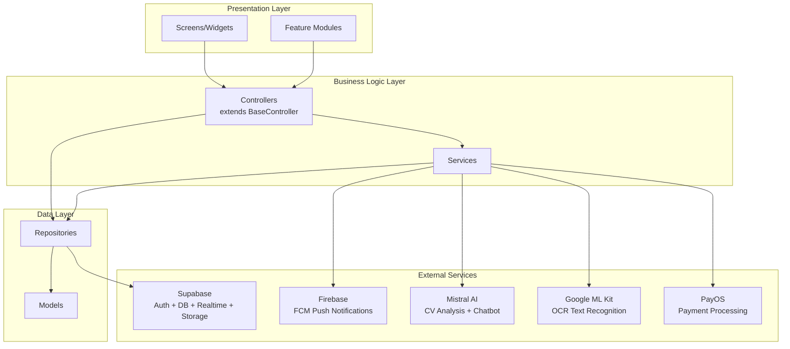
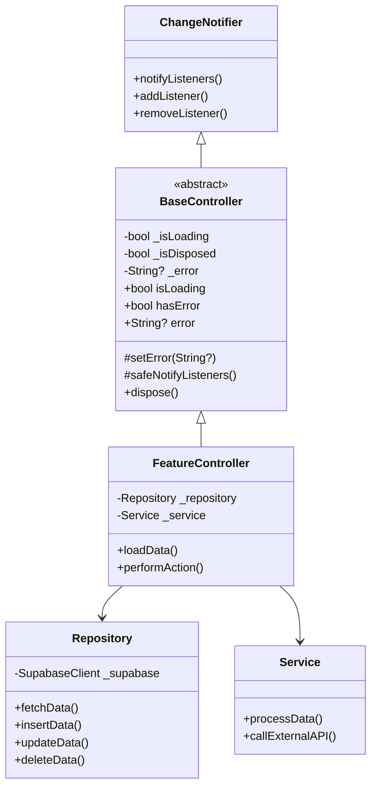

# Design Document: Architecture Analysis Documentation

## Overview

Thiết kế hệ thống tạo tài liệu phân tích kiến trúc toàn diện cho dự án NP FutureGate, phục vụ bảo vệ đồ án tốt nghiệp. Hệ thống sẽ tạo thư mục `architecture_analysis/` tại root dự án, chứa 12+ tài liệu Markdown được tổ chức theo cấu trúc phân cấp rõ ràng.

**Mục tiêu chính:**
- Tạo bộ tài liệu phân tích kiến trúc đầy đủ bằng tiếng Việt
- Sử dụng sơ đồ Mermaid để minh họa trực quan
- Cung cấp nội dung slide và kịch bản thuyết trình
- Phân tích so sánh với hệ thống tương tự và tự đánh giá điểm mạnh/yếu

**Phạm vi:**
- Tạo 12 nhóm tài liệu (files và thư mục con)
- Tất cả nội dung bằng tiếng Việt
- Định dạng Markdown với Mermaid diagrams
- Liên kết chéo giữa các tài liệu

## Architecture

Hệ thống tạo tài liệu được thiết kế theo mô hình **file-based generation** — mỗi requirement tương ứng với một hoặc nhiều file Markdown output. Không có runtime application; đây là quá trình tạo tài liệu tĩnh.

### Cấu trúc thư mục output

```
architecture_analysis/
├── README.md                                    # Mục lục và hướng dẫn
├── 01_tong_quan_kien_truc.md                   # Tổng quan kiến trúc
├── 02_co_che_tung_chuc_nang/                   # Cơ chế từng chức năng
│   ├── authentication_flow.md
│   ├── ai_matching_flow.md
│   ├── notification_flow.md
│   ├── realtime_sync_flow.md
│   ├── payment_flow.md
│   ├── interview_flow.md
│   ├── cv_management_flow.md
│   ├── job_posting_flow.md
│   └── chat_flow.md
├── 03_so_do_flow/                              # Sơ đồ luồng Mermaid
│   ├── mermaid_sequence_diagrams.md
│   ├── state_management_flow.mermaid
│   └── navigation_flow.mermaid
├── 04_cong_nghe_su_dung/                       # Công nghệ sử dụng
│   ├── tech_stack_overview.md
│   └── tech_comparison_reason.md
├── 05_diem_sang_ky_thuat_va_business.md        # Điểm sáng
├── 06_so_sanh_voi_he_thong_khac.md             # So sánh hệ thống
├── 07_phan_tich_diem_con_thieu_va_khac_biet_noi_bat.md  # Gap analysis
├── 08_slide_thuyet_trinh/                      # Slide thuyết trình
│   ├── slide_key_points.md
│   └── slide_scripts.md
├── 09_kich_ban_thuyet_trinh_chi_tiet.md        # Kịch bản thuyết trình
├── 10_giai_thich_cong_nghe_tung_cai/           # Giải thích công nghệ
│   ├── flutter.md
│   ├── state_management_changenotifier.md
│   ├── supabase.md
│   ├── mistral_ai.md
│   ├── firebase_fcm.md
│   ├── google_mlkit_ocr.md
│   ├── dio_vs_http.md
│   ├── fl_chart.md
│   ├── speech_to_text.md
│   ├── payos_payment.md
│   └── other_libraries.md
├── 11_phan_tich_cac_file_dung_chung/           # Phân tích file dùng chung
│   ├── utils_analysis.md
│   ├── themes_analysis.md
│   ├── constants_analysis.md
│   ├── routes_analysis.md
│   └── network_interceptor_analysis.md
└── 12_tom_tat_de_trinh_chieu.md                # Tóm tắt trình chiếu
```

### Kiến trúc dự án NP FutureGate (được phân tích)



## Components and Interfaces

### 1. Documentation Generator (Task Execution)

Mỗi tài liệu được tạo dựa trên phân tích source code thực tế của dự án. Các thành phần chính:

| Component | Mô tả | Output |
|-----------|--------|--------|
| Architecture Analyzer | Phân tích cấu trúc thư mục lib/ | 01_tong_quan_kien_truc.md |
| Feature Flow Analyzer | Phân tích từng feature module | 02_co_che_tung_chuc_nang/*.md |
| Diagram Generator | Tạo sơ đồ Mermaid từ code flow | 03_so_do_flow/*.md |
| Tech Stack Analyzer | Phân tích pubspec.yaml | 04_cong_nghe_su_dung/*.md |
| Highlight Extractor | Tổng hợp điểm sáng | 05_diem_sang_*.md |
| Comparison Builder | So sánh với hệ thống khác | 06_so_sanh_*.md |
| Gap Analyzer | Phân tích điểm thiếu | 07_phan_tich_*.md |
| Presentation Builder | Tạo nội dung slide | 08_slide_*/, 09_kich_ban_*.md |
| Tech Explainer | Giải thích từng công nghệ | 10_giai_thich_*/*.md |
| Shared Code Analyzer | Phân tích code dùng chung | 11_phan_tich_*/*.md |
| Summary Generator | Tóm tắt toàn bộ | 12_tom_tat_*.md |

### 2. Kiến trúc MVC của NP FutureGate (được document)



### 3. Feature Modules Structure

Mỗi feature module tuân theo cấu trúc nhất quán:

```
features/{feature_name}/
├── controllers/     # Business logic, extends BaseController
├── screens/         # UI screens (View layer)
└── widgets/         # Reusable widgets cho feature
```

**Feature modules hiện tại:**
- `auth/` — Đăng nhập, đăng ký, Google Sign-In
- `ai/` — AI matching, chatbot, intent-based queries
- `candidate/` — Quản lý ứng viên, tìm việc
- `employer/` — Quản lý nhà tuyển dụng, đăng tin
- `school/` — Quản lý trường học, partnership
- `admin/` — Quản trị hệ thống
- `chat/` — Chat realtime giữa các vai trò
- `cv/` — Quản lý CV, OCR scanning
- `interview/` — Quản lý phỏng vấn, nhắc nhở
- `notification/` — Push notifications, local notifications

## Data Models

### Cấu trúc tài liệu output

Mỗi file Markdown output tuân theo template:

```markdown
# [Tiêu đề tài liệu]

## Mục đích
[Mô tả ngắn gọn mục đích của tài liệu]

## Nội dung chính
[Nội dung chi tiết với heading, bullet points, code blocks, bảng]

## Sơ đồ minh họa (nếu có)
[Mermaid diagrams]

## Liên kết liên quan
[Links đến các tài liệu khác trong bộ]
```

### Dữ liệu nguồn (Source Data)

| Nguồn | Mô tả | Sử dụng cho |
|--------|--------|-------------|
| `lib/core/controllers/` | BaseController, PaginationMixin | Tài liệu kiến trúc MVC |
| `lib/core/services/` | 17 service files | Tài liệu cơ chế chức năng |
| `lib/core/repositories/` | 16 repository files | Tài liệu data layer |
| `lib/core/models/` | 24 model files | Tài liệu data models |
| `lib/features/` | 10 feature modules | Tài liệu feature flows |
| `lib/core/theme/` | 5 theme files | Tài liệu shared files |
| `lib/core/utils/` | 4 utility files | Tài liệu shared files |
| `lib/core/enums/` | 4 enum files | Tài liệu constants |
| `pubspec.yaml` | Dependencies list | Tài liệu tech stack |

### Thống kê dự án

| Metric | Giá trị |
|--------|---------|
| Feature modules | 10 |
| Services | 17 |
| Repositories | 16 |
| Models | 24 |
| Utility files | 4 |
| Theme files | 5 |
| Enum files | 4 |
| External integrations | 5 (Supabase, Firebase, Mistral AI, Google ML Kit, PayOS) |
| User roles | 4 (Candidate, Employer, School, Admin) |

### Naming Convention cho output files

- Prefix số thứ tự: `01_`, `02_`, ...
- Snake_case cho tên file
- Tiếng Việt không dấu cho tên file
- Extension: `.md` cho Markdown, `.mermaid` cho sơ đồ thuần Mermaid
- Relative links cho liên kết chéo: `../01_tong_quan_kien_truc.md`

## Error Handling

### Xử lý lỗi trong quá trình tạo tài liệu

| Tình huống | Xử lý |
|------------|--------|
| File source không tồn tại | Ghi chú "[Cần bổ sung]" trong tài liệu |
| Mermaid syntax không hợp lệ | Validate cú pháp trước khi ghi file |
| Liên kết chéo bị hỏng | Kiểm tra file tồn tại trước khi tạo link |
| Nội dung quá dài | Chia thành sections với table of contents |
| Encoding tiếng Việt | Sử dụng UTF-8 cho tất cả files |

### Validation Rules

1. **Mermaid diagrams**: Phải sử dụng cú pháp hợp lệ, có thể render bởi GitHub/GitLab
2. **Relative links**: Phải trỏ đến file thực sự tồn tại trong cấu trúc
3. **Code examples**: Phải lấy từ source code thực tế của dự án
4. **Tiếng Việt**: Toàn bộ nội dung mô tả bằng tiếng Việt, code giữ nguyên tiếng Anh
5. **Markdown format**: Heading hierarchy đúng (h1 > h2 > h3), không skip level

## Testing Strategy

### Phương pháp kiểm thử

Vì đây là feature tạo tài liệu tĩnh (documentation generation), **property-based testing không phù hợp**. Lý do:
- Output là các file Markdown tĩnh, không phải pure functions
- Không có input space đa dạng cần test
- Không có serialization/deserialization logic
- Đây là side-effect operations (tạo files)

### Chiến lược kiểm thử phù hợp

**1. Verification Tests (Example-based)**
- Kiểm tra tất cả files/thư mục được tạo đúng theo cấu trúc
- Kiểm tra mỗi file có nội dung không rỗng
- Kiểm tra heading hierarchy trong mỗi file Markdown

**2. Content Validation**
- Kiểm tra Mermaid syntax hợp lệ (regex validation)
- Kiểm tra relative links trỏ đến files tồn tại
- Kiểm tra encoding UTF-8 cho tiếng Việt
- Kiểm tra naming convention (snake_case, prefix số)

**3. Completeness Checks**
- Kiểm tra README.md liệt kê đầy đủ tất cả tài liệu
- Kiểm tra mỗi requirement có ít nhất 1 file output tương ứng
- Kiểm tra cross-references giữa các tài liệu

**4. Manual Review**
- Review nội dung tiếng Việt cho chính xác ngữ pháp
- Review sơ đồ Mermaid render đúng trên GitHub
- Review code examples khớp với source code thực tế
- Review kịch bản thuyết trình phù hợp thời lượng 15-20 phút

### Test Execution

```bash
# Kiểm tra cấu trúc thư mục
find architecture_analysis/ -type f | sort

# Kiểm tra files không rỗng
find architecture_analysis/ -type f -empty

# Kiểm tra encoding
file architecture_analysis/**/*.md

# Kiểm tra broken links (manual hoặc script)
grep -r '\[.*\](\.\./' architecture_analysis/ | while read line; do
  # validate each relative link
done
```
