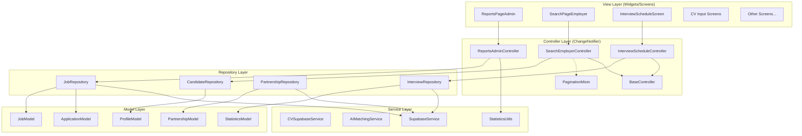
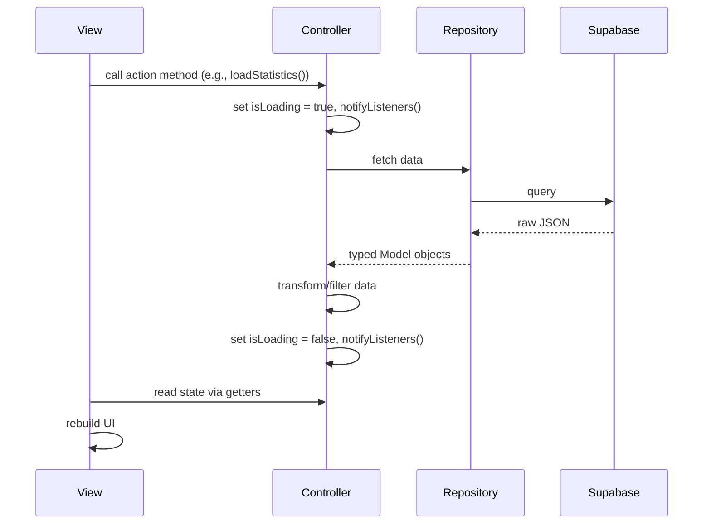

# Design Document: MVC Refactoring

## Overview

This design describes the refactoring of the NP_FutureGate Flutter application from its current mixed architecture (where screens contain business logic, direct Supabase calls, and data transformation) into a proper MVC (Model-View-Controller) architecture using `ChangeNotifier`-based controllers.

The refactoring targets:
- **3 existing controllers** to extend/verify (HomeCandidateController, HomeEmployerController, SearchCandidateController)
- **5+ new controllers** to create (ReportsAdmin, EmployerStatistics, SearchEmployer, InterviewSchedule, etc.)
- **19 CV input screens** to consolidate via a base class
- **3+ new model classes** (StatisticsModel, PartnershipModel, ApplicationModel)
- **Shared utilities** (BaseController, PaginationMixin, statistics_utils, snackbar_utils)
- **Folder restructuring** from flat `lib/screens/` to feature-based `lib/features/`

### Design Decisions

1. **ChangeNotifier over BLoC/Riverpod**: The project already uses ChangeNotifier (see existing controllers). Maintaining consistency avoids introducing new dependencies and learning curve.
2. **Feature-based folder structure**: Scales better than the current role-based flat structure as the app grows.
3. **Base class over code generation**: For CV screens, inheritance is simpler and more maintainable than code generation for 19 templates with minor variations.
4. **Mixin for pagination**: Mixins allow multiple controllers to share pagination without deep inheritance hierarchies.

## Architecture



### Data Flow



## Components and Interfaces

### BaseController

Abstract base class for all controllers providing common state management:

```dart
abstract class BaseController extends ChangeNotifier {
  bool _isLoading = false;
  bool _isDisposed = false;
  String? _error;

  bool get isLoading => _isLoading;
  bool get hasError => _error != null;
  String? get error => _error;

  @protected
  set isLoading(bool value) {
    _isLoading = value;
    safeNotifyListeners();
  }

  @protected
  void setError(String? error) {
    _error = error;
    safeNotifyListeners();
  }

  @protected
  void safeNotifyListeners() {
    if (!_isDisposed) {
      notifyListeners();
    }
  }

  @override
  void dispose() {
    _isDisposed = true;
    super.dispose();
  }
}
```

### PaginationMixin

Reusable pagination logic as a mixin:

```dart
mixin PaginationMixin<T> on BaseController {
  List<T> _items = [];
  int _currentPage = 0;
  bool _hasMore = true;
  int get pageSize => 10;

  List<T> get items => _items;
  bool get hasMore => _hasMore;
  int get currentPage => _currentPage;

  Future<List<T>> fetchPage(int offset, int limit);

  Future<void> loadNextPage() async {
    if (isLoading || !_hasMore) return;
    isLoading = true;
    try {
      final newItems = await fetchPage(_currentPage * pageSize, pageSize);
      _items.addAll(newItems);
      _hasMore = newItems.length >= pageSize;
      _currentPage++;
      setError(null);
    } catch (e) {
      setError(e.toString());
    } finally {
      isLoading = false;
    }
  }

  void resetPagination() {
    _items = [];
    _currentPage = 0;
    _hasMore = true;
    safeNotifyListeners();
  }
}
```

### BaseCVInputScreen

Abstract base for all 19 CV input screens:

```dart
abstract class BaseCVInputScreen extends StatefulWidget {
  const BaseCVInputScreen({super.key, this.cvId});
  final String? cvId;
}

abstract class BaseCVInputScreenState<T extends BaseCVInputScreen> extends State<T> {
  final CVSupabaseService cvService = CVSupabaseService();
  Map<String, dynamic> cvData = {};
  bool isLoading = false;
  final ScrollController scrollController = ScrollController();

  // Template methods - subclasses MUST override
  Map<String, dynamic> getEmptyDataSchema();
  String sectionTitle(String section);
  Widget buildCVPreview(Map<String, dynamic> data, void Function(String) onSectionTap);

  @override
  void initState() {
    super.initState();
    initializeData();
  }

  Future<void> initializeData() async { /* shared load logic */ }
  Future<void> saveCV() async { /* shared save logic */ }
  void showError(String message) { /* shared error display */ }
  void showSuccess(String message) { /* shared success display */ }

  @override
  Widget build(BuildContext context) { /* shared scaffold structure */ }
}
```

### Controller Interfaces

#### ReportsAdminController

```dart
class ReportsAdminController extends BaseController {
  // State
  StatisticsModel? get statistics;
  String get selectedPeriod;
  List<Map<String, dynamic>> get usersByDay;
  List<Map<String, dynamic>> get jobsByDay;
  List<Map<String, dynamic>> get applicationsByDay;

  // Actions
  Future<void> loadStatistics();
  void setPeriod(String period); // '7', '30', '90', '365'
}
```

#### SearchEmployerController

```dart
class SearchEmployerController extends BaseController with PaginationMixin<ProfileModel> {
  // State
  List<ProfileModel> get candidates;
  Map<String, dynamic> get activeFilters;
  bool get hasActiveFilters;

  // Actions
  Future<void> searchCandidates({String? field, String? education, String? location, int? minAge, int? maxAge, String? gender});
  Future<void> toggleFollow(String candidateId);
  void clearFilters();
}
```

#### InterviewScheduleController

```dart
class InterviewScheduleController extends BaseController {
  // State
  List<InterviewModel> get interviews;
  List<InterviewModel> get filteredInterviews;
  String get searchQuery;
  String get statusFilter; // 'All', 'Scheduled', 'Completed', 'Postponed'
  DateTimeRange? get dateRange;
  Map<String, List<InterviewModel>> get groupedByDate;
  Map<String, List<InterviewModel>> get groupedByJob;

  // Actions
  Future<void> loadInterviews();
  void setSearchQuery(String query);
  void setStatusFilter(String status);
  void setDateRange(DateTimeRange? range);
}
```

### Shared Utilities

#### statistics_utils.dart

```dart
/// Groups items by day within a period.
/// Returns list of {'day': 'M/D', 'count': int} maps.
List<Map<String, dynamic>> groupByDay(
  List<dynamic> items,
  String dateField,
  DateTime periodStart,
  int periodDays,
);

/// Converts day-count list to FlSpot list for fl_chart.
List<FlSpot> buildLineChartSpots(List<Map<String, dynamic>> dayCountList);
```

#### snackbar_utils.dart

```dart
enum SnackBarType { success, error, info }

void showAppSnackBar(
  BuildContext context, {
  required String message,
  SnackBarType type = SnackBarType.info,
  VoidCallback? action,
  String? actionLabel,
});
```

## Data Models

### StatisticsModel

```dart
class StatisticsModel {
  final int totalUsers;
  final int totalJobs;
  final int totalApplications;
  final int totalInterviews;
  final int newUsersInPeriod;
  final int newJobsInPeriod;
  final int newApplicationsInPeriod;
  final double applicationSuccessRate;
  final Map<String, int> usersByRole;
  final Map<String, int> jobsByStatus;

  factory StatisticsModel.fromJson(Map<String, dynamic> json);
  Map<String, dynamic> toJson();
  StatisticsModel copyWith({...});
}
```

### PartnershipModel

```dart
class PartnershipModel {
  final String id;
  final String schoolId;
  final String companyId;
  final String status; // 'pending', 'approved', 'rejected'
  final int postLimitCount;
  final String postLimitPeriod; // 'month', 'year'
  final DateTime? createdAt;
  final DateTime? updatedAt;

  factory PartnershipModel.fromJson(Map<String, dynamic> json);
  Map<String, dynamic> toJson();
  PartnershipModel copyWith({...});
}
```

### ApplicationModel (extracted from JobApplication)

```dart
class ApplicationModel {
  final String userId;
  final String cvId;
  final String jobId;
  final DateTime appliedAt;
  final String status; // 'pending', 'accepted', 'rejected'
  final String? recruitmentStatus;

  factory ApplicationModel.fromJson(Map<String, dynamic> json);
  Map<String, dynamic> toJson();
  ApplicationModel copyWith({...});
}
```

### Target Folder Structure

```
lib/
├── core/
│   ├── config/
│   ├── controllers/        # BaseController, PaginationMixin
│   ├── enums/
│   ├── models/             # All model classes
│   ├── repositories/       # All repository classes
│   ├── services/           # All service classes
│   ├── theme/
│   └── utils/              # statistics_utils, snackbar_utils
├── features/
│   ├── admin/
│   │   ├── controllers/    # ReportsAdminController
│   │   ├── screens/
│   │   └── widgets/
│   ├── auth/
│   │   ├── screens/
│   │   └── widgets/
│   ├── candidate/
│   │   ├── controllers/    # HomeCandidateController, SearchCandidateController
│   │   ├── screens/
│   │   └── widgets/
│   ├── cv/
│   │   ├── controllers/
│   │   ├── screens/        # BaseCVInputScreen + cv1-cv19
│   │   └── widgets/
│   ├── employer/
│   │   ├── controllers/    # HomeEmployerController, SearchEmployerController, InterviewScheduleController
│   │   ├── screens/
│   │   └── widgets/
│   ├── school/
│   │   ├── controllers/
│   │   ├── screens/
│   │   └── widgets/
│   ├── chat/
│   │   ├── screens/
│   │   └── widgets/
│   ├── ai/
│   │   ├── screens/
│   │   └── widgets/
│   ├── interview/
│   │   ├── controllers/
│   │   ├── screens/
│   │   └── widgets/
│   └── notification/
│       ├── screens/
│       └── widgets/
├── shared/
│   └── widgets/
│       ├── buttons/
│       ├── cards/
│       ├── dialogs/
│       ├── inputs/
│       └── layouts/
└── main.dart
```

## Correctness Properties

*A property is a characteristic or behavior that should hold true across all valid executions of a system — essentially, a formal statement about what the system should do. Properties serve as the bridge between human-readable specifications and machine-verifiable correctness guarantees.*

### Property 1: Model serialization round trip

*For any* valid model instance (StatisticsModel, PartnershipModel, ApplicationModel, or any newly created model), calling `toJson()` and then `fromJson()` on the result SHALL produce an object that is equivalent to the original instance in all field values.

**Validates: Requirements 4.1, 4.2, 4.3, 4.5**

### Property 2: Model fromJson error on missing required fields

*For any* model class and *for any* JSON map that is missing at least one required field (a field with no default value), calling `fromJson()` SHALL throw an error whose message contains the name of the missing field.

**Validates: Requirements 4.6**

### Property 3: Candidate filtering correctness

*For any* list of candidate profiles and *for any* combination of filter criteria (field, education, location, age range, gender), every candidate in the filtered result SHALL satisfy all active filter criteria, and no candidate satisfying all criteria SHALL be excluded from the result.

**Validates: Requirements 2.3**

### Property 4: Interview filtering and grouping correctness

*For any* list of interviews and *for any* combination of search query, date range, and status filter, every interview in the filtered result SHALL match the search query, fall within the date range, and have the specified status. Additionally, when grouped by date, every interview in a date group SHALL have its scheduled date matching that group's date key.

**Validates: Requirements 2.5**

### Property 5: Pagination correctness

*For any* list of items and *for any* page size, sequentially calling `loadNextPage()` until `hasMore` is false SHALL produce a concatenated result containing all original items in order, with each page containing at most `pageSize` items, and `hasMore` being false only when the last page has fewer than `pageSize` items.

**Validates: Requirements 6.1**

### Property 6: groupByDay preserves all items

*For any* list of timestamped items and *for any* valid period (periodStart, periodDays), calling `groupByDay()` SHALL produce day-groups where the sum of all group counts equals the number of items whose timestamp falls within the period, and no item within the period is unaccounted for.

**Validates: Requirements 6.5**

## Error Handling

### Controller Error Strategy

All controllers extend `BaseController` which provides:
- `setError(String?)` to store error messages
- `hasError` getter for views to check
- `error` getter for views to display
- Errors are cleared on successful operations via `setError(null)`

### Error Scenarios

| Scenario | Handling |
|----------|----------|
| Supabase query fails | Controller catches exception, sets error state, View shows error message via SnackBar |
| Model fromJson missing field | Throws descriptive error caught by Repository, propagated to Controller |
| Network timeout | Repository throws, Controller sets error, View shows retry option |
| Optimistic update fails | Controller reverts local state, notifies listeners, shows error SnackBar |
| Controller used after dispose | `safeNotifyListeners()` checks `_isDisposed` flag, silently no-ops |

### Refactoring Safety

- Each refactoring step is atomic at the file/component level
- If compilation fails after extraction, revert within 3 attempts
- `flutter analyze` runs after each step to catch issues early
- Public API signatures are preserved to avoid breaking call sites

## Testing Strategy

### Property-Based Tests (using `dart_quickcheck` or `fast_check` for Dart)

Property-based testing applies to the pure logic components of this refactoring:
- Model serialization (round-trip properties)
- Filtering logic (correctness of filter results)
- Pagination logic (completeness and ordering)
- Utility functions (groupByDay correctness)

**Configuration:**
- Minimum 100 iterations per property test
- Each test tagged with: `Feature: mvc-refactoring, Property {N}: {description}`
- Library: `fast_check` (Dart PBT library)

### Unit Tests

- **BaseController**: Verify isLoading toggle, error state, safeNotifyListeners after dispose
- **PaginationMixin**: Verify page loading, hasMore flag, reset behavior
- **Each new Controller**: Verify state transitions, method behavior with mocked repositories
- **BaseCVInputScreen**: Verify shared logic (save, load, error display) works correctly
- **SnackBar utility**: Verify correct color/duration for each type

### Integration Tests

- **Compilation check**: `flutter analyze` passes after each refactoring step
- **Import correctness**: All moved files have updated imports across the project
- **Widget tree equivalence**: Key screens render identically before and after refactoring

### Test Organization

```
test/
├── core/
│   ├── controllers/
│   │   └── base_controller_test.dart
│   ├── models/
│   │   ├── statistics_model_test.dart
│   │   ├── partnership_model_test.dart
│   │   └── application_model_test.dart
│   └── utils/
│       ├── statistics_utils_test.dart
│       └── pagination_mixin_test.dart
├── features/
│   ├── employer/
│   │   ├── search_employer_controller_test.dart
│   │   └── interview_schedule_controller_test.dart
│   └── admin/
│       └── reports_admin_controller_test.dart
└── properties/
    ├── model_serialization_property_test.dart
    ├── filtering_property_test.dart
    ├── pagination_property_test.dart
    └── statistics_utils_property_test.dart
```
