# NP FutureGate - Sơ Đồ Use Case

> **Ngày tạo:** 2026-01-21  
> **Phiên bản:** 1.0.0  
> **Ghi chú:** Sử dụng Mermaid syntax để vẽ sơ đồ. Có thể xem trực tiếp trên GitHub hoặc VSCode với extension Mermaid.

---

## 📋 MỤC LỤC

1. [Sơ Đồ Use Case Cấp 0 - Tổng Quan Hệ Thống](#1-sơ-đồ-use-case-cấp-0---tổng-quan-hệ-thống)
2. [Sơ Đồ Use Case Cấp 1 - Theo Actor](#2-sơ-đồ-use-case-cấp-1---theo-actor)
3. [Sơ Đồ Use Case Cấp 2 - Chi Tiết Chức Năng](#3-sơ-đồ-use-case-cấp-2---chi-tiết-chức-năng)
4. [Mô Tả Chi Tiết Các Use Case](#4-mô-tả-chi-tiết-các-use-case)

---

## 1. SƠ ĐỒ USE CASE CẤP 0 - TỔNG QUAN HỆ THỐNG

### 1.1 Context Diagram - Hệ thống NP FutureGate

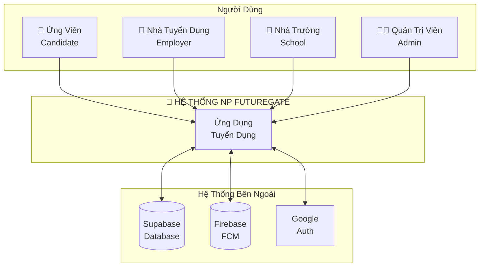

### 1.2 Use Case Cấp 0 - Tổng Quan

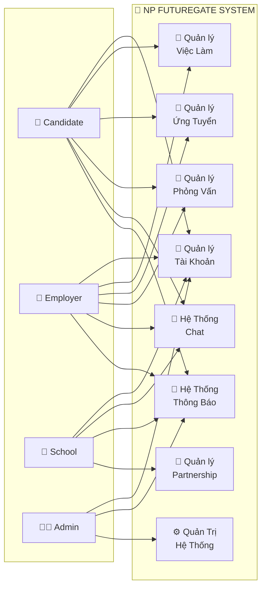

---

## 2. SƠ ĐỒ USE CASE CẤP 1 - THEO ACTOR

### 2.1 Use Case - CANDIDATE (Ứng Viên)

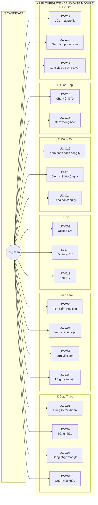

### 2.2 Use Case - EMPLOYER (Nhà Tuyển Dụng)

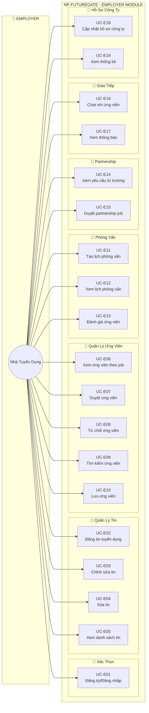

### 2.3 Use Case - SCHOOL (Nhà Trường)

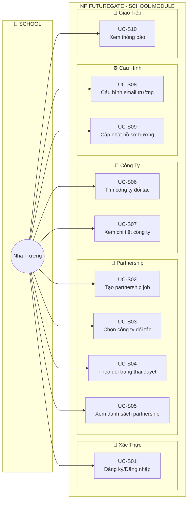

### 2.4 Use Case - ADMIN (Quản Trị Viên)

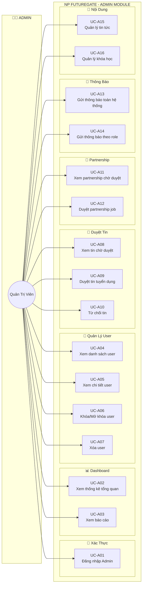

---

## 3. SƠ ĐỒ USE CASE CẤP 2 - CHI TIẾT CHỨC NĂNG

### 3.1 Chi Tiết: Quản Lý Việc Làm (Job Management)

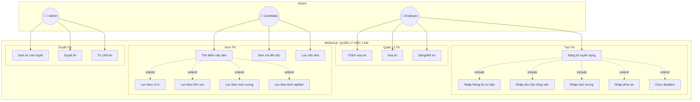

### 3.2 Chi Tiết: Quy Trình Ứng Tuyển (Application Process)

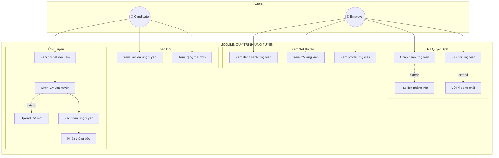

### 3.3 Chi Tiết: Quy Trình Phỏng Vấn (Interview Process)

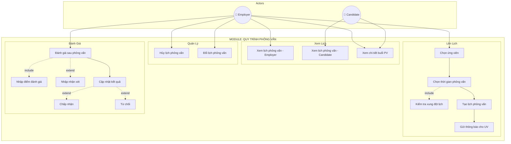

### 3.4 Chi Tiết: Partnership Job (Hợp Tác Trường - Doanh Nghiệp)

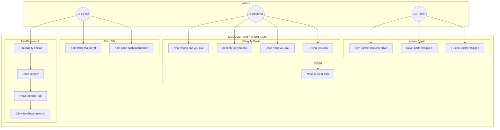

### 3.5 Chi Tiết: Hệ Thống Chat

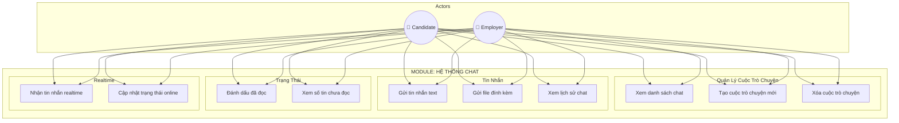

### 3.6 Chi Tiết: Quản Lý CV

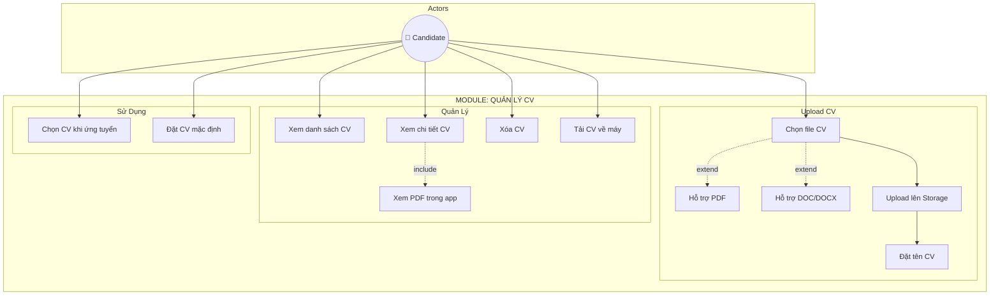

---

## 4. MÔ TẢ CHI TIẾT CÁC USE CASE

### 4.1 CANDIDATE USE CASES

#### UC-C08: Ứng Tuyển Việc Làm

| Thuộc tính | Mô tả |
|------------|-------|
| **Tên Use Case** | Ứng tuyển việc làm |
| **Mã** | UC-C08 |
| **Actor** | Candidate |
| **Mô tả** | Ứng viên gửi đơn ứng tuyển vào một công việc |
| **Tiền điều kiện** | - Đã đăng nhập<br>- Có ít nhất 1 CV<br>- Chưa ứng tuyển job này |
| **Hậu điều kiện** | - Đơn ứng tuyển được ghi nhận<br>- NTD nhận thông báo |
| **Luồng chính** | 1. UV xem chi tiết job<br>2. UV nhấn "Ứng tuyển"<br>3. Hệ thống hiển thị danh sách CV<br>4. UV chọn CV<br>5. UV xác nhận ứng tuyển<br>6. Hệ thống ghi nhận & gửi thông báo |
| **Luồng thay thế** | 3a. Nếu chưa có CV → Chuyển đến Upload CV |
| **Ngoại lệ** | - Đã ứng tuyển trước đó<br>- Job đã đóng<br>- Lỗi kết nối |

#### UC-C05: Tìm Kiếm Việc Làm

| Thuộc tính | Mô tả |
|------------|-------|
| **Tên Use Case** | Tìm kiếm việc làm |
| **Mã** | UC-C05 |
| **Actor** | Candidate |
| **Mô tả** | Tìm kiếm và lọc các công việc phù hợp |
| **Tiền điều kiện** | Đã đăng nhập |
| **Hậu điều kiện** | Hiển thị danh sách job matching |
| **Luồng chính** | 1. UV vào trang tìm kiếm<br>2. UV nhập từ khóa/chọn bộ lọc<br>3. Hệ thống filter jobs<br>4. Hiển thị kết quả |
| **Bộ lọc** | - Vị trí (63 tỉnh/thành)<br>- Lĩnh vực (22 ngành)<br>- Mức lương<br>- Kinh nghiệm<br>- Loại hình công việc |

---

### 4.2 EMPLOYER USE CASES

#### UC-E02: Đăng Tin Tuyển Dụng

| Thuộc tính | Mô tả |
|------------|-------|
| **Tên Use Case** | Đăng tin tuyển dụng |
| **Mã** | UC-E02 |
| **Actor** | Employer |
| **Mô tả** | NTD tạo tin tuyển dụng mới |
| **Tiền điều kiện** | - Đã đăng nhập<br>- Role = employer |
| **Hậu điều kiện** | - Job được tạo (status=pending)<br>- Admin nhận thông báo |
| **Luồng chính** | 1. NTD vào màn hình tạo tin<br>2. Nhập thông tin cơ bản (tiêu đề, mô tả)<br>3. Chọn vị trí, lĩnh vực<br>4. Nhập yêu cầu ứng viên<br>5. Nhập mức lương<br>6. Nhập phúc lợi<br>7. Chọn deadline (optional)<br>8. Submit<br>9. Hệ thống lưu & gửi thông báo Admin |
| **Validation** | - Tiêu đề: bắt buộc, max 200 ký tự<br>- Mô tả: bắt buộc<br>- Ít nhất 1 vị trí<br>- Ít nhất 1 lĩnh vực |

#### UC-E11: Tạo Lịch Phỏng Vấn

| Thuộc tính | Mô tả |
|------------|-------|
| **Tên Use Case** | Tạo lịch phỏng vấn |
| **Mã** | UC-E11 |
| **Actor** | Employer |
| **Mô tả** | NTD đặt lịch phỏng vấn với ứng viên |
| **Tiền điều kiện** | - Có ứng viên accepted<br>- Không xung đột lịch |
| **Hậu điều kiện** | - Lịch PV được tạo<br>- UV nhận thông báo |
| **Luồng chính** | 1. NTD chọn UV từ danh sách<br>2. NTD chọn ngày giờ<br>3. Hệ thống check xung đột<br>4. Nếu OK → Tạo lịch<br>5. Gửi thông báo cho UV |
| **Luồng thay thế** | 3a. Nếu xung đột → Thông báo, yêu cầu chọn lại |

---

### 4.3 SCHOOL USE CASES

#### UC-S02: Tạo Partnership Job

| Thuộc tính | Mô tả |
|------------|-------|
| **Tên Use Case** | Tạo Partnership Job |
| **Mã** | UC-S02 |
| **Actor** | School |
| **Mô tả** | Trường tạo tin tuyển dụng cho công ty đối tác |
| **Tiền điều kiện** | - Đã đăng nhập<br>- Role = school |
| **Hậu điều kiện** | - Partnership job được tạo<br>- Công ty nhận thông báo |
| **Luồng chính** | 1. Trường tìm & chọn công ty<br>2. Nhập thông tin job (giống employer)<br>3. Submit<br>4. Hệ thống lưu (company_status=pending)<br>5. Gửi thông báo cho công ty |
| **Quy trình duyệt** | Trường tạo → Công ty duyệt → Admin duyệt → Xuất bản |

---

### 4.4 ADMIN USE CASES

#### UC-A09: Duyệt Tin Tuyển Dụng

| Thuộc tính | Mô tả |
|------------|-------|
| **Tên Use Case** | Duyệt tin tuyển dụng |
| **Mã** | UC-A09 |
| **Actor** | Admin |
| **Mô tả** | Admin phê duyệt tin tuyển dụng |
| **Tiền điều kiện** | - Role = admin<br>- Có tin chờ duyệt |
| **Hậu điều kiện** | - Job status = approved/rejected<br>- NTD nhận thông báo |
| **Luồng chính** | 1. Admin xem danh sách pending jobs<br>2. Chọn job để review<br>3. Xem chi tiết<br>4. Approve/Reject<br>5. Gửi thông báo cho NTD |
| **Tiêu chí duyệt** | - Nội dung hợp lệ<br>- Không spam<br>- Không vi phạm |

---

## 5. BẢNG TỔNG HỢP QUAN HỆ USE CASE

### 5.1 Quan hệ Include (Bắt buộc)

| Use Case Chính | Include | Mô tả |
|----------------|---------|-------|
| Ứng tuyển việc | Chọn CV | Phải chọn CV để ứng tuyển |
| Tạo lịch PV | Check xung đột lịch | Phải kiểm tra trước khi tạo |
| Xem chi tiết CV | Render PDF | Hiển thị nội dung PDF |

### 5.2 Quan hệ Extend (Tùy chọn)

| Use Case Chính | Extend | Điều kiện |
|----------------|--------|-----------|
| Ứng tuyển việc | Upload CV mới | Nếu chưa có CV |
| Tìm kiếm việc | Lọc theo vị trí | User muốn lọc thêm |
| Từ chối ứng viên | Gửi lý do | NTD muốn gửi lý do |
| Đăng tin | Chọn deadline | NTD muốn set deadline |

### 5.3 Quan hệ Generalization (Kế thừa)

| Use Case Tổng Quát | Use Case Cụ Thể |
|--------------------|-----------------|
| Đăng nhập | Đăng nhập Email, Đăng nhập Google |
| Duyệt tin | Duyệt tin thường, Duyệt partnership |
| Gửi thông báo | Gửi cho user, Gửi cho role, Gửi toàn hệ thống |

---

## 6. DIAGRAM LEGEND

```
Ký hiệu trong sơ đồ:

○ ──────→  : Actor sử dụng Use Case
┅┅┅┅┅┅→    : Include (bao gồm bắt buộc)
- - - - →  : Extend (mở rộng tùy chọn)
△          : Generalization (kế thừa)

Màu sắc:
🟢 Xanh lá : Candidate
🟠 Cam     : Employer  
🟣 Tím     : School
🔴 Đỏ     : Admin
```

---

## 7. TỔNG KẾT SỐ LƯỢNG USE CASE

| Actor | Số Use Case Cấp 1 | Số Use Case Cấp 2 |
|-------|-------------------|-------------------|
| Candidate | 19 | 35+ |
| Employer | 19 | 40+ |
| School | 10 | 20+ |
| Admin | 16 | 30+ |
| **Tổng** | **64** | **125+** |

---

*Cập nhật lần cuối: 2026-01-21*

*Công cụ vẽ sơ đồ: Mermaid.js - Tương thích GitHub, VSCode, Notion*
