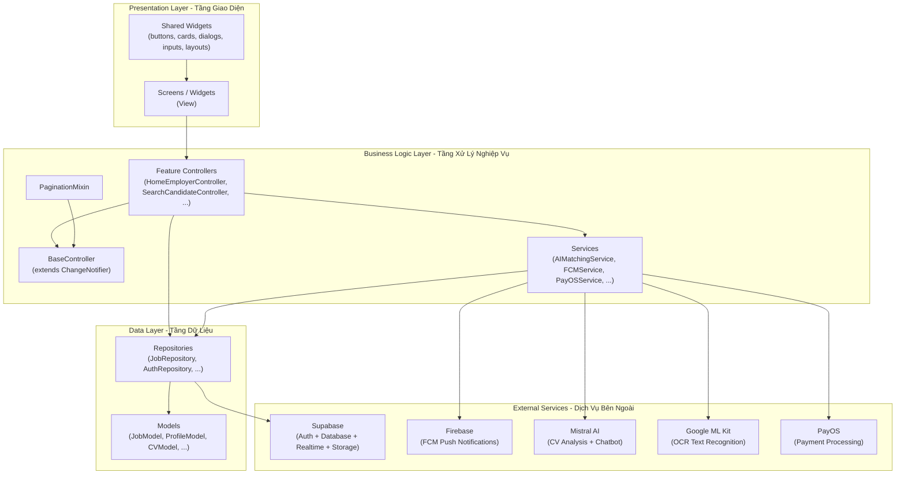
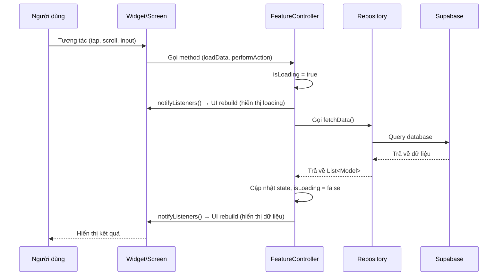
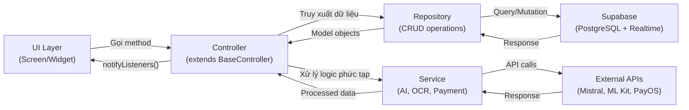
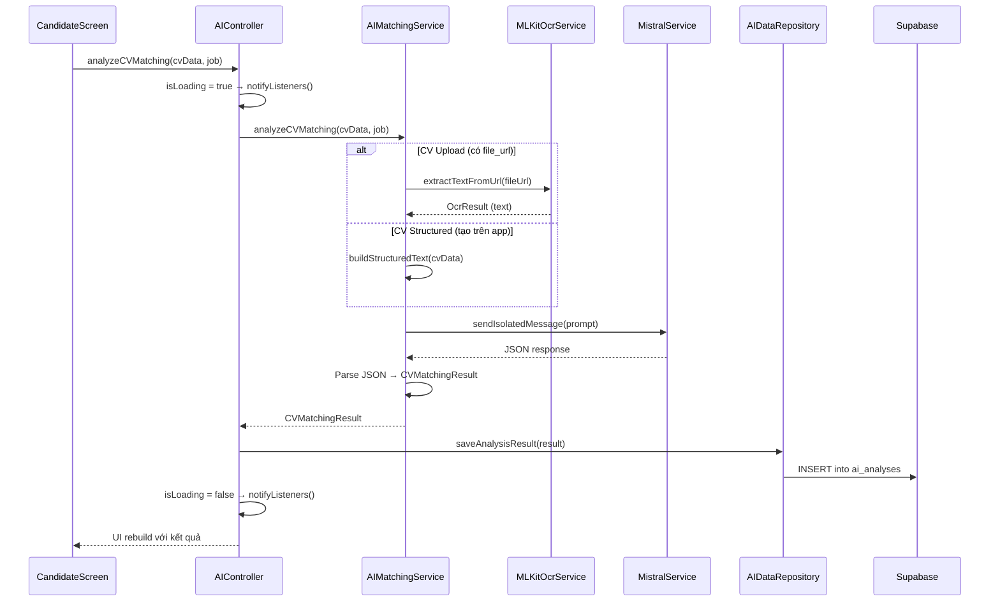
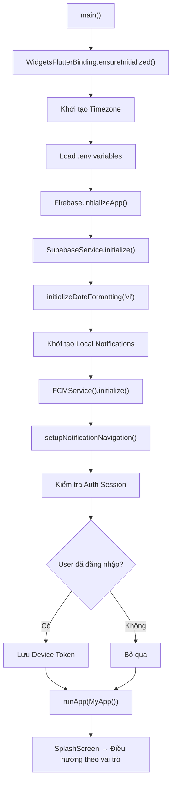
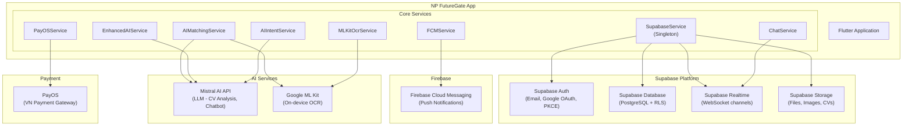
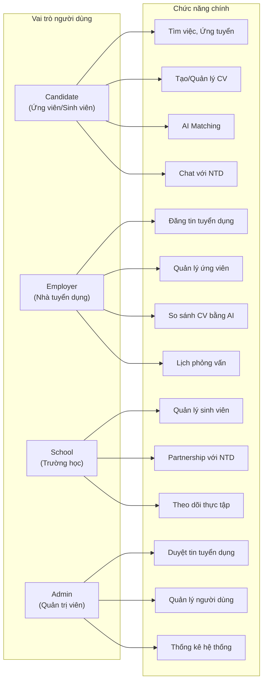

# Tổng Quan Kiến Trúc Hệ Thống NP FutureGate

## Mục đích

Tài liệu này mô tả kiến trúc tổng thể của ứng dụng NP FutureGate — một nền tảng kết nối việc làm thông minh dành cho sinh viên, nhà tuyển dụng và trường học. Tài liệu bao gồm mô hình kiến trúc MVC, cơ chế state management, cấu trúc thư mục, luồng dữ liệu và sơ đồ tương tác giữa các thành phần.

---

## 1. Kiến Trúc MVC Tổng Thể

NP FutureGate áp dụng mô hình kiến trúc **MVC (Model-View-Controller)** kết hợp với **ChangeNotifier** của Flutter để quản lý trạng thái. Kiến trúc được phân tầng rõ ràng thành 3 lớp chính:

### 1.1 Sơ Đồ Phân Tầng Kiến Trúc



### 1.2 Mô Tả Từng Tầng

| Tầng | Vai trò | Thành phần chính |
|------|---------|------------------|
| **Presentation Layer** | Hiển thị giao diện, nhận tương tác người dùng | Screens, Widgets, Shared Widgets |
| **Business Logic Layer** | Xử lý logic nghiệp vụ, quản lý trạng thái | BaseController, Feature Controllers, Services |
| **Data Layer** | Truy xuất và lưu trữ dữ liệu | Repositories, Models |
| **External Services** | Cung cấp dịch vụ bên ngoài | Supabase, Firebase, Mistral AI, Google ML Kit, PayOS |

---

## 2. Cơ Chế State Management

### 2.1 BaseController - Lớp Cơ Sở

`BaseController` là lớp trừu tượng (abstract class) kế thừa từ `ChangeNotifier` của Flutter, cung cấp các chức năng quản lý trạng thái chung cho toàn bộ ứng dụng:

```dart
abstract class BaseController extends ChangeNotifier {
  bool _isLoading = false;
  bool _isDisposed = false;
  String? _error;

  bool get isLoading => _isLoading;
  bool get hasError => _error != null;
  String? get error => _error;

  set isLoading(bool value) {
    _isLoading = value;
    safeNotifyListeners();
  }

  void setError(String? error) {
    _error = error;
    safeNotifyListeners();
  }

  void safeNotifyListeners() {
    if (!_isDisposed) {
      notifyListeners();
    }
  }

  @override
  void dispose() {
    _isDisposed = true;
    super.dispose();
  }
}
```

**Đặc điểm nổi bật:**

- **Quản lý trạng thái loading**: Tự động thông báo UI khi bắt đầu/kết thúc tải dữ liệu
- **Quản lý lỗi tập trung**: Cơ chế `setError()` thống nhất xử lý lỗi
- **Safe notification**: Kiểm tra `_isDisposed` trước khi gọi `notifyListeners()` để tránh lỗi khi widget đã bị hủy
- **Lifecycle management**: Đánh dấu `_isDisposed = true` khi controller bị dispose

### 2.2 PaginationMixin - Phân Trang Tái Sử Dụng

`PaginationMixin` là mixin cung cấp logic phân trang có thể tái sử dụng cho bất kỳ controller nào:

```dart
mixin PaginationMixin<T> on BaseController {
  List<T> _items = [];
  int _currentPage = 0;
  bool _hasMore = true;
  int get pageSize => 10;

  Future<List<T>> fetchPage(int offset, int limit); // Abstract method

  Future<void> loadNextPage() async {
    if (isLoading || !_hasMore) return;
    isLoading = true;
    try {
      final newItems = await fetchPage(_currentPage * pageSize, pageSize);
      _items.addAll(newItems);
      _hasMore = newItems.length >= pageSize;
      _currentPage++;
    } catch (e) {
      setError(e.toString());
    } finally {
      isLoading = false;
    }
  }

  void resetPagination() {
    _items = [];
    _currentPage = 0;
    _hasMore = true;
    safeNotifyListeners();
  }
}
```

### 2.3 Luồng State Management



---

## 3. Cấu Trúc Thư Mục Dự Án

```
lib/
├── main.dart                          # Entry point, khởi tạo app
├── firebase_options.dart              # Cấu hình Firebase
├── core/                              # Lõi ứng dụng (dùng chung)
│   ├── config/                        # Cấu hình hệ thống
│   │   └── supabase_config.dart       # URL và API key Supabase
│   ├── controllers/                   # Controller cơ sở
│   │   ├── base_controller.dart       # BaseController (abstract)
│   │   └── pagination_mixin.dart      # Mixin phân trang
│   ├── enums/                         # Hằng số enum
│   │   ├── employment_types.dart      # Loại hình công việc
│   │   ├── experience_levels.dart     # Cấp độ kinh nghiệm
│   │   ├── job_fields.dart            # Lĩnh vực ngành nghề
│   │   └── vietnam_provinces.dart     # Danh sách tỉnh thành
│   ├── models/                        # Data models (24 files)
│   │   ├── job_model.dart             # Model công việc
│   │   ├── profile_model.dart         # Model hồ sơ người dùng
│   │   ├── cv_model.dart              # Model CV
│   │   ├── interview_model.dart       # Model phỏng vấn
│   │   ├── notification_model.dart    # Model thông báo
│   │   ├── conversation_model.dart    # Model hội thoại
│   │   ├── message_model.dart         # Model tin nhắn
│   │   └── ...                        # 17 models khác
│   ├── repositories/                  # Data access layer (16 files)
│   │   ├── job_repository.dart        # CRUD công việc
│   │   ├── auth_repository.dart       # Xác thực người dùng
│   │   ├── candidate_repository.dart  # Dữ liệu ứng viên
│   │   ├── ai_data_repository.dart    # Dữ liệu AI
│   │   ├── interview_repository.dart  # Dữ liệu phỏng vấn
│   │   └── ...                        # 11 repositories khác
│   ├── services/                      # Business services (17 files)
│   │   ├── supabase_service.dart      # Singleton quản lý Supabase client
│   │   ├── ai_matching_service.dart   # Phân tích CV bằng AI
│   │   ├── mistral_service.dart       # Giao tiếp Mistral AI API
│   │   ├── mlkit_ocr_service.dart     # OCR bằng Google ML Kit
│   │   ├── fcm_service.dart           # Firebase Cloud Messaging
│   │   ├── payos_service.dart         # Thanh toán PayOS
│   │   ├── chat_service.dart          # Chat realtime
│   │   ├── subscription_service.dart  # Quản lý gói đăng ký
│   │   ├── notification/              # Nhóm dịch vụ thông báo
│   │   │   ├── application_notification_service.dart
│   │   │   ├── interview_reminder_service.dart
│   │   │   └── status_notification_service.dart
│   │   └── ...                        # Các services khác
│   ├── theme/                         # Giao diện và style (5 files)
│   │   ├── app_theme.dart             # Theme chính (light/dark)
│   │   ├── app_colors.dart            # Bảng màu
│   │   ├── app_gradients.dart         # Gradient styles
│   │   ├── app_main_colors.dart       # Màu chủ đạo
│   │   └── app_text_styles.dart       # Typography
│   └── utils/                         # Tiện ích (4 files)
│       ├── date_time_utils.dart       # Xử lý ngày giờ
│       ├── job_utils.dart             # Tiện ích công việc
│       ├── snackbar_utils.dart        # Hiển thị thông báo
│       └── statistics_utils.dart      # Tính toán thống kê
├── features/                          # Modules theo chức năng (10 modules)
│   ├── auth/                          # Xác thực (đăng nhập, đăng ký)
│   ├── ai/                            # AI matching, chatbot
│   ├── candidate/                     # Quản lý ứng viên
│   ├── employer/                      # Quản lý nhà tuyển dụng
│   ├── school/                        # Quản lý trường học
│   ├── admin/                         # Quản trị hệ thống
│   ├── chat/                          # Chat realtime
│   ├── cv/                            # Quản lý CV
│   ├── interview/                     # Quản lý phỏng vấn
│   └── notification/                  # Thông báo đẩy
├── screens/                           # Màn hình dùng chung
│   ├── career_news/                   # Tin tức nghề nghiệp
│   ├── chatbot/                       # Chatbot AI
│   ├── courses/                       # Khóa học
│   ├── profile/                       # Hồ sơ cá nhân
│   ├── settings/                      # Cài đặt
│   └── splash/                        # Màn hình khởi động
├── shared/                            # Components dùng chung
│   └── widgets/                       # Widget tái sử dụng
│       ├── buttons/                   # Nút bấm
│       ├── cards/                     # Thẻ hiển thị
│       ├── dialogs/                   # Hộp thoại
│       ├── inputs/                    # Trường nhập liệu
│       ├── layouts/                   # Bố cục
│       └── ...                        # Widgets đặc biệt
└── dev_tools/                         # Công cụ phát triển
    ├── demo/                          # Demo mode
    └── test/                          # Test utilities
```

### 3.1 Giải Thích Vai Trò Từng Thư Mục

| Thư mục | Vai trò |
|---------|---------|
| `core/config/` | Chứa cấu hình kết nối đến các dịch vụ bên ngoài (Supabase URL, API keys) |
| `core/controllers/` | Lớp controller cơ sở và mixin, cung cấp nền tảng cho tất cả feature controllers |
| `core/enums/` | Định nghĩa các hằng số enum dùng chung (loại việc, kinh nghiệm, ngành nghề, tỉnh thành) |
| `core/models/` | Data models ánh xạ dữ liệu từ database, 24 model files |
| `core/repositories/` | Tầng truy xuất dữ liệu, giao tiếp trực tiếp với Supabase, 16 repository files |
| `core/services/` | Tầng dịch vụ xử lý logic phức tạp và tích hợp API bên ngoài, 17 service files |
| `core/theme/` | Định nghĩa giao diện: màu sắc, typography, gradient, theme light/dark |
| `core/utils/` | Hàm tiện ích dùng chung: xử lý ngày giờ, format dữ liệu, hiển thị thông báo |
| `features/` | Modules theo chức năng, mỗi module có cấu trúc controllers/screens/widgets riêng |
| `screens/` | Màn hình dùng chung không thuộc feature cụ thể nào |
| `shared/widgets/` | Widget tái sử dụng xuyên suốt ứng dụng |
| `dev_tools/` | Công cụ hỗ trợ phát triển và testing |

---

## 4. Cấu Trúc Feature Module

Mỗi feature module tuân theo cấu trúc nhất quán:

```
features/{feature_name}/
├── controllers/     # Business logic, extends BaseController hoặc ChangeNotifier
├── screens/         # UI screens (View layer)
└── widgets/         # Reusable widgets riêng cho feature
```

### 4.1 Danh Sách Feature Modules

| Module | Mô tả | Vai trò người dùng |
|--------|--------|-------------------|
| `auth/` | Đăng nhập, đăng ký, Google Sign-In | Tất cả |
| `ai/` | AI matching, phân tích CV, chatbot | Candidate, Employer |
| `candidate/` | Tìm việc, ứng tuyển, quản lý hồ sơ | Candidate |
| `employer/` | Đăng tin, quản lý ứng viên, thống kê | Employer |
| `school/` | Quản lý sinh viên, partnership | School |
| `admin/` | Quản trị hệ thống, duyệt tin | Admin |
| `chat/` | Chat realtime giữa các vai trò | Tất cả |
| `cv/` | Tạo/quản lý CV, OCR scanning | Candidate |
| `interview/` | Lịch phỏng vấn, nhắc nhở | Candidate, Employer |
| `notification/` | Push notifications, local notifications | Tất cả |

---

## 5. Luồng Dữ Liệu

### 5.1 Luồng Tổng Quát: UI → Controller → Repository/Service



### 5.2 Ví Dụ Cụ Thể: Luồng Phân Tích CV



### 5.3 Luồng Khởi Tạo Ứng Dụng



---

## 6. Sơ Đồ Tương Tác Giữa Các Thành Phần Chính

### 6.1 Tổng Quan Tích Hợp Hệ Thống



### 6.2 Chi Tiết Vai Trò Từng Dịch Vụ Bên Ngoài

| Dịch vụ | Vai trò trong hệ thống | Giao thức |
|---------|------------------------|-----------|
| **Supabase Auth** | Xác thực người dùng (email/password, Google OAuth với PKCE flow) | REST API |
| **Supabase Database** | Lưu trữ toàn bộ dữ liệu (jobs, profiles, CVs, interviews, ...) với Row Level Security | REST API (PostgREST) |
| **Supabase Realtime** | Đồng bộ dữ liệu realtime cho chat, cập nhật trạng thái job | WebSocket |
| **Supabase Storage** | Lưu trữ files (CV uploads, avatar, hình ảnh) | REST API |
| **Firebase FCM** | Gửi push notifications đến thiết bị người dùng | HTTP/2 |
| **Mistral AI** | Phân tích CV, chatbot hỗ trợ, intent-based queries, so sánh ứng viên | REST API |
| **Google ML Kit** | OCR nhận dạng văn bản từ ảnh CV (xử lý on-device) | Native SDK |
| **PayOS** | Xử lý thanh toán gói đăng ký cho nhà tuyển dụng | REST API |

---

## 7. Mô Hình Đa Vai Trò (Multi-Role System)

Hệ thống hỗ trợ 4 vai trò người dùng với quyền truy cập khác nhau:



---

## 8. Thống Kê Dự Án

| Metric | Giá trị |
|--------|---------|
| Feature modules | 10 |
| Core services | 17 |
| Repositories | 16 |
| Data models | 24 |
| Enum files | 4 |
| Theme files | 5 |
| Utility files | 4 |
| Shared widget categories | 5 (buttons, cards, dialogs, inputs, layouts) |
| External integrations | 5 (Supabase, Firebase, Mistral AI, Google ML Kit, PayOS) |
| User roles | 4 (Candidate, Employer, School, Admin) |

---

## Liên Kết Liên Quan

- [Cơ chế từng chức năng](./02_co_che_tung_chuc_nang/authentication_flow.md)
- [Sơ đồ luồng Mermaid](./03_so_do_flow/mermaid_sequence_diagrams.md)
- [Công nghệ sử dụng](./04_cong_nghe_su_dung/tech_stack_overview.md)
- [Giải thích State Management](./10_giai_thich_cong_nghe_tung_cai/state_management_changenotifier.md)
- [Phân tích file dùng chung](./11_phan_tich_cac_file_dung_chung/utils_analysis.md)
- [Tóm tắt trình chiếu](./12_tom_tat_de_trinh_chieu.md)
