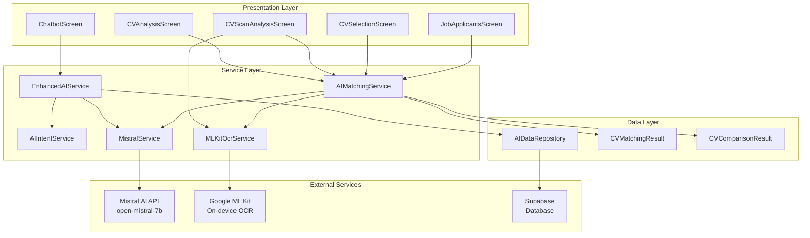
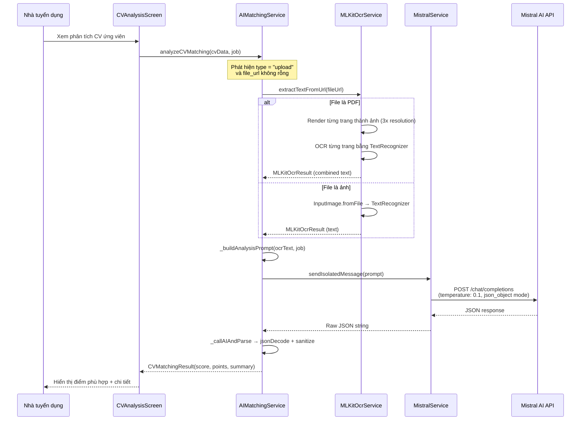
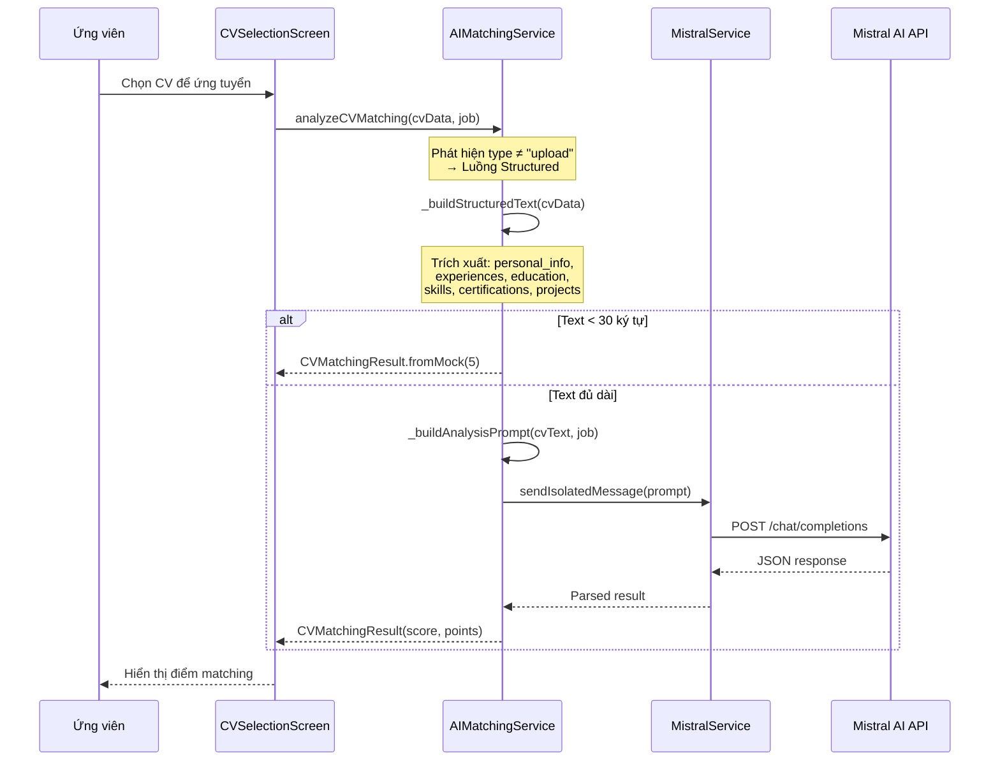
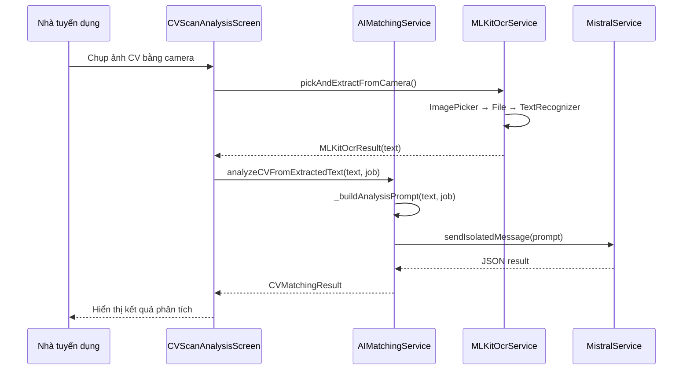
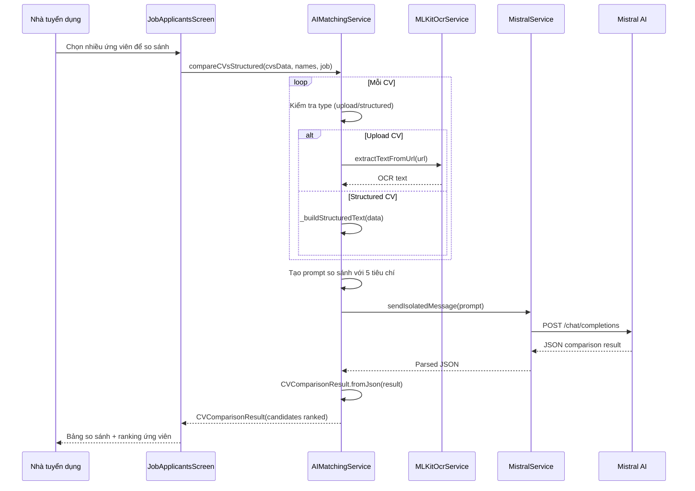
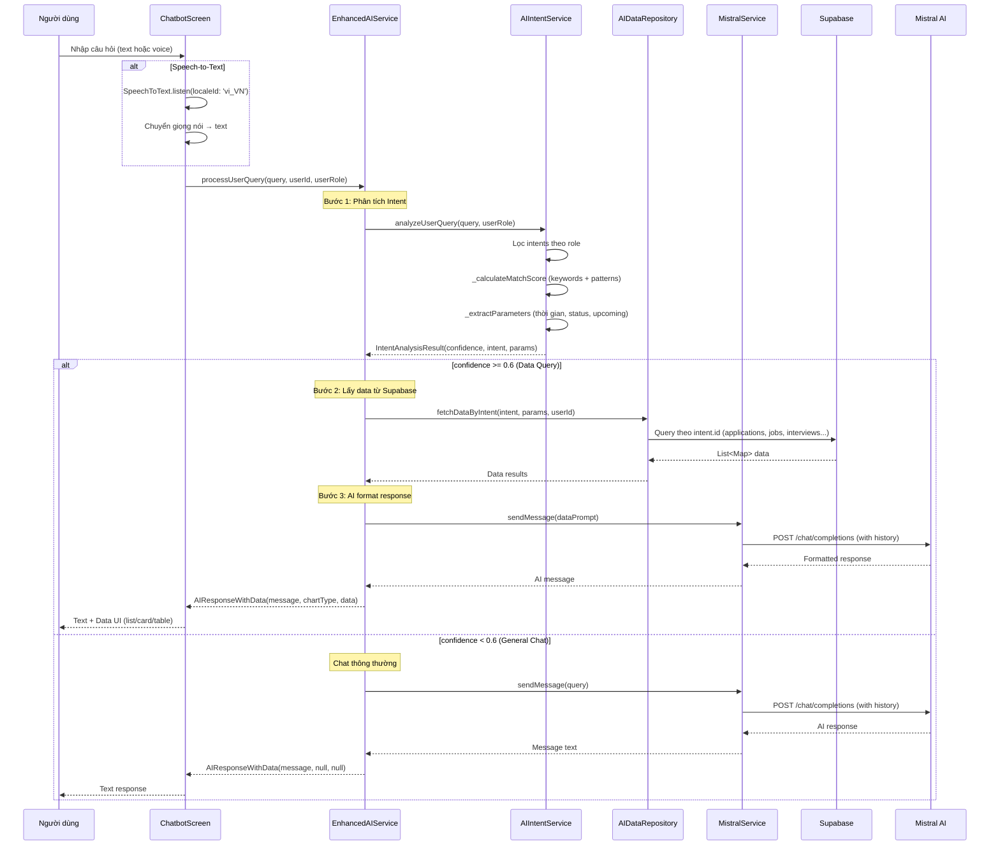
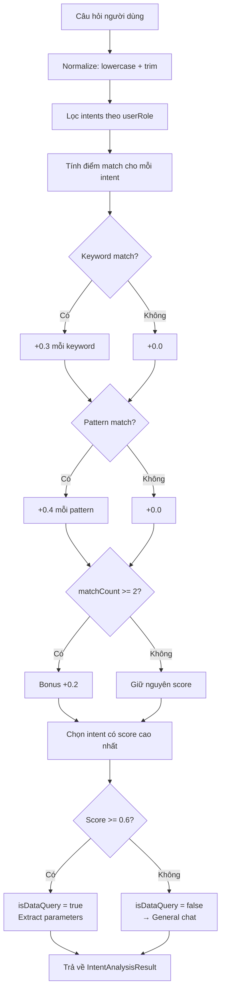

# Cơ Chế AI Matching & Chatbot

## Mục đích

Tài liệu này mô tả chi tiết cơ chế hoạt động của hệ thống AI trong NP FutureGate, bao gồm ba chức năng chính:

1. **Phân tích CV (CV Matching)** — Đánh giá mức độ phù hợp giữa CV ứng viên và yêu cầu công việc bằng Mistral AI
2. **Chatbot AI Assistant** — Trợ lý AI thông minh hỗ trợ người dùng tư vấn việc làm, CV, phỏng vấn
3. **Hệ thống Intent-Based Queries** — Phát hiện ý định người dùng và truy vấn dữ liệu thực từ Supabase

## Các thành phần tham gia

### Services

| Service | File | Vai trò |
|---------|------|---------|
| `AIMatchingService` | `lib/core/services/ai_matching_service.dart` | Điều phối phân tích CV, xử lý 2 luồng (Upload/Structured) |
| `MistralService` | `lib/core/services/mistral_service.dart` | Giao tiếp với Mistral AI API (chat + isolated analysis) |
| `MLKitOcrService` | `lib/core/services/mlkit_ocr_service.dart` | Trích xuất text từ ảnh/PDF bằng Google ML Kit (on-device) |
| `EnhancedAIService` | `lib/core/services/enhanced_ai_service.dart` | Kết hợp AI chatbot với data queries từ Supabase |
| `AIIntentService` | `lib/core/services/ai_intent_service.dart` | Phát hiện intent từ câu hỏi người dùng |

### Repositories

| Repository | File | Vai trò |
|------------|------|---------|
| `AIDataRepository` | `lib/core/repositories/ai_data_repository.dart` | Truy vấn dữ liệu từ Supabase dựa trên intent đã phát hiện |

### Models

| Model | File | Vai trò |
|-------|------|---------|
| `CVMatchingResult` | `lib/core/models/cv_matching_result_model.dart` | Kết quả phân tích CV (score, matching/missing points) |
| `CVComparisonResult` | `lib/core/models/cv_comparison_result_model.dart` | Kết quả so sánh nhiều ứng viên |
| `AIIntent` | `lib/core/models/ai_intent_model.dart` | Định nghĩa intent (keywords, patterns, roles, action type) |
| `IntentAnalysisResult` | `lib/core/models/ai_intent_model.dart` | Kết quả phân tích intent (confidence, params) |
| `AIResponseWithData` | `lib/core/models/ai_intent_model.dart` | Response AI kèm data và chart type |

### Screens

| Screen | File | Vai trò |
|--------|------|---------|
| `ChatbotScreen` | `lib/screens/chatbot/chatbot_screen.dart` | Giao diện chatbot AI với speech-to-text |
| `CVAnalysisScreen` | `lib/features/employer/screens/jobs/cv_analysis_screen.dart` | Hiển thị kết quả phân tích CV |
| `CVScanAnalysisScreen` | `lib/features/employer/screens/jobs/cv_scan_analysis_screen.dart` | Scan CV bằng camera và phân tích |
| `CVSelectionScreen` | `lib/features/candidate/screens/cv_selection_screen.dart` | Chọn CV và xem điểm matching |

## Sơ đồ kiến trúc tổng quan



## Luồng xử lý chi tiết

---

### 1. Phân tích CV Matching

Hệ thống hỗ trợ 3 phương thức phân tích CV:

#### Luồng 1: CV Upload (File PDF/Ảnh → OCR → AI)



#### Luồng 2: CV Structured (App-created CV → AI)



#### Luồng 3: Scan CV (Camera → OCR → AI)



#### Cấu trúc Prompt phân tích CV

```
PHÂN TÍCH ĐỘ PHÙ HỢP CV VỚI CÔNG VIỆC.

[CV]
{nội dung CV - text từ OCR hoặc structured}

[CÔNG VIỆC]
Vị trí: {title}
Mô tả: {jobDescription}
Yêu cầu: {candidateRequirements}
Kỹ năng: {requirementsTags}
Kinh nghiệm: {experienceRequired}
Lĩnh vực: {fields}

Trả về JSON duy nhất:
{
  "overall_score": 0-100,
  "semantic_similarity": 0.0-1.0,
  "keyword_match_score": 0-100,
  "summary": "nhận xét tiếng Việt",
  "matching_points": ["điểm phù hợp"],
  "missing_points": ["điểm thiếu"],
  "parsed_data": {"name": "", "skills": "", "experience": "", "education": ""}
}
```

#### Kết quả trả về (CVMatchingResult)

| Trường | Kiểu | Mô tả |
|--------|------|--------|
| `overallScore` | `double` | Điểm tổng thể 0-100 |
| `semanticSimilarity` | `double` | Độ tương đồng ngữ nghĩa 0.0-1.0 |
| `keywordMatchScore` | `double` | Điểm khớp từ khóa 0-100 |
| `matchingSummary` | `String` | Nhận xét tổng quan bằng tiếng Việt |
| `matchingPoints` | `List<String>` | Danh sách điểm phù hợp |
| `missingPoints` | `List<String>` | Danh sách điểm còn thiếu |
| `parsedData` | `Map` | Dữ liệu CV đã parse (name, skills, experience, education) |

---

### 2. So sánh ứng viên (CV Comparison)



**5 tiêu chí đánh giá (0-100):**
- `skills_score` — Kỹ năng
- `experience_score` — Kinh nghiệm
- `education_score` — Học vấn
- `overall_score` — Tổng thể
- `potential_score` — Tiềm năng

---

### 3. Chatbot AI Assistant



#### Tính năng Chatbot

| Tính năng | Mô tả |
|-----------|--------|
| Chat text | Nhập câu hỏi bằng bàn phím |
| Speech-to-Text | Nhận dạng giọng nói tiếng Việt (`vi_VN`) |
| Conversation history | Lưu lịch sử hội thoại trong session |
| Data-aware responses | Trả lời kèm dữ liệu thực từ database |
| Role-based suggestions | Gợi ý câu hỏi theo vai trò người dùng |
| Rich UI responses | Hiển thị data dưới dạng list, card, table |

#### System Prompt của Chatbot

```
Bạn là trợ lý AI thông minh của NP FutureGate - nền tảng kết nối sinh viên với cơ hội việc làm.

Nhiệm vụ của bạn:
- Tư vấn về tìm việc, viết CV, chuẩn bị phỏng vấn
- Hướng dẫn sử dụng các tính năng của app
- Giải đáp thắc mắc về quy trình ứng tuyển
- Gợi ý ngành nghề phù hợp với profile sinh viên

Hãy trả lời thân thiện, chuyên nghiệp và súc tích bằng tiếng Việt.
```

---

### 4. Hệ thống Intent-Based Queries

#### Cơ chế phát hiện Intent



#### Danh sách Intents theo vai trò

**Employer (Nhà tuyển dụng):**

| Intent ID | Mô tả | Ví dụ câu hỏi |
|-----------|--------|----------------|
| `employer_applications_today` | Ứng viên ứng tuyển hôm nay | "Ứng viên hôm nay" |
| `employer_job_status` | Tình trạng tin tuyển dụng | "Tin chờ duyệt" |
| `employer_expired_jobs` | Tin hết hạn | "Tin hết hạn" |
| `employer_active_jobs` | Tin còn hạn | "Đang tuyển" |
| `employer_interviews` | Lịch phỏng vấn | "Lịch phỏng vấn" |
| `employer_upcoming_interviews` | Phỏng vấn sắp tới | "Phỏng vấn sắp tới" |
| `employer_partnership_requests` | Yêu cầu liên kết trường | "Yêu cầu liên kết" |

**Student (Sinh viên/Ứng viên):**

| Intent ID | Mô tả | Ví dụ câu hỏi |
|-----------|--------|----------------|
| `student_applied_jobs` | Công việc đã ứng tuyển | "Đã ứng tuyển" |
| `student_interviews` | Lịch phỏng vấn của tôi | "Phỏng vấn của tôi" |
| `student_recommended_jobs` | Công việc đề xuất | "Gợi ý công việc" |

**School (Trường học):**

| Intent ID | Mô tả | Ví dụ câu hỏi |
|-----------|--------|----------------|
| `school_partners` | Doanh nghiệp liên kết | "Doanh nghiệp liên kết" |
| `school_partnership_jobs` | Công việc từ đối tác | "Công việc đối tác" |

#### Trích xuất Parameters

Hệ thống tự động trích xuất các tham số từ câu hỏi:

| Loại | Từ khóa | Giá trị |
|------|---------|---------|
| Thời gian | "hôm nay" | `time_filter: 'today'` |
| Thời gian | "hôm qua" | `time_filter: 'yesterday'` |
| Thời gian | "tuần này" | `time_filter: 'this_week'` |
| Thời gian | "tháng này" | `time_filter: 'this_month'` |
| Trạng thái | "chờ duyệt" | `status: 'pending'` |
| Trạng thái | "đã duyệt" | `status: 'approved'` |
| Trạng thái | "từ chối" | `status: 'rejected'` |
| Trạng thái | "hết hạn" | `status: 'expired'` |
| Sắp tới | "sắp tới" | `upcoming: true` |

---

## Xử lý lỗi

### AIMatchingService

| Tình huống | Xử lý |
|------------|--------|
| OCR thất bại (file không đọc được) | Throw Exception → Fallback `CVMatchingResult.fromMock(5)` |
| CV text quá ngắn (< 30 ký tự) | Trả về `CVMatchingResult.fromMock(5)` trực tiếp |
| AI không trả về JSON hợp lệ | Sanitize response → tìm JSON trong text → nếu vẫn fail trả mock |
| API timeout/error | Retry logic trong MistralService (tối đa 2 lần) |

### MistralService

| Tình huống | Xử lý |
|------------|--------|
| API key chưa cấu hình | Throw Exception ngay lập tức |
| HTTP 429 (Rate limit) | Đợi 30s rồi retry 1 lần |
| HTTP 422/400 (json_object mode không hỗ trợ) | Fallback gọi lại không có `response_format` |
| Lỗi khác | Retry tối đa 2 lần với delay tăng dần (3s, 8s) |

### MLKitOcrService

| Tình huống | Xử lý |
|------------|--------|
| File không tồn tại | Trả `MLKitOcrResult.failure('File không tồn tại')` |
| Không tìm thấy text trong ảnh | Trả failure với message mô tả |
| PDF render page thất bại | Skip page đó, tiếp tục các page khác |
| Download file thất bại | Trả failure với HTTP status code |

### EnhancedAIService

| Tình huống | Xử lý |
|------------|--------|
| Data query trả về rỗng | Trả message thân thiện theo category |
| Lỗi khi lấy data từ Supabase | Trả message xin lỗi + gợi ý thử lại |
| Lỗi khi gọi AI | Trả message xin lỗi chung |

---

## Cấu hình và Dependencies

### Environment Variables

```
MISTRAL_API_KEY=<api_key>
MISTRAL_MODEL=open-mistral-7b
```

### Packages sử dụng

| Package | Vai trò |
|---------|---------|
| `http` | HTTP client gọi Mistral AI API |
| `flutter_dotenv` | Đọc API key từ .env |
| `google_mlkit_text_recognition` | OCR on-device |
| `pdfx` | Render PDF thành ảnh cho OCR |
| `image_picker` | Chọn/chụp ảnh CV |
| `path_provider` | Lưu file tạm cho OCR |
| `speech_to_text` | Nhận dạng giọng nói cho chatbot |
| `permission_handler` | Xin quyền microphone |
| `supabase_flutter` | Truy vấn data cho intent queries |

---

## Design Patterns sử dụng

| Pattern | Áp dụng | Mô tả |
|---------|---------|--------|
| **Singleton** | `MistralService`, `MLKitOcrService`, `EnhancedAIService`, `AIIntentService` | Đảm bảo chỉ có 1 instance, chia sẻ conversation history |
| **Strategy** | `analyzeCVMatching()` | Tự động chọn luồng xử lý (Upload vs Structured) dựa trên input |
| **Template Method** | `_buildAnalysisPrompt()` | Prompt template chung cho mọi loại CV |
| **Chain of Responsibility** | `_callAIAndParse()` | Parse JSON → Sanitize → Extract JSON → Fallback |
| **Facade** | `EnhancedAIService` | Che giấu complexity của Intent + Data + AI phía sau 1 method |

---

## Liên kết liên quan

- [Tổng quan kiến trúc](../01_tong_quan_kien_truc.md)
- [Luồng quản lý CV](./cv_management_flow.md)
- [Luồng đăng tin tuyển dụng](./job_posting_flow.md)
- [Luồng chat realtime](./chat_flow.md)
- [Giải thích Mistral AI](../10_giai_thich_cong_nghe_tung_cai/mistral_ai.md)
- [Giải thích Google ML Kit OCR](../10_giai_thich_cong_nghe_tung_cai/google_mlkit_ocr.md)
- [Giải thích Speech-to-Text](../10_giai_thich_cong_nghe_tung_cai/speech_to_text.md)
- [Sơ đồ Sequence Diagrams](../03_so_do_flow/mermaid_sequence_diagrams.md)
