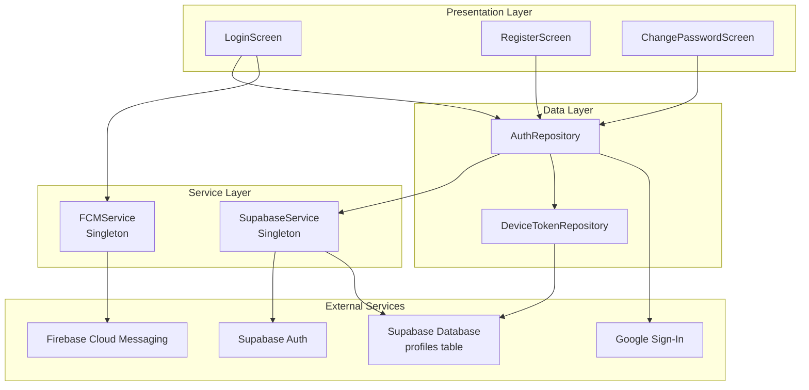
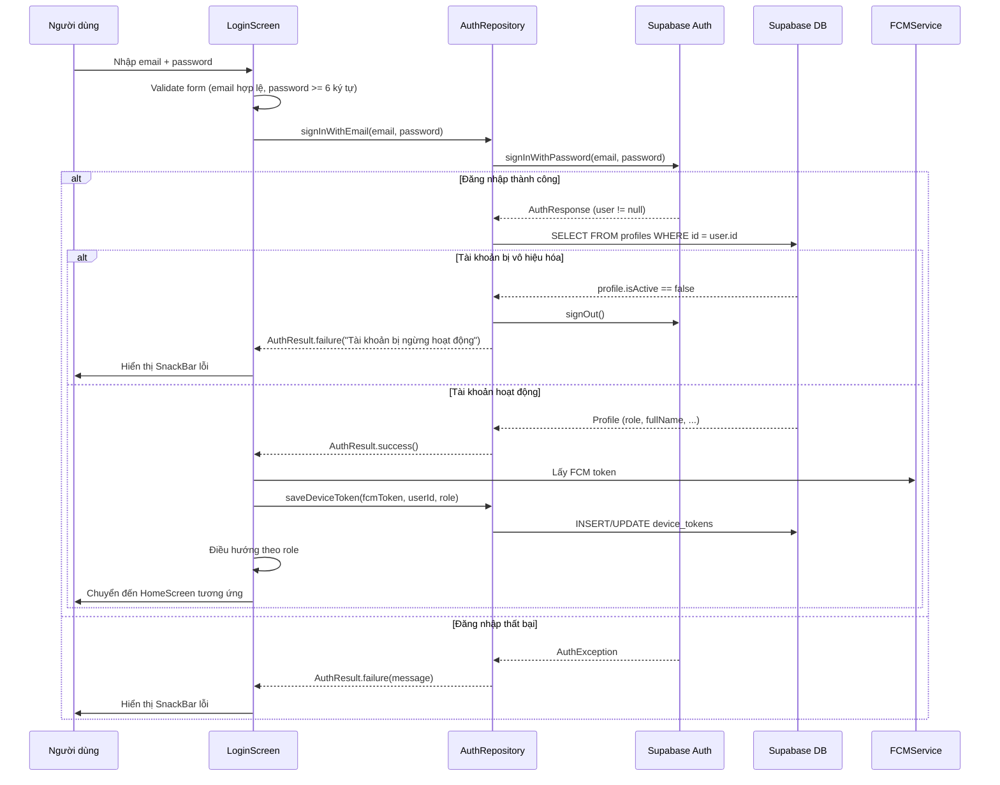
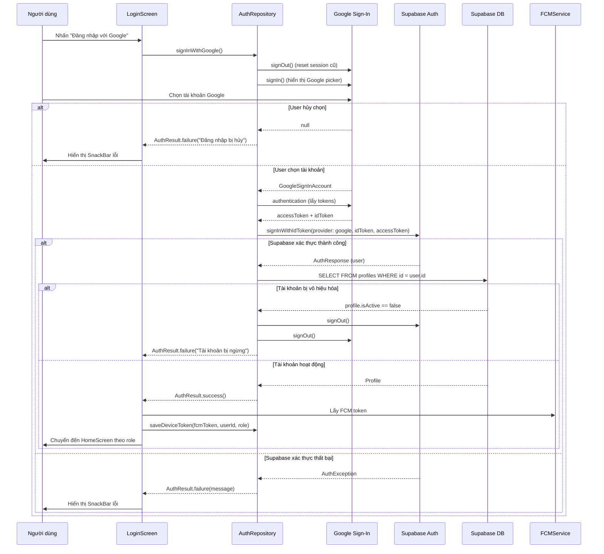
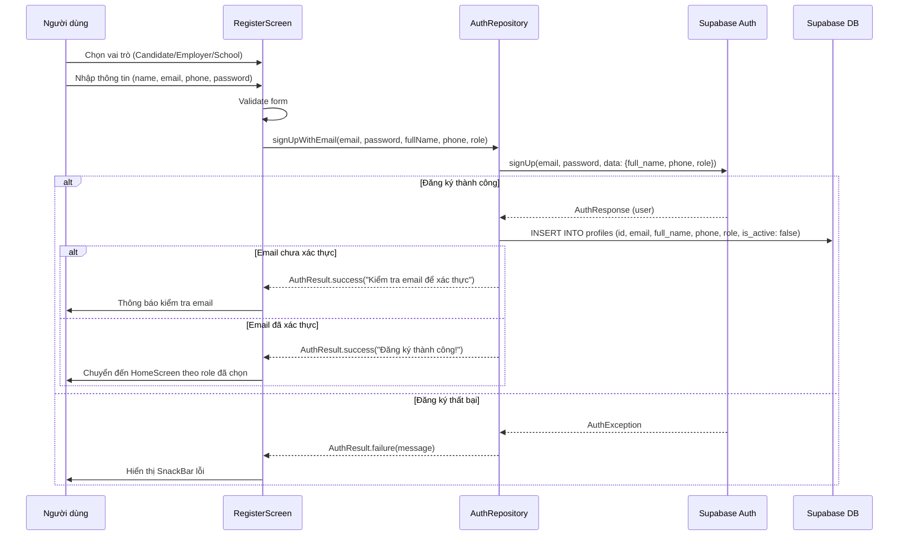
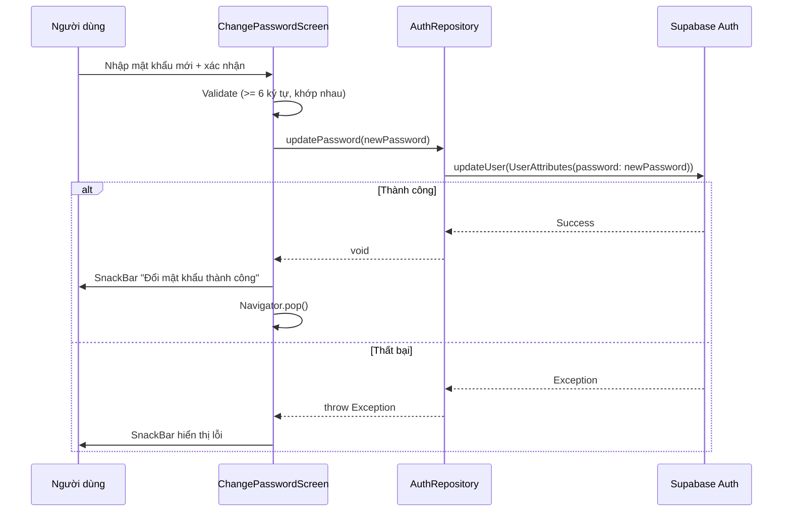
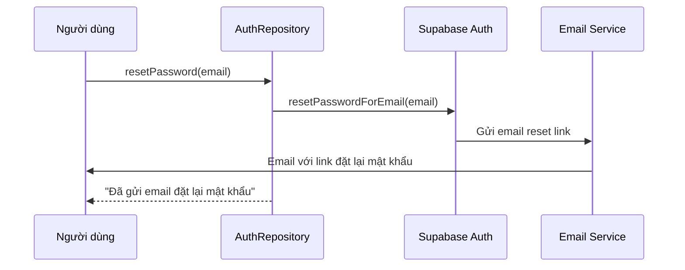
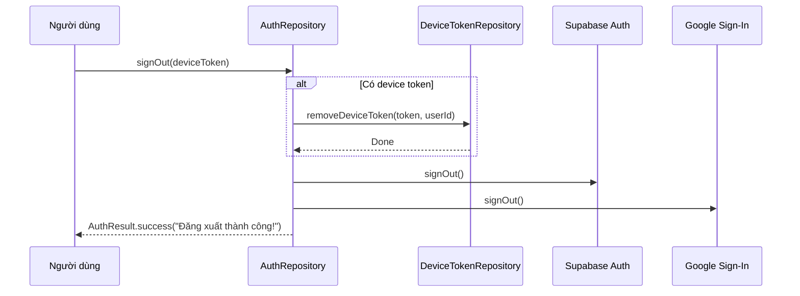

# Luồng Xác Thực (Authentication Flow)

## Mục đích

Tài liệu này mô tả chi tiết cơ chế xác thực người dùng trong ứng dụng NP FutureGate, bao gồm:
- Đăng nhập bằng Email/Password qua Supabase Auth
- Đăng nhập/Đăng ký bằng Google Sign-In
- Đăng ký tài khoản mới với lựa chọn vai trò (Candidate, Employer, School)
- Đổi mật khẩu và đặt lại mật khẩu
- Quản lý phiên đăng nhập và điều hướng theo vai trò

## Các thành phần tham gia

| Thành phần | Đường dẫn | Vai trò |
|------------|-----------|---------|
| `LoginScreen` | `lib/features/auth/screens/login_screen.dart` | Giao diện đăng nhập |
| `RegisterScreen` | `lib/features/auth/screens/register_screen.dart` | Giao diện đăng ký |
| `ChangePasswordScreen` | `lib/features/auth/screens/change_password_screen.dart` | Giao diện đổi mật khẩu |
| `AuthRepository` | `lib/core/repositories/auth_repository.dart` | Xử lý logic xác thực |
| `SupabaseService` | `lib/core/services/supabase_service.dart` | Quản lý Supabase client (Singleton) |
| `SupabaseConfig` | `lib/core/config/supabase_config.dart` | Cấu hình URL và API key từ `.env` |
| `FCMService` | `lib/core/services/fcm_service.dart` | Lưu FCM token sau đăng nhập |
| `DeviceTokenRepository` | `lib/core/repositories/device_token_repository.dart` | Lưu/xóa device token |
| `AuthResult` | `lib/core/models/auth_models.dart` | Model kết quả xác thực |
| `UserRole` | `lib/core/models/auth_models.dart` | Enum vai trò người dùng |
| `Profile` | `lib/core/models/profile_model.dart` | Model thông tin người dùng |

## Kiến trúc tổng quan



## Luồng xử lý chi tiết

### 1. Khởi tạo Supabase

Trước khi ứng dụng chạy, `SupabaseService.initialize()` được gọi trong `main()`:

1. Load file `.env` chứa `SUPABASE_URL` và `SUPABASE_ANON_KEY`
2. Khởi tạo Supabase client với `AuthFlowType.pkce` (Proof Key for Code Exchange)
3. Lưu client instance vào Singleton để sử dụng toàn ứng dụng

```dart
// Cấu hình PKCE flow cho bảo mật cao hơn
await Supabase.initialize(
  url: SupabaseConfig.supabaseUrl,
  anonKey: SupabaseConfig.supabaseAnonKey,
  authOptions: const FlutterAuthClientOptions(
    authFlowType: AuthFlowType.pkce,
  ),
);
```

### 2. Đăng nhập bằng Email/Password



**Các bước chi tiết:**

1. Người dùng nhập email và password trên `LoginScreen`
2. Form validation kiểm tra:
   - Email không rỗng và chứa ký tự `@`
   - Password không rỗng và có ít nhất 6 ký tự
3. Gọi `AuthRepository.signInWithEmail()`
4. Supabase Auth xác thực credentials
5. Nếu thành công: lấy profile từ bảng `profiles` để kiểm tra trạng thái tài khoản (`isActive`)
6. Nếu tài khoản active: lưu FCM token và điều hướng theo role
7. Nếu thất bại: hiển thị thông báo lỗi bằng tiếng Việt

### 3. Đăng nhập bằng Google Sign-In



**Các bước chi tiết:**

1. Gọi `_googleSignIn.signOut()` trước để đảm bảo user có thể chọn tài khoản mới
2. Hiển thị Google Account Picker qua `_googleSignIn.signIn()`
3. Lấy `accessToken` và `idToken` từ Google Authentication
4. Gửi tokens đến Supabase qua `signInWithIdToken()` với provider `OAuthProvider.google`
5. Supabase tự động tạo/liên kết user trong hệ thống auth
6. Kiểm tra trạng thái tài khoản và điều hướng

**Scopes yêu cầu:** `email`, `profile`

### 4. Đăng ký tài khoản mới



**Các bước chi tiết:**

1. Người dùng chọn vai trò trên `RegisterScreen`:
   - **Người dùng (Candidate):** Tìm kiếm cơ hội nghề nghiệp
   - **Nhà tuyển dụng (Employer):** Tuyển dụng nhân tài
   - **Nhà trường (School):** Kết nối sinh viên với doanh nghiệp
   - *(Admin không hiển thị trong form đăng ký)*
2. Nhập thông tin: Họ tên, Email, Số điện thoại, Mật khẩu, Xác nhận mật khẩu
3. Form validation:
   - Họ tên không rỗng
   - Email hợp lệ (chứa `@`)
   - Số điện thoại >= 10 ký tự
   - Mật khẩu >= 6 ký tự
   - Xác nhận mật khẩu khớp
4. Gọi `AuthRepository.signUpWithEmail()`:
   - Tạo user trong `auth.users` với metadata (full_name, phone, role)
   - Tạo profile trong bảng `profiles` với `is_active: false` (mặc định chưa kích hoạt)
5. Nếu trigger database đã tạo profile → bỏ qua lỗi duplicate
6. Điều hướng theo role đã chọn

### 5. Đăng ký bằng Google

Luồng tương tự đăng nhập Google (`signInWithGoogle()`). Supabase tự động xử lý:
- Nếu user chưa tồn tại → tạo mới trong `auth.users`
- Nếu user đã tồn tại → đăng nhập bình thường
- Profile được tạo với role mặc định (candidate)

### 6. Đổi mật khẩu



### 7. Đặt lại mật khẩu (Reset Password)



### 8. Đăng xuất



## Điều hướng theo vai trò (Role-based Navigation)

Sau khi xác thực thành công, hệ thống điều hướng người dùng đến màn hình chính tương ứng:

| Vai trò | Màn hình | File |
|---------|----------|------|
| `candidate` | `CandidateHomeScreen` | `lib/features/candidate/screens/candidate_home_screen.dart` |
| `employer` | `EmployerHomeScreen` | `lib/features/employer/screens/employer_home_screen.dart` |
| `school` | `SchoolHomeScreen` | `lib/features/school/screens/school_home_screen.dart` |
| `admin` | `AdminHomeScreen` | `lib/features/admin/screens/admin_home_screen.dart` |

## Xử lý lỗi

### Bảng mã lỗi và thông báo

| Mã lỗi | Điều kiện | Thông báo tiếng Việt |
|---------|-----------|---------------------|
| `400` | User already registered | "Email đã được đăng ký." |
| `400` | Invalid login credentials | "Email hoặc mật khẩu không đúng." |
| `400` | Khác | "Yêu cầu không hợp lệ." |
| `422` | Validation error | "Email hoặc mật khẩu không hợp lệ." |
| `429` | Rate limit | "Quá nhiều yêu cầu. Vui lòng thử lại sau." |
| - | Account deactivated | "Tài khoản đã bị ngừng hoạt động. Liên hệ quản trị viên." |
| - | Google cancelled | "Đăng nhập Google bị hủy." |
| - | Token null | "Không thể lấy thông tin xác thực từ Google." |

### Chiến lược xử lý lỗi

1. **AuthException**: Chuyển đổi mã lỗi Supabase sang thông báo tiếng Việt qua `_getAuthErrorMessage()`
2. **PostgrestException**: Hiển thị lỗi database (thường xảy ra khi tạo profile)
3. **General Exception**: Hiển thị thông báo chung với chi tiết lỗi
4. **Account Status Check**: Kiểm tra `isActive` sau đăng nhập, nếu bị vô hiệu hóa → sign out ngay lập tức
5. **FCM Token Error**: Không block luồng đăng nhập, chỉ log warning

## Bảo mật

- **PKCE Flow**: Sử dụng `AuthFlowType.pkce` cho bảo mật OAuth cao hơn
- **Environment Variables**: Credentials lưu trong `.env`, không hardcode
- **Account Deactivation**: Kiểm tra trạng thái tài khoản sau mỗi lần đăng nhập
- **Google Session Reset**: Gọi `signOut()` trước `signIn()` để tránh tự động chọn tài khoản cũ
- **Password Validation**: Yêu cầu tối thiểu 6 ký tự
- **Device Token Cleanup**: Xóa FCM token khi đăng xuất

## Model dữ liệu

### AuthResult

```dart
class AuthResult {
  final bool success;      // Kết quả thành công/thất bại
  final String? message;   // Thông báo cho người dùng
  final dynamic data;      // Dữ liệu bổ sung (User object)
}
```

### UserRole

```dart
enum UserRole {
  candidate,   // Ứng viên tìm việc
  employer,    // Nhà tuyển dụng
  school,      // Nhà trường
  admin;       // Quản trị viên
}
```

### Bảng `profiles` (Supabase Database)

| Cột | Kiểu | Mô tả |
|-----|------|--------|
| `id` | UUID | Khóa chính, liên kết với `auth.users.id` |
| `email` | TEXT | Email người dùng |
| `full_name` | TEXT | Họ và tên |
| `phone` | TEXT | Số điện thoại |
| `role` | TEXT | Vai trò (candidate/employer/school/admin) |
| `avatar_url` | TEXT | URL ảnh đại diện |
| `metadata` | JSONB | Dữ liệu bổ sung |
| `is_active` | BOOLEAN | Trạng thái tài khoản (mặc định: false) |

## Services và Repositories liên quan

| Tên | Loại | Chức năng trong luồng auth |
|-----|------|---------------------------|
| `SupabaseService` | Service (Singleton) | Khởi tạo và cung cấp Supabase client |
| `FCMService` | Service (Singleton) | Quản lý FCM token, lưu token sau đăng nhập |
| `AuthRepository` | Repository | Xử lý toàn bộ logic xác thực |
| `DeviceTokenRepository` | Repository | CRUD device tokens cho push notification |

## Liên kết liên quan

- [Tổng quan kiến trúc](../01_tong_quan_kien_truc.md)
- [Luồng thông báo (Notification Flow)](./notification_flow.md)
- [Giải thích Supabase](../10_giai_thich_cong_nghe_tung_cai/supabase.md)
- [Giải thích Firebase FCM](../10_giai_thich_cong_nghe_tung_cai/firebase_fcm.md)
