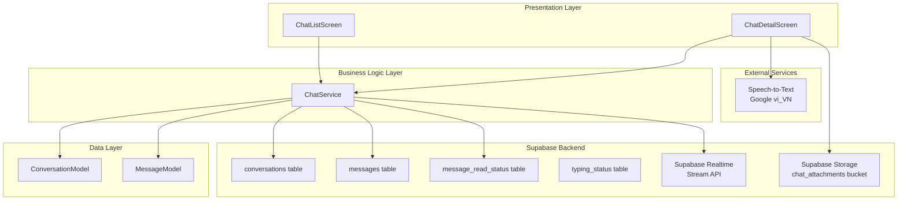
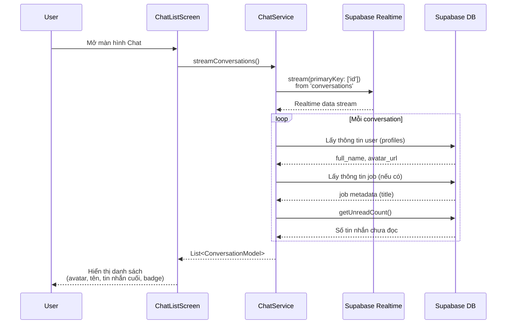
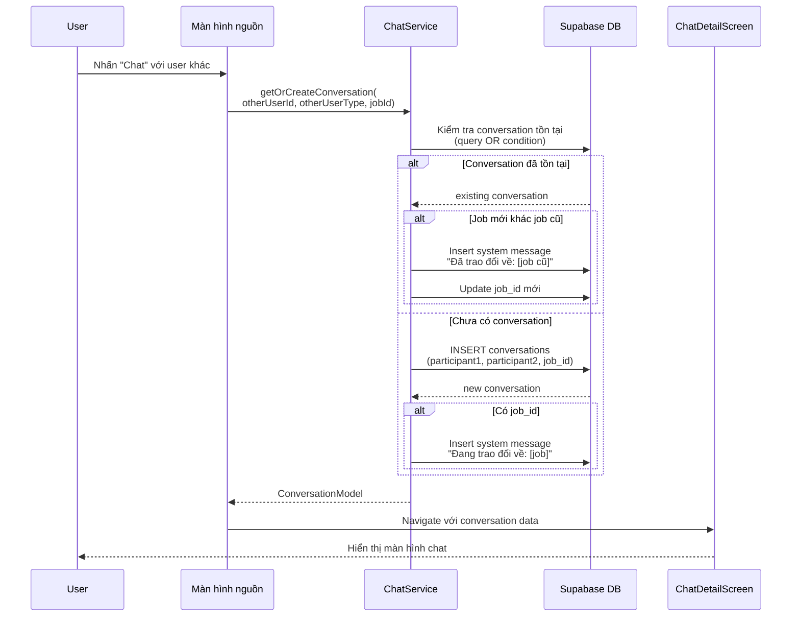
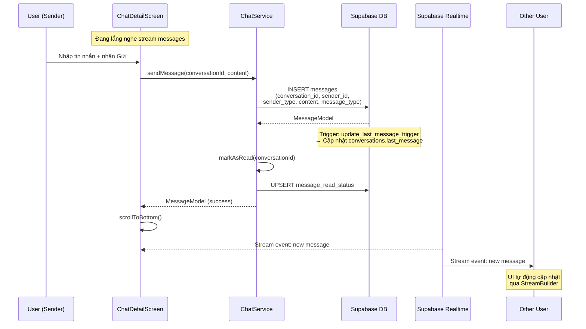
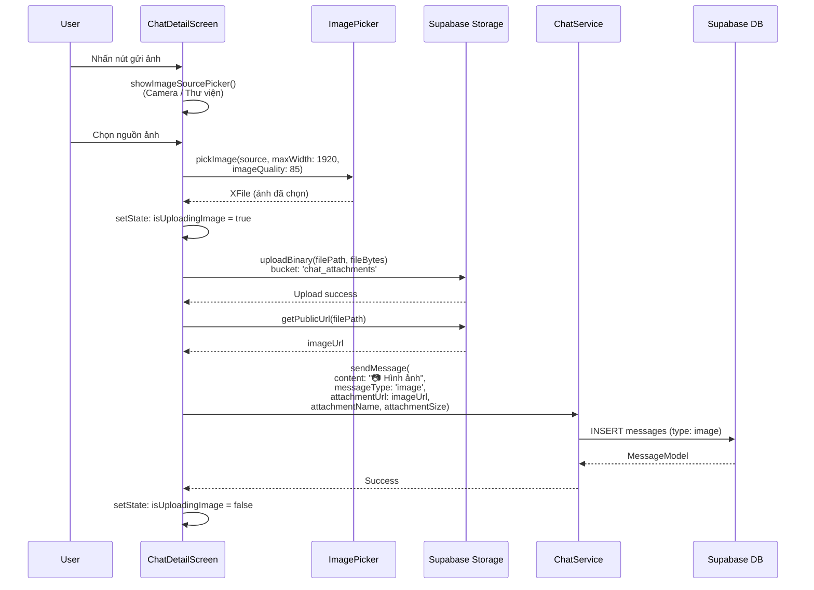
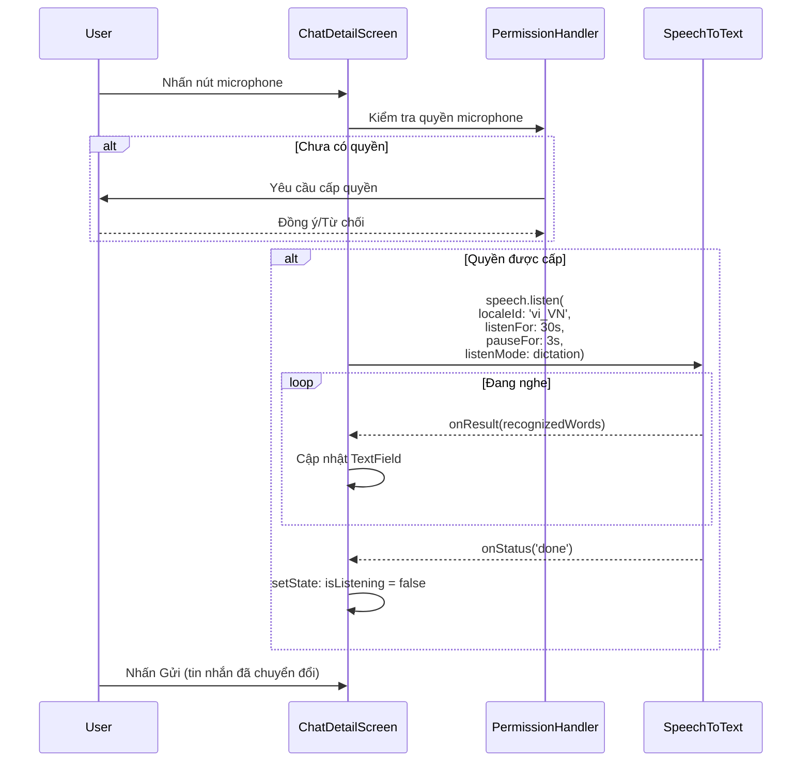
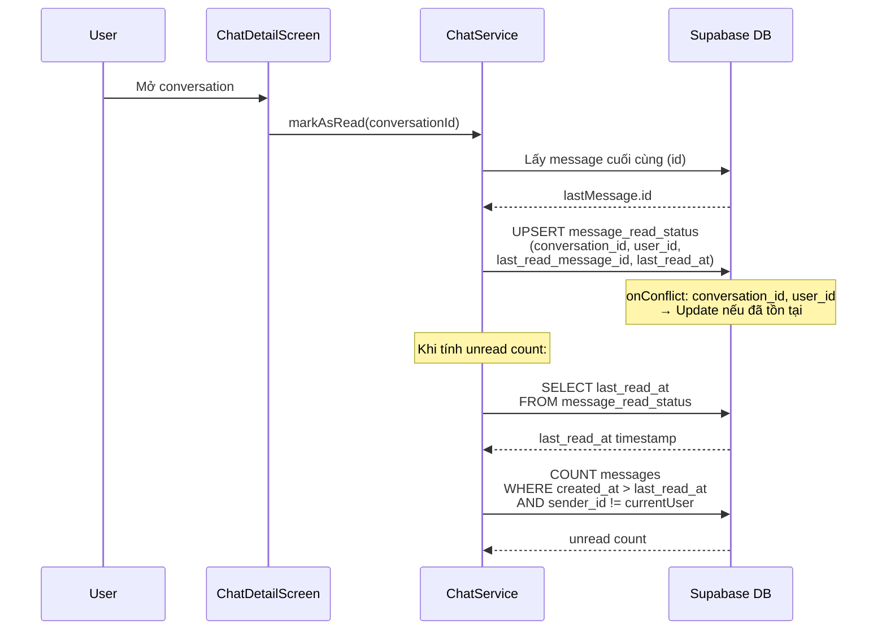
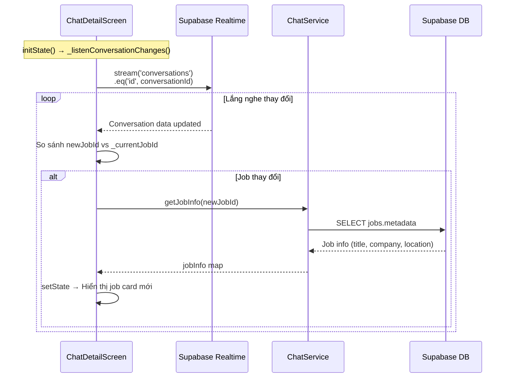

# Cơ Chế Chat Realtime Giữa Các Vai Trò

## Mục đích

Hệ thống chat realtime cho phép các vai trò trong NP FutureGate (Ứng viên, Nhà tuyển dụng, Trường học, Admin) trao đổi trực tiếp với nhau. Chat hỗ trợ:

- Nhắn tin văn bản realtime
- Gửi hình ảnh (chụp camera hoặc chọn từ thư viện)
- Nhập liệu bằng giọng nói (Speech-to-Text)
- Liên kết cuộc trò chuyện với công việc cụ thể (job context)
- Theo dõi trạng thái đọc/chưa đọc
- Hỗ trợ tin nhắn hệ thống (system messages)

## Các thành phần tham gia

### Tầng Presentation (UI)

| Thành phần | File | Vai trò |
|------------|------|---------|
| `ChatListScreen` | `lib/features/chat/screens/chat_list_screen.dart` | Hiển thị danh sách cuộc trò chuyện, tìm kiếm, phân tab (Tất cả / Chưa đọc) |
| `ChatDetailScreen` | `lib/features/chat/screens/chat_detail_screen.dart` | Giao diện chat chi tiết, gửi/nhận tin nhắn, gửi ảnh, speech-to-text |

### Tầng Service (Business Logic)

| Thành phần | File | Vai trò |
|------------|------|---------|
| `ChatService` | `lib/core/services/chat_service.dart` | Xử lý toàn bộ logic chat: CRUD conversations, messages, realtime streaming, read status |

### Tầng Data (Models)

| Thành phần | File | Vai trò |
|------------|------|---------|
| `ConversationModel` | `lib/core/models/conversation_model.dart` | Model cuộc hội thoại giữa 2 người dùng |
| `MessageModel` | `lib/core/models/message_model.dart` | Model tin nhắn (text, image, file, system) |

### Tầng Database (Supabase)

| Bảng | Vai trò |
|------|---------|
| `conversations` | Lưu thông tin cuộc hội thoại, participants, job liên quan |
| `messages` | Lưu nội dung tin nhắn, attachments |
| `message_read_status` | Theo dõi trạng thái đọc của từng user |
| `typing_status` | Theo dõi trạng thái đang gõ (realtime) |
| `profiles` | Thông tin user (tên, avatar, role) |
| `jobs` | Thông tin công việc liên kết với conversation |

### Dịch vụ bên ngoài

| Dịch vụ | Vai trò |
|---------|---------|
| Supabase Realtime | Stream tin nhắn và conversations theo thời gian thực |
| Supabase Storage (`chat_attachments`) | Lưu trữ hình ảnh được gửi trong chat |
| Speech-to-Text (Google) | Chuyển giọng nói thành văn bản (locale: vi_VN) |

## Sơ đồ kiến trúc tổng quan



## Luồng xử lý step-by-step

### 1. Hiển thị danh sách cuộc trò chuyện



**Chi tiết các bước:**

1. User mở màn hình `ChatListScreen`
2. Screen gọi `ChatService.streamConversations()` để lắng nghe realtime
3. ChatService sử dụng Supabase Realtime stream trên bảng `conversations`
4. Với mỗi conversation, service:
   - Xác định `otherUserId` dựa trên participant1/participant2
   - Gọi `_getUserInfo()` để lấy tên và avatar từ bảng `profiles`
   - Nếu có `job_id`, gọi `_getJobInfo()` để append tên job vào tên hiển thị
   - Gọi `getUnreadCount()` để đếm tin nhắn chưa đọc
5. Trả về danh sách `ConversationModel` đã enriched
6. UI hiển thị với tabs "Tất cả" và "Chưa đọc", hỗ trợ tìm kiếm

### 2. Tạo hoặc mở cuộc trò chuyện



**Chi tiết các bước:**

1. User nhấn nút chat từ màn hình khác (ví dụ: chi tiết công việc, hồ sơ ứng viên)
2. Gọi `getOrCreateConversation(otherUserId, otherUserType, jobId)`
3. Service kiểm tra conversation đã tồn tại bằng query OR:
   - `(participant1_id = currentUser AND participant2_id = otherUser)` HOẶC
   - `(participant1_id = otherUser AND participant2_id = currentUser)`
4. Nếu đã tồn tại và có job mới khác job cũ:
   - Gửi system message đánh dấu job cũ đã trao đổi
   - Update `job_id` trong conversation sang job mới
5. Nếu chưa tồn tại: tạo mới với status `active`
6. Navigate đến `ChatDetailScreen` với conversation data

### 3. Gửi và nhận tin nhắn realtime



**Chi tiết các bước:**

1. `ChatDetailScreen` sử dụng `StreamBuilder` lắng nghe `ChatService.streamMessages(conversationId)`
2. User nhập tin nhắn và nhấn gửi
3. `sendMessage()` xác định `sender_type` qua `_getCurrentUserType()` (query bảng `profiles`)
4. INSERT vào bảng `messages` với các trường: `conversation_id`, `sender_id`, `sender_type`, `content`, `message_type`
5. Database trigger `update_last_message_trigger` tự động cập nhật `last_message`, `last_message_at`, `last_message_sender_id` trong bảng `conversations`
6. Gọi `markAsRead()` để cập nhật trạng thái đọc
7. Supabase Realtime phát sự kiện đến tất cả clients đang lắng nghe
8. `StreamBuilder` trên cả hai phía tự động rebuild UI

### 4. Gửi hình ảnh



**Chi tiết các bước:**

1. User nhấn icon hình ảnh → hiển thị bottom sheet chọn nguồn (Camera/Thư viện)
2. Sử dụng `ImagePicker` với giới hạn: `maxWidth: 1920`, `maxHeight: 1920`, `imageQuality: 85`
3. Xác định content type dựa trên extension (jpeg, png, gif, webp)
4. Upload lên Supabase Storage bucket `chat_attachments` với path: `{userId}/{conversationId}/{timestamp}_{filename}`
5. Lấy public URL của ảnh đã upload
6. Gửi message với `messageType: 'image'`, kèm `attachmentUrl`, `attachmentName`, `attachmentSize`

### 5. Nhập liệu bằng giọng nói (Speech-to-Text)



**Chi tiết các bước:**

1. Khởi tạo `SpeechToText` trong `initState()`
2. Khi nhấn mic, kiểm tra quyền microphone qua `PermissionHandler`
3. Bắt đầu lắng nghe với locale `vi_VN`, thời gian tối đa 30 giây, tạm dừng sau 3 giây im lặng
4. Kết quả nhận dạng được cập nhật realtime vào `TextEditingController`
5. User có thể chỉnh sửa text trước khi gửi

### 6. Theo dõi trạng thái đọc



### 7. Lắng nghe thay đổi job trong conversation



## Cấu trúc Database

### Bảng `conversations`

```sql
CREATE TABLE conversations (
    id UUID PRIMARY KEY,
    participant1_id UUID NOT NULL,
    participant1_type VARCHAR(20) NOT NULL,  -- 'admin', 'employer', 'candidate'
    participant2_id UUID NOT NULL,
    participant2_type VARCHAR(20) NOT NULL,
    job_id UUID,                             -- Job liên quan (có thể thay đổi)
    application_id UUID,                     -- Application liên quan
    last_message TEXT,                       -- Preview tin nhắn cuối
    last_message_at TIMESTAMP,
    last_message_sender_id UUID,
    status VARCHAR(20) DEFAULT 'active',     -- 'active', 'archived', 'blocked'
    created_at TIMESTAMP,
    updated_at TIMESTAMP,
    CONSTRAINT unique_conversation UNIQUE (participant1_id, participant2_id)
);
```

### Bảng `messages`

```sql
CREATE TABLE messages (
    id UUID PRIMARY KEY,
    conversation_id UUID REFERENCES conversations(id) ON DELETE CASCADE,
    sender_id UUID NOT NULL,
    sender_type VARCHAR(20) NOT NULL,        -- 'admin', 'employer', 'candidate', 'school'
    message_type VARCHAR(20) DEFAULT 'text', -- 'text', 'image', 'file', 'system'
    content TEXT NOT NULL,
    attachment_url TEXT,
    attachment_name TEXT,
    attachment_size INTEGER,
    is_edited BOOLEAN DEFAULT FALSE,
    is_deleted BOOLEAN DEFAULT FALSE,
    created_at TIMESTAMP,
    updated_at TIMESTAMP
);
```

### Bảng `message_read_status`

```sql
CREATE TABLE message_read_status (
    id UUID PRIMARY KEY,
    conversation_id UUID REFERENCES conversations(id) ON DELETE CASCADE,
    user_id UUID NOT NULL,
    user_type VARCHAR(20) NOT NULL,
    last_read_message_id UUID REFERENCES messages(id),
    last_read_at TIMESTAMP,
    CONSTRAINT unique_read_status UNIQUE (conversation_id, user_id)
);
```

## Cơ chế Realtime

### Supabase Realtime Stream

Hệ thống sử dụng **Supabase Realtime** với phương thức `.stream(primaryKey: ['id'])` để lắng nghe thay đổi trên các bảng:

1. **Stream Messages**: Lắng nghe bảng `messages`, filter theo `conversation_id` và `is_deleted = false`, sắp xếp theo `created_at` tăng dần
2. **Stream Conversations**: Lắng nghe bảng `conversations`, filter theo participant hiện tại, sắp xếp theo `last_message_at` giảm dần
3. **Stream Conversation Changes**: Lắng nghe thay đổi `job_id` trong conversation cụ thể

### Database Triggers

| Trigger | Bảng | Chức năng |
|---------|------|-----------|
| `update_conversations_updated_at` | `conversations` | Tự động cập nhật `updated_at` khi UPDATE |
| `update_messages_updated_at` | `messages` | Tự động cập nhật `updated_at` khi UPDATE |
| `update_last_message_trigger` | `messages` (AFTER INSERT) | Cập nhật `last_message`, `last_message_at`, `last_message_sender_id` trong `conversations` |

### Row Level Security (RLS)

Hệ thống áp dụng RLS để đảm bảo bảo mật:

- **Conversations**: User chỉ xem/tạo/sửa conversations mà họ là participant
- **Messages**: User chỉ xem messages trong conversations của họ, chỉ sửa/xóa messages của chính mình
- **Read Status**: User chỉ quản lý read status của chính mình
- **Typing Status**: User chỉ xem typing status trong conversations của họ

## Xử lý lỗi

| Tình huống | Xử lý |
|------------|--------|
| Không có kết nối mạng | StreamBuilder hiển thị trạng thái lỗi với nút "Thử lại" |
| Gửi tin nhắn thất bại | `sendMessage()` trả về `null`, UI không clear input |
| Upload ảnh thất bại | Hiển thị SnackBar lỗi, reset `isUploadingImage` |
| User chưa đăng nhập | Kiểm tra `currentUser?.id`, trả về list rỗng hoặc `null` |
| Conversation không tồn tại | `getOrCreateConversation()` tạo mới |
| Job không tìm thấy | `_getJobInfo()` trả về `null`, UI ẩn job card |
| Speech-to-Text không khả dụng | Hiển thị SnackBar yêu cầu cấp quyền microphone |
| Ảnh không tải được | Hiển thị placeholder "Không tải được ảnh" với icon broken_image |
| Profile user không tồn tại | Fallback hiển thị "Người dùng" và avatar mặc định |

## Các tính năng bổ sung

### Tìm kiếm cuộc trò chuyện

- Tìm theo tên người dùng hoặc nội dung tin nhắn cuối
- Filter realtime khi user gõ

### Xóa cuộc trò chuyện

- Swipe-to-delete với xác nhận dialog
- Gọi `ChatService.deleteConversation()` → DELETE từ database

### Xóa tin nhắn

- Soft delete: cập nhật `is_deleted = true`
- Tin nhắn đã xóa không hiển thị trong stream

### Chat với Admin Support

- Nút hỗ trợ Admin cố định trên header
- Tự động tạo conversation với Admin ID hardcoded

### Hiển thị Job Context

- Pinned job card phía dưới danh sách tin nhắn
- Nhấn vào để navigate đến `JobDetailScreen`
- Tự động cập nhật khi job thay đổi (realtime listener)

## Services và Repositories liên quan

| Service/Repository | Vai trò trong Chat |
|-------------------|-------------------|
| `ChatService` | Service chính xử lý toàn bộ logic chat |
| `Supabase.instance.client` | Client truy cập database, storage, realtime |
| `Supabase Storage (chat_attachments)` | Lưu trữ file đính kèm (hình ảnh) |
| `SpeechToText` | Chuyển đổi giọng nói thành text |
| `ImagePicker` | Chọn ảnh từ camera/gallery |
| `PermissionHandler` | Quản lý quyền microphone |

## Liên kết liên quan

- [Tổng quan kiến trúc](../01_tong_quan_kien_truc.md)
- [Cơ chế Realtime Sync](./realtime_sync_flow.md)
- [Cơ chế Notification](./notification_flow.md)
- [Cơ chế Đăng tin tuyển dụng](./job_posting_flow.md)
- [Giải thích Supabase](../10_giai_thich_cong_nghe_tung_cai/supabase.md)
- [Giải thích Speech-to-Text](../10_giai_thich_cong_nghe_tung_cai/speech_to_text.md)
