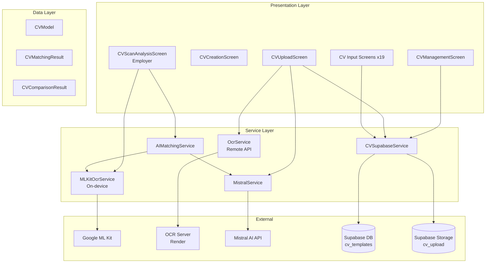
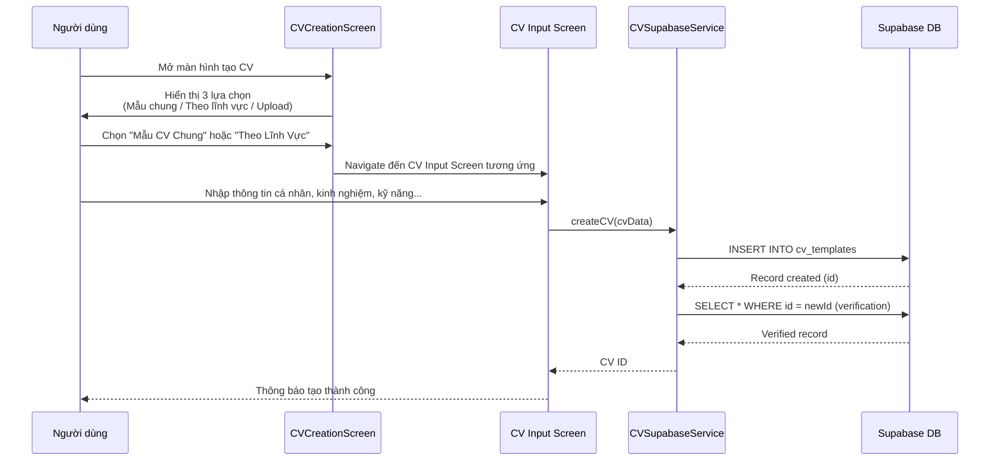
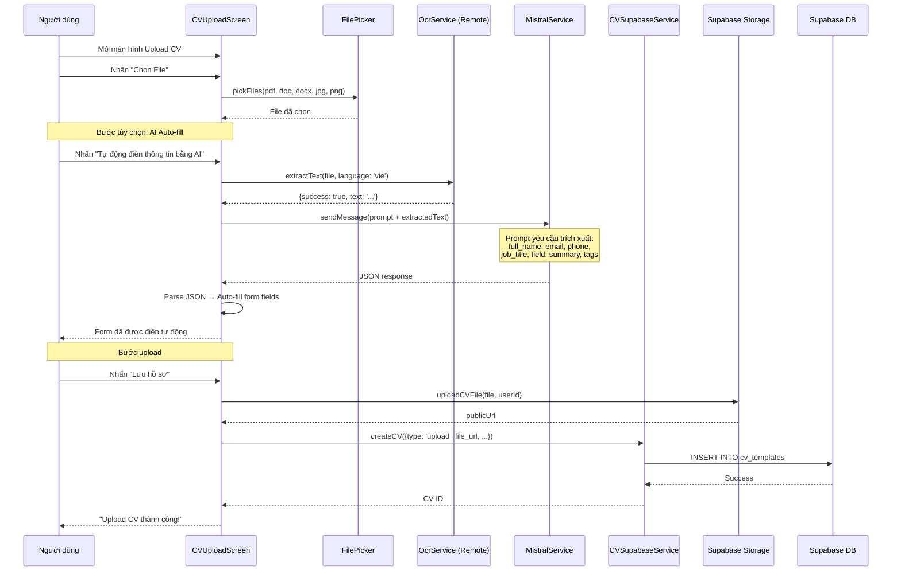
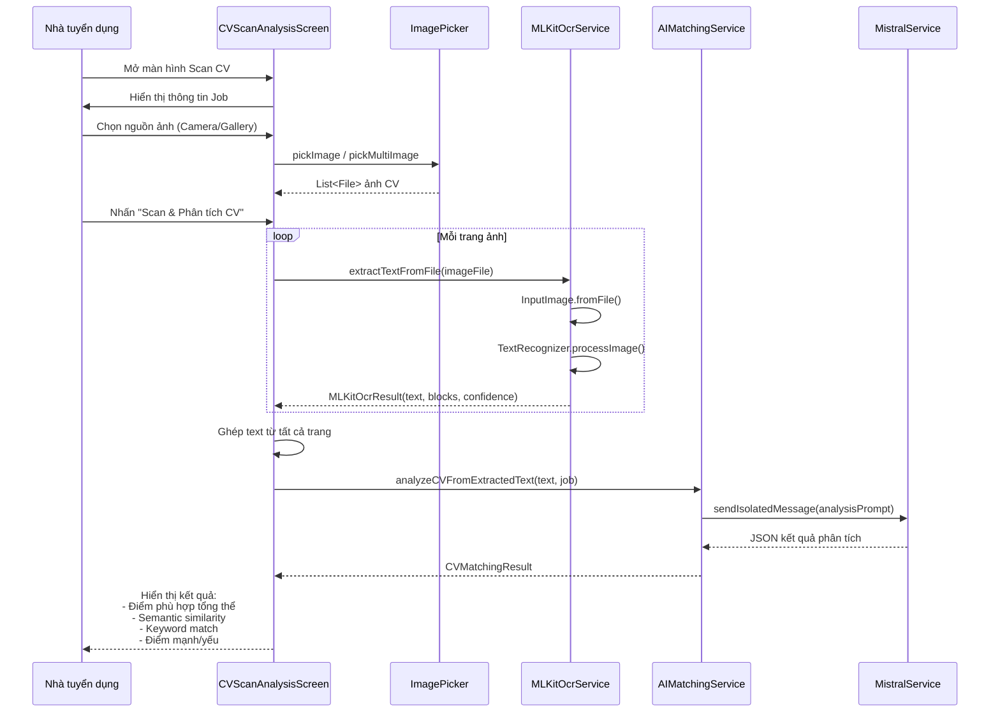
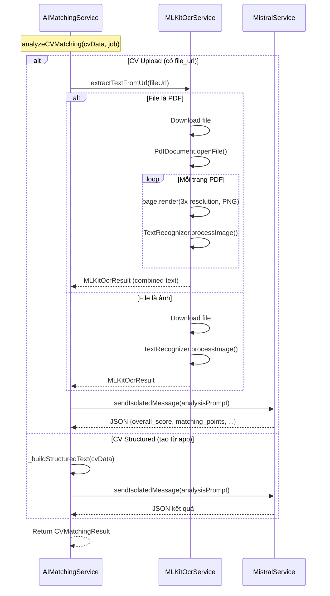
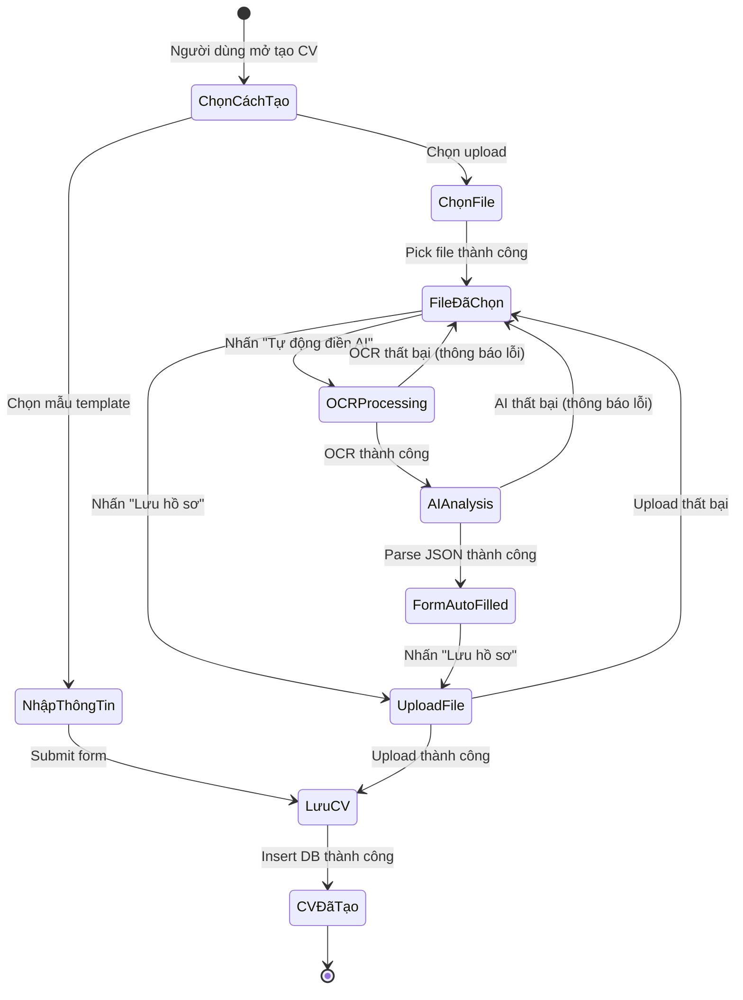
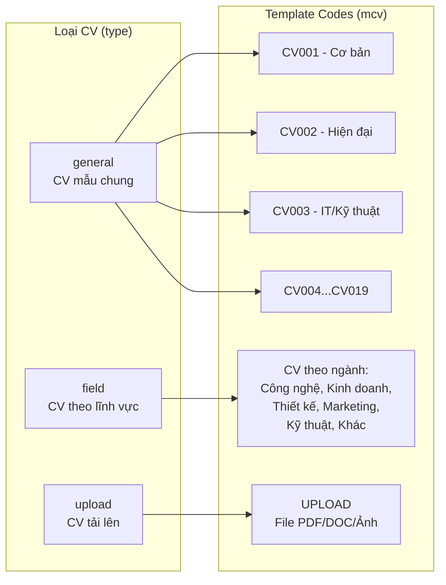

# Luồng Quản Lý CV và OCR Scanning

## Mục đích

Tài liệu này mô tả chi tiết cơ chế quản lý CV (Curriculum Vitae) trong hệ thống NP FutureGate, bao gồm:
- Tạo CV từ mẫu có sẵn (template-based)
- Upload CV từ thiết bị (file PDF, DOC, ảnh)
- OCR scanning bằng Google ML Kit (on-device) và OCR Server (remote)
- Phân tích CV tự động bằng AI (Mistral)
- Quản lý danh sách CV (CRUD operations)
- So sánh và matching CV với công việc

## Các thành phần tham gia

### Screens (View Layer)

| File | Vai trò |
|------|---------|
| `cv_management_screen.dart` | Màn hình chính quản lý danh sách CV |
| `cv_creation_screen.dart` | Màn hình chọn cách tạo CV (mẫu chung, theo lĩnh vực, upload) |
| `cv_upload_screen.dart` | Upload CV từ thiết bị + tự động phân tích AI |
| `cv_input/cv1_input_screen.dart` → `cv19_input_screen.dart` | 19 mẫu CV input khác nhau |
| `cv_setting/cv_display_manager.dart` | Quản lý hiển thị CV theo template |
| `cv_setting/cv_general_templates_screen.dart` | Danh sách mẫu CV chung |
| `cv_setting/cv_field_templates_screen.dart` | Danh sách mẫu CV theo lĩnh vực |
| `employer/.../cv_scan_analysis_screen.dart` | Nhà tuyển dụng scan CV bằng camera/ảnh |

### Services (Business Logic Layer)

| File | Vai trò |
|------|---------|
| `ocr_service.dart` | OCR qua API server (Render) - hỗ trợ PDF/ảnh |
| `mlkit_ocr_service.dart` | OCR on-device bằng Google ML Kit - hỗ trợ ảnh/PDF |
| `cv_supabase_service.dart` | CRUD operations cho CV trên Supabase |
| `mistral_service.dart` | Gọi Mistral AI để phân tích nội dung CV |
| `ai_matching_service.dart` | Phân tích độ phù hợp CV với công việc |

### Models (Data Layer)

| File | Vai trò |
|------|---------|
| `cv_model.dart` | Model đại diện cho CV (id, name, updatedAt, data) |
| `cv_matching_result_model.dart` | Kết quả matching CV với job |
| `cv_comparison_result_model.dart` | Kết quả so sánh nhiều CV |

### External Services

| Service | Vai trò |
|---------|---------|
| Google ML Kit (Text Recognition) | Nhận diện văn bản on-device từ ảnh |
| OCR Server (Render) | Trích xuất text từ PDF/ảnh qua API |
| Mistral AI | Phân tích nội dung CV, trích xuất thông tin cấu trúc |
| Supabase Storage | Lưu trữ file CV (bucket: `cv_upload`) |
| Supabase Database | Lưu metadata CV (table: `cv_templates`) |

## Sơ đồ kiến trúc tổng quan



## Luồng xử lý chi tiết

### Luồng 1: Tạo CV từ mẫu (Template-based)



**Chi tiết dữ liệu CV được lưu:**
```dart
{
  'mcv': 'CV001',           // Mã template (CV001-CV019)
  'title': 'Tên CV',
  'description': 'Mô tả',
  'tags': ['tag1', 'tag2'],
  'data': {                  // Dữ liệu chi tiết
    'personal_info': { 'full_name', 'email', 'phone', 'title' },
    'summary': '...',
    'experiences': [...],
    'education': [...],
    'skills': [...],
    'certifications': [...],
    'projects': [...]
  },
  'type': 'general' | 'field',
  'user_create': userId
}
```

### Luồng 2: Upload CV + OCR + AI Auto-fill



### Luồng 3: Employer Scan CV bằng ML Kit (On-device)



### Luồng 4: AI Matching - Phân tích CV với Job



## Chi tiết kỹ thuật OCR

### Google ML Kit (On-device) - `MLKitOcrService`

**Đặc điểm:**
- Xử lý hoàn toàn trên thiết bị (không cần internet)
- Sử dụng `TextRecognitionScript.latin` cho nhận diện text
- Hỗ trợ ảnh trực tiếp và PDF (render → ảnh → OCR)
- Singleton pattern (`factory` constructor)

**Pipeline xử lý PDF:**
1. Mở PDF bằng `PdfDocument.openFile()`
2. Render từng trang thành ảnh PNG (3x resolution cho chất lượng cao)
3. Lưu ảnh tạm vào `getTemporaryDirectory()`
4. Chạy OCR trên từng ảnh trang
5. Ghép text với separator `--- Trang N ---`
6. Dọn dẹp file tạm

**Các phương thức chính:**

| Phương thức | Mô tả |
|-------------|--------|
| `extractTextFromFile(File)` | OCR từ file ảnh |
| `extractTextFromPdf(File)` | OCR từ PDF (render → ảnh → OCR) |
| `extractTextFromUrl(String)` | Tải file từ URL rồi OCR |
| `pickAndExtractFromCamera()` | Chụp ảnh → OCR |
| `pickAndExtractFromGallery()` | Chọn ảnh từ gallery → OCR |
| `pickMultipleAndExtract()` | Chọn nhiều ảnh → OCR (CV nhiều trang) |

**Kết quả trả về (`MLKitOcrResult`):**
```dart
class MLKitOcrResult {
  final bool success;
  final String text;           // Toàn bộ text nhận diện được
  final String? error;         // Thông báo lỗi (nếu có)
  final List<TextBlockInfo> blocks;  // Chi tiết từng block
  final int pageCount;         // Số trang đã xử lý
}

class TextBlockInfo {
  final String text;           // Nội dung block
  final double confidence;     // Độ tin cậy (0.0 - 1.0)
}
```

### OCR Server (Remote) - `OcrService`

**Đặc điểm:**
- Gọi API server trên Render (`https://ocr-server-7w2k.onrender.com/api/ocr`)
- Hỗ trợ ngôn ngữ: `eng` (English), `vie` (Vietnamese)
- Timeout 120 giây (cho cold start của server)
- Tự động retry khi gặp timeout (đợi 5 giây)
- Sử dụng Dio cho HTTP requests

**API Interface:**
```
POST /api/ocr
Content-Type: multipart/form-data

Fields:
  - file: File (PDF hoặc ảnh)
  - lang: String ('eng' | 'vie')

Response:
  { "success": true, "text": "...", "full_text": "..." }
```

## Quản lý CV - CRUD Operations

### CVSupabaseService

**Database Table:** `cv_templates`

| Column | Type | Mô tả |
|--------|------|--------|
| `id` | UUID | Primary key |
| `mcv` | String | Mã template (CV001-CV019, UPLOAD) |
| `title` | String | Tiêu đề CV |
| `description` | String | Mô tả ngắn |
| `tags` | Array | Tags phân loại |
| `data` | JSONB | Dữ liệu chi tiết CV |
| `type` | String | Loại: 'general', 'field', 'upload' |
| `user_create` | UUID | FK → auth.users |
| `created_at` | Timestamp | Thời gian tạo |
| `updated_at` | Timestamp | Thời gian cập nhật |

**Storage Bucket:** `cv_upload`
- Path format: `{userId}/{timestamp}.{extension}`
- File types: PDF, DOC, DOCX, JPG, JPEG, PNG

**Các operations:**

| Phương thức | Mô tả |
|-------------|--------|
| `createCV(cvData)` | Tạo CV mới + verification |
| `updateCVData(cvId, cvData)` | Cập nhật CV |
| `getCVData(cvId)` | Lấy data field của CV |
| `getCVFullData(cvId)` | Lấy toàn bộ record |
| `getMyCVs()` | Lấy tất cả CV của user hiện tại |
| `getUserCVs(userId)` | Lấy CV dạng model cho job application |
| `getCVsByTags(tags)` | Tìm CV theo tags |
| `deleteCV(cvId)` | Xóa CV |
| `uploadCVFile(file, userId)` | Upload file lên Storage |
| `getCVFullDataForEmployer(cvId)` | Employer xem CV ứng viên (RLS) |

## Xử lý lỗi

### OCR Service (Remote)

| Lỗi | Xử lý |
|------|--------|
| Connection timeout | Retry sau 5 giây (cold start) |
| Receive timeout | Retry sau 5 giây |
| HTTP error (non-200) | Trả về `{success: false, error: 'HTTP {code}'}` |
| Network error | Trả về `{success: false, error: 'Network error: ...'}` |
| Exception khác | Trả về `{success: false, error: message}` |

### ML Kit OCR (On-device)

| Lỗi | Xử lý |
|------|--------|
| File không tồn tại | `MLKitOcrResult.failure('File không tồn tại')` |
| Không tìm thấy text | `MLKitOcrResult.failure('Không tìm thấy văn bản')` |
| Lỗi render trang PDF | Skip trang, tiếp tục trang tiếp theo |
| Lỗi download URL | `MLKitOcrResult.failure('Lỗi tải và xử lý file')` |
| Không chọn ảnh | `MLKitOcrResult.failure('Không có ảnh được chọn')` |

### CV Upload

| Lỗi | Xử lý |
|------|--------|
| Chưa đăng nhập | Exception: 'Bạn chưa đăng nhập' |
| File không tồn tại | Exception: 'File does not exist' |
| Upload thất bại | Exception: 'Lỗi khi upload file' |
| OCR trống | Exception hiển thị SnackBar |
| AI parse thất bại | SnackBar lỗi, form vẫn hoạt động bình thường |

### AI Matching

| Lỗi | Xử lý |
|------|--------|
| OCR thất bại | Throw exception, fallback mock score |
| AI không trả JSON hợp lệ | Sanitize response, retry parse |
| CV text quá ngắn (<30 chars) | Return mock result (score = 5) |
| Upload CV analysis fail | Fallback `CVMatchingResult.fromMock(5)` |

## Sơ đồ trạng thái CV



## Phân loại CV trong hệ thống



## So sánh hai phương pháp OCR

| Tiêu chí | ML Kit (On-device) | OCR Server (Remote) |
|-----------|-------------------|---------------------|
| Kết nối internet | Không cần | Bắt buộc |
| Tốc độ | Nhanh (local) | Chậm hơn (network + cold start) |
| Ngôn ngữ | Latin script | Tiếng Việt + English |
| File hỗ trợ | Ảnh + PDF (render) | PDF + Ảnh |
| Sử dụng tại | Employer scan CV | Candidate upload CV |
| Độ chính xác | Tốt cho ảnh rõ | Tốt cho PDF text-based |
| Chi phí | Miễn phí | Server hosting |

## Liên kết liên quan

- [Tổng quan kiến trúc](../01_tong_quan_kien_truc.md)
- [Luồng AI Matching](./ai_matching_flow.md)
- [Giải thích Google ML Kit OCR](../10_giai_thich_cong_nghe_tung_cai/google_mlkit_ocr.md)
- [Giải thích Mistral AI](../10_giai_thich_cong_nghe_tung_cai/mistral_ai.md)
- [Giải thích Supabase](../10_giai_thich_cong_nghe_tung_cai/supabase.md)
