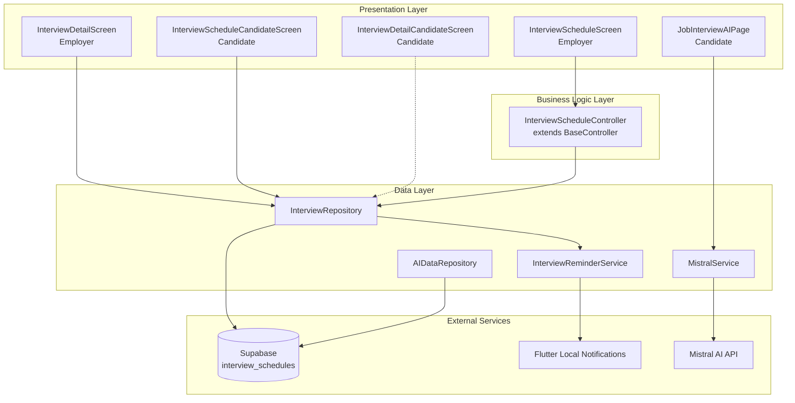
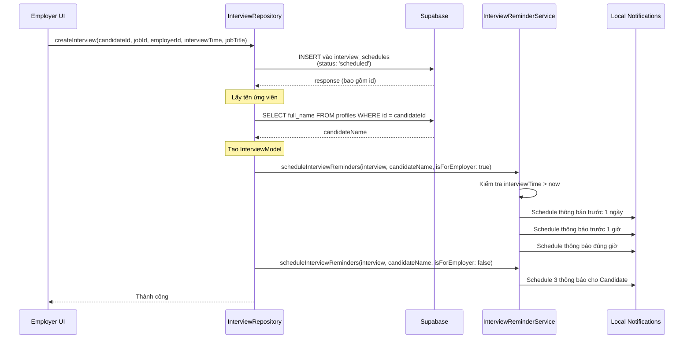
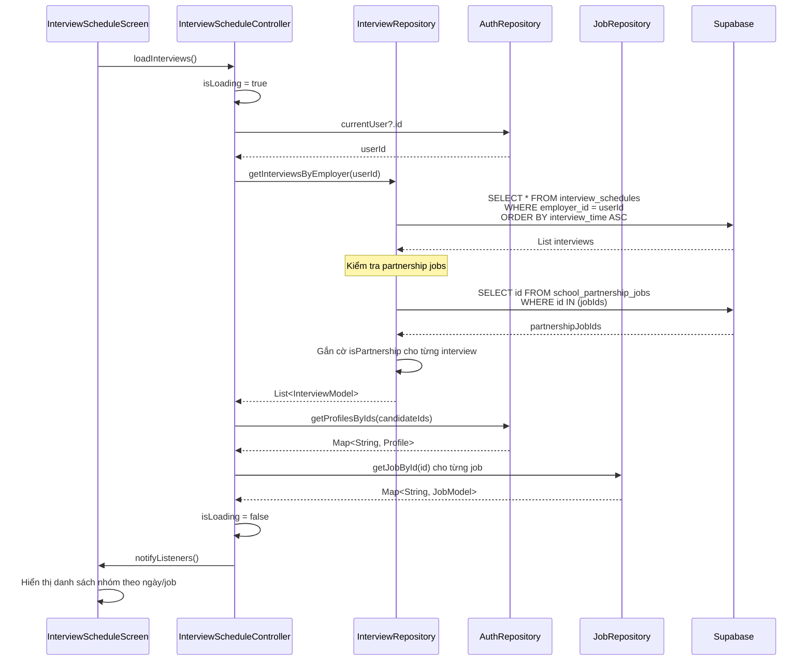
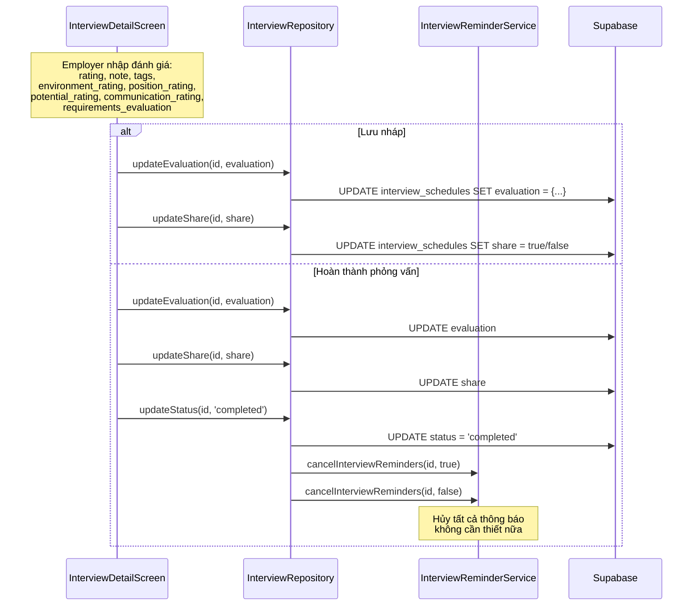
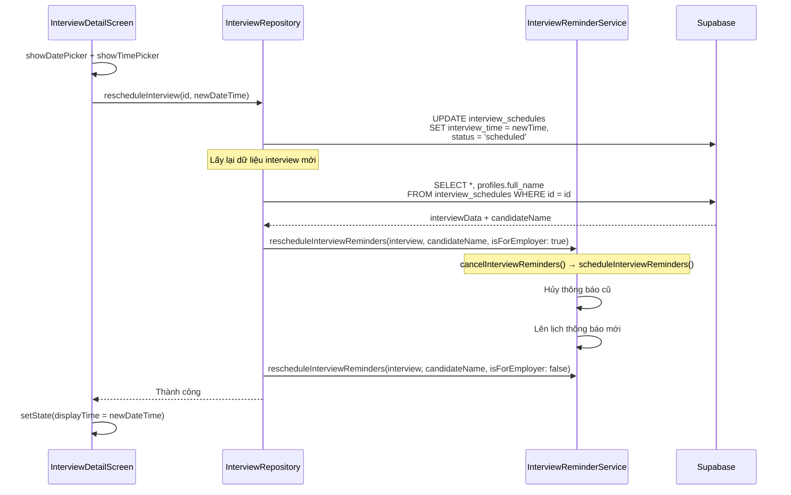
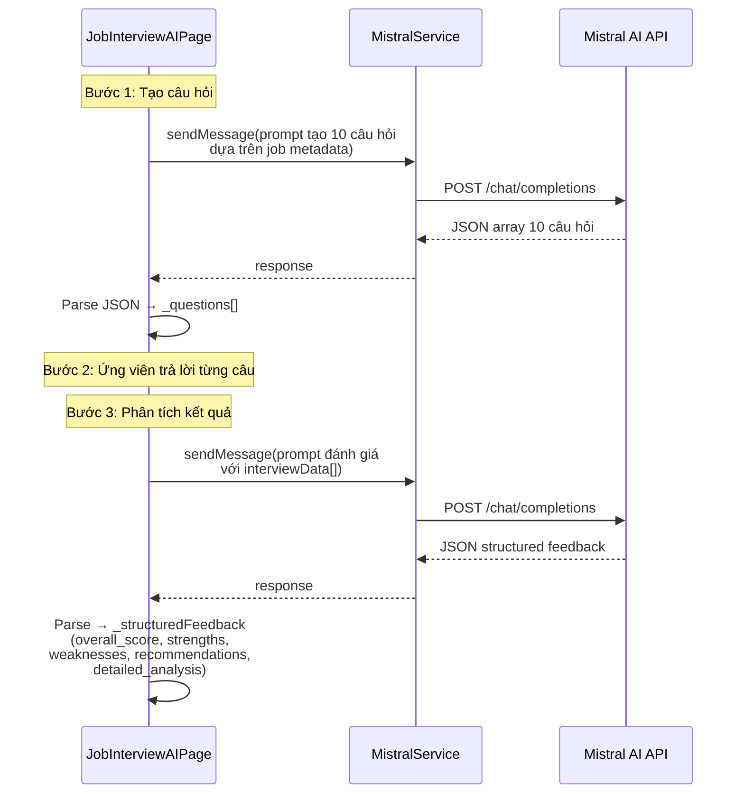
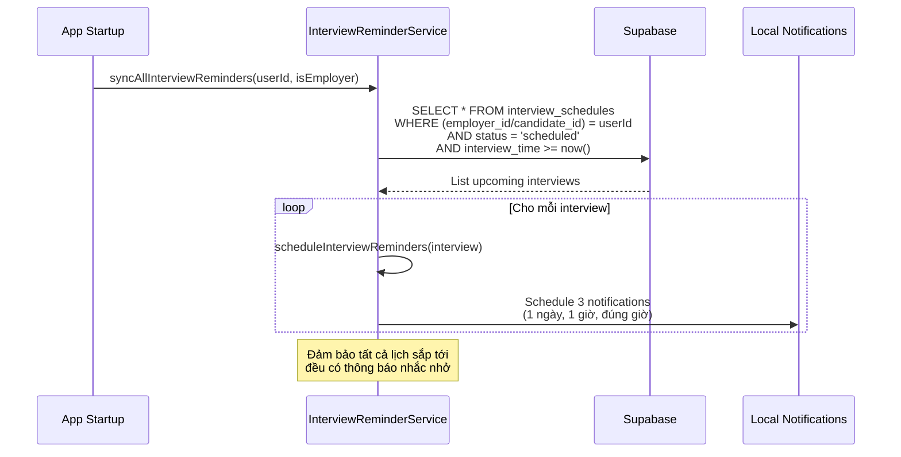
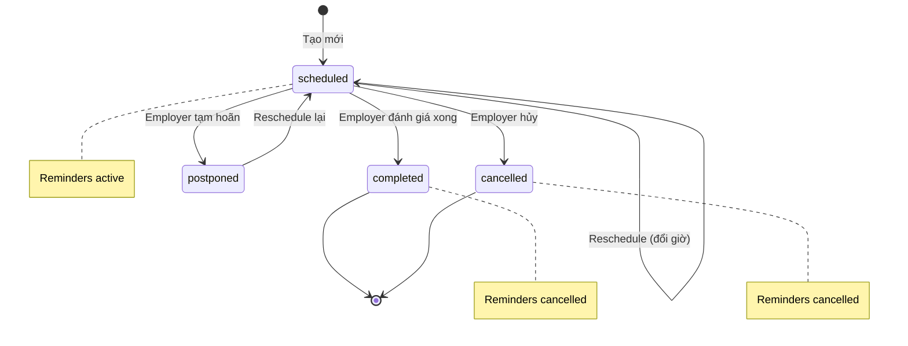

# Cơ chế Quản lý Phỏng vấn và Nhắc nhở (Interview Flow)

## Mục đích

Hệ thống quản lý phỏng vấn trong NP FutureGate cung cấp khả năng:
- **Lên lịch phỏng vấn** giữa nhà tuyển dụng (Employer) và ứng viên (Candidate)
- **Nhắc nhở tự động** trước 1 ngày, 1 giờ và đúng giờ phỏng vấn cho cả hai bên
- **Đánh giá ứng viên** sau phỏng vấn với hệ thống chấm điểm đa tiêu chí
- **Phỏng vấn AI** cho phép ứng viên luyện tập phỏng vấn với AI trước khi gặp nhà tuyển dụng
- **Quản lý trạng thái** phỏng vấn (scheduled → completed/cancelled/postponed)
- **Hỗ trợ partnership jobs** từ trường học liên kết

## Các thành phần tham gia

### Tầng Presentation (UI)

| File | Vai trò |
|------|---------|
| `features/employer/screens/interview_schedule_screen.dart` | Màn hình danh sách lịch phỏng vấn (Employer) |
| `features/employer/screens/interview_detail_screen.dart` | Chi tiết & đánh giá phỏng vấn (Employer) |
| `features/candidate/screens/interview_schedule_candidate_screen.dart` | Danh sách lịch phỏng vấn (Candidate) |
| `features/candidate/screens/interview_detail_candidate_screen.dart` | Xem chi tiết phỏng vấn (Candidate) |
| `features/candidate/screens/job_interview_ai_page.dart` | Phỏng vấn thử với AI (Candidate) |

### Tầng Business Logic (Controller)

| File | Vai trò |
|------|---------|
| `features/employer/controllers/interview_schedule_controller.dart` | Quản lý logic lọc, nhóm, tìm kiếm lịch phỏng vấn |

### Tầng Data (Repository / Service)

| File | Vai trò |
|------|---------|
| `core/repositories/interview_repository.dart` | CRUD lịch phỏng vấn trên Supabase |
| `core/services/notification/interview_reminder_service.dart` | Lên lịch/hủy thông báo nhắc nhở local |
| `core/repositories/ai_data_repository.dart` | Truy vấn dữ liệu phỏng vấn cho AI chatbot |
| `core/services/mistral_service.dart` | Gọi Mistral AI để tạo câu hỏi & đánh giá phỏng vấn |

### Tầng Model

| File | Vai trò |
|------|---------|
| `core/models/interview_model.dart` | Data model cho lịch phỏng vấn |
| `core/models/notification_settings_model.dart` | Cài đặt bật/tắt thông báo phỏng vấn |

### Database (Supabase)

| Bảng | Vai trò |
|------|---------|
| `interview_schedules` | Lưu trữ lịch phỏng vấn, đánh giá, trạng thái |
| `profiles` | Thông tin ứng viên và nhà tuyển dụng |
| `jobs` | Thông tin công việc liên quan |
| `school_partnership_jobs` | Công việc từ trường liên kết |

## Sơ đồ kiến trúc tổng quan



## Luồng xử lý Step-by-Step

### 1. Tạo lịch phỏng vấn mới



### 2. Xem danh sách phỏng vấn (Employer)



### 3. Đánh giá sau phỏng vấn (Employer)



### 4. Dời lịch phỏng vấn (Reschedule)



### 5. Phỏng vấn thử với AI (Candidate)



### 6. Đồng bộ nhắc nhở khi khởi động app



## Cơ chế nhắc nhở (Reminder System)

### Thời điểm gửi thông báo

| Thời điểm | Nội dung (Employer) | Nội dung (Candidate) |
|-----------|---------------------|---------------------|
| Trước 1 ngày | "📅 Nhắc nhở: Phỏng vấn ngày mai" | "📅 Nhắc nhở: Bạn có lịch phỏng vấn ngày mai" |
| Trước 1 giờ | "⏰ Nhắc nhở: Phỏng vấn trong 1 giờ nữa" | "⏰ Nhắc nhở: Bạn có lịch phỏng vấn trong 1 giờ nữa" |
| Đúng giờ | "🎯 Phỏng vấn bắt đầu!" | "🎯 Lịch phỏng vấn của bạn đã bắt đầu!" |

### Notification ID Format

```
[interview_hash (5 digits)][type_code][user_code]

type_code: 1 = 1day, 2 = 1hour, 3 = now
user_code: 1 = employer, 2 = candidate

Ví dụ: 123461 = hash 12345 + type 1day (1) + employer (1)
```

### Điều kiện schedule

- Chỉ schedule nếu `interviewTime > now`
- Mỗi mốc thời gian chỉ schedule nếu mốc đó chưa qua
- Sử dụng `AndroidScheduleMode.exactAllowWhileIdle` để đảm bảo chính xác
- iOS sử dụng `InterruptionLevel.timeSensitive`

## Hệ thống đánh giá phỏng vấn

### Cấu trúc evaluation (JSON)

```json
{
  "note": "Ghi chú tổng quan",
  "rating": 4.5,
  "environment_rating": 4.0,
  "position_rating": 4.5,
  "potential_rating": 5.0,
  "communication_rating": 3.5,
  "requirements_evaluation": {
    "Yêu cầu 1": 4.0,
    "Yêu cầu 2": 3.5
  },
  "tags": ["chuyên nghiệp", "kinh nghiệm tốt"],
  "updated_at": "2024-01-15T10:30:00.000Z"
}
```

### Chia sẻ đánh giá

- Cột `share` (boolean) quyết định ứng viên có thể xem đánh giá hay không
- Tách biệt khỏi evaluation JSON để dễ quản lý
- Candidate chỉ thấy đánh giá khi `share = true` VÀ `status = 'completed'`

## Xử lý lỗi

| Tình huống | Xử lý |
|-----------|--------|
| Tạo interview thất bại | `rethrow` — hiển thị lỗi cho user |
| Schedule reminder thất bại | Log warning, KHÔNG throw — interview vẫn được tạo thành công |
| Fetch interviews thất bại | Return danh sách rỗng `[]`, log error |
| Update evaluation thất bại | `rethrow` — hiển thị SnackBar lỗi |
| Cancel reminder thất bại | Log warning, tiếp tục xử lý |
| Kiểm tra conflict thất bại | Return `null` (không block tạo mới) |
| User chưa đăng nhập | Set error "User not authenticated", dừng load |
| Interview time đã qua | Skip scheduling reminders |
| Partnership job lookup thất bại | Log error, tiếp tục với `isPartnership = false` |

### Nguyên tắc xử lý lỗi

1. **Reminder errors không block main flow**: Nếu schedule/cancel reminder thất bại, interview vẫn hoạt động bình thường
2. **Repository errors propagate**: Lỗi CRUD trên Supabase được `rethrow` để UI xử lý
3. **Graceful degradation**: Nếu không lấy được partnership info, vẫn hiển thị interview bình thường

## Trạng thái phỏng vấn (Status Flow)



## Kiểm tra xung đột lịch (Conflict Check)

```dart
// Kiểm tra trong cửa sổ ±30 phút
Future<InterviewModel?> checkInterviewConflict(
  String employerId, 
  DateTime interviewTime
)
```

- Tìm interview trong khoảng ±30 phút so với thời gian đề xuất
- Bỏ qua interview đã cancelled
- Return `null` nếu không có xung đột

## Database Schema

```sql
CREATE TABLE public.interview_schedules (
    id uuid PRIMARY KEY DEFAULT gen_random_uuid(),
    candidate_id uuid NOT NULL REFERENCES profiles(id),
    job_id uuid NOT NULL,  -- Có thể tham chiếu jobs HOẶC school_partnership_jobs
    employer_id uuid NOT NULL REFERENCES profiles(id),
    cv_id text NULL,
    interview_time timestamptz NOT NULL,
    job_title text NOT NULL,
    evaluation jsonb DEFAULT '{}',
    status text DEFAULT 'scheduled',
    share boolean DEFAULT false,
    created_at timestamptz DEFAULT now(),
    updated_at timestamptz DEFAULT now()
);
```

### Row Level Security (RLS)

| Policy | Quyền |
|--------|--------|
| Employer SELECT | `auth.uid() = employer_id` |
| Employer INSERT | `auth.uid() = employer_id` |
| Employer UPDATE | `auth.uid() = employer_id` |
| Employer DELETE | `auth.uid() = employer_id` |
| Candidate SELECT | `auth.uid() = candidate_id` |
| School SELECT | Qua JOIN với `school_partnership_jobs` |

## Tích hợp với hệ thống Notification

### Notification Action Codes liên quan

```dart
// Trong notification_config.dart
interviewScheduled('interview_schedule', 'Lịch phỏng vấn')
interviewUpdated('interview_updated', 'Cập nhật lịch phỏng vấn')
interviewCanceled('interview_canceled', 'Hủy phỏng vấn')
interviewReminder('interview_reminder', 'Nhắc phỏng vấn')
interviewEvaluated('interview_evaluated', 'Đánh giá phỏng vấn')
```

### Navigation khi tap notification

```dart
// Payload format: 'interview:{interviewId}'
// Route: '/interview-detail'
// Params: { interviewId, jobId }
```

## Services và Repositories liên quan

| Component | Mối quan hệ |
|-----------|-------------|
| `InterviewRepository` | Repository chính — CRUD + tích hợp reminder |
| `InterviewReminderService` | Singleton — quản lý local notifications |
| `InterviewScheduleController` | Controller cho Employer — filter, group, search |
| `AIDataRepository` | Cung cấp dữ liệu interview cho AI chatbot |
| `MistralService` | Tạo câu hỏi phỏng vấn AI và đánh giá |
| `AuthRepository` | Lấy thông tin profile (tên ứng viên, employer) |
| `JobRepository` | Lấy thông tin job liên quan |
| `CVSupabaseService` | Xem CV ứng viên trong màn hình đánh giá |
| `NotificationNavigationSetup` | Xử lý navigation khi tap notification |

## Liên kết liên quan

- [Tổng quan kiến trúc](../01_tong_quan_kien_truc.md)
- [Luồng Notification](./notification_flow.md)
- [Luồng AI Matching](./ai_matching_flow.md)
- [Luồng đăng tin tuyển dụng](./job_posting_flow.md)
- [Sơ đồ Sequence Diagrams](../03_so_do_flow/mermaid_sequence_diagrams.md)
