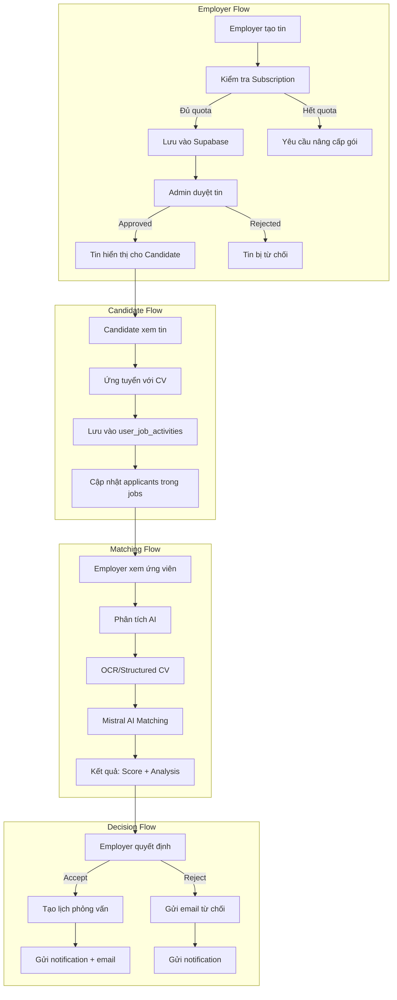
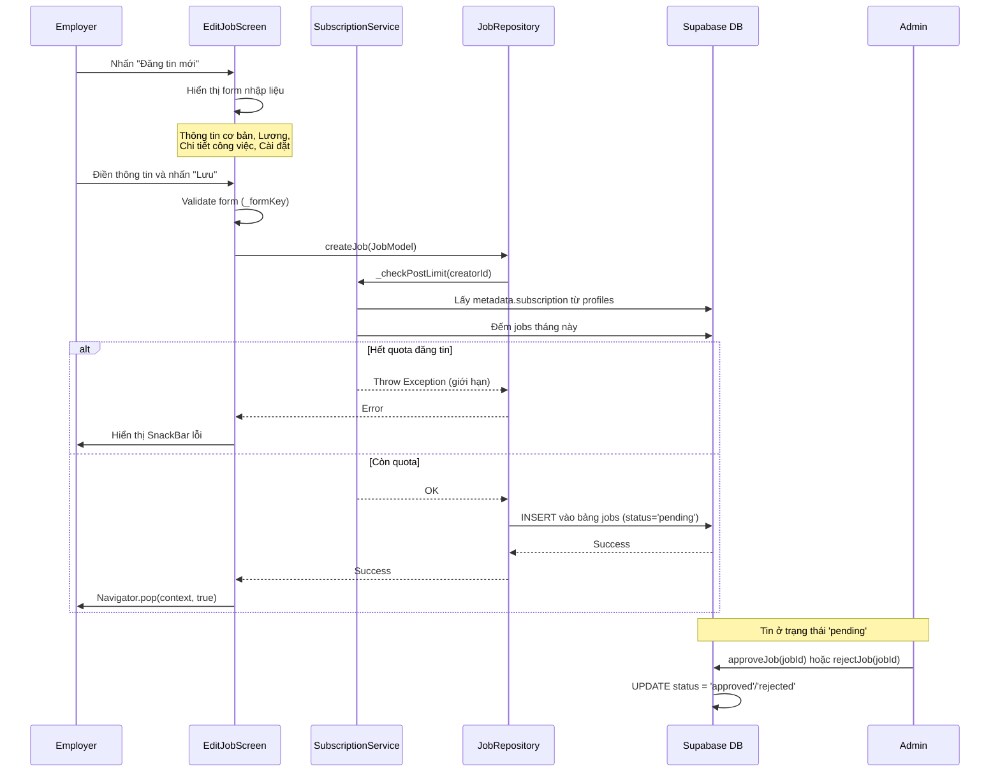
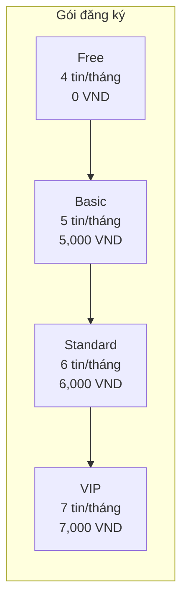
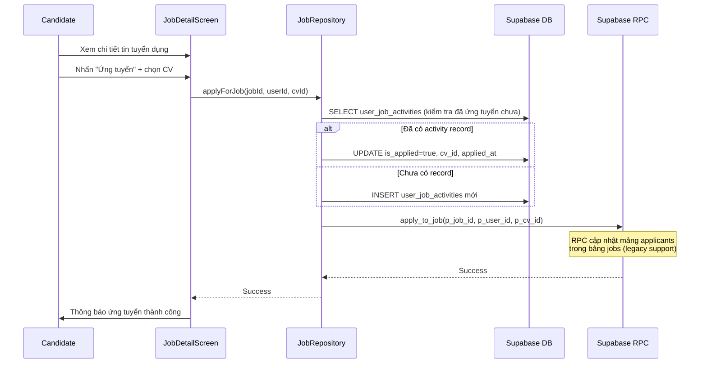
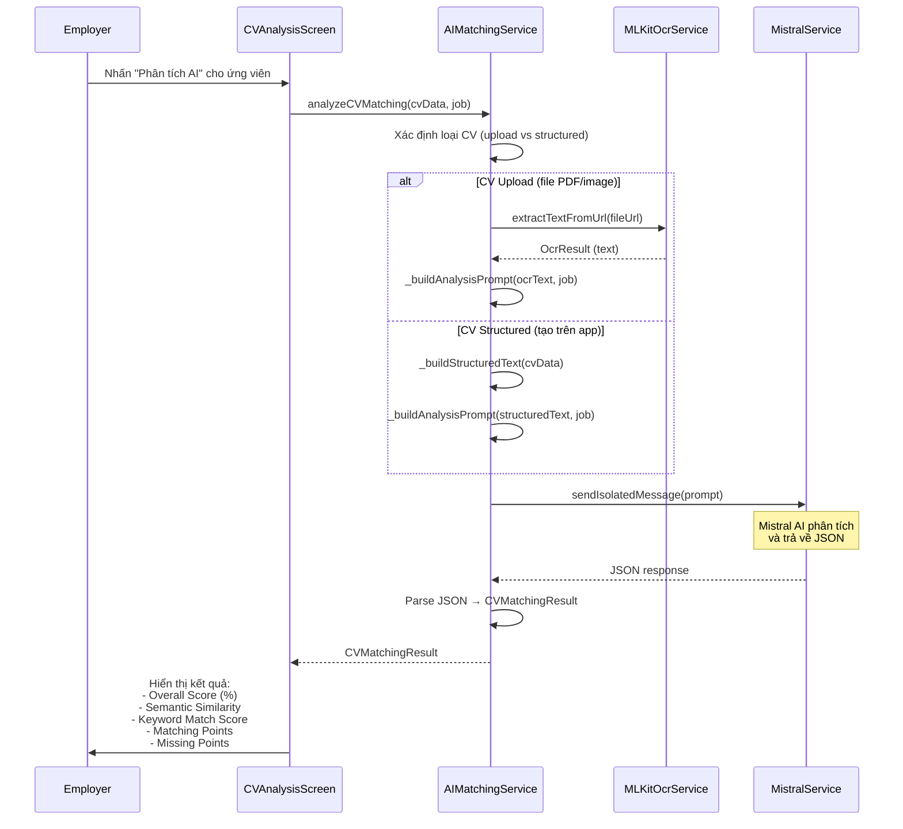
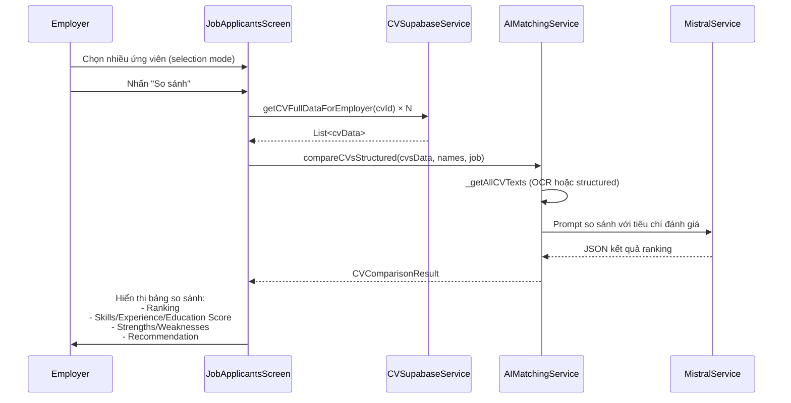
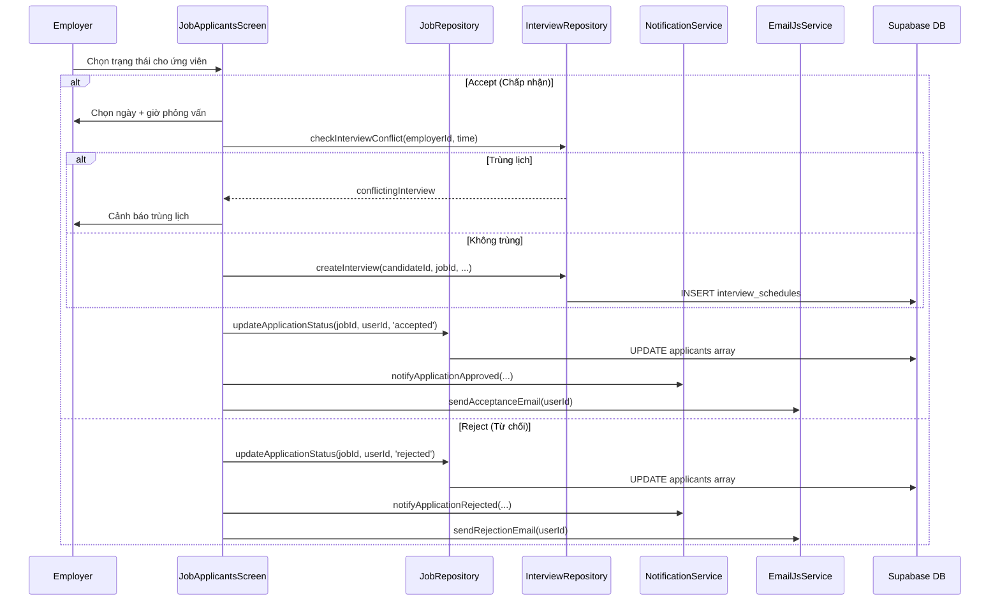
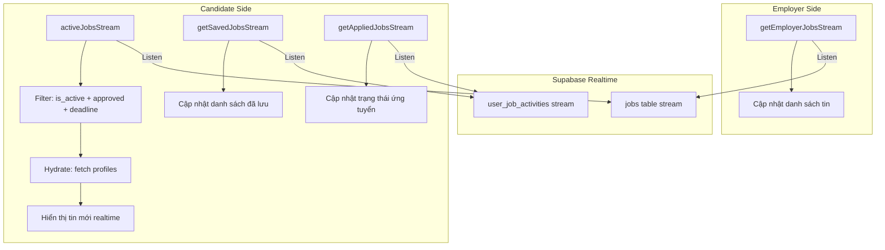
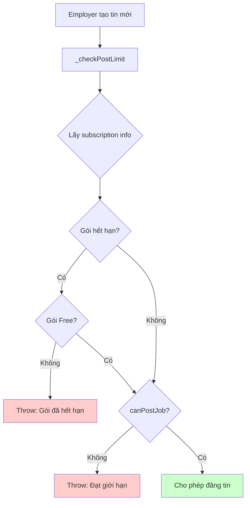

# Luồng Đăng Tin Tuyển Dụng và Matching

## Mục đích

Tài liệu này mô tả chi tiết luồng đăng tin tuyển dụng của nhà tuyển dụng (Employer), quy trình ứng tuyển của ứng viên (Candidate), và cơ chế AI Matching để đánh giá độ phù hợp giữa CV và công việc. Hệ thống hỗ trợ hai loại tin tuyển dụng: tin thường (regular jobs) và tin đối tác (partnership jobs) thông qua liên kết với trường học.

## Các thành phần tham gia

### Controllers

| Controller | File | Vai trò |
|-----------|------|---------|
| `HomeEmployerController` | `lib/features/employer/controllers/home_employer_controller.dart` | Quản lý trang chủ employer: load jobs, applications, stats, subscription |
| `SearchEmployerController` | `lib/features/employer/controllers/search_employer_controller.dart` | Tìm kiếm và lọc ứng viên theo nhiều tiêu chí |
| `EmployerStatisticsController` | `lib/features/employer/controllers/employer_statistics_controller.dart` | Thống kê hoạt động tuyển dụng |

### Screens

| Screen | File | Vai trò |
|--------|------|---------|
| `EditJobScreen` | `lib/features/employer/screens/jobs/edit_job_screen.dart` | Tạo mới / chỉnh sửa tin tuyển dụng |
| `EmployerJobsScreen` | `lib/features/employer/screens/jobs/employer_jobs_screen.dart` | Danh sách quản lý tin đã đăng (tabs: tin thường + tin đối tác) |
| `JobApplicantsScreen` | `lib/features/employer/screens/jobs/job_applicants_screen.dart` | Quản lý ứng viên cho từng tin |
| `CVAnalysisScreen` | `lib/features/employer/screens/jobs/cv_analysis_screen.dart` | Phân tích AI matching cho từng CV |
| `CVScanAnalysisScreen` | `lib/features/employer/screens/jobs/cv_scan_analysis_screen.dart` | Scan CV bằng camera và phân tích |

### Repositories

| Repository | File | Vai trò |
|-----------|------|---------|
| `JobRepository` | `lib/core/repositories/job_repository.dart` | CRUD tin tuyển dụng, quản lý ứng viên, realtime streams |
| `CandidateRepository` | `lib/core/repositories/candidate_repository.dart` | Truy vấn thông tin ứng viên |
| `InterviewRepository` | `lib/core/repositories/interview_repository.dart` | Tạo lịch phỏng vấn khi chấp nhận ứng viên |
| `AIDataRepository` | `lib/core/repositories/ai_data_repository.dart` | Truy vấn dữ liệu cho AI chatbot (intent-based) |

### Services

| Service | File | Vai trò |
|---------|------|---------|
| `AIMatchingService` | `lib/core/services/ai_matching_service.dart` | Phân tích độ phù hợp CV-Job bằng Mistral AI |
| `SubscriptionService` | `lib/core/services/subscription_service.dart` | Kiểm tra giới hạn đăng tin theo gói đăng ký |
| `MistralService` | `lib/core/services/mistral_service.dart` | Gọi API Mistral AI |
| `MLKitOcrService` | `lib/core/services/mlkit_ocr_service.dart` | OCR text recognition từ CV upload/scan |
| `CVSupabaseService` | `lib/core/services/cv_supabase_service.dart` | Lấy dữ liệu CV từ Supabase |
| `ApplicationNotificationService` | `lib/core/services/notification/application_notification_service.dart` | Gửi thông báo kết quả ứng tuyển |
| `EmailJsService` | `lib/core/services/emailjs_service.dart` | Gửi email phản hồi cho ứng viên |

### Models

| Model | File | Vai trò |
|-------|------|---------|
| `JobModel` | `lib/core/models/job_model.dart` | Model chính cho tin tuyển dụng |
| `JobMetadata` | `lib/core/models/job_model.dart` | Thông tin chi tiết: title, salary, fields, requirements |
| `JobSalary` | `lib/core/models/job_model.dart` | Thông tin lương (min, max, currency, type) |
| `JobApplication` | `lib/core/models/job_model.dart` | Thông tin ứng tuyển (userId, cvId, status) |
| `CVMatchingResult` | `lib/core/models/cv_matching_result_model.dart` | Kết quả phân tích AI matching |

## Sơ đồ tổng quan



## Luồng xử lý chi tiết

### 1. Luồng đăng tin tuyển dụng (Employer)



#### Chi tiết dữ liệu tin tuyển dụng (JobModel)

```dart
JobModel(
  creatorId: userId,          // ID nhà tuyển dụng
  isActive: true,             // Trạng thái hiển thị
  deadline: DateTime,         // Hạn nộp hồ sơ
  status: 'pending',          // pending → approved/rejected
  metadata: JobMetadata(
    title: 'Senior Flutter Developer',
    workingRegions: ['Hà Nội', 'TP.HCM'],
    experienceRequired: '2-3 năm',
    fields: ['Công nghệ thông tin'],
    requirementsTags: ['Flutter', 'Dart', 'Firebase'],
    salary: JobSalary(min: 15000000, max: 25000000, currency: 'VND'),
    employmentTypes: ['Toàn thời gian'],
    workLocations: ['123 Nguyễn Huệ, Q1, TP.HCM'],
    jobDescription: ['Phát triển ứng dụng mobile...'],
    candidateRequirements: ['Tốt nghiệp ĐH CNTT...'],
    benefits: ['Lương tháng 13...'],
  ),
)
```

### 2. Hệ thống Subscription (Giới hạn đăng tin)



| Gói | Mã code | Giới hạn | Giá/tháng |
|-----|---------|----------|-----------|
| Free | FREE | 4 tin/tháng | 0 VND |
| Basic | EMP-CB | 5 tin/tháng | 5,000 VND |
| Standard | EMP-T | 6 tin/tháng | 6,000 VND |
| VIP | EMP-V | 7 tin/tháng | 7,000 VND |

**Logic kiểm tra:**
1. Lấy thông tin subscription từ `profiles.metadata.subscription`
2. Kiểm tra hết hạn (`expires_at`)
3. Đếm số tin đã đăng trong tháng (cả regular + partnership jobs)
4. So sánh với `maxJobsPerMonth` của gói hiện tại

### 3. Luồng ứng tuyển (Candidate)



### 4. Luồng AI Matching (Phân tích CV)



#### Cấu trúc kết quả AI Matching

```json
{
  "overall_score": 75,
  "semantic_similarity": 0.82,
  "keyword_match_score": 68,
  "summary": "Ứng viên có kinh nghiệm Flutter 2 năm, phù hợp 75%...",
  "matching_points": [
    "Có kinh nghiệm Flutter/Dart",
    "Đã làm việc với Firebase"
  ],
  "missing_points": [
    "Chưa có kinh nghiệm CI/CD",
    "Thiếu chứng chỉ AWS"
  ],
  "parsed_data": {
    "name": "Nguyễn Văn A",
    "skills": "Flutter, Dart, Firebase",
    "experience": "2 năm",
    "education": "ĐH Bách Khoa"
  }
}
```

### 5. Luồng so sánh ứng viên (Compare CVs)



### 6. Luồng xử lý ứng viên (Accept/Reject)



### 7. Luồng Realtime Streams



## Xử lý lỗi

| Tình huống | Xử lý | Thông báo |
|-----------|--------|-----------|
| Hết quota đăng tin | Throw Exception, hiển thị SnackBar | "Bạn đã đạt giới hạn đăng tin (X tin/tháng). Vui lòng nâng cấp gói." |
| Gói đăng ký hết hạn | Reset về Free plan, cho phép đăng 4 tin | "Gói đăng ký đã hết hạn. Đang sử dụng gói miễn phí." |
| Lỗi tạo tin | Catch Exception, hiển thị SnackBar | "Lỗi khi lưu tin: [chi tiết]" |
| Lỗi ứng tuyển | Throw Exception | "Failed to apply for job: [chi tiết]" |
| Đã ứng tuyển rồi | Detect P0001 error code | "Bạn đã ứng tuyển công việc này rồi." |
| OCR thất bại | Fallback về mock result | Return CVMatchingResult.fromMock(5) |
| AI không trả JSON hợp lệ | Sanitize + retry parse | Fallback CVMatchingResult.fromMock(10) |
| Trùng lịch phỏng vấn | Hiển thị dialog cảnh báo | "Bạn đã có lịch phỏng vấn vào thời gian này" |
| Lỗi gửi email/notification | Log warning, không hiển thị lỗi | Background operation, không ảnh hưởng UX |

## Cơ chế kiểm tra giới hạn đăng tin



## Tìm kiếm ứng viên (Employer Search)

`SearchEmployerController` cho phép nhà tuyển dụng tìm kiếm ứng viên với các bộ lọc:

| Bộ lọc | Mô tả |
|--------|--------|
| Lĩnh vực (Fields) | Lọc theo `metadata.interested_fields` |
| Trình độ học vấn | Lọc theo `metadata.education` |
| Khu vực | Lọc theo `metadata.work_locations` |
| Độ tuổi | Lọc theo `date_of_birth` (18-60) |
| Giới tính | Lọc theo `metadata.gender` |
| Từ khóa | Tìm trong fields + tags |

**Lưu ý:** Chỉ hiển thị ứng viên có `metadata.security = true` (đã xác minh).

## Bảng dữ liệu Supabase liên quan

| Bảng | Vai trò |
|------|---------|
| `jobs` | Lưu tin tuyển dụng (metadata JSONB, applicants JSONB array) |
| `user_job_activities` | Tracking: saved, applied, application_status |
| `profiles` | Thông tin user (employer/candidate), subscription metadata |
| `school_partnership_jobs` | Tin tuyển dụng đối tác (school + company) |
| `interview_schedules` | Lịch phỏng vấn |
| `email_templates` | Template email phản hồi tùy chỉnh |

## Liên kết liên quan

- [Tổng quan kiến trúc](../01_tong_quan_kien_truc.md)
- [Luồng AI Matching](./ai_matching_flow.md)
- [Luồng thông báo](./notification_flow.md)
- [Luồng phỏng vấn](./interview_flow.md)
- [Luồng thanh toán](./payment_flow.md)
- [Luồng quản lý CV](./cv_management_flow.md)
