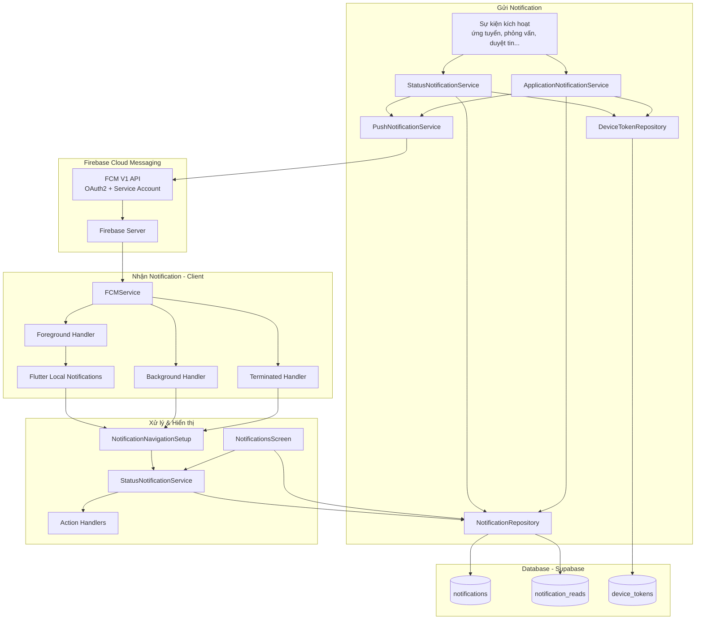
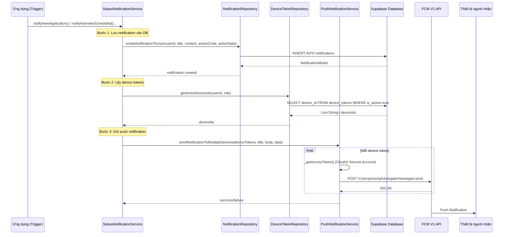
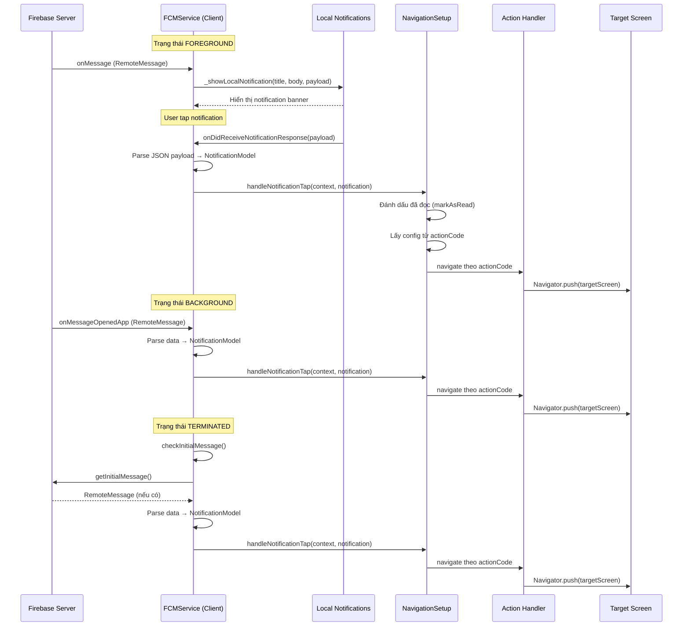
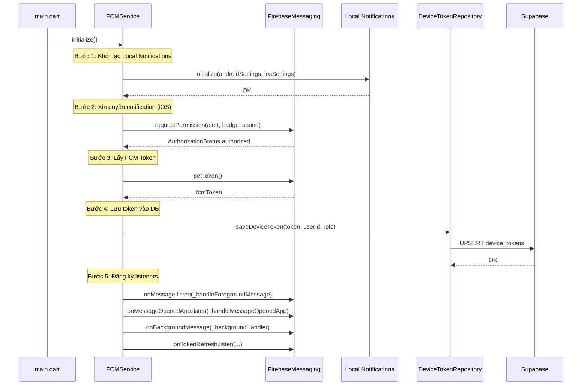
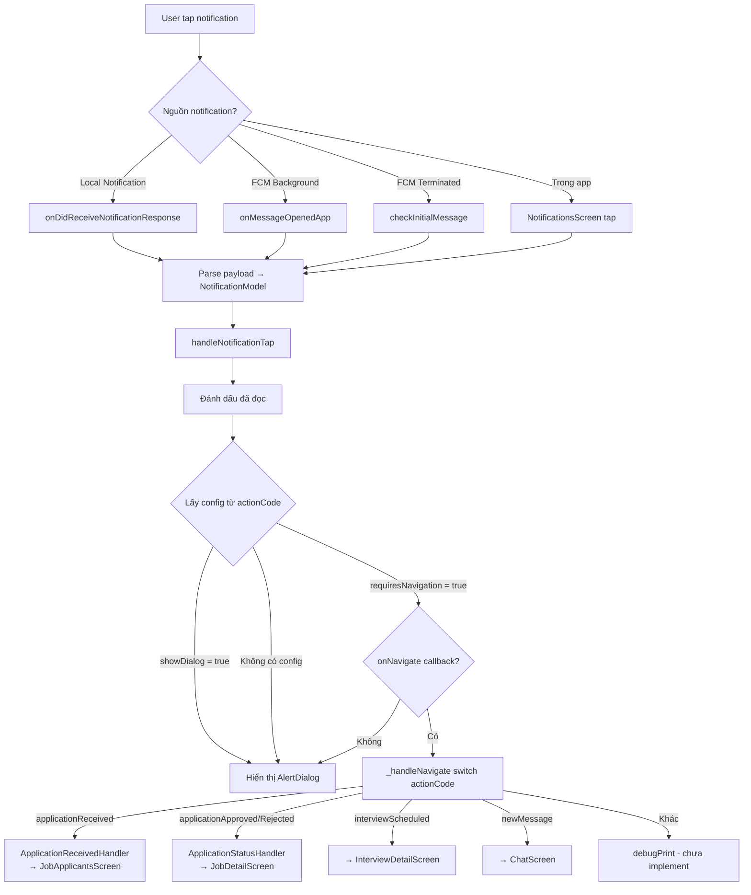
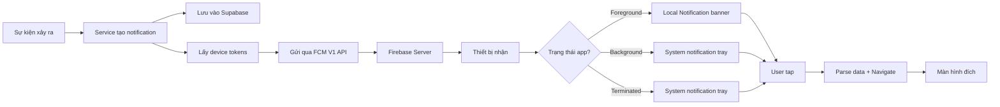

# Luồng Thông Báo (Notification Flow)

## Mục đích

Hệ thống thông báo của NP FutureGate cung cấp cơ chế gửi và nhận push notification qua **Firebase Cloud Messaging (FCM)** kết hợp với **Local Notifications** (flutter_local_notifications). Mục tiêu chính:

- Thông báo realtime đến người dùng khi có sự kiện quan trọng (ứng tuyển, phỏng vấn, duyệt tin, liên kết...)
- Hỗ trợ đa thiết bị (multi-device) cho mỗi user
- Xử lý notification ở cả 3 trạng thái app: foreground, background, terminated
- Điều hướng (navigation) đến màn hình phù hợp khi user tap vào notification
- Lưu trữ lịch sử thông báo trong database (Supabase) với hỗ trợ phân trang và lọc

## Các thành phần tham gia

### Services

| Thành phần | File | Vai trò |
|------------|------|---------|
| `FCMService` | `lib/core/services/fcm_service.dart` | Khởi tạo Firebase Messaging, nhận token, xử lý message ở các trạng thái app |
| `PushNotificationService` | `lib/core/services/push_notification_service.dart` | Gửi push notification qua FCM V1 API (OAuth2 authentication) |
| `StatusNotificationService` | `lib/core/services/notification/status_notification_service.dart` | Xử lý logic navigation, tạo notification trong DB, gửi push |
| `ApplicationNotificationService` | `lib/core/services/notification/application_notification_service.dart` | Xử lý gửi notification liên quan đến đơn ứng tuyển |

### Repositories

| Thành phần | File | Vai trò |
|------------|------|---------|
| `NotificationRepository` | `lib/core/repositories/notification_repository.dart` | CRUD thông báo trong Supabase, phân trang, đánh dấu đã đọc |
| `DeviceTokenRepository` | `lib/core/repositories/device_token_repository.dart` | Quản lý device tokens, notification settings |

### Models

| Thành phần | File | Vai trò |
|------------|------|---------|
| `NotificationModel` | `lib/core/models/notification_model.dart` | Data model cho thông báo |
| `NotificationConfig` | `lib/features/notification/models/notification_config.dart` | Định nghĩa NotificationType, NotificationActionCode, cấu hình navigation |

### UI Components

| Thành phần | File | Vai trò |
|------------|------|---------|
| `NotificationsScreen` | `lib/features/notification/screens/notifications_screen.dart` | Màn hình danh sách thông báo với tabs, filter, phân trang |
| `NotificationItemWidget` | `lib/features/notification/widgets/notification_item_widget.dart` | Widget hiển thị từng notification item |

### Action Handlers

| Thành phần | File | Vai trò |
|------------|------|---------|
| `ApplicationReceivedHandler` | `lib/features/notification/actions/application_received_handler.dart` | Xử lý navigation khi nhận đơn ứng tuyển |
| `ApplicationStatusHandler` | `lib/features/notification/actions/application_status_handler.dart` | Xử lý navigation khi đơn được duyệt/từ chối |

## Sơ đồ kiến trúc tổng quan



## Luồng xử lý step-by-step

### Luồng 1: Gửi Push Notification



### Luồng 2: Nhận và xử lý Notification trên Client



### Luồng 3: Khởi tạo FCM Service



## Phân loại Notification

### NotificationType (Loại thông báo)

| Type | Hiển thị | Màu sắc | Icon |
|------|----------|----------|------|
| `info` | Thông tin | Xanh dương | info_outline |
| `success` | Thành công | Xanh lá | check_circle_outline |
| `warning` | Cảnh báo | Cam | warning_amber |
| `error` | Lỗi | Đỏ | error_outline |
| `announcement` | Thông báo | Tím | campaign |
| `requirement` | Yêu cầu | Vàng amber | assignment_outlined |
| `reminder` | Nhắc nhở | Teal | notifications_active |

### NotificationActionCode (Mã hành động)

Hệ thống định nghĩa **30+ action codes** được phân nhóm:

| Nhóm | Action Codes | Navigation |
|-------|-------------|------------|
| Job Related | `job_detail`, `job_approved`, `job_rejected`, `new_job_posted`, `job_expiring` | → Job Detail Screen |
| Application | `application_received`, `application_approved`, `application_rejected`, `application_viewed` | → Job Applicants / Job Detail |
| Interview | `interview_schedule`, `interview_updated`, `interview_canceled`, `interview_reminder`, `interview_evaluated` | → Interview Detail |
| Partnership | `partnership_request`, `partnership_approved`, `partnership_rejected`, `partnership_job_posted` | → Partnership Detail |
| Profile | `profile_viewed`, `profile_followed`, `profile_updated` | → Profile Screen |
| Message | `new_message`, `message_reply` | → Chat Screen |
| System | `system_update`, `system_maintenance`, `announcement` | Show Dialog |
| Admin | `admin_review`, `admin_approved`, `admin_rejected` | → Admin Screen |
| Payment | `payment_success`, `payment_failed`, `subscription_expiring` | Show Dialog / Subscription |

## Cơ chế gửi Push Notification (FCM V1 API)

### Authentication

`PushNotificationService` sử dụng **OAuth2 với Service Account** để xác thực với FCM V1 API:

```dart
// Load service account JSON từ assets
final serviceAccountJson = await rootBundle.loadString(_serviceAccountPath);
final accountCredentials = ServiceAccountCredentials.fromJson(json.decode(serviceAccountJson));

// Lấy OAuth2 access token
const scopes = ['https://www.googleapis.com/auth/firebase.messaging'];
final authClient = await clientViaServiceAccount(accountCredentials, scopes);
final accessToken = authClient.credentials.accessToken.data;
```

### Cấu trúc FCM Message

```json
{
  "message": {
    "token": "<device_token>",
    "notification": {
      "title": "Tiêu đề",
      "body": "Nội dung"
    },
    "data": {
      "type": "application_received",
      "jobId": "uuid",
      "notificationId": "uuid"
    },
    "android": {
      "priority": "high",
      "notification": {
        "sound": "default",
        "click_action": "FLUTTER_NOTIFICATION_CLICK",
        "channel_id": "fcm_channel"
      }
    },
    "apns": {
      "headers": { "apns-priority": "10" },
      "payload": {
        "aps": {
          "sound": "default",
          "category": "FLUTTER_NOTIFICATION_CLICK"
        }
      }
    }
  }
}
```

### Các phương thức gửi

| Phương thức | Mô tả |
|-------------|--------|
| `sendNotificationToDevice()` | Gửi đến 1 device token cụ thể |
| `sendNotificationToMultipleDevices()` | Gửi đến nhiều devices (loop tuần tự) |
| `sendNotificationToTopic()` | Gửi đến tất cả subscribers của 1 topic |

## Quản lý Device Token

### Lưu trữ

Device tokens được lưu trong bảng `device_tokens` trên Supabase với các thông tin:
- `device_id`: FCM token
- `user_id`: ID người dùng
- `role`: Vai trò (candidate, employer, school, admin)
- `device_type`: android/ios
- `device_name`: Tên thiết bị
- `app_version`: Phiên bản app
- `is_active`: Trạng thái hoạt động
- `notification_settings`: Cài đặt notification (JSON)
- `last_login_at`: Thời gian đăng nhập cuối

### Notification Settings

Mỗi device có cấu hình notification riêng:

```json
{
  "enabled": true,
  "sound_enabled": true,
  "vibration_enabled": true,
  "job_notifications": true,
  "system_notifications": true,
  "message_notifications": true,
  "interview_notifications": true,
  "application_notifications": true,
  "partnership_notifications": true,
  "notification_types": {
    "info": true,
    "error": true,
    "success": true,
    "warning": true,
    "reminder": true,
    "requirement": true,
    "announcement": true
  }
}
```

## Cơ chế Navigation khi tap Notification



## Xử lý lỗi

| Tình huống | Xử lý |
|------------|--------|
| Không lấy được OAuth2 token | Rethrow exception, log lỗi |
| FCM API trả về lỗi (status != 200) | Return `false`, log status code và response body |
| Không tìm thấy device token của user | Fallback: gửi đến current user (để test), hoặc bỏ qua |
| User chưa cấp quyền notification (iOS) | Không đăng ký listeners, không lấy token |
| Token refresh | Tự động lưu token mới qua `onTokenRefresh` listener |
| Context không available khi navigate | Kiểm tra `context.mounted` trước mọi navigation |
| Job không tồn tại khi navigate | Hiển thị error dialog "Không tìm thấy công việc" |
| Lỗi trong notification flow | Catch exception, không throw để không ảnh hưởng flow chính |
| Notification hết hạn | Filter bỏ trong query (`isExpired` check) |
| Duplicate read mark | Ignore PostgreSQL unique constraint violation |

## Database Schema

### Bảng `notifications`

| Column | Type | Mô tả |
|--------|------|--------|
| `id` | UUID | Primary key |
| `created_at` | TIMESTAMP | Thời gian tạo |
| `updated_at` | TIMESTAMP | Thời gian cập nhật |
| `recipient_ids` | TEXT | 'all', UUID đơn, hoặc JSON array UUIDs |
| `title` | TEXT | Tiêu đề thông báo |
| `content` | TEXT | Nội dung thông báo |
| `action_code` | TEXT | Mã hành động (VD: 'application_received') |
| `action_data` | JSONB | Dữ liệu bổ sung cho navigation |
| `is_active` | BOOLEAN | Trạng thái hoạt động |
| `type` | TEXT | Loại thông báo (info, success, warning...) |
| `sender_id` | UUID | ID người gửi (nullable) |
| `expires_at` | TIMESTAMP | Thời gian hết hạn (nullable) |

### Bảng `notification_reads`

| Column | Type | Mô tả |
|--------|------|--------|
| `notification_id` | UUID | FK → notifications.id |
| `user_id` | UUID | ID người đọc |
| `read_at` | TIMESTAMP | Thời gian đọc |

### Bảng `device_tokens`

| Column | Type | Mô tả |
|--------|------|--------|
| `id` | UUID | Primary key |
| `device_id` | TEXT | FCM token |
| `user_id` | UUID | FK → users.id |
| `role` | TEXT | Vai trò (candidate, employer, school, admin) |
| `device_type` | TEXT | android/ios |
| `device_name` | TEXT | Tên thiết bị |
| `app_version` | TEXT | Phiên bản app |
| `is_active` | BOOLEAN | Trạng thái hoạt động |
| `notification_settings` | JSONB | Cài đặt notification |
| `last_login_at` | TIMESTAMP | Thời gian đăng nhập cuối |

## Realtime Updates

`NotificationRepository` cung cấp **Stream** để theo dõi thông báo mới realtime:

```dart
Stream<List<NotificationModel>> watchNotifications({required String userId}) {
  return _supabase
      .from('notifications')
      .stream(primaryKey: ['id'])
      .order('created_at', ascending: false)
      .map((data) => data
          .map((json) => NotificationModel.fromJson(json))
          .where((n) => !n.isExpired)
          .where((n) => n.recipientIds == 'all' || 
                        n.recipientIds == userId || 
                        n.recipientIds.contains(userId))
          .toList());
}
```

## Tổng kết luồng hoạt động



## Liên kết liên quan

- [Tổng quan kiến trúc](../01_tong_quan_kien_truc.md)
- [Luồng Authentication](./authentication_flow.md)
- [Luồng Chat Realtime](./chat_flow.md)
- [Luồng Phỏng vấn](./interview_flow.md)
- [Giải thích Firebase FCM](../10_giai_thich_cong_nghe_tung_cai/firebase_fcm.md)
