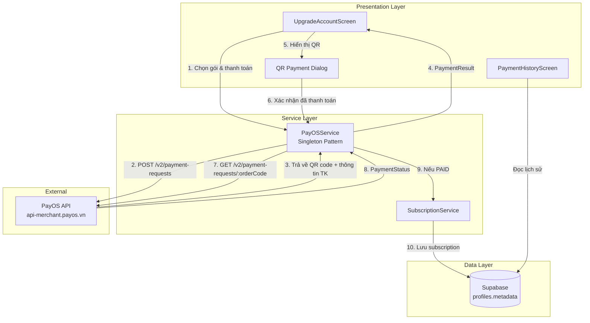
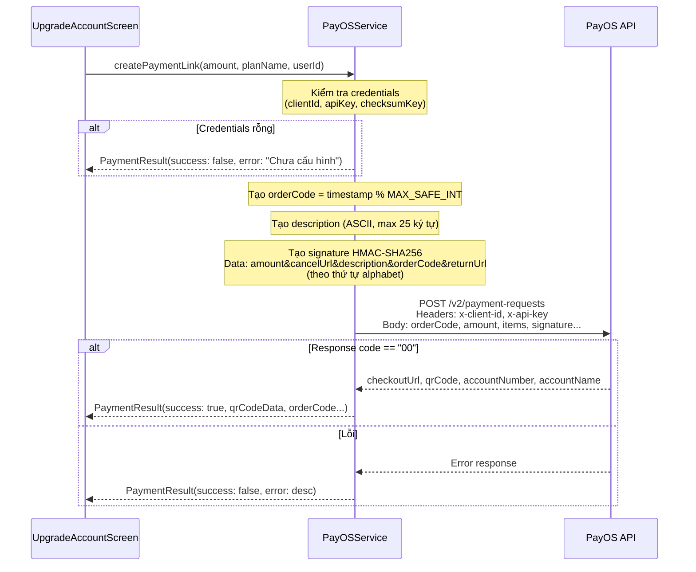
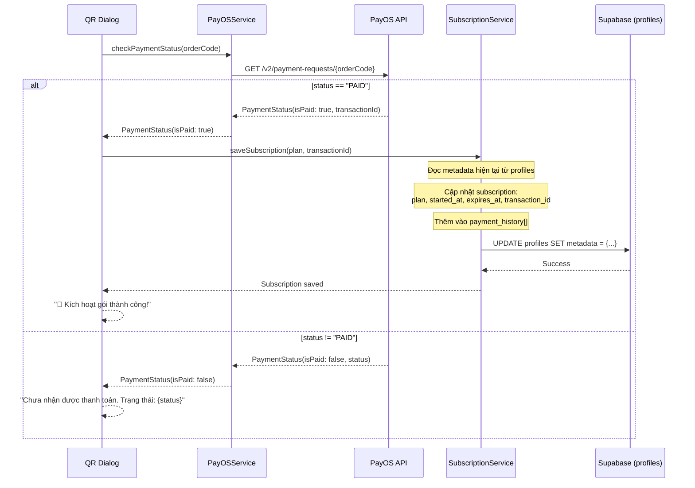
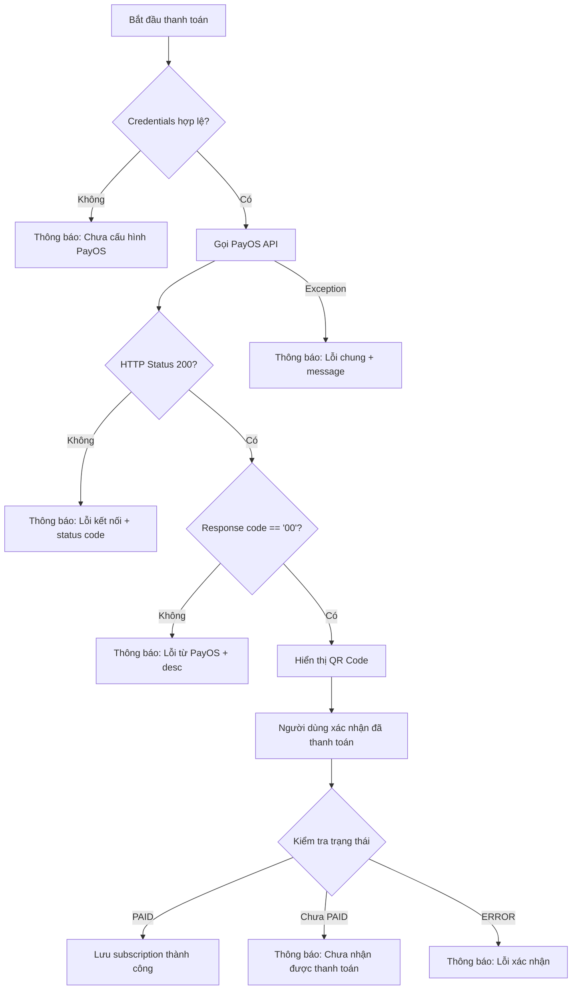
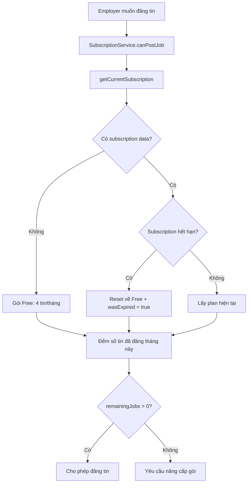

# Luồng Thanh Toán qua PayOS

## Mục đích

Tài liệu này mô tả chi tiết cơ chế thanh toán trong ứng dụng NP FutureGate, sử dụng cổng thanh toán **PayOS** để xử lý các giao dịch nâng cấp gói dịch vụ (subscription) cho nhà tuyển dụng (Employer). Hệ thống cho phép nhà tuyển dụng thanh toán qua mã QR ngân hàng để mở rộng số lượng tin tuyển dụng được đăng mỗi tháng.

## Các thành phần tham gia

| Thành phần | File/Class | Vai trò |
|------------|-----------|---------|
| PayOSService | `lib/core/services/payos_service.dart` | Giao tiếp với PayOS API, tạo link thanh toán, kiểm tra trạng thái |
| SubscriptionService | `lib/core/services/subscription_service.dart` | Quản lý gói đăng ký, lưu thông tin subscription sau thanh toán |
| UpgradeAccountScreen | `lib/features/employer/screens/subscription/upgrade_account_screen.dart` | Giao diện chọn gói và thanh toán |
| PaymentHistoryScreen | `lib/features/employer/screens/subscription/payment_history_screen.dart` | Hiển thị lịch sử giao dịch |
| SupabaseService | `lib/core/services/supabase_service.dart` | Lưu trữ metadata subscription trong bảng `profiles` |
| PayOS API | External (`api-merchant.payos.vn`) | Cổng thanh toán bên thứ ba |

## Sơ đồ tổng quan



## Luồng xử lý step-by-step

### Bước 1: Nhà tuyển dụng chọn gói nâng cấp

Nhà tuyển dụng truy cập màn hình `UpgradeAccountScreen`, hệ thống hiển thị các gói subscription:

| Gói | Mã code | Giá | Số tin/tháng |
|-----|---------|-----|-------------|
| Miễn phí | FREE | 0 VNĐ | 4 tin |
| Cơ bản | EMP-CB | 5.000 VNĐ | 5 tin |
| Thường | EMP-T | 6.000 VNĐ | 6 tin |
| VIP | EMP-V | 7.000 VNĐ | 7 tin |

### Bước 2: Tạo yêu cầu thanh toán (Payment Request)

Khi nhà tuyển dụng nhấn "Nâng cấp ngay", hệ thống gọi `PayOSService.createPaymentLink()`:

```dart
final result = await _payOSService.createPaymentLink(
  amount: planInfo.price,      // Số tiền (VNĐ)
  planName: plan.code,         // Mã gói: EMP-CB, EMP-T, EMP-V
  userId: userId,              // ID người dùng
);
```

### Bước 3: PayOSService xử lý tạo link thanh toán



### Bước 4: Hiển thị mã QR thanh toán

Sau khi nhận `PaymentResult` thành công, hệ thống hiển thị dialog chứa:
- **Mã QR**: Render bằng thư viện `qr_flutter` từ `qrCodeData`
- **Thông tin thanh toán**: Số tiền, mã đơn hàng, số tài khoản, chủ tài khoản
- **Hướng dẫn**: "Mở app ngân hàng, quét mã QR và thanh toán"
- **Nút hành động**: "Hủy" và "Đã thanh toán"

### Bước 5: Xác nhận thanh toán (Verify Payment)

Sau khi người dùng quét QR và thanh toán xong, nhấn "Đã thanh toán":



### Bước 6: Lưu trữ thông tin subscription

`SubscriptionService.saveSubscription()` lưu dữ liệu vào `profiles.metadata`:

```json
{
  "subscription": {
    "plan": "basic",
    "started_at": "2024-01-15T10:00:00.000Z",
    "expires_at": "2024-02-15T10:00:00.000Z",
    "transaction_id": "TXN123456"
  },
  "payment_history": [
    {
      "transaction_id": "TXN123456",
      "plan_code": "EMP-CB",
      "amount": 5000,
      "date": "2024-01-15T10:00:00.000Z"
    }
  ]
}
```

## Cơ chế bảo mật

### Xác thực API PayOS

| Thành phần | Mô tả |
|------------|--------|
| `PAYOS_CLIENT_ID` | Định danh merchant, gửi qua header `x-client-id` |
| `PAYOS_API_KEY` | API key xác thực, gửi qua header `x-api-key` |
| `PAYOS_CHECKSUM_KEY` | Khóa bí mật để tạo chữ ký HMAC-SHA256 |

### Tạo chữ ký (Signature)

Chữ ký được tạo bằng thuật toán **HMAC-SHA256** với dữ liệu theo thứ tự alphabet:

```
signatureData = "amount={amount}&cancelUrl={cancelUrl}&description={description}&orderCode={orderCode}&returnUrl={returnUrl}"
signature = HMAC-SHA256(checksumKey, signatureData)
```

### Lưu trữ credentials

Credentials được lưu trong file `.env` và đọc qua thư viện `flutter_dotenv`:

```
PAYOS_CLIENT_ID='...'
PAYOS_API_KEY='...'
PAYOS_CHECKSUM_KEY='...'
```

## Xử lý lỗi



| Tình huống lỗi | Xử lý | Thông báo cho người dùng |
|----------------|--------|--------------------------|
| Credentials rỗng | Trả về `PaymentResult(success: false)` | "PayOS credentials chưa được cấu hình" |
| HTTP error (non-200) | Parse error response | "Lỗi kết nối: {statusCode}" hoặc message từ API |
| PayOS trả code != "00" | Lấy `desc` từ response | Mô tả lỗi từ PayOS |
| Exception bất kỳ | Catch all exceptions | "Lỗi: {exception message}" |
| Thanh toán chưa hoàn tất | Hiển thị trạng thái | "Chưa nhận được thanh toán. Trạng thái: {status}" |
| Lỗi lưu subscription | Catch exception | "Lỗi xác nhận: {error}" |

## Quản lý Subscription

### Kiểm tra quyền đăng tin



### Hết hạn subscription

- Subscription có thời hạn **1 tháng** kể từ ngày thanh toán
- Khi hết hạn, hệ thống tự động reset về gói Free
- Flag `wasExpired = true` được set để UI hiển thị thông báo "Gói đã hết hạn" và gợi ý gia hạn
- Cảnh báo khi còn ≤ 7 ngày (`isAboutToExpire`)

### Đếm số tin đã đăng

Hệ thống đếm tổng số tin từ 2 bảng:
- `jobs` — Tin tuyển dụng thông thường
- `school_partnership_jobs` — Tin tuyển dụng qua partnership với trường

## Design Patterns sử dụng

| Pattern | Áp dụng | Mô tả |
|---------|---------|--------|
| Singleton | `PayOSService` | Đảm bảo chỉ có 1 instance duy nhất trong toàn app |
| Factory Constructor | `PayOSService()` | Trả về instance singleton qua factory |
| Result Object | `PaymentResult`, `PaymentStatus` | Đóng gói kết quả thành công/thất bại thay vì throw exception |
| Metadata Storage | `profiles.metadata` | Lưu subscription và payment history dạng JSON trong metadata column |

## Services và Repositories liên quan

| Service/Repository | Vai trò trong luồng thanh toán |
|-------------------|-------------------------------|
| `PayOSService` | Tạo payment link, kiểm tra trạng thái thanh toán |
| `SubscriptionService` | Quản lý gói đăng ký, kiểm tra quyền, lưu subscription |
| `SupabaseService` | Truy cập Supabase client để đọc/ghi profiles |
| Supabase `profiles` table | Lưu trữ metadata chứa subscription và payment_history |
| Supabase `jobs` table | Đếm số tin đã đăng trong tháng |
| Supabase `school_partnership_jobs` table | Đếm số tin partnership đã đăng |

## Thư viện sử dụng

| Thư viện | Vai trò |
|----------|---------|
| `http` | Gọi REST API đến PayOS |
| `crypto` | Tạo HMAC-SHA256 signature |
| `flutter_dotenv` | Đọc credentials từ file `.env` |
| `url_launcher` | Mở payment URL trên trình duyệt (fallback) |
| `qr_flutter` | Render mã QR từ data string trong app |

## Liên kết liên quan

- [Tổng quan kiến trúc](../01_tong_quan_kien_truc.md)
- [Giải thích PayOS Payment](../10_giai_thich_cong_nghe_tung_cai/payos_payment.md)
- [Công nghệ sử dụng](../04_cong_nghe_su_dung/tech_stack_overview.md)
- [Luồng đăng tin tuyển dụng](./job_posting_flow.md)
