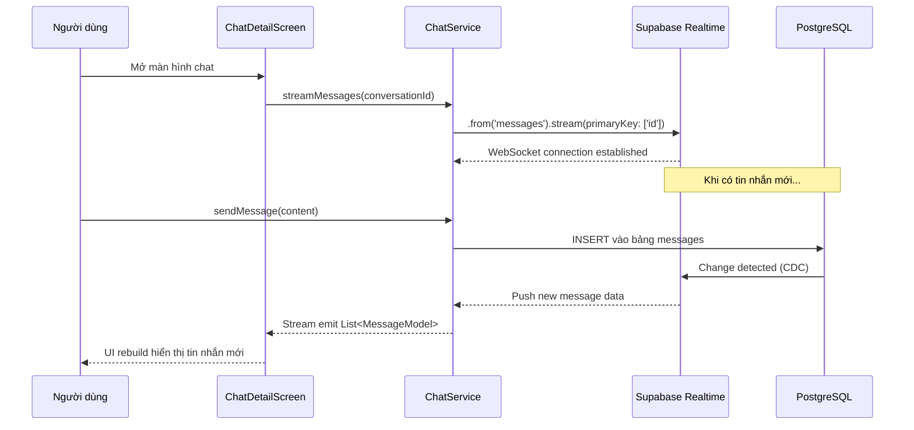
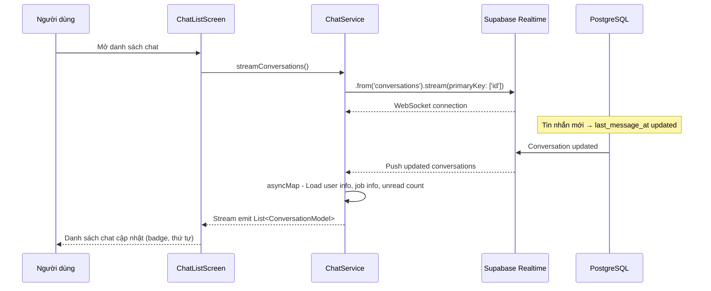
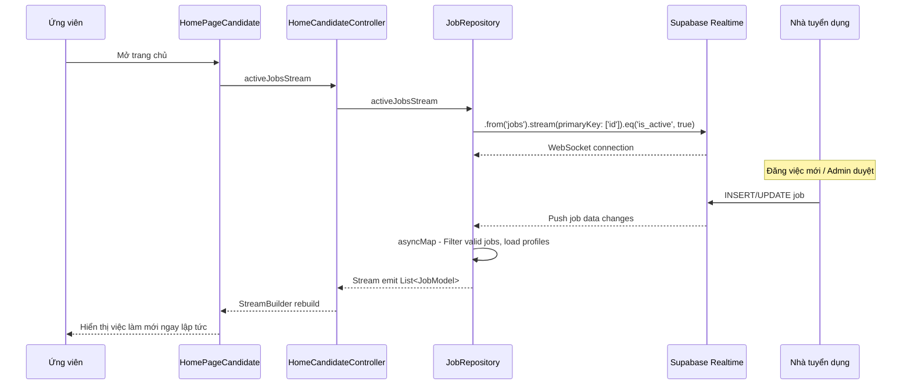
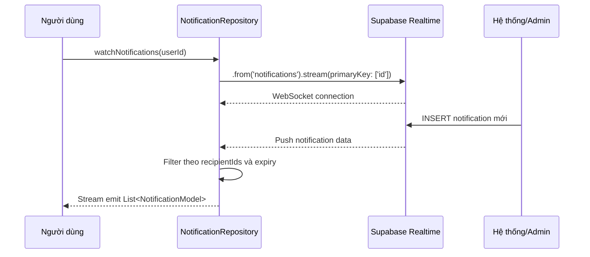
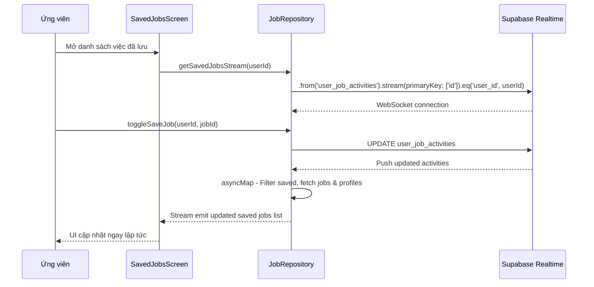
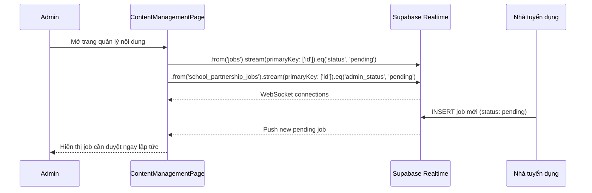
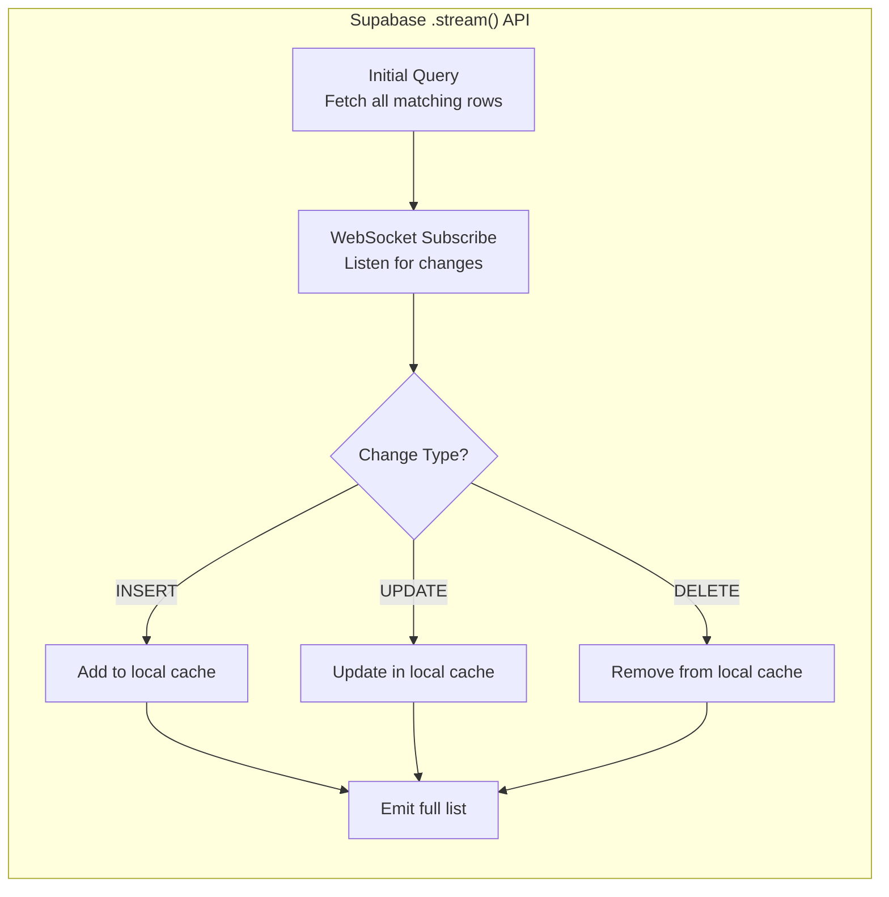
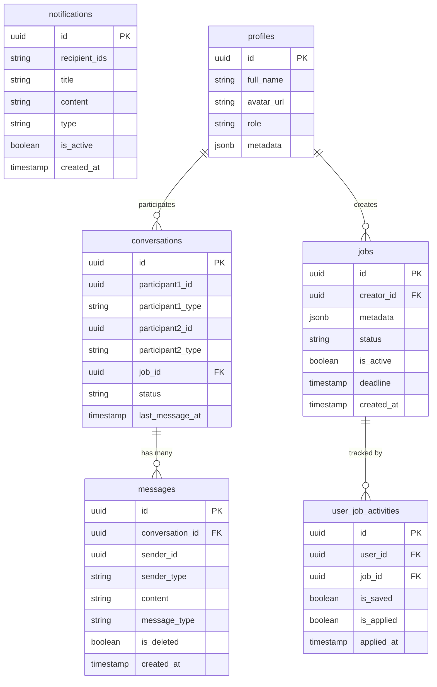

# Cơ chế đồng bộ Realtime qua Supabase Realtime

## Mục đích

Cơ chế đồng bộ realtime trong NP FutureGate sử dụng **Supabase Realtime** để cập nhật dữ liệu tức thì trên giao diện người dùng mà không cần refresh thủ công. Khi có thay đổi dữ liệu trên server (INSERT, UPDATE, DELETE), client sẽ tự động nhận được thông báo và cập nhật UI ngay lập tức.

**Các tình huống sử dụng realtime:**
- Chat tin nhắn giữa các vai trò (Candidate, Employer, School)
- Cập nhật danh sách việc làm mới
- Thông báo realtime cho người dùng
- Cập nhật trạng thái ứng tuyển và lưu việc
- Danh sách công ty realtime
- Quản lý nội dung admin (duyệt bài đăng)

## Các thành phần tham gia

| Thành phần | Vai trò | File |
|------------|---------|------|
| `ChatService` | Stream tin nhắn và conversations realtime | `lib/core/services/chat_service.dart` |
| `JobRepository` | Stream danh sách việc làm, saved jobs, applied jobs | `lib/core/repositories/job_repository.dart` |
| `NotificationRepository` | Stream thông báo realtime | `lib/core/repositories/notification_repository.dart` |
| `CompanyRepository` | Stream danh sách công ty | `lib/core/repositories/company_repository.dart` |
| `SupabaseService` | Khởi tạo và quản lý Supabase client | `lib/core/services/supabase_service.dart` |
| `StreamBuilder` (Flutter) | Widget lắng nghe stream và rebuild UI | Các screen files |

## Sơ đồ kiến trúc tổng quan

```mermaid
graph TB
    subgraph "Client - Flutter App"
        UI[UI Layer<br/>StreamBuilder Widgets]
        Controllers[Controllers]
        Services[Services<br/>ChatService]
        Repos[Repositories<br/>JobRepo, NotificationRepo, CompanyRepo]
    end

    subgraph "Supabase Realtime"
        RT[Realtime Engine<br/>WebSocket Connection]
        PG[PostgreSQL<br/>Database Changes]
        CDC[Change Data Capture<br/>WAL Listener]
    end

    UI -->|subscribe| Controllers
    Controllers -->|expose stream| Services
    Controllers -->|expose stream| Repos
    Services -->|.stream(primaryKey)| RT
    Repos -->|.stream(primaryKey)| RT
    PG -->|INSERT/UPDATE/DELETE| CDC
    CDC -->|broadcast| RT
    RT -->|push changes| Services
    RT -->|push changes| Repos
```

## Luồng xử lý Step-by-Step

### Luồng 1: Chat Realtime (Tin nhắn)



**Chi tiết kỹ thuật:**

```dart
// ChatService - streamMessages()
Stream<List<MessageModel>> streamMessages(String conversationId) {
  final userId = _supabase.auth.currentUser?.id;
  return _supabase
      .from('messages')
      .stream(primaryKey: ['id'])
      .order('created_at', ascending: true)
      .map((data) => data
          .where((json) => 
              json['conversation_id'] == conversationId &&
              json['is_deleted'] == false)
          .map((json) {
            final message = MessageModel.fromJson(json);
            message.isSentByMe = message.senderId == userId;
            return message;
          })
          .toList());
}
```

### Luồng 2: Conversations Realtime



**Chi tiết kỹ thuật:**

```dart
// ChatService - streamConversations()
Stream<List<ConversationModel>> streamConversations() {
  final userId = _supabase.auth.currentUser?.id;
  return _supabase
      .from('conversations')
      .stream(primaryKey: ['id'])
      .order('last_message_at', ascending: false)
      .asyncMap((data) async {
        final conversations = data
            .where((json) =>
                json['participant1_id'] == userId ||
                json['participant2_id'] == userId)
            .map((json) => ConversationModel.fromJson(json))
            .toList();
        // Load thêm user info, job info, unread count
        for (var conversation in conversations) { ... }
        return conversations;
      });
}
```

### Luồng 3: Việc làm Realtime



**Chi tiết kỹ thuật:**

```dart
// JobRepository - activeJobsStream
Stream<List<JobModel>> get activeJobsStream {
  return _supabase
      .from('jobs')
      .stream(primaryKey: ['id'])
      .eq('is_active', true)
      .order('created_at', ascending: false)
      .asyncMap((jobsList) async {
        // Filter: chỉ lấy jobs approved và chưa hết hạn
        final validJobs = jobsList.where((job) {
          final status = job['status'] as String?;
          if (status != 'approved') return false;
          final deadlineStr = job['deadline'] as String?;
          if (deadlineStr == null) return true;
          return DateTime.parse(deadlineStr).isAfter(DateTime.now());
        }).toList();
        // Hydrate data và load profiles
        ...
        return hydratedJobs.map((e) => JobModel.fromJson(e)).toList();
      });
}
```

### Luồng 4: Thông báo Realtime



**Chi tiết kỹ thuật:**

```dart
// NotificationRepository - watchNotifications()
Stream<List<NotificationModel>> watchNotifications({required String userId}) {
  return _supabase
      .from('notifications')
      .stream(primaryKey: ['id'])
      .order('created_at', ascending: false)
      .map((data) => (data as List)
          .map((json) => NotificationModel.fromJson(json))
          .where((n) => !n.isExpired)
          .where((n) =>
              n.recipientIds == 'all' ||
              n.recipientIds == userId ||
              n.recipientIds.contains(userId))
          .toList());
}
```

### Luồng 5: Saved Jobs & Applied Jobs Realtime



### Luồng 6: Admin Content Management Realtime



## Cơ chế hoạt động của Supabase Realtime Stream

### Nguyên lý hoạt động



**Đặc điểm chính:**
1. **Initial fetch**: Khi subscribe, Supabase tự động fetch toàn bộ dữ liệu matching ban đầu
2. **Incremental updates**: Sau đó chỉ nhận các thay đổi (delta) qua WebSocket
3. **Local cache**: Supabase SDK duy trì cache local và emit toàn bộ list sau mỗi thay đổi
4. **Auto-reconnect**: Tự động kết nối lại khi mất connection

### Pattern sử dụng trong dự án

| Pattern | Mô tả | Ví dụ |
|---------|--------|-------|
| `.stream().map()` | Transform đơn giản | `companiesStream`, `watchNotifications` |
| `.stream().asyncMap()` | Transform cần async (fetch thêm data) | `activeJobsStream`, `streamConversations` |
| `.stream().eq()` | Filter server-side | `getEmployerJobsStream(creatorId)` |
| `StreamBuilder` + `.stream()` | Trực tiếp trong UI | Admin content management |

## Xử lý lỗi

### Các loại lỗi và cách xử lý

| Lỗi | Nguyên nhân | Xử lý |
|-----|-------------|--------|
| WebSocket disconnect | Mất kết nối mạng | Supabase SDK tự động reconnect |
| Permission denied | RLS policy chặn | Trả về empty list, log error |
| Data parsing error | Schema thay đổi | try-catch, trả về empty list |
| Timeout | Server không phản hồi | StreamBuilder hiển thị loading state |

### Xử lý lỗi trong code

```dart
// Pattern xử lý lỗi trong StreamBuilder (UI Layer)
StreamBuilder<List<JobModel>>(
  stream: controller.activeJobsStream,
  builder: (context, snapshot) {
    if (snapshot.hasError) {
      return _buildErrorState(snapshot.error.toString());
    }
    if (!snapshot.hasData) {
      return const Center(child: CircularProgressIndicator());
    }
    final jobs = snapshot.data!;
    if (jobs.isEmpty) return _buildEmptyState();
    return _buildJobsList(jobs);
  },
);
```

```dart
// Pattern xử lý lỗi trong asyncMap (Repository Layer)
.asyncMap((activities) async {
  try {
    final savedActivities = activities.where((a) => a['is_saved'] == true).toList();
    if (savedActivities.isEmpty) return <Map<String, dynamic>>[];
    // ... process data
    return result;
  } catch (e) {
    debugPrint('Error in getSavedJobsStream: $e');
    return <Map<String, dynamic>>[];
  }
});
```

### Conversation change listener (Chat)

```dart
// Lắng nghe thay đổi job_id trong conversation
void _listenConversationChanges() {
  Supabase.instance.client
      .from('conversations')
      .stream(primaryKey: ['id'])
      .eq('id', widget.conversation.id)
      .listen((data) {
        if (data.isNotEmpty) {
          final newJobId = data.first['job_id'] as String?;
          if (newJobId != _currentJobId) {
            _currentJobId = newJobId;
            _loadJobInfoById(newJobId); // Reload job info
          }
        }
      });
}
```

## Sơ đồ tổng hợp các bảng sử dụng Realtime



## Services và Repositories liên quan

### Services

| Service | Chức năng Realtime | Bảng DB |
|---------|-------------------|---------|
| `ChatService` | Stream messages, stream conversations | `messages`, `conversations` |
| `SupabaseService` | Khởi tạo client, quản lý connection | - |

### Repositories

| Repository | Chức năng Realtime | Bảng DB |
|------------|-------------------|---------|
| `JobRepository` | Stream active jobs, employer jobs, saved jobs, applied jobs | `jobs`, `user_job_activities` |
| `NotificationRepository` | Watch notifications realtime | `notifications` |
| `CompanyRepository` | Stream danh sách công ty | `profiles` |

### Controllers (expose streams cho UI)

| Controller | Stream exposed | Sử dụng bởi |
|------------|---------------|-------------|
| `HomeCandidateController` | `activeJobsStream` | `HomePageCandidate` |
| `SearchCandidateController` | `activeJobsStream` | `SearchPageCandidate` |

## Tổng kết

Supabase Realtime trong NP FutureGate được sử dụng rộng rãi với pattern `.stream(primaryKey: ['id'])` — một API đơn giản nhưng mạnh mẽ cho phép:

1. **Đồng bộ tức thì**: Mọi thay đổi dữ liệu được phản ánh ngay trên UI
2. **Không cần polling**: Tiết kiệm tài nguyên so với việc gọi API định kỳ
3. **Tích hợp tự nhiên với Flutter**: Sử dụng `StreamBuilder` widget để reactive UI
4. **Filter server-side**: Giảm bandwidth bằng cách filter ngay tại query (`.eq()`)
5. **Enrichment client-side**: Sử dụng `.asyncMap()` để bổ sung dữ liệu liên quan

## Liên kết liên quan

- [Tổng quan kiến trúc](../01_tong_quan_kien_truc.md)
- [Cơ chế Chat Realtime](./chat_flow.md)
- [Cơ chế Notification](./notification_flow.md)
- [Giải thích Supabase](../10_giai_thich_cong_nghe_tung_cai/supabase.md)
- [Sơ đồ Sequence Diagrams](../03_so_do_flow/mermaid_sequence_diagrams.md)
