# Sequence Diagrams - Luong Chinh Cua He Thong

## Muc dich

Tai lieu nay chua cac **sequence diagrams** duoc viet bang cu phap Mermaid, mo ta chi tiet luong tuong tac giua cac thanh phan trong he thong NP FutureGate. Cac so do bao gom 4 luong chinh:

1. **Authentication** - Xac thuc nguoi dung (Email va Google Sign-In)
2. **AI Matching** - Phan tich CV va matching voi cong viec
3. **Notification** - Gui va nhan thong bao push (FCM)
4. **Payment** - Thanh toan qua PayOS

---

## 1. Luong Xac Thuc (Authentication Flow)

### 1.1 Dang nhap bang Email/Password

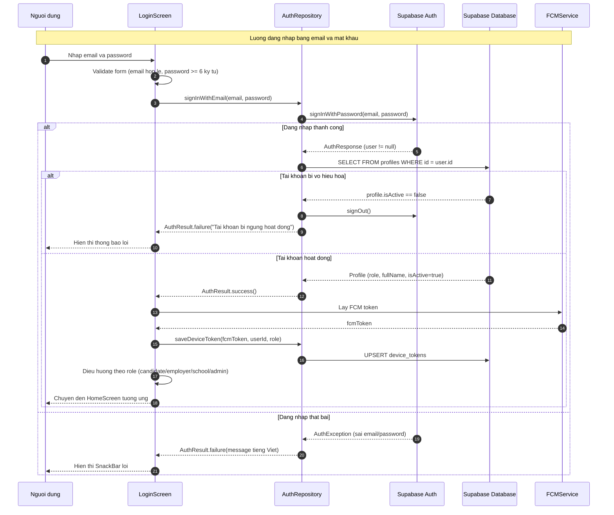

### 1.2 Dang nhap bang Google Sign-In

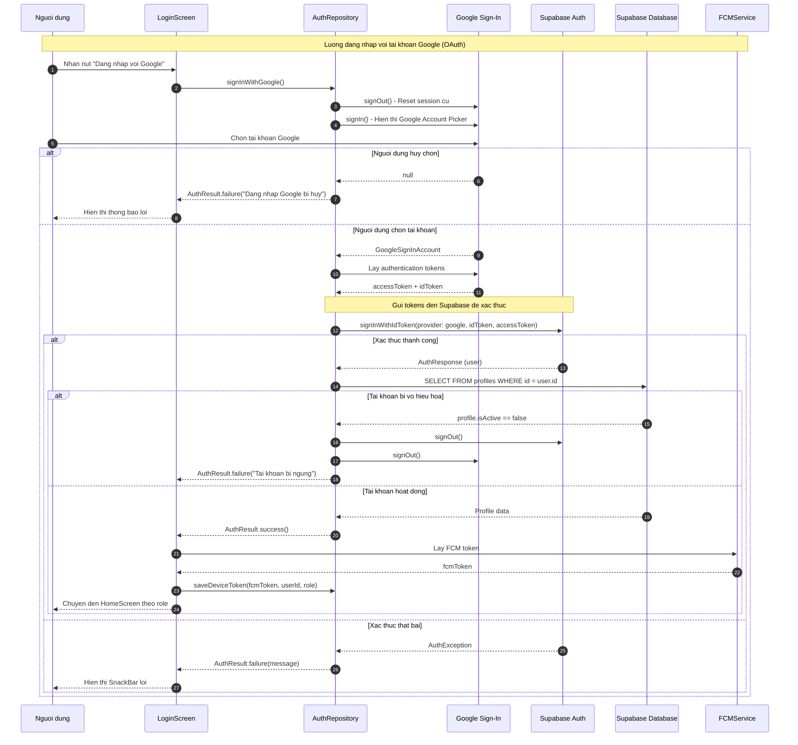

### 1.3 Dang ky tai khoan moi

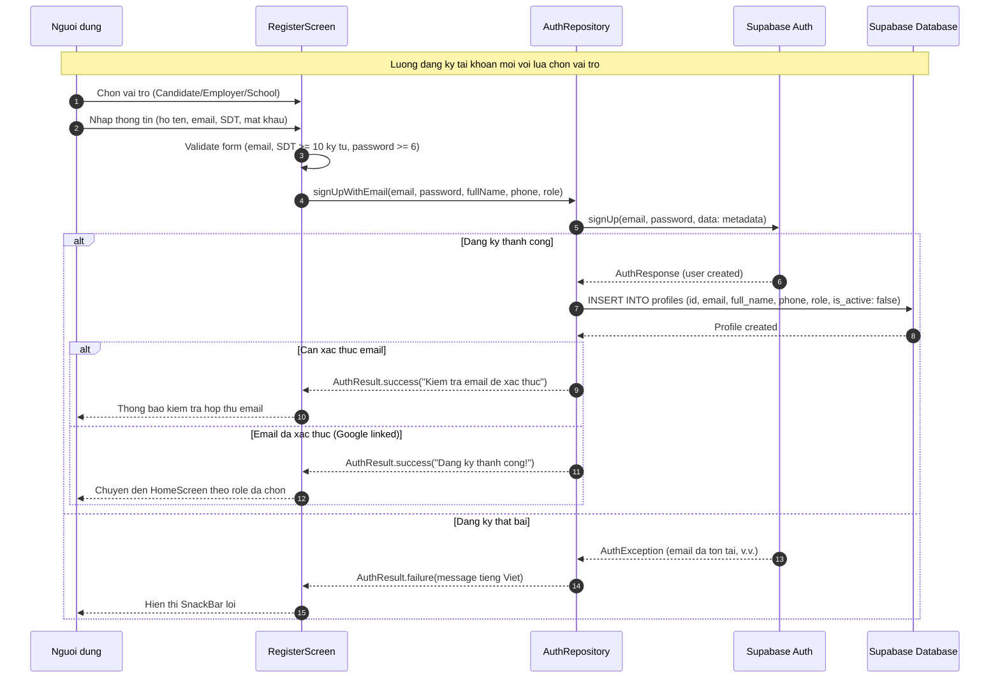

### 1.4 Dang xuat

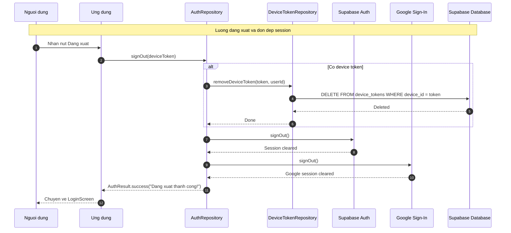

---

## 2. Luong AI Matching (Phan Tich CV)

### 2.1 Phan tich CV Upload (File PDF/Anh qua OCR)

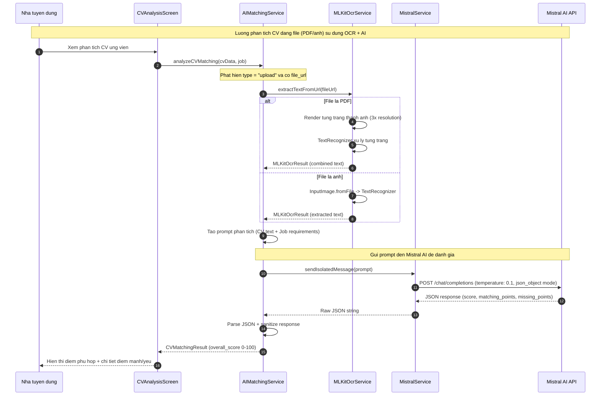

### 2.2 Phan tich CV Structured (CV tao trong app)

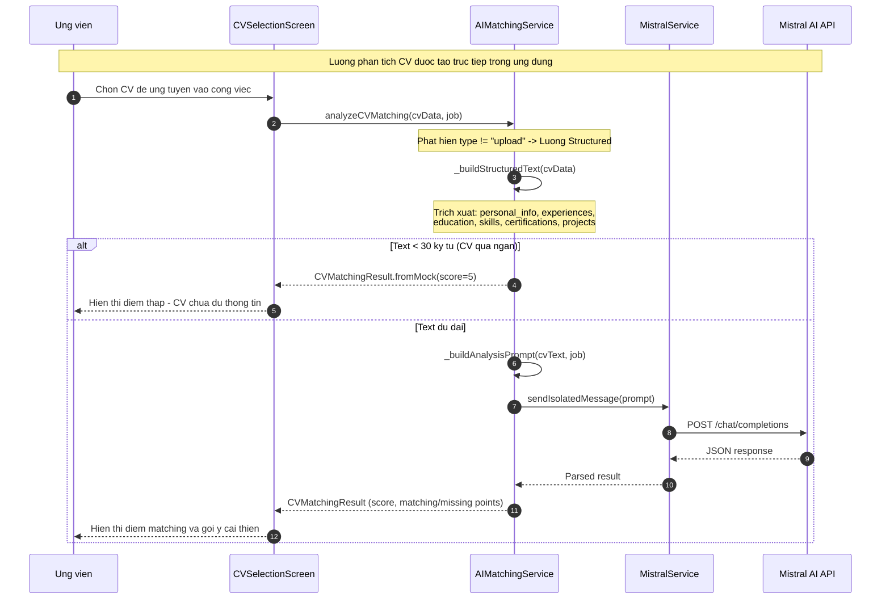

### 2.3 So sanh nhieu ung vien (CV Comparison)

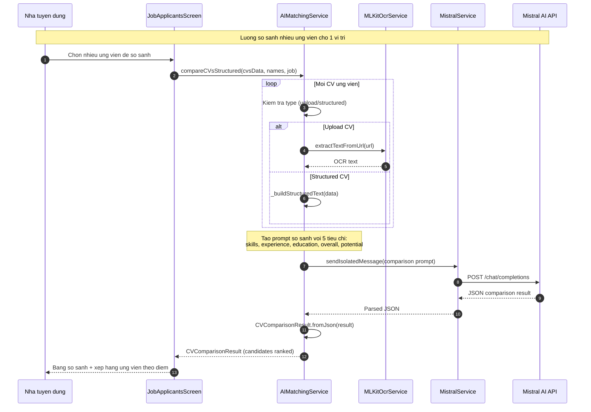

### 2.4 Chatbot AI voi Intent-Based Queries

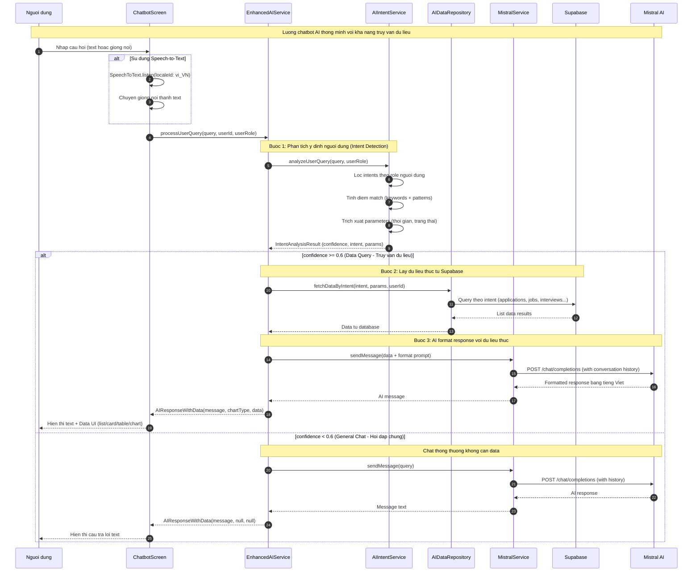

---

## 3. Luong Thong Bao (Notification Flow)

### 3.1 Gui Push Notification (Server-side)

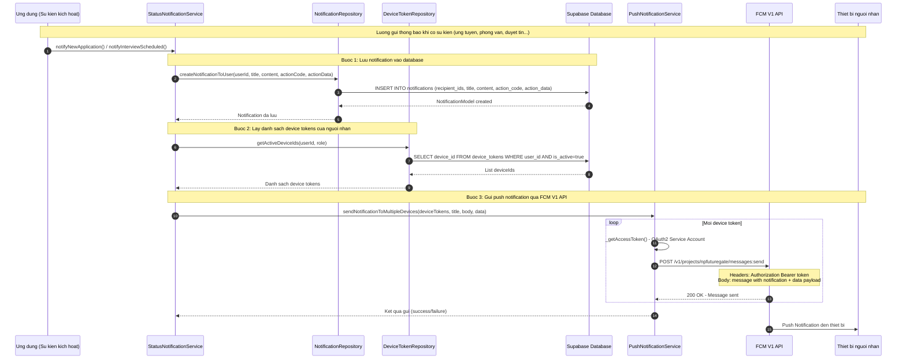

### 3.2 Nhan va xu ly Notification tren Client

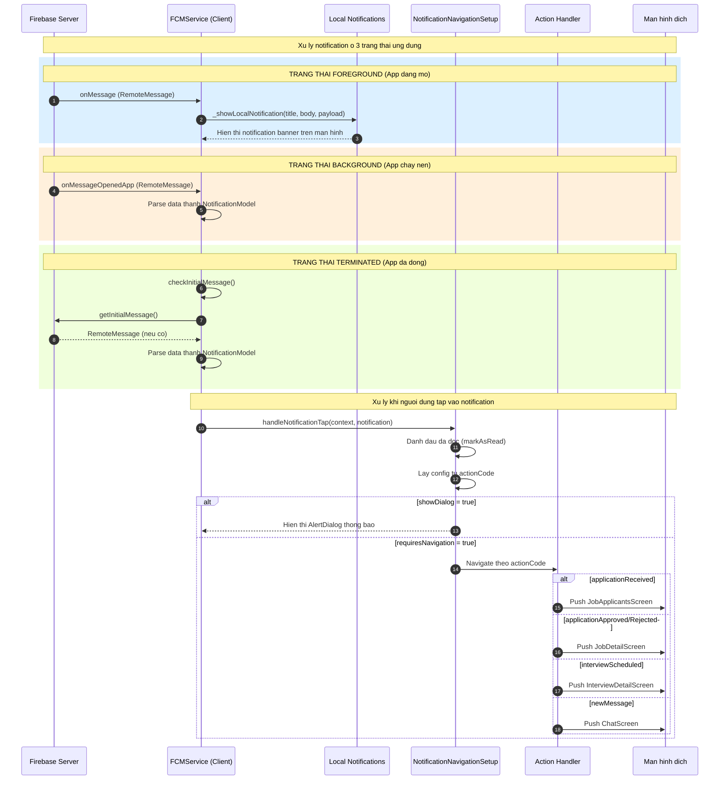

### 3.3 Khoi tao FCM Service

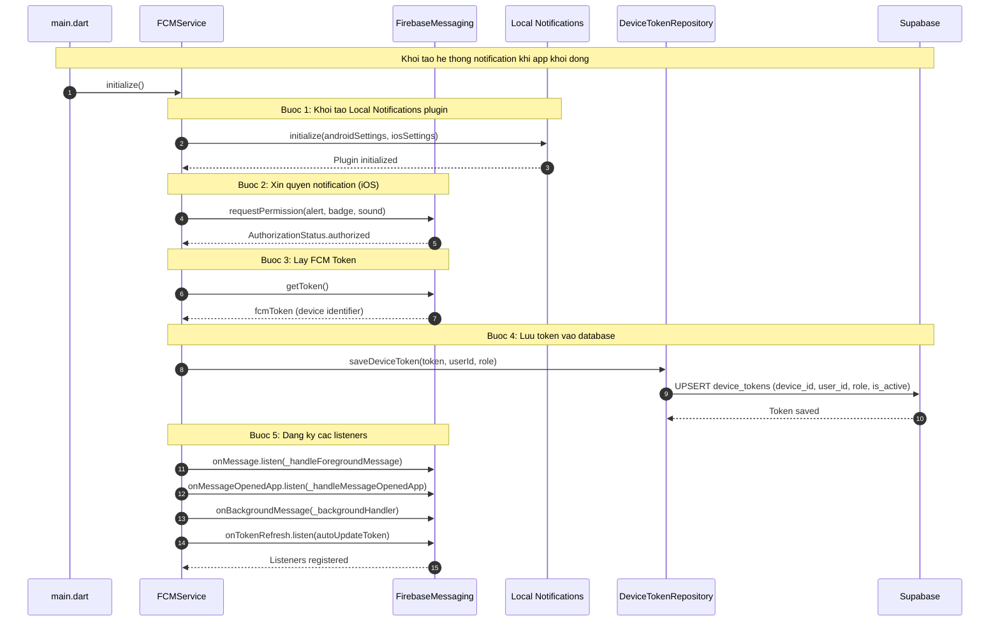

---

## 4. Luong Thanh Toan (Payment Flow - PayOS)

### 4.1 Tao yeu cau thanh toan va hien thi QR

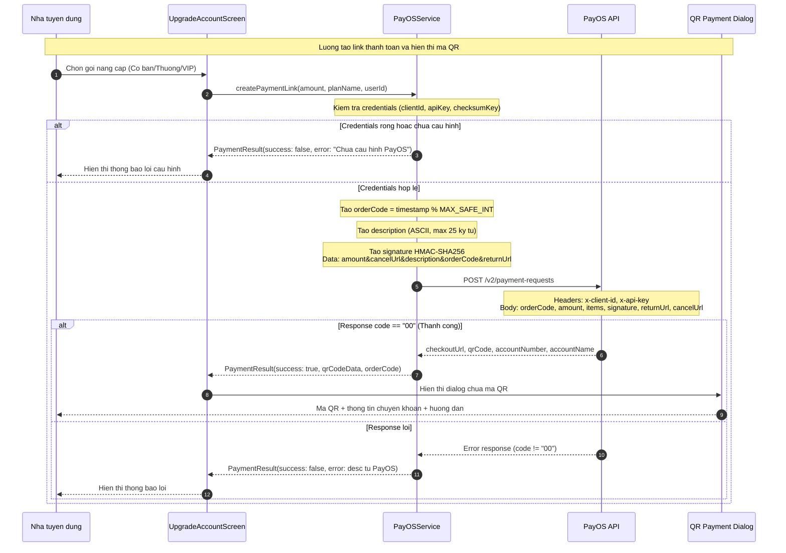

### 4.2 Xac nhan thanh toan va kich hoat goi

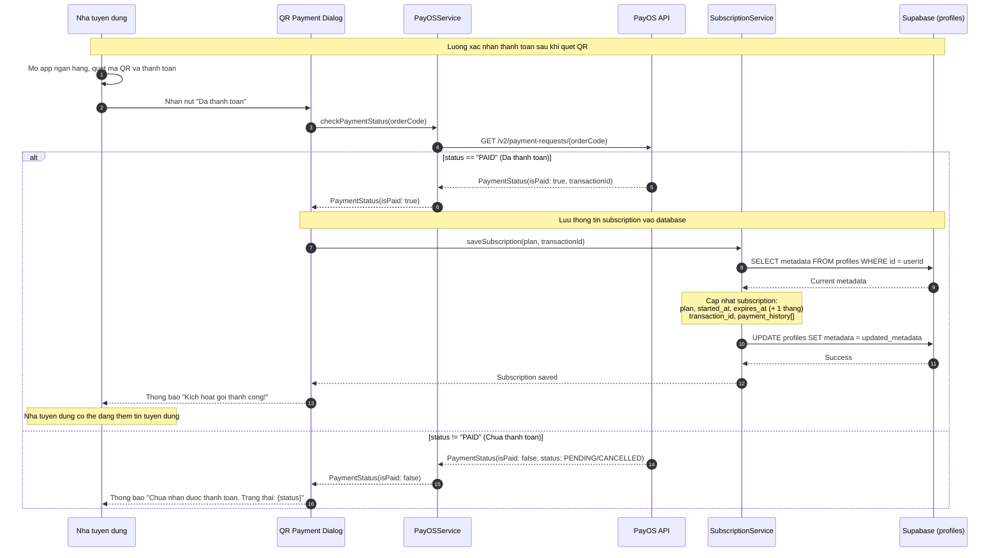

### 4.3 Kiem tra quyen dang tin (Subscription Check)

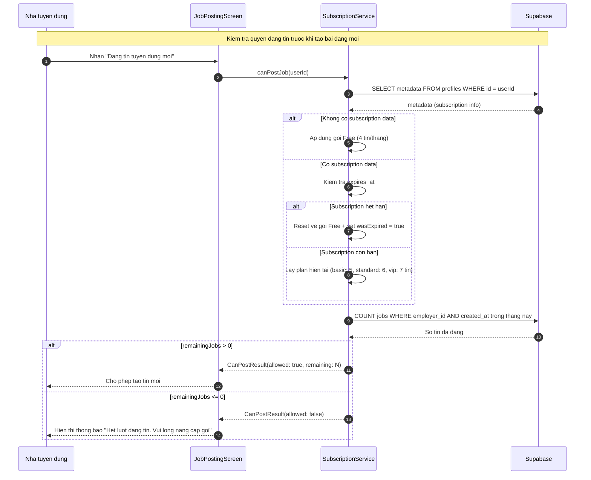

---

## Tong Ket Cac Luong Chinh

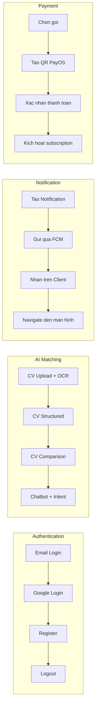

---

## Lien Ket Lien Quan

- [Tong quan kien truc](../01_tong_quan_kien_truc.md)
- [Luong Authentication chi tiet](../02_co_che_tung_chuc_nang/authentication_flow.md)
- [Luong AI Matching chi tiet](../02_co_che_tung_chuc_nang/ai_matching_flow.md)
- [Luong Notification chi tiet](../02_co_che_tung_chuc_nang/notification_flow.md)
- [Luong Payment chi tiet](../02_co_che_tung_chuc_nang/payment_flow.md)
- [State Management Flow](./state_management_flow.mermaid)
- [Navigation Flow](./navigation_flow.mermaid)
