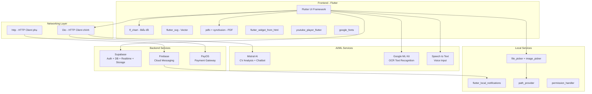
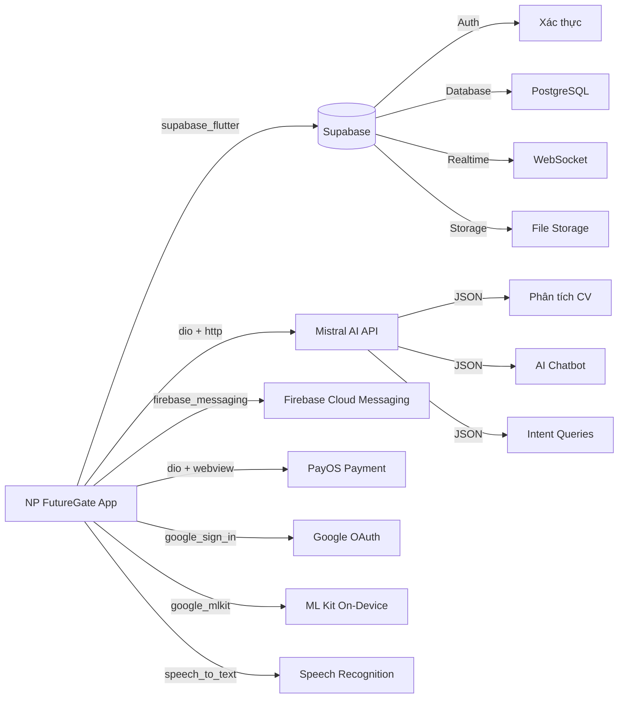

# Tổng Quan Công Nghệ Sử Dụng (Tech Stack Overview)

## Mục đích

Tài liệu này liệt kê toàn bộ công nghệ, framework và thư viện được sử dụng trong dự án NP FutureGate, kèm theo mô tả vai trò và phân loại theo nhóm chức năng. Thông tin được trích xuất trực tiếp từ file `pubspec.yaml` của dự án.

## Thông tin dự án

| Thuộc tính | Giá trị |
|------------|---------|
| Tên dự án | np_future_gate |
| Phiên bản | 1.0.0+1 |
| Dart SDK | ^3.9.2 |
| Framework | Flutter |
| Nền tảng | Android, iOS, Web, macOS, Windows |

---

## Phân loại công nghệ theo nhóm

### 1. Backend & Database

| Thư viện | Phiên bản | Vai trò trong dự án |
|----------|-----------|---------------------|
| `supabase_flutter` | ^2.9.1 | SDK chính kết nối Supabase — cung cấp Authentication, PostgreSQL Database, Realtime subscriptions, và Storage cho toàn bộ backend |
| `flutter_dotenv` | ^5.2.1 | Quản lý biến môi trường (.env) — lưu trữ an toàn các API keys, Supabase URL, và cấu hình nhạy cảm |
| `crypto` | ^3.0.3 | Thư viện mã hóa — hỗ trợ hash, HMAC cho xác thực và bảo mật dữ liệu |

### 2. AI/ML (Trí tuệ nhân tạo & Machine Learning)

| Thư viện | Phiên bản | Vai trò trong dự án |
|----------|-----------|---------------------|
| `google_mlkit_text_recognition` | ^0.15.0 | OCR (Optical Character Recognition) — nhận dạng và trích xuất văn bản từ ảnh CV, sử dụng Google ML Kit on-device |
| `speech_to_text` | ^7.3.0 | Nhận dạng giọng nói — chuyển đổi voice input thành text cho tính năng tìm kiếm bằng giọng nói |

> **Lưu ý:** Mistral AI được tích hợp qua HTTP API (sử dụng `dio`/`http`) để phân tích CV, chatbot AI, và hệ thống intent-based queries. Không có package riêng trên pub.dev.

### 3. UI (Giao diện người dùng)

| Thư viện | Phiên bản | Vai trò trong dự án |
|----------|-----------|---------------------|
| `flutter` | SDK | Framework chính — xây dựng giao diện cross-platform với Material Design |
| `cupertino_icons` | ^1.0.8 | Bộ icon iOS style — cung cấp icon Cupertino cho giao diện iOS-like |
| `flutter_svg` | ^2.2.3 | Hiển thị ảnh SVG — render logo, icon vector chất lượng cao |
| `qr_flutter` | ^4.1.0 | Tạo mã QR — sinh QR code cho chia sẻ thông tin, profile |
| `fl_chart` | ^0.69.2 | Biểu đồ thống kê — hiển thị chart (bar, line, pie) cho dashboard thống kê nhà tuyển dụng/admin |
| `google_fonts` | ^6.2.1 | Font chữ Google — sử dụng font đẹp, đa dạng từ Google Fonts |
| `flutter_widget_from_html` | ^0.15.2 | Render HTML — hiển thị nội dung HTML (mô tả công việc, rich text) thành Flutter widgets |
| `youtube_player_flutter` | ^9.0.3 | Phát video YouTube — nhúng và phát video hướng dẫn, giới thiệu |
| `syncfusion_flutter_pdfviewer` | ^32.1.1 | Xem PDF — hiển thị file CV dạng PDF trực tiếp trong app |
| `pdfx` | ^2.9.0 | Xử lý PDF — đọc và thao tác với file PDF (render pages, extract info) |
| `webview_flutter` | any | WebView — hiển thị trang web trong app (thanh toán PayOS, nội dung bên ngoài) |

### 4. Networking (Kết nối mạng)

| Thư viện | Phiên bản | Vai trò trong dự án |
|----------|-----------|---------------------|
| `dio` | ^5.8.0 | HTTP client chính — gọi API với interceptors, retry logic, error handling nâng cao (gọi Mistral AI API, PayOS API) |
| `http` | ^1.6.0 | HTTP client phụ — gọi API đơn giản, lightweight requests |
| `url_launcher` | ^6.3.2 | Mở URL — mở link bên ngoài (website công ty, social media, email) trong trình duyệt |

### 5. Storage (Lưu trữ)

| Thư viện | Phiên bản | Vai trò trong dự án |
|----------|-----------|---------------------|
| `path_provider` | ^2.1.5 | Truy cập đường dẫn hệ thống — lấy thư mục lưu trữ tạm, documents cho cache file |
| `file_picker` | ^8.1.6 | Chọn file — cho phép người dùng chọn file CV (PDF, DOC) từ thiết bị để upload |
| `image_picker` | ^1.2.1 | Chọn ảnh — chụp hoặc chọn ảnh từ gallery cho avatar, ảnh CV |
| `share_plus` | ^12.0.1 | Chia sẻ nội dung — chia sẻ thông tin việc làm, CV qua các ứng dụng khác |

### 6. Authentication (Xác thực)

| Thư viện | Phiên bản | Vai trò trong dự án |
|----------|-----------|---------------------|
| `supabase_flutter` | ^2.9.1 | Supabase Auth — xác thực email/password, quản lý session, JWT tokens |
| `google_sign_in` | ^6.2.2 | Đăng nhập Google — OAuth2 sign-in cho đăng nhập nhanh bằng tài khoản Google |
| `googleapis_auth` | ^1.6.0 | OAuth2 Google APIs — xác thực service account cho Firebase Cloud Messaging V1 API |

### 7. Payment (Thanh toán)

| Thư viện | Phiên bản | Vai trò trong dự án |
|----------|-----------|---------------------|
| `webview_flutter` | any | WebView thanh toán — hiển thị trang thanh toán PayOS trong app |
| `crypto` | ^3.0.3 | Mã hóa chữ ký — tạo HMAC signature cho xác thực giao dịch PayOS |

> **Lưu ý:** PayOS được tích hợp qua REST API (sử dụng `dio`) kết hợp WebView để hiển thị giao diện thanh toán. Không có SDK Flutter riêng.

### 8. Notifications (Thông báo)

| Thư viện | Phiên bản | Vai trò trong dự án |
|----------|-----------|---------------------|
| `firebase_core` | ^3.10.0 | Firebase Core — khởi tạo Firebase SDK, bắt buộc cho tất cả dịch vụ Firebase |
| `firebase_messaging` | ^15.2.0 | Firebase Cloud Messaging — nhận push notifications từ server, quản lý FCM token |
| `flutter_local_notifications` | ^18.0.1 | Thông báo cục bộ — hiển thị notification khi app đang foreground, scheduled reminders (nhắc phỏng vấn) |
| `timezone` | ^0.9.0 | Múi giờ — xử lý timezone cho scheduled notifications chính xác theo vùng |

### 9. Utilities (Tiện ích)

| Thư viện | Phiên bản | Vai trò trong dự án |
|----------|-----------|---------------------|
| `intl` | ^0.20.2 | Quốc tế hóa — format ngày tháng, số, tiền tệ theo locale Việt Nam |
| `permission_handler` | ^12.0.1 | Quản lý quyền — yêu cầu và kiểm tra quyền camera, microphone, storage, notifications |
| `device_info_plus` | ^12.3.0 | Thông tin thiết bị — lấy device ID để đăng ký FCM token theo thiết bị |
| `package_info_plus` | ^9.0.0 | Thông tin ứng dụng — lấy version, build number hiển thị trong app |

### 10. Dev Dependencies (Công cụ phát triển)

| Thư viện | Phiên bản | Vai trò trong dự án |
|----------|-----------|---------------------|
| `flutter_test` | SDK | Testing framework — viết unit test và widget test |
| `flutter_lints` | ^5.0.0 | Lint rules — bộ quy tắc coding style, phát hiện lỗi tiềm ẩn |
| `flutter_launcher_icons` | ^0.14.4 | Tạo app icon — tự động generate icon cho tất cả nền tảng từ một ảnh nguồn |

---

## Sơ đồ tổng quan Tech Stack

---

## Thống kê tổng hợp

| Nhóm | Số lượng thư viện | Ghi chú |
|------|-------------------|---------|
| Backend & Database | 3 | Supabase là core backend |
| AI/ML | 2 (+1 API) | Mistral AI qua HTTP API |
| UI | 11 | Đa dạng widget hiển thị |
| Networking | 3 | Dio là client chính |
| Storage | 4 | File handling đa dạng |
| Authentication | 3 | Multi-provider auth |
| Payment | 2 | PayOS qua WebView + API |
| Notifications | 4 | Push + Local notifications |
| Utilities | 4 | Hỗ trợ đa nền tảng |
| Dev Dependencies | 3 | Testing + Linting |
| **Tổng cộng** | **~35 packages** | |

---

## Kiến trúc tích hợp dịch vụ bên ngoài

---

## Liên kết liên quan

- [Lý do chọn công nghệ và so sánh](./tech_comparison_reason.md)
- [Tổng quan kiến trúc hệ thống](../01_tong_quan_kien_truc.md)
- [Giải thích chi tiết từng công nghệ](../10_giai_thich_cong_nghe_tung_cai/)
- [Phân tích network interceptor](../11_phan_tich_cac_file_dung_chung/network_interceptor_analysis.md)
