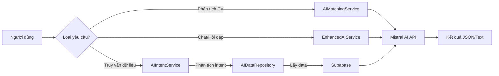
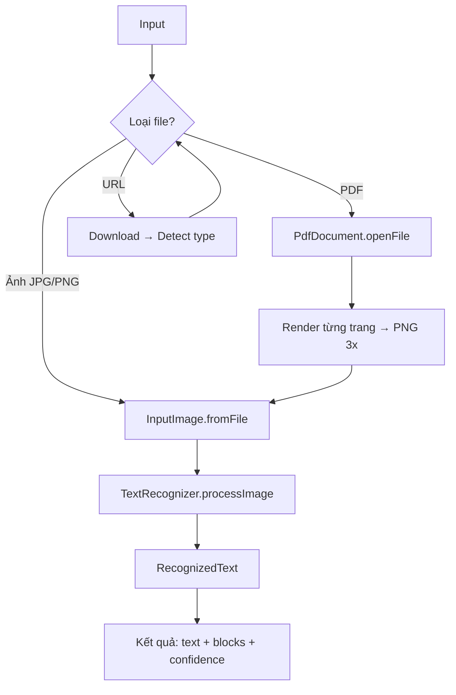
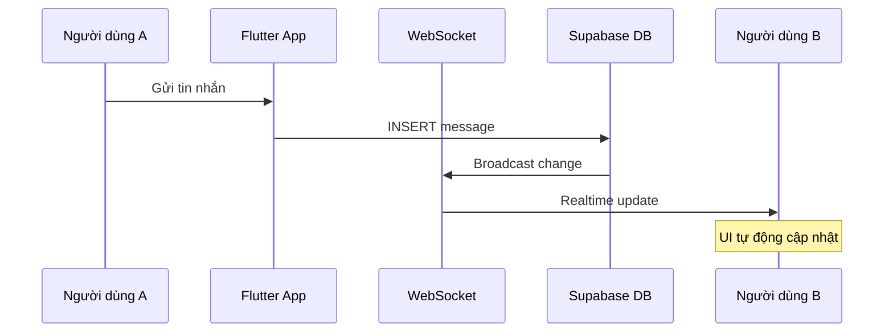
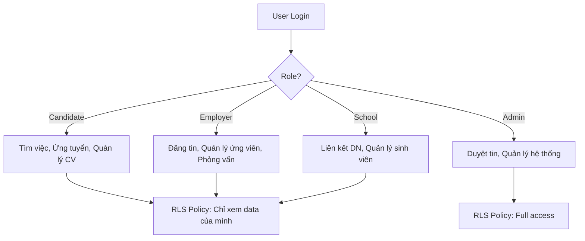
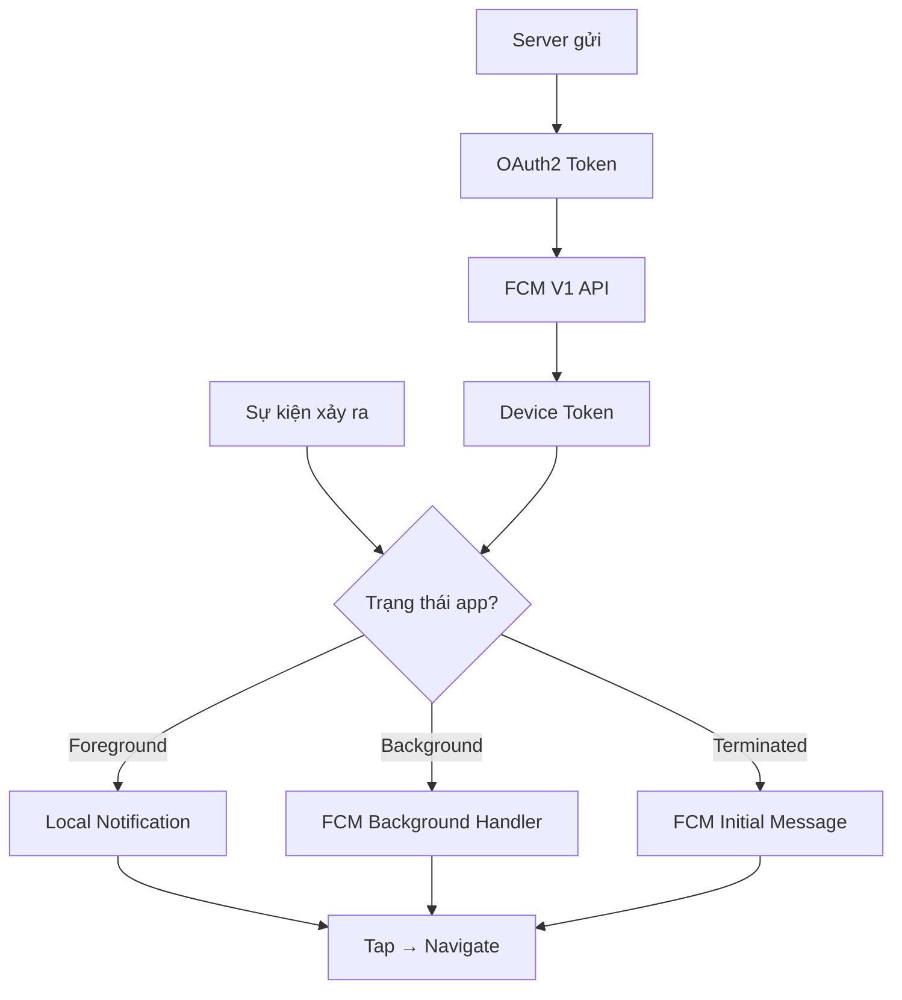
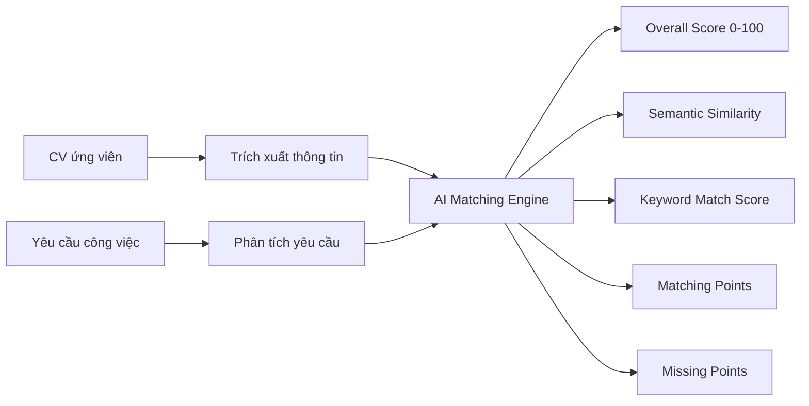
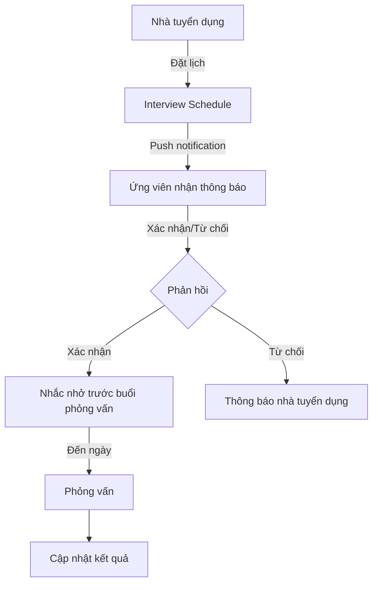
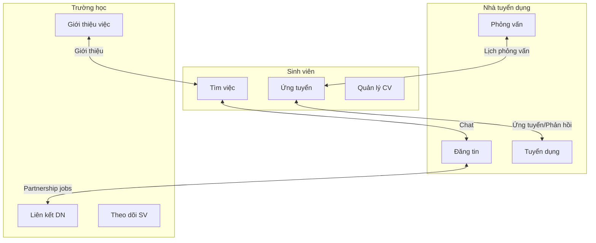

# Điểm Sáng Kỹ Thuật và Business

## Mục đích

Tài liệu này tổng hợp các điểm sáng nổi bật của NP FutureGate cả về mặt kỹ thuật lẫn giá trị business. Đây là những yếu tố tạo nên sự khác biệt và giá trị thực tiễn của hệ thống, phục vụ cho việc trình bày trước hội đồng bảo vệ đồ án.

---

## I. Điểm Sáng Kỹ Thuật

### 1. Tích hợp AI — Mistral AI

| Tiêu chí | Chi tiết |
|-----------|----------|
| **Công nghệ** | Mistral AI (Large Language Model) |
| **Service** | `MistralService`, `AIMatchingService`, `EnhancedAIService`, `AIIntentService` |
| **Chức năng** | Phân tích CV, chatbot thông minh, intent-based queries |

**Cách hoạt động:**

**Chi tiết kỹ thuật:**

- **CV Matching**: Hệ thống nhận CV (upload hoặc structured), trích xuất nội dung, gửi đến Mistral AI cùng với yêu cầu công việc, nhận về điểm phù hợp (0-100), điểm tương đồng ngữ nghĩa, điểm keyword match, danh sách điểm phù hợp/thiếu
- **Chatbot thông minh**: Sử dụng conversation history để duy trì ngữ cảnh, hỗ trợ tiếng Việt hoàn toàn
- **Intent-based queries**: Phân tích câu hỏi tự nhiên của người dùng → xác định intent → truy vấn dữ liệu thực từ Supabase → format kết quả bằng AI
- **So sánh ứng viên**: Đánh giá và xếp hạng nhiều ứng viên theo 5 tiêu chí (skills, experience, education, overall, potential)

**Giá trị thực tiễn cho người dùng cuối:**
- Ứng viên biết ngay mức độ phù hợp với công việc trước khi ứng tuyển
- Nhà tuyển dụng tiết kiệm thời gian sàng lọc CV thủ công
- Giao tiếp bằng ngôn ngữ tự nhiên thay vì thao tác phức tạp trên giao diện

---

### 2. OCR Scanning — Google ML Kit (On-Device)

| Tiêu chí | Chi tiết |
|-----------|----------|
| **Công nghệ** | Google ML Kit Text Recognition |
| **Service** | `MLKitOcrService` |
| **Đặc điểm** | Xử lý hoàn toàn trên thiết bị (on-device), không cần internet |

**Cách hoạt động:**

**Chi tiết kỹ thuật:**

- **Multi-format support**: Hỗ trợ ảnh (JPG, PNG), PDF (render từng trang thành ảnh rồi OCR), và URL (tự động detect loại file)
- **High-resolution rendering**: PDF được render ở độ phân giải 3x để đảm bảo chất lượng OCR cao
- **On-device processing**: Không gửi dữ liệu CV nhạy cảm lên server, bảo mật thông tin cá nhân
- **Multi-page support**: Xử lý CV nhiều trang, kết hợp text từ tất cả các trang
- **Camera integration**: Chụp ảnh CV trực tiếp từ camera hoặc chọn từ thư viện

**Giá trị thực tiễn cho người dùng cuối:**
- Ứng viên chỉ cần chụp ảnh CV giấy → hệ thống tự trích xuất thông tin
- Bảo mật tuyệt đối vì dữ liệu không rời khỏi thiết bị
- Hoạt động offline, không phụ thuộc kết nối mạng cho bước OCR

---

### 3. Realtime Sync — Supabase Realtime

| Tiêu chí | Chi tiết |
|-----------|----------|
| **Công nghệ** | Supabase Realtime (WebSocket-based) |
| **Service** | `ChatService`, `SupabaseService` |
| **Chức năng** | Chat realtime, cập nhật trạng thái job, thông báo tức thì |

**Cách hoạt động:**

**Chi tiết kỹ thuật:**

- **Stream-based architecture**: Sử dụng `stream(primaryKey: ['id'])` để lắng nghe thay đổi realtime
- **Chat realtime**: Tin nhắn hiển thị ngay lập tức cho cả hai bên mà không cần refresh
- **Conversation streaming**: Danh sách hội thoại tự động cập nhật khi có tin nhắn mới
- **Unread count realtime**: Số tin nhắn chưa đọc cập nhật tức thì
- **Job updates**: Trạng thái công việc (duyệt, từ chối, hết hạn) được thông báo ngay

**Giá trị thực tiễn cho người dùng cuối:**
- Trải nghiệm chat mượt mà như các ứng dụng nhắn tin chuyên dụng
- Không bỏ lỡ thông tin quan trọng nhờ cập nhật tức thì
- Tương tác nhanh chóng giữa ứng viên và nhà tuyển dụng

---

### 4. Multi-Role System — 4 vai trò với RLS

| Tiêu chí | Chi tiết |
|-----------|----------|
| **Công nghệ** | Supabase Row Level Security (RLS) |
| **Vai trò** | Candidate (Ứng viên), Employer (Nhà tuyển dụng), School (Trường học), Admin |
| **Bảo mật** | Phân quyền ở cấp database, không thể bypass từ client |

**Cách hoạt động:**

**Chi tiết kỹ thuật:**

- **Database-level security**: RLS policies đảm bảo mỗi user chỉ truy cập được dữ liệu thuộc quyền
- **Role-based UI**: Mỗi vai trò có giao diện và navigation riêng biệt
- **Cross-role interaction**: Hệ thống cho phép tương tác giữa các vai trò (chat, ứng tuyển, phỏng vấn)
- **Intent filtering by role**: AI chatbot hiển thị gợi ý khác nhau tùy vai trò người dùng

**Giá trị thực tiễn cho người dùng cuối:**
- Mỗi người dùng chỉ thấy thông tin liên quan đến mình
- Bảo mật dữ liệu cá nhân ở mức cao nhất (database-level)
- Giao diện tối ưu cho từng đối tượng sử dụng

---

### 5. Push Notifications — FCM V1 + Local Notifications

| Tiêu chí | Chi tiết |
|-----------|----------|
| **Công nghệ** | Firebase Cloud Messaging V1 API + Flutter Local Notifications |
| **Service** | `FCMService`, `PushNotificationService` |
| **Xác thực** | OAuth2 với Service Account (không dùng legacy server key) |

**Cách hoạt động:**

**Chi tiết kỹ thuật:**

- **FCM V1 API**: Sử dụng API mới nhất với OAuth2 authentication thay vì legacy server key
- **3 trạng thái xử lý**: Foreground (local notification), Background (background handler), Terminated (initial message check)
- **Deep linking**: Tap notification → navigate đến màn hình tương ứng (chi tiết ứng tuyển, phỏng vấn, chat)
- **Topic-based**: Hỗ trợ gửi notification theo topic cho nhóm người dùng
- **Token management**: Tự động lưu và refresh device token khi thay đổi
- **Multi-platform**: Hỗ trợ cả Android và iOS với cấu hình riêng

**Giá trị thực tiễn cho người dùng cuối:**
- Không bỏ lỡ cơ hội việc làm hay lịch phỏng vấn
- Nhận thông báo ngay khi có ứng viên mới ứng tuyển
- Nhắc nhở phỏng vấn sắp diễn ra

---

### 6. Speech-to-Text — Nhận dạng giọng nói

| Tiêu chí | Chi tiết |
|-----------|----------|
| **Công nghệ** | Speech-to-Text plugin |
| **Chức năng** | Nhập liệu bằng giọng nói cho chatbot AI |

**Giá trị thực tiễn cho người dùng cuối:**
- Tương tác với AI assistant bằng giọng nói, tiện lợi khi di chuyển
- Hỗ trợ người dùng không quen gõ phím trên điện thoại

---

## II. Điểm Sáng Business

### 1. Job Matching Algorithm — Thuật toán ghép nối việc làm

| Tiêu chí | Chi tiết |
|-----------|----------|
| **Phương pháp** | AI-powered matching (Mistral AI) |
| **Đầu vào** | CV ứng viên + Yêu cầu công việc |
| **Đầu ra** | Điểm phù hợp, phân tích chi tiết, gợi ý cải thiện |

**Quy trình matching:**

**Các chỉ số đánh giá:**

| Chỉ số | Mô tả | Thang điểm |
|--------|--------|------------|
| Overall Score | Điểm phù hợp tổng thể | 0 - 100 |
| Semantic Similarity | Độ tương đồng ngữ nghĩa | 0.0 - 1.0 |
| Keyword Match Score | Điểm khớp từ khóa | 0 - 100 |
| Matching Points | Các điểm ứng viên đáp ứng | Danh sách |
| Missing Points | Các điểm ứng viên còn thiếu | Danh sách |

**Giá trị thực tiễn cho người dùng cuối:**
- Ứng viên biết chính xác mình thiếu gì để cải thiện
- Nhà tuyển dụng có cơ sở khách quan để đánh giá ứng viên
- Giảm thời gian tuyển dụng từ hàng tuần xuống còn vài phút

---

### 2. CV Analysis Tự Động — Phân tích CV thông minh

| Tiêu chí | Chi tiết |
|-----------|----------|
| **Hỗ trợ** | CV upload (PDF/ảnh), CV tạo trên app, CV scan từ camera |
| **Pipeline** | OCR → Text extraction → AI Analysis → Structured Result |

**3 luồng phân tích CV:**

| Luồng | Input | Xử lý | Output |
|--------|-------|--------|--------|
| Upload CV | File PDF/ảnh | OCR → AI | Điểm matching + phân tích |
| Structured CV | Form trên app | Format → AI | Điểm matching + phân tích |
| Scan CV | Chụp camera | ML Kit OCR → AI | Điểm matching + phân tích |

**Giá trị thực tiễn cho người dùng cuối:**
- Linh hoạt: dùng CV có sẵn, tạo mới, hoặc chụp ảnh đều được
- Phân tích tức thì, không cần chờ đợi
- Gợi ý cải thiện CV dựa trên yêu cầu công việc cụ thể

---

### 3. Hệ Thống Phỏng Vấn — Interview Management

| Tiêu chí | Chi tiết |
|-----------|----------|
| **Chức năng** | Đặt lịch, nhắc nhở, quản lý trạng thái |
| **Tích hợp** | Push notification + Local notification + AI chatbot |

**Quy trình phỏng vấn:**

**Giá trị thực tiễn cho người dùng cuối:**
- Không quên lịch phỏng vấn nhờ hệ thống nhắc nhở tự động
- Quản lý nhiều cuộc phỏng vấn cùng lúc một cách có tổ chức
- AI chatbot có thể trả lời "Lịch phỏng vấn sắp tới của tôi?" bằng ngôn ngữ tự nhiên

---

### 4. Kết Nối Đa Bên — Multi-Stakeholder Platform

| Tiêu chí | Chi tiết |
|-----------|----------|
| **Các bên** | Sinh viên/Ứng viên, Nhà tuyển dụng, Trường học, Admin |
| **Mô hình** | Platform kết nối 3 bên chính + quản trị |

**Mô hình kết nối:**

**Điểm khác biệt so với nền tảng khác:**

| Tính năng | NP FutureGate | TopCV/VietnamWorks |
|-----------|---------------|-------------------|
| Vai trò trường học | ✅ Có (liên kết DN, giới thiệu việc) | ❌ Không |
| Partnership system | ✅ DN liên kết trường → đăng tin riêng | ❌ Không |
| AI matching cho sinh viên | ✅ Phân tích CV + gợi ý | ⚠️ Hạn chế |
| Chat trực tiếp | ✅ Realtime giữa mọi vai trò | ⚠️ Chỉ qua email |

**Giá trị thực tiễn cho người dùng cuối:**
- Sinh viên được trường giới thiệu việc làm phù hợp
- Nhà tuyển dụng tiếp cận nguồn ứng viên chất lượng từ trường đối tác
- Trường học theo dõi được tình hình việc làm của sinh viên

---

### 5. Subscription Model — Mô hình gói dịch vụ

| Gói | Giá | Số tin/tháng | Đối tượng |
|-----|-----|-------------|-----------|
| Free | 0 VND | 4 tin | Nhà tuyển dụng mới |
| Cơ bản | 5,000 VND | 5 tin | Nhà tuyển dụng nhỏ |
| Thường | 6,000 VND | 6 tin | Nhà tuyển dụng vừa |
| VIP | 7,000 VND | 7 tin | Nhà tuyển dụng lớn |

**Tích hợp thanh toán:**
- Sử dụng PayOS — cổng thanh toán Việt Nam
- Tự động kích hoạt gói sau thanh toán thành công
- Theo dõi lịch sử thanh toán và hạn sử dụng
- Cảnh báo khi gói sắp hết hạn (trong 7 ngày)

**Giá trị thực tiễn cho người dùng cuối:**
- Mô hình freemium: dùng thử miễn phí trước khi nâng cấp
- Chi phí hợp lý cho doanh nghiệp nhỏ và vừa
- Thanh toán nhanh chóng qua cổng thanh toán nội địa

---

## III. Tổng Hợp Giá Trị

### Ma trận điểm sáng theo đối tượng người dùng

| Điểm sáng | Sinh viên | Nhà tuyển dụng | Trường học |
|-----------|-----------|----------------|------------|
| AI Matching | ⭐⭐⭐ Biết mức phù hợp | ⭐⭐⭐ Sàng lọc nhanh | ⭐⭐ Theo dõi SV |
| OCR Scanning | ⭐⭐⭐ Scan CV giấy | ⭐⭐ Đọc CV upload | — |
| Realtime Sync | ⭐⭐⭐ Chat với NTD | ⭐⭐⭐ Phản hồi nhanh | ⭐⭐ Liên lạc DN |
| Multi-Role | ⭐⭐ UI tối ưu | ⭐⭐ UI tối ưu | ⭐⭐⭐ Vai trò riêng |
| Push Notifications | ⭐⭐⭐ Không lỡ cơ hội | ⭐⭐⭐ Ứng viên mới | ⭐⭐ Yêu cầu liên kết |
| Interview System | ⭐⭐⭐ Nhắc lịch | ⭐⭐⭐ Quản lý PV | ⭐ Theo dõi |
| Partnership | ⭐⭐ Việc từ trường | ⭐⭐⭐ Nguồn SV | ⭐⭐⭐ Kết nối DN |

### Điểm sáng kỹ thuật nổi bật nhất (cho bảo vệ đồ án)

1. **AI Pipeline hoàn chỉnh**: OCR → Text Extraction → AI Analysis → Structured Result — pipeline xử lý end-to-end
2. **On-device processing**: Bảo mật dữ liệu CV nhạy cảm bằng xử lý trên thiết bị
3. **Intent-based AI**: Chatbot hiểu ngữ cảnh, phân tích intent, truy vấn dữ liệu thực
4. **Realtime architecture**: WebSocket-based cho trải nghiệm tức thì
5. **Security-first**: RLS ở database level, OAuth2 cho FCM, on-device OCR

---

## Liên kết liên quan

- [Tổng quan kiến trúc](./01_tong_quan_kien_truc.md)
- [Cơ chế AI Matching](./02_co_che_tung_chuc_nang/ai_matching_flow.md)
- [Cơ chế Notification](./02_co_che_tung_chuc_nang/notification_flow.md)
- [Cơ chế Realtime Sync](./02_co_che_tung_chuc_nang/realtime_sync_flow.md)
- [Cơ chế CV Management](./02_co_che_tung_chuc_nang/cv_management_flow.md)
- [Cơ chế Interview](./02_co_che_tung_chuc_nang/interview_flow.md)
- [So sánh với hệ thống khác](./06_so_sanh_voi_he_thong_khac.md)
- [Công nghệ sử dụng](./04_cong_nghe_su_dung/tech_stack_overview.md)
