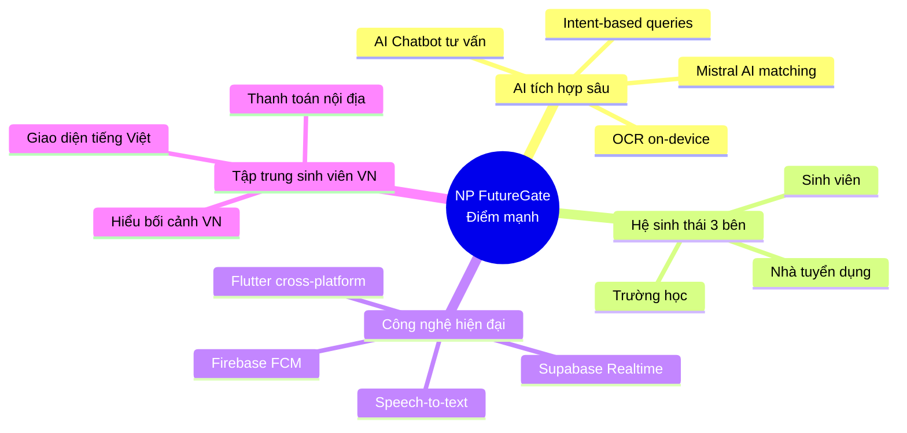

# So Sánh NP FutureGate Với Các Hệ Thống Tuyển Dụng Khác

## Mục đích

Tài liệu này so sánh NP FutureGate với các nền tảng tuyển dụng phổ biến tại Việt Nam và quốc tế (TopCV, VietnamWorks, LinkedIn), nhằm chứng minh tính mới, giá trị khác biệt, và lợi thế cạnh tranh của đồ án. So sánh được thực hiện theo nhiều tiêu chí: tính năng AI, đối tượng mục tiêu, công nghệ, và tính năng đặc biệt.

---

## 1. Giới thiệu các hệ thống so sánh

| Hệ thống | Mô tả | Năm thành lập | Thị trường |
|----------|--------|---------------|------------|
| **NP FutureGate** | Ứng dụng mobile kết nối việc làm cho sinh viên đại học Việt Nam, tích hợp AI matching và hệ thống đa vai trò (sinh viên - nhà tuyển dụng - trường học) | 2024 (đồ án) | Việt Nam (sinh viên) |
| **TopCV** | Nền tảng tuyển dụng trực tuyến lớn nhất Việt Nam, tập trung vào CV và kết nối ứng viên với nhà tuyển dụng | 2014 | Việt Nam |
| **VietnamWorks** | Nền tảng tuyển dụng lâu đời tại Việt Nam, thuộc Navigos Group, phục vụ chuyên gia và quản lý cấp trung-cao | 2002 | Việt Nam |
| **LinkedIn** | Mạng xã hội nghề nghiệp lớn nhất thế giới, kết hợp tuyển dụng, networking, và chia sẻ kiến thức | 2003 | Toàn cầu |

---

## 2. Bảng so sánh tổng quan

### 2.1 So sánh theo tính năng AI

| Tiêu chí | NP FutureGate ✅ | TopCV | VietnamWorks | LinkedIn |
|----------|-----------------|-------|--------------|----------|
| **AI phân tích CV** | Có (Mistral AI — phân tích nội dung, trích xuất kỹ năng, đánh giá phù hợp) | Có (AI review CV cơ bản, gợi ý cải thiện) | Không rõ ràng | Có (AI gợi ý cải thiện profile) |
| **AI matching ứng viên - việc làm** | Có (thuật toán matching dựa trên phân tích ngữ nghĩa CV và JD bằng Mistral AI) | Có (matching cơ bản dựa trên keyword) | Có (matching dựa trên tiêu chí lọc) | Có (AI matching mạnh, dựa trên big data) |
| **AI Chatbot tư vấn nghề nghiệp** | Có (chatbot AI với intent-based queries, tư vấn cá nhân hóa) | Không | Không | Không (chỉ có messaging giữa người dùng) |
| **OCR scanning CV** | Có (Google ML Kit on-device, scan CV từ ảnh chụp) | Không | Không | Không |
| **Speech-to-text tìm kiếm** | Có (nhận dạng giọng nói để tìm kiếm việc làm) | Không | Không | Có (voice search trên mobile) |
| **Intent-based queries** | Có (hệ thống phân tích ý định người dùng để trả lời chính xác) | Không | Không | Không |

### 2.2 So sánh theo đối tượng mục tiêu

| Tiêu chí | NP FutureGate ✅ | TopCV | VietnamWorks | LinkedIn |
|----------|-----------------|-------|--------------|----------|
| **Đối tượng chính** | Sinh viên đại học Việt Nam (năm 3-4, mới tốt nghiệp) | Mọi ứng viên tại Việt Nam | Chuyên gia, quản lý cấp trung-cao | Chuyên gia toàn cầu |
| **Nhà tuyển dụng** | Doanh nghiệp tuyển thực tập sinh, fresher | Mọi doanh nghiệp | Doanh nghiệp lớn, đa quốc gia | Mọi doanh nghiệp toàn cầu |
| **Trường học/Đại học** | Có (vai trò riêng, quản lý sinh viên, partnership) | Không | Không | Không (chỉ có University Pages) |
| **Phân khúc kinh nghiệm** | 0-2 năm (fresher, intern) | Mọi cấp độ | 3+ năm (mid-senior) | Mọi cấp độ |
| **Ngôn ngữ giao diện** | Tiếng Việt | Tiếng Việt | Tiếng Việt + Tiếng Anh | Đa ngôn ngữ |
| **Khu vực địa lý** | Việt Nam (tập trung sinh viên) | Việt Nam | Việt Nam | Toàn cầu |

### 2.3 So sánh theo công nghệ

| Tiêu chí | NP FutureGate ✅ | TopCV | VietnamWorks | LinkedIn |
|----------|-----------------|-------|--------------|----------|
| **Nền tảng** | Mobile app (Flutter — Android, iOS) | Web + Mobile app | Web + Mobile app | Web + Mobile app |
| **Framework mobile** | Flutter (cross-platform) | Native/React Native | Native | Native (Android/iOS riêng) |
| **Backend** | Supabase (PostgreSQL + Realtime) | Custom backend | Custom backend | Microservices (Java, Scala) |
| **AI Engine** | Mistral AI (LLM) | AI nội bộ | Không rõ | LinkedIn AI (proprietary) |
| **OCR Engine** | Google ML Kit (on-device) | Không | Không | Không |
| **Realtime** | Supabase Realtime (WebSocket) | WebSocket | Không rõ | Không rõ |
| **Push Notifications** | Firebase Cloud Messaging | FCM/APNs | FCM/APNs | Hệ thống riêng |
| **Payment** | PayOS (QR, chuyển khoản VN) | VNPay, MoMo | Không (B2B) | Stripe (quốc tế) |
| **State Management** | ChangeNotifier + BaseController (MVC) | — | — | — |
| **Database** | PostgreSQL (Supabase) | MySQL/PostgreSQL | Oracle/PostgreSQL | Espresso (custom) |

### 2.4 So sánh theo tính năng đặc biệt

| Tính năng | NP FutureGate ✅ | TopCV | VietnamWorks | LinkedIn |
|-----------|-----------------|-------|--------------|----------|
| **Hệ thống đa vai trò (3 roles)** | ✅ Sinh viên + Nhà tuyển dụng + Trường học | ❌ (2 roles: ứng viên + NTD) | ❌ (2 roles: ứng viên + NTD) | ❌ (1 profile đa mục đích) |
| **Chat realtime** | ✅ Chat trực tiếp giữa các vai trò | ❌ | ❌ (chỉ email) | ✅ (InMail, messaging) |
| **Quản lý phỏng vấn + nhắc nhở** | ✅ Lịch phỏng vấn, reminder tự động | ❌ | ❌ | ✅ (cơ bản, qua calendar) |
| **AI Chatbot tư vấn** | ✅ Chatbot AI cá nhân hóa | ❌ | ❌ | ❌ |
| **OCR scan CV từ ảnh** | ✅ Scan on-device, trích xuất text | ❌ | ❌ | ❌ |
| **Tìm kiếm bằng giọng nói** | ✅ Speech-to-text search | ❌ | ❌ | ✅ (hạn chế) |
| **Kết nối trường học - doanh nghiệp** | ✅ Partnership system | ❌ | ❌ | ❌ (chỉ University Pages) |
| **Thống kê cho nhà tuyển dụng** | ✅ Dashboard với biểu đồ (fl_chart) | ✅ (cơ bản) | ✅ | ✅ (LinkedIn Recruiter) |
| **Thanh toán gói dịch vụ** | ✅ PayOS (QR, chuyển khoản) | ✅ (VNPay, MoMo) | ✅ (B2B contract) | ✅ (Stripe) |
| **Xem CV dạng PDF trong app** | ✅ (syncfusion_flutter_pdfviewer) | ✅ | ✅ | ✅ |
| **Chia sẻ việc làm** | ✅ (share_plus) | ✅ | ✅ | ✅ |
| **Video hướng dẫn** | ✅ (youtube_player_flutter) | ❌ | ❌ | ✅ (LinkedIn Learning) |

---

## 3. Tính năng NP FutureGate có mà hệ thống khác chưa có

### 3.1 Tính năng độc quyền (Unique Features)

Dưới đây là các tính năng mà NP FutureGate sở hữu nhưng **không có hoặc chưa tập trung** ở TopCV, VietnamWorks, và LinkedIn:

| # | Tính năng | Mô tả chi tiết | Giá trị cho người dùng |
|---|-----------|-----------------|------------------------|
| 1 | **AI Chatbot tư vấn nghề nghiệp** | Chatbot sử dụng Mistral AI với hệ thống intent-based queries, hiểu ngữ cảnh và tư vấn cá nhân hóa cho sinh viên | Sinh viên được tư vấn 24/7 về định hướng nghề nghiệp, chuẩn bị phỏng vấn, cải thiện CV mà không cần chờ tư vấn viên |
| 2 | **OCR scanning CV on-device** | Sử dụng Google ML Kit để scan CV từ ảnh chụp trực tiếp trên thiết bị, không cần upload lên cloud | Bảo mật thông tin cá nhân, hoạt động offline, tiện lợi cho sinh viên chỉ có CV bản cứng |
| 3 | **Hệ thống 3 vai trò (Multi-role)** | Tích hợp 3 vai trò trong 1 ứng dụng: Sinh viên, Nhà tuyển dụng, Trường học — mỗi vai trò có giao diện và chức năng riêng | Tạo hệ sinh thái kết nối đa bên, trường học giám sát và hỗ trợ sinh viên tìm việc |
| 4 | **Kết nối Trường học - Doanh nghiệp** | Hệ thống partnership cho phép trường học liên kết với doanh nghiệp, quản lý sinh viên thực tập | Tăng cơ hội việc làm cho sinh viên thông qua mối quan hệ trường - doanh nghiệp |
| 5 | **AI matching CV với Mistral AI (LLM)** | Sử dụng Large Language Model (Mistral) để phân tích ngữ nghĩa CV và Job Description, không chỉ matching keyword | Kết quả matching chính xác hơn, hiểu được kỹ năng tương đương và tiềm năng phát triển |
| 6 | **Intent-based queries** | Hệ thống phân tích ý định câu hỏi của người dùng để trả lời chính xác (ví dụ: "tìm việc IT lương trên 10 triệu gần trường") | Trải nghiệm tìm kiếm tự nhiên, không cần biết cách sử dụng bộ lọc phức tạp |
| 7 | **Lịch phỏng vấn với reminder tự động** | Hệ thống quản lý lịch phỏng vấn tích hợp, tự động gửi nhắc nhở qua push notification trước giờ phỏng vấn | Sinh viên không bỏ lỡ phỏng vấn, nhà tuyển dụng quản lý lịch hiệu quả |
| 8 | **Speech-to-text tìm kiếm việc làm** | Tìm kiếm việc làm bằng giọng nói tiếng Việt | Tiện lợi khi di chuyển, phù hợp thói quen sử dụng mobile của sinh viên |

### 3.2 Tính năng vượt trội so với từng đối thủ

#### So với TopCV

| Tính năng | NP FutureGate | TopCV | Nhận xét |
|-----------|---------------|-------|----------|
| AI Chatbot | ✅ Mistral AI chatbot | ❌ Không có | NP FutureGate cung cấp tư vấn AI 24/7 |
| OCR Scan | ✅ On-device ML Kit | ❌ Không có | Scan CV từ ảnh mà không cần internet |
| Vai trò Trường học | ✅ Có | ❌ Không có | Hệ sinh thái 3 bên hoàn chỉnh |
| Chat realtime | ✅ Supabase Realtime | ❌ Không có | Giao tiếp trực tiếp, nhanh chóng |
| Tìm kiếm giọng nói | ✅ Speech-to-text | ❌ Không có | Trải nghiệm mobile tốt hơn |
| Đối tượng | Sinh viên (chuyên biệt) | Mọi người (chung chung) | NP FutureGate tối ưu cho sinh viên |

#### So với VietnamWorks

| Tính năng | NP FutureGate | VietnamWorks | Nhận xét |
|-----------|---------------|--------------|----------|
| AI matching (LLM) | ✅ Mistral AI semantic | ❌ Keyword-based | Matching thông minh hơn |
| AI Chatbot | ✅ Có | ❌ Không có | Tư vấn tự động cho sinh viên |
| Mobile-first | ✅ Flutter app | ⚠️ Web-first | Phù hợp thói quen sinh viên |
| Đối tượng | Sinh viên, fresher | Mid-senior | Phân khúc khác biệt rõ ràng |
| Chi phí | Thấp/Miễn phí | Cao (B2B) | Phù hợp sinh viên và startup |
| Realtime chat | ✅ Có | ❌ Chỉ email | Giao tiếp nhanh hơn |

#### So với LinkedIn

| Tính năng | NP FutureGate | LinkedIn | Nhận xét |
|-----------|---------------|----------|----------|
| OCR scan CV | ✅ On-device | ❌ Không có | Tính năng độc đáo |
| Vai trò Trường học | ✅ Partnership system | ⚠️ University Pages (hạn chế) | Tích hợp sâu hơn |
| AI Chatbot tư vấn | ✅ Mistral AI | ❌ Không có chatbot | Tư vấn cá nhân hóa |
| Thị trường Việt Nam | ✅ Tối ưu cho VN | ⚠️ Chung chung toàn cầu | Hiểu bối cảnh VN tốt hơn |
| Intent-based queries | ✅ Có | ❌ Không có | Tìm kiếm tự nhiên hơn |
| Thanh toán VN | ✅ PayOS (QR, chuyển khoản) | ❌ Stripe (không phổ biến tại VN) | Phù hợp thị trường VN |
| Interview reminders | ✅ Push notification tự động | ⚠️ Calendar integration | Tích hợp sẵn, không cần app khác |

---

## 4. Phân tích SWOT so sánh

### 4.1 Điểm mạnh của NP FutureGate (Strengths)

### 4.2 Điểm yếu so với đối thủ (Weaknesses)

| Điểm yếu | So với ai | Giải thích |
|-----------|-----------|------------|
| Quy mô dữ liệu nhỏ | TopCV, VietnamWorks, LinkedIn | Đồ án mới, chưa có lượng người dùng và dữ liệu lớn |
| Chưa có web version | TopCV, VietnamWorks, LinkedIn | Hiện chỉ là mobile app, chưa có giao diện web |
| Brand awareness thấp | Tất cả | Đồ án sinh viên, chưa được biết đến rộng rãi |
| Thiếu tính năng networking | LinkedIn | Chưa có tính năng mạng xã hội nghề nghiệp (posts, articles) |
| Chưa có AI đề xuất kỹ năng cần học | LinkedIn Learning | Chưa tích hợp hệ thống học tập |

### 4.3 Cơ hội (Opportunities)

- Thị trường sinh viên Việt Nam chưa có nền tảng chuyên biệt
- Xu hướng AI trong tuyển dụng đang phát triển mạnh
- Trường đại học cần công cụ quản lý việc làm cho sinh viên
- Mobile-first phù hợp thói quen sử dụng của Gen Z

### 4.4 Thách thức (Threats)

- TopCV và VietnamWorks có thể phát triển tính năng tương tự
- LinkedIn có nguồn lực AI mạnh hơn nhiều
- Chi phí duy trì AI API khi scale lên

---

## 5. Ma trận tính năng chi tiết

### 5.1 Tính năng cốt lõi

| Tính năng | NP FutureGate | TopCV | VietnamWorks | LinkedIn |
|-----------|:---:|:---:|:---:|:---:|
| Tạo/Upload CV | ✅ | ✅ | ✅ | ✅ |
| Tìm kiếm việc làm | ✅ | ✅ | ✅ | ✅ |
| Đăng tin tuyển dụng | ✅ | ✅ | ✅ | ✅ |
| Ứng tuyển online | ✅ | ✅ | ✅ | ✅ |
| Thông báo việc mới | ✅ | ✅ | ✅ | ✅ |
| Lọc theo tiêu chí | ✅ | ✅ | ✅ | ✅ |

### 5.2 Tính năng AI nâng cao

| Tính năng | NP FutureGate | TopCV | VietnamWorks | LinkedIn |
|-----------|:---:|:---:|:---:|:---:|
| AI phân tích CV (LLM) | ✅ | ⚠️ | ❌ | ✅ |
| AI matching ngữ nghĩa | ✅ | ⚠️ | ❌ | ✅ |
| AI Chatbot tư vấn | ✅ | ❌ | ❌ | ❌ |
| OCR scan CV | ✅ | ❌ | ❌ | ❌ |
| Speech-to-text search | ✅ | ❌ | ❌ | ⚠️ |
| Intent-based queries | ✅ | ❌ | ❌ | ❌ |
| AI gợi ý cải thiện CV | ✅ | ✅ | ❌ | ✅ |

### 5.3 Tính năng giao tiếp

| Tính năng | NP FutureGate | TopCV | VietnamWorks | LinkedIn |
|-----------|:---:|:---:|:---:|:---:|
| Chat realtime | ✅ | ❌ | ❌ | ✅ |
| Push notifications | ✅ | ✅ | ✅ | ✅ |
| Email notifications | ❌ | ✅ | ✅ | ✅ |
| Lịch phỏng vấn | ✅ | ❌ | ❌ | ✅ |
| Reminder tự động | ✅ | ❌ | ❌ | ⚠️ |
| Video call tích hợp | ❌ | ❌ | ❌ | ❌ |

### 5.4 Tính năng đặc thù

| Tính năng | NP FutureGate | TopCV | VietnamWorks | LinkedIn |
|-----------|:---:|:---:|:---:|:---:|
| Vai trò Trường học | ✅ | ❌ | ❌ | ❌ |
| Partnership system | ✅ | ❌ | ❌ | ❌ |
| Multi-role (3 roles) | ✅ | ❌ | ❌ | ❌ |
| Thanh toán QR (VN) | ✅ | ✅ | ❌ | ❌ |
| Mạng xã hội nghề nghiệp | ❌ | ❌ | ❌ | ✅ |
| Khóa học online | ❌ | ❌ | ❌ | ✅ |
| Salary insights | ❌ | ✅ | ✅ | ✅ |
| Company reviews | ❌ | ✅ | ❌ | ✅ |

---

## 6. Kết luận

### 6.1 Định vị của NP FutureGate

NP FutureGate không cạnh tranh trực tiếp với TopCV, VietnamWorks hay LinkedIn về quy mô và dữ liệu. Thay vào đó, hệ thống tập trung vào **phân khúc ngách** — sinh viên đại học Việt Nam — với các giá trị khác biệt:

1. **AI-first approach:** Tích hợp AI sâu vào mọi tính năng (matching, chatbot, OCR, intent queries) — không chỉ là tính năng phụ trợ
2. **Hệ sinh thái 3 bên:** Kết nối sinh viên - nhà tuyển dụng - trường học trong một nền tảng duy nhất
3. **Mobile-native:** Thiết kế mobile-first phù hợp thói quen sử dụng của sinh viên Gen Z
4. **Công nghệ hiện đại:** Sử dụng stack công nghệ mới nhất (Flutter, Supabase, Mistral AI, ML Kit)

### 6.2 Giá trị đóng góp của đồ án

| Khía cạnh | Giá trị |
|-----------|---------|
| **Học thuật** | Chứng minh khả năng tích hợp nhiều công nghệ AI/ML vào ứng dụng thực tế |
| **Kỹ thuật** | Kiến trúc MVC rõ ràng, tích hợp 5+ dịch vụ bên ngoài, realtime features |
| **Thực tiễn** | Giải quyết vấn đề thực tế: sinh viên khó tìm việc phù hợp, thiếu kết nối với doanh nghiệp |
| **Sáng tạo** | Kết hợp AI chatbot + OCR + multi-role + realtime — chưa có hệ thống nào tại VN làm đầy đủ |

---

## Liên kết liên quan

- [Điểm sáng kỹ thuật và business](./05_diem_sang_ky_thuat_va_business.md)
- [Phân tích điểm còn thiếu và khác biệt nổi bật](./07_phan_tich_diem_con_thieu_va_khac_biet_noi_bat.md)
- [Lý do chọn công nghệ](./04_cong_nghe_su_dung/tech_comparison_reason.md)
- [Tổng quan kiến trúc hệ thống](./01_tong_quan_kien_truc.md)
- [Tóm tắt để trình chiếu](./12_tom_tat_de_trinh_chieu.md)
