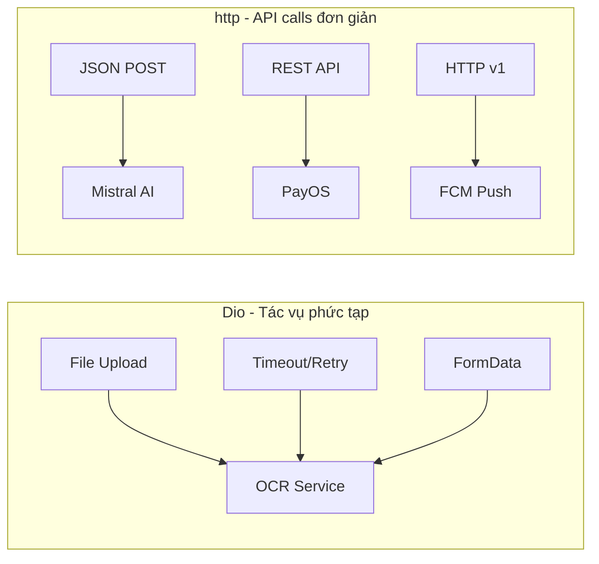

# Dio vs HTTP — So sánh và Lý do chọn

## Mục đích

Tài liệu so sánh hai thư viện HTTP client phổ biến trong Flutter: **Dio** và **http**, giải thích lý do dự án NP FutureGate sử dụng cả hai và vai trò cụ thể của từng thư viện.

## Định nghĩa

### Dio
**Dio** là một HTTP client mạnh mẽ cho Dart/Flutter, hỗ trợ interceptors, global configuration, FormData, request cancellation, file downloading, timeout, và nhiều tính năng nâng cao khác.

Package: `dio: ^5.8.0`

### http
**http** là package HTTP client chính thức từ Dart team, cung cấp API đơn giản cho các HTTP request cơ bản (GET, POST, PUT, DELETE).

Package: `http: ^1.6.0`

## Bảng so sánh chi tiết

| Tiêu chí | Dio | http |
|-----------|-----|------|
| **Interceptors** | ✅ Có (request, response, error) | ❌ Không có |
| **FormData/Multipart** | ✅ Built-in, dễ sử dụng | ⚠️ Cần tự xây dựng |
| **Timeout config** | ✅ connectTimeout, receiveTimeout, sendTimeout | ⚠️ Chỉ qua Client |
| **Request cancellation** | ✅ CancelToken | ❌ Không hỗ trợ |
| **File upload/download** | ✅ Progress callback | ❌ Không có progress |
| **Global configuration** | ✅ BaseOptions | ❌ Không có |
| **Retry mechanism** | ✅ Qua interceptor | ❌ Cần tự implement |
| **Response type** | ✅ JSON auto-parse, bytes, stream | ⚠️ Cần parse thủ công |
| **Kích thước package** | ⚠️ Lớn hơn (~200KB) | ✅ Nhẹ (~50KB) |
| **Dependency** | ⚠️ Nhiều sub-dependencies | ✅ Ít dependencies |
| **Learning curve** | ⚠️ Phức tạp hơn | ✅ Đơn giản, dễ học |
| **Official support** | Community package | ✅ Dart team maintain |

## Lý do sử dụng trong dự án

### Dio — Dùng cho OCR Service (file upload phức tạp)

Dự án sử dụng **Dio** trong `ocr_service.dart` vì:
1. **FormData/Multipart upload**: Cần upload file CV (PDF/ảnh) lên OCR server
2. **Timeout configuration**: OCR server trên Render có cold start, cần timeout dài (120s)
3. **Retry mechanism**: Tự động retry khi server cold start
4. **Progress tracking**: Theo dõi tiến trình upload file lớn

### http — Dùng cho API calls đơn giản

Dự án sử dụng **http** trong các service khác vì:
1. **Mistral AI Service**: Chỉ cần POST JSON đơn giản
2. **PayOS Service**: API thanh toán với request/response JSON
3. **Push Notification Service**: Gửi FCM message qua HTTP
4. **EmailJS Service**: Gửi email notification

## Cách tích hợp trong dự án

### Phân bổ sử dụng

| Service | Package | Lý do |
|---------|---------|-------|
| `ocr_service.dart` | **Dio** | File upload, timeout, retry |
| `mistral_service.dart` | http | JSON POST đơn giản |
| `payos_service.dart` | http | REST API cơ bản |
| `push_notification_service.dart` | http | FCM HTTP v1 API |
| `emailjs_service.dart` | http | POST request đơn giản |

## Ví dụ code từ dự án

### 1. Dio — OCR Service với FormData và Timeout (`ocr_service.dart`)

```dart
import 'package:dio/dio.dart';

class OcrService {
  static const String apiUrl = 'https://ocr-server-7w2k.onrender.com/api/ocr';
  static final Dio _dio = Dio();

  /// Trích xuất text từ file (PDF hoặc ảnh)
  static Future<Map<String, dynamic>> extractText({
    required File file,
    String language = 'eng',
  }) async {
    try {
      // Tạo FormData - Dio hỗ trợ native
      final formData = FormData.fromMap({
        'file': await MultipartFile.fromFile(
          file.path,
          filename: file.path.split('/').last,
        ),
        'lang': language,
      });

      // Cấu hình timeout (120 giây cho cold start)
      _dio.options.connectTimeout = const Duration(seconds: 120);
      _dio.options.receiveTimeout = const Duration(seconds: 120);

      // Gọi API
      final response = await _dio.post(apiUrl, data: formData);

      if (response.statusCode == 200) {
        final data = response.data as Map<String, dynamic>;
        return {'success': true, ...data};
      }
    } on DioException catch (e) {
      // Xử lý timeout - retry cho cold start
      if (e.type == DioExceptionType.connectionTimeout ||
          e.type == DioExceptionType.receiveTimeout) {
        await Future.delayed(const Duration(seconds: 5));
        return await extractText(file: file, language: language);
      }
      return {'success': false, 'error': 'Network error: ${e.message}'};
    }
  }
}
```

### 2. http — PayOS Service với JSON request đơn giản (`payos_service.dart`)

```dart
import 'package:http/http.dart' as http;

class PayOSService {
  static const String _baseUrl = 'https://api-merchant.payos.vn';

  Future<PaymentResult> createPaymentLink({
    required int amount,
    required String planName,
    required String userId,
  }) async {
    final body = {
      'orderCode': orderCode,
      'amount': amount,
      'description': description,
      'items': [{'name': 'Goi $planName', 'quantity': 1, 'price': amount}],
      'cancelUrl': actualCancelUrl,
      'returnUrl': actualReturnUrl,
      'signature': checksum,
    };

    // http package - API đơn giản, dễ đọc
    final response = await http.post(
      Uri.parse('$_baseUrl/v2/payment-requests'),
      headers: {
        'Content-Type': 'application/json',
        'x-client-id': _clientId,
        'x-api-key': _apiKey,
      },
      body: jsonEncode(body),
    );

    if (response.statusCode == 200) {
      final data = jsonDecode(response.body);
      // Xử lý response...
    }
  }
}
```

### 3. http — Mistral AI Service (`mistral_service.dart`)

```dart
import 'package:http/http.dart' as http;

class MistralService {
  Future<String> sendMessage(String prompt) async {
    final response = await http.post(
      Uri.parse('https://api.mistral.ai/v1/chat/completions'),
      headers: {
        'Content-Type': 'application/json',
        'Authorization': 'Bearer $_apiKey',
      },
      body: jsonEncode({
        'model': 'mistral-small-latest',
        'messages': [{'role': 'user', 'content': prompt}],
      }),
    );
    // Parse response...
  }
}
```

## Kết luận: Chiến lược sử dụng



**Nguyên tắc**: Sử dụng **Dio** khi cần tính năng nâng cao (file upload, interceptors, retry), sử dụng **http** cho các API call đơn giản để giữ code gọn nhẹ và dễ đọc.

## Ưu điểm của cách tiếp cận hybrid

| Ưu điểm | Mô tả |
|----------|--------|
| **Tối ưu** | Dùng đúng tool cho đúng việc |
| **Nhẹ** | Không ép buộc Dio cho mọi request |
| **Dễ maintain** | http code đơn giản, dễ debug |
| **Linh hoạt** | Có thể thay thế từng phần độc lập |

## Nhược điểm

| Nhược điểm | Mô tả |
|------------|--------|
| **Không nhất quán** | Hai cách viết HTTP request khác nhau |
| **Duplicate logic** | Error handling phải viết riêng cho mỗi package |
| **Dependency nhiều** | Phải maintain cả hai package |
| **Khó refactor** | Nếu muốn thêm interceptor chung, phải migrate http → Dio |

## Liên kết liên quan

- [Tổng quan công nghệ](../04_cong_nghe_su_dung/tech_stack_overview.md)
- [So sánh công nghệ](../04_cong_nghe_su_dung/tech_comparison_reason.md)
- [Google ML Kit OCR](./google_mlkit_ocr.md)
- [PayOS Payment](./payos_payment.md)
