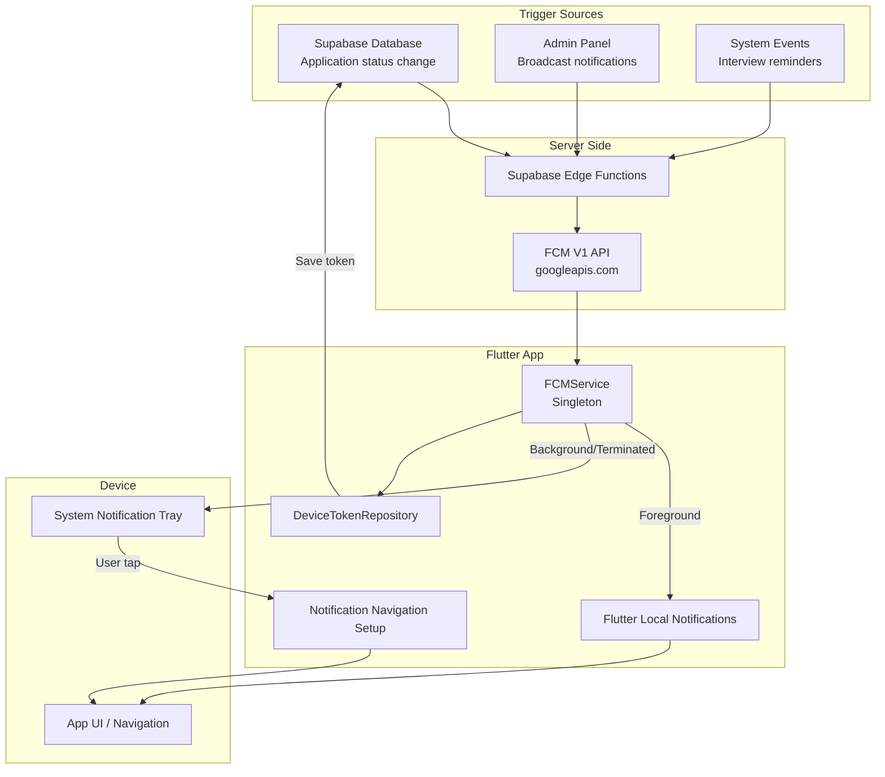
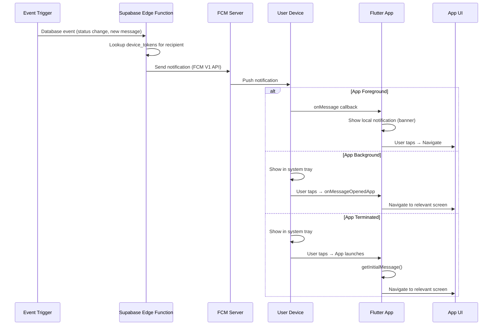

# Firebase Cloud Messaging (FCM)

## Mục đích

Giải thích chi tiết về Firebase Cloud Messaging — dịch vụ push notification được sử dụng trong NP FutureGate để gửi thông báo realtime đến người dùng trên cả Android và iOS.

## Định nghĩa

Firebase Cloud Messaging (FCM) là dịch vụ miễn phí của Google cho phép gửi push notifications và messages đến các thiết bị di động. FCM hoạt động theo mô hình:
- **Server → Device:** Gửi notification từ server đến thiết bị cụ thể (via device token) hoặc nhóm thiết bị (via topic)
- **Foreground/Background/Terminated:** Xử lý notification ở mọi trạng thái app

**Packages sử dụng:**
- `firebase_core: ^3.10.0` — Firebase initialization
- `firebase_messaging: ^15.2.0` — FCM service
- `flutter_local_notifications: ^18.0.1` — Hiển thị notification khi app foreground
- `googleapis_auth: ^1.6.0` — OAuth2 cho FCM V1 API

## Lý do sử dụng trong dự án

1. **Cross-platform:** FCM hỗ trợ cả Android và iOS từ một codebase, phù hợp với Flutter.

2. **Miễn phí hoàn toàn:** Không giới hạn số lượng notifications gửi đi.

3. **Đáng tin cậy:** Infrastructure của Google đảm bảo delivery rate cao.

4. **Topic-based messaging:** Gửi notification theo nhóm (employer, candidate, school) mà không cần quản lý danh sách tokens.

5. **Tích hợp với Supabase:** Lưu device tokens trong Supabase database, trigger notification từ database events.

6. **Xử lý mọi trạng thái app:** Foreground (hiển thị local notification), Background (system tray), Terminated (mở app khi tap).

## Cách tích hợp trong dự án

### Kiến trúc Push Notification



### Các trạng thái xử lý notification

| Trạng thái App | Xử lý | Hiển thị |
|----------------|--------|----------|
| **Foreground** | `onMessage` listener → show local notification | Banner/popup trong app |
| **Background** | `onBackgroundMessage` handler | System notification tray |
| **Terminated** | `getInitialMessage()` khi app mở | Navigate đến màn hình liên quan |
| **Tap notification** | `onMessageOpenedApp` / `onDidReceiveNotificationResponse` | Navigate theo payload data |

## Ví dụ code từ dự án

### 1. FCMService — Initialization (lib/core/services/fcm_service.dart)

```dart
class FCMService {
  factory FCMService() => _instance;
  FCMService._internal();
  static final FCMService _instance = FCMService._internal();

  final FirebaseMessaging _fcm = FirebaseMessaging.instance;
  final DeviceTokenRepository _deviceTokenRepo = DeviceTokenRepository();
  final FlutterLocalNotificationsPlugin _localNotifications = 
      FlutterLocalNotificationsPlugin();
  
  String? _fcmToken;
  String? get fcmToken => _fcmToken;

  /// Initialize FCM and Local Notifications
  Future<void> initialize() async {
    try {
      // Initialize local notifications
      await _initializeLocalNotifications();
      
      // Request permission for iOS
      final NotificationSettings settings = await _fcm.requestPermission(
        alert: true,
        badge: true,
        sound: true,
      );

      if (settings.authorizationStatus == AuthorizationStatus.authorized) {
        // Get FCM token
        _fcmToken = await _fcm.getToken();

        if (_fcmToken != null) {
          await _saveTokenForCurrentUser(_fcmToken!);
        }

        // Listen for token refresh
        _fcm.onTokenRefresh.listen((newToken) {
          _fcmToken = newToken;
          _saveTokenForCurrentUser(newToken);
        });

        // Setup message handlers
        FirebaseMessaging.onMessage.listen(_handleForegroundMessage);
        FirebaseMessaging.onMessageOpenedApp.listen(_handleMessageOpenedApp);
        FirebaseMessaging.onBackgroundMessage(
            _firebaseMessagingBackgroundHandler);
      }
    } catch (e) {
      debugPrint('❌ FCM Initialization error: $e');
    }
  }
}
```

### 2. Xử lý Foreground Message

```dart
/// Handle foreground messages - hiển thị local notification
void _handleForegroundMessage(RemoteMessage message) async {
  debugPrint('📬 Foreground message received:');
  debugPrint('   Title: ${message.notification?.title}');
  debugPrint('   Body: ${message.notification?.body}');
  debugPrint('   Data: ${message.data}');
  
  // Show local notification when app is in foreground
  if (message.notification != null) {
    await _showLocalNotification(
      title: message.notification!.title ?? 'Notification',
      body: message.notification!.body ?? '',
      payload: jsonEncode(message.data),
    );
  }
}

/// Show local notification
Future<void> _showLocalNotification({
  required String title,
  required String body,
  String? payload,
}) async {
  const androidDetails = AndroidNotificationDetails(
    'fcm_channel',
    'FCM Notifications',
    channelDescription: 'Firebase Cloud Messaging notifications',
    importance: Importance.high,
    priority: Priority.high,
    showWhen: true,
  );
  
  const iosDetails = DarwinNotificationDetails();
  
  const notificationDetails = NotificationDetails(
    android: androidDetails,
    iOS: iosDetails,
  );
  
  await _localNotifications.show(
    DateTime.now().millisecondsSinceEpoch.remainder(100000),
    title,
    body,
    notificationDetails,
    payload: payload,
  );
}
```

### 3. Xử lý Background/Terminated Message

```dart
/// Handle messages that opened the app (from background)
void _handleMessageOpenedApp(RemoteMessage message) async {
  final context = navigatorKey.currentContext;
  
  if (context != null && context.mounted && message.data.isNotEmpty) {
    try {
      final notificationService = StatusNotificationService();
      
      // Tạo notification model từ FCM data
      final notification = NotificationModel(
        id: message.data['notificationId'] as String? ?? '',
        createdAt: DateTime.now(),
        updatedAt: DateTime.now(),
        recipientIds: '',
        title: message.notification?.title ?? 'Thông báo',
        content: message.notification?.body ?? '',
        actionCode: message.data['type'] as String? ?? '',
        actionData: message.data,
        isActive: true,
        type: NotificationType.info,
        isRead: false,
      );
      
      // Handle navigation dựa trên notification type
      await notificationService.handleNotificationTap(context, notification);
    } catch (e) {
      debugPrint('❌ Error handling message opened app: $e');
    }
  }
}

/// Background message handler - MUST be top-level function
@pragma('vm:entry-point')
Future<void> _firebaseMessagingBackgroundHandler(RemoteMessage message) async {
  await Firebase.initializeApp();
  debugPrint('📦 Background message received:');
  debugPrint('   Title: ${message.notification?.title}');
  debugPrint('   Body: ${message.notification?.body}');
}
```

### 4. Check Initial Message (Terminated State)

```dart
/// Check và xử lý initial message (khi app mở từ terminated state)
Future<void> checkInitialMessage() async {
  try {
    final RemoteMessage? initialMessage = await _fcm.getInitialMessage();
    
    if (initialMessage != null) {
      // Đợi app render xong
      await Future.delayed(const Duration(milliseconds: 500));
      
      final context = navigatorKey.currentContext;
      
      if (context != null && context.mounted && 
          initialMessage.data.isNotEmpty) {
        final notificationService = StatusNotificationService();
        
        final notification = NotificationModel(
          id: initialMessage.data['notificationId'] as String? ?? '',
          createdAt: DateTime.now(),
          updatedAt: DateTime.now(),
          recipientIds: '',
          title: initialMessage.notification?.title ?? 'Thông báo',
          content: initialMessage.notification?.body ?? '',
          actionCode: initialMessage.data['type'] as String? ?? '',
          actionData: initialMessage.data,
          isActive: true,
          type: NotificationType.info,
          isRead: false,
        );
        
        await notificationService.handleNotificationTap(context, notification);
      }
    }
  } catch (e) {
    debugPrint('❌ Error checking initial message: $e');
  }
}
```

### 5. Save Device Token

```dart
/// Save FCM token to database
Future<void> saveToken({
  required String userId,
  required String role,
}) async {
  if (_fcmToken == null) return;

  try {
    await _deviceTokenRepo.saveDeviceToken(
      deviceToken: _fcmToken!,
      userId: userId,
      role: role,
    );
  } catch (e) {
    debugPrint('❌ Failed to save FCM token: $e');
    rethrow;
  }
}

/// Subscribe to a topic (ví dụ: role-based notifications)
Future<void> subscribeToTopic(String topic) async {
  try {
    await _fcm.subscribeToTopic(topic);
  } catch (e) {
    debugPrint('❌ Failed to subscribe to topic: $e');
  }
}
```

### 6. Local Notifications Initialization (main.dart)

```dart
Future<void> _initializeLocalNotifications() async {
  const AndroidInitializationSettings androidSettings =
      AndroidInitializationSettings('@mipmap/ic_launcher');
  
  const DarwinInitializationSettings iosSettings =
      DarwinInitializationSettings(
        requestAlertPermission: true,
        requestBadgePermission: true,
        requestSoundPermission: true,
      );
  
  const InitializationSettings settings = InitializationSettings(
    android: androidSettings,
    iOS: iosSettings,
  );
  
  await flutterLocalNotificationsPlugin.initialize(
    settings,
    onDidReceiveNotificationResponse: (NotificationResponse response) {
      if (response.payload != null) {
        _handleNotificationTap(response.payload!);
      }
    },
  );
  
  // Request permissions for Android 13+
  await flutterLocalNotificationsPlugin
      .resolvePlatformSpecificImplementation<
          AndroidFlutterLocalNotificationsPlugin>()
      ?.requestNotificationsPermission();
}
```

### 7. Startup Token Save (main.dart)

```dart
/// Lưu device token cho user hiện tại (nếu đã đăng nhập)
Future<void> _saveDeviceTokenForCurrentUser() async {
  try {
    final authRepo = AuthRepository();
    final profile = await authRepo.getCurrentUserProfile();
    final fcmToken = FCMService().fcmToken;
    
    if (profile != null && fcmToken != null) {
      await authRepo.saveDeviceToken(
        deviceToken: fcmToken,
        userId: profile.id,
        role: profile.role.value,
      );
    }
  } catch (e) {
    debugPrint('⚠️ Error saving device token on startup: $e');
  }
}
```

## Luồng Push Notification hoàn chỉnh



## Các loại notification trong dự án

| Loại | Trigger | Người nhận | Nội dung |
|------|---------|------------|----------|
| **Application status** | Employer duyệt/từ chối đơn | Candidate | "Đơn ứng tuyển đã được chấp nhận" |
| **New message** | Gửi tin nhắn chat | Người nhận chat | "Bạn có tin nhắn mới từ..." |
| **Interview reminder** | Scheduled (local) | Candidate/Employer | "Phỏng vấn sau 30 phút" |
| **Job recommendation** | AI matching | Candidate | "Có công việc phù hợp với bạn" |
| **Partnership request** | Employer gửi yêu cầu | School | "Yêu cầu liên kết mới" |

## Ưu điểm

| Ưu điểm | Mô tả |
|----------|--------|
| **Miễn phí** | Không giới hạn số lượng notifications |
| **Cross-platform** | Android + iOS từ một codebase |
| **Reliable** | Google infrastructure, delivery rate cao |
| **Topic messaging** | Gửi theo nhóm không cần quản lý tokens |
| **Background handling** | Xử lý ở mọi trạng thái app |
| **Rich notifications** | Hỗ trợ images, actions, custom data |
| **Token management** | Auto-refresh token khi thay đổi |
| **Flutter SDK** | Package chính thức, well-maintained |

## Nhược điểm

| Nhược điểm | Mô tả | Giải pháp trong dự án |
|------------|--------|----------------------|
| **Vendor lock-in** | Phụ thuộc Google/Firebase | Chấp nhận — FCM là standard |
| **iOS complexity** | Cần APNs certificate, provisioning | Cấu hình đúng trong Xcode |
| **No guarantee delivery** | Không đảm bảo 100% delivery | Lưu notification trong DB để user xem lại |
| **Foreground handling** | FCM không tự hiển thị khi foreground | Sử dụng flutter_local_notifications |
| **Background limitations** | iOS giới hạn background execution | Sử dụng data-only messages |
| **Token invalidation** | Token có thể thay đổi bất kỳ lúc nào | onTokenRefresh listener + save mới |
| **Android 13+ permission** | Cần request permission runtime | requestNotificationsPermission() |

## Liên kết liên quan

- [Notification Flow](../02_co_che_tung_chuc_nang/notification_flow.md)
- [Tổng quan kiến trúc](../01_tong_quan_kien_truc.md)
- [Supabase](./supabase.md)
- [Flutter](./flutter.md)
- [Công nghệ sử dụng](../04_cong_nghe_su_dung/tech_stack_overview.md)
