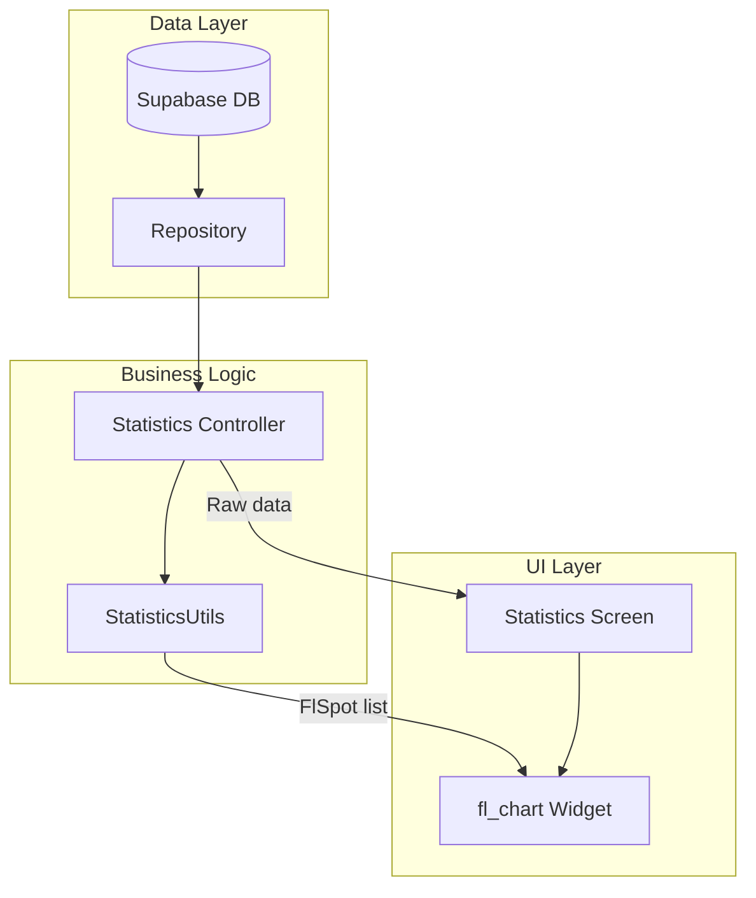

# FL Chart — Biểu đồ thống kê

## Mục đích

Tài liệu giải thích chi tiết về thư viện **fl_chart** — thư viện vẽ biểu đồ (charts) cho Flutter được sử dụng trong dự án NP FutureGate để hiển thị dữ liệu thống kê cho Admin, Employer và School.

## Định nghĩa

**fl_chart** là một thư viện Flutter mã nguồn mở cho phép tạo các biểu đồ đẹp, tương tác và có animation. Thư viện hỗ trợ nhiều loại biểu đồ: Line Chart, Bar Chart, Pie Chart, Scatter Chart, và Radar Chart.

Package: `fl_chart: ^0.69.2`

## Lý do sử dụng trong dự án

NP FutureGate cần hiển thị **dữ liệu thống kê trực quan** cho nhiều vai trò:

1. **Admin**: Thống kê người dùng mới, việc làm mới, đơn ứng tuyển theo thời gian
2. **Employer**: Thống kê đơn ứng tuyển theo tháng, tỷ lệ chấp nhận/từ chối, việc làm active/expired
3. **School**: Thống kê ứng tuyển của sinh viên, phân bổ trạng thái đơn

Lý do chọn fl_chart:
- **Pure Flutter**: Không phụ thuộc native code, hoạt động trên mọi platform
- **Đẹp và mượt**: Animation smooth, gradient support, touch interaction
- **Đa dạng chart types**: Line, Bar, Pie — đủ cho nhu cầu dự án
- **Customizable**: Tùy chỉnh cao về màu sắc, tooltip, grid, labels
- **Lightweight**: Không nặng như Syncfusion Charts (có license)

## Cách tích hợp trong dự án

### Các màn hình sử dụng fl_chart

| Màn hình | Loại biểu đồ | Dữ liệu |
|----------|--------------|----------|
| `reports_page_admin.dart` | **LineChart** | Users/Jobs/Applications theo ngày |
| `employer_statistics_screen.dart` | **BarChart** + **PieChart** | Ứng tuyển theo tháng, tỷ lệ trạng thái |
| `school_statistics_screen.dart` | **LineChart** + **PieChart** | Ứng tuyển theo tháng, phân bổ trạng thái |
| `mi_result_screen.dart` | **Chart** | Kết quả phân tích MI |

### Kiến trúc dữ liệu



### Utility hỗ trợ

File `lib/core/utils/statistics_utils.dart` cung cấp các hàm tiện ích chuyển đổi dữ liệu thô thành format phù hợp cho fl_chart.

## Ví dụ code từ dự án

### 1. StatisticsUtils — Chuyển đổi dữ liệu cho biểu đồ

```dart
import 'package:fl_chart/fl_chart.dart';

class StatisticsUtils {
  /// Groups items by day within a period.
  /// Returns a list of {'day': 'M/D', 'count': int} maps
  static List<Map<String, dynamic>> groupByDay(
    List<dynamic> items,
    String dateField,
    DateTime periodStart,
    int periodDays,
  ) {
    final grouped = <String, int>{};

    // Initialize all days in the period with 0
    for (var i = 0; i < periodDays; i++) {
      final date = periodStart.add(Duration(days: i + 1));
      final key = '${date.month}/${date.day}';
      grouped[key] = 0;
    }

    // Count items by day
    for (var item in items) {
      final date = DateTime.tryParse(item[dateField]?.toString() ?? '');
      if (date != null && date.isAfter(periodStart)) {
        final key = '${date.month}/${date.day}';
        if (grouped.containsKey(key)) {
          grouped[key] = (grouped[key] ?? 0) + 1;
        }
      }
    }

    return grouped.entries
        .map((e) => {'day': e.key, 'count': e.value})
        .toList();
  }

  /// Converts a day-count list to FlSpot list for fl_chart line charts.
  static List<FlSpot> buildLineChartSpots(
    List<Map<String, dynamic>> dayCountList,
  ) {
    return dayCountList.asMap().entries.map((entry) {
      final count = (entry.value['count'] as int?) ?? 0;
      return FlSpot(entry.key.toDouble(), count.toDouble());
    }).toList();
  }
}
```

### 2. LineChart — Admin Reports (`reports_page_admin.dart`)

```dart
Widget _buildLineChart(List<Map<String, dynamic>> data, Color color) {
  final maxValue = data
      .map((e) => e['count'] as int)
      .reduce((a, b) => a > b ? a : b)
      .toDouble();
  final spots = data.asMap().entries.map((entry) {
    return FlSpot(
      entry.key.toDouble(),
      (entry.value['count'] as int).toDouble(),
    );
  }).toList();

  return Container(
    height: 120,
    padding: const EdgeInsets.all(12),
    decoration: BoxDecoration(
      color: color.withValues(alpha: 0.05),
      borderRadius: BorderRadius.circular(12),
    ),
    child: LineChart(
      LineChartData(
        gridData: const FlGridData(show: false),
        titlesData: const FlTitlesData(show: false),
        borderData: FlBorderData(show: false),
        minX: 0,
        maxX: (data.length - 1).toDouble(),
        minY: 0,
        maxY: maxValue > 0 ? maxValue * 1.2 : 10,
        lineBarsData: [
          LineChartBarData(
            spots: spots,
            isCurved: true,
            color: color,
            barWidth: 3,
            isStrokeCapRound: true,
            dotData: const FlDotData(show: false),
            belowBarData: BarAreaData(
              show: true,
              color: color.withValues(alpha: 0.2),
            ),
          ),
        ],
      ),
    ),
  );
}
```

### 3. BarChart — Employer Statistics (`employer_statistics_screen.dart`)

```dart
BarChart(
  BarChartData(
    alignment: BarChartAlignment.spaceAround,
    maxY: maxApplications,
    barGroups: _controller.applicationsByMonth
        .asMap()
        .entries
        .map((entry) {
      final index = entry.key;
      final data = entry.value;
      return BarChartGroupData(
        x: index,
        barRods: [
          BarChartRodData(
            toY: (data['count'] as int).toDouble(),
            gradient: const LinearGradient(
              colors: [Color(0xFF6366F1), Color(0xFF8B5CF6)],
              begin: Alignment.bottomCenter,
              end: Alignment.topCenter,
            ),
            width: 20,
            borderRadius: const BorderRadius.vertical(
              top: Radius.circular(6),
            ),
          ),
        ],
      );
    }).toList(),
  ),
)
```

### 4. PieChart — Phân bổ trạng thái đơn ứng tuyển

```dart
PieChart(
  PieChartData(
    sectionsSpace: 2,
    centerSpaceRadius: 24,
    sections: [
      PieChartSectionData(
        value: _controller.pendingApplications.toDouble(),
        color: Colors.orange.shade400,
        radius: 30,
        showTitle: false,
      ),
      PieChartSectionData(
        value: _controller.acceptedApplications.toDouble(),
        color: Colors.green.shade400,
        radius: 30,
        showTitle: false,
      ),
      PieChartSectionData(
        value: _controller.rejectedApplications.toDouble(),
        color: Colors.red.shade400,
        radius: 30,
        showTitle: false,
      ),
    ],
  ),
)
```

### 5. School Statistics — LineChart với labels

```dart
LineChart(
  LineChartData(
    gridData: FlGridData(show: true, drawVerticalLine: false),
    titlesData: FlTitlesData(
      bottomTitles: AxisTitles(
        sideTitles: SideTitles(
          showTitles: true,
          getTitlesWidget: (value, meta) {
            final index = value.toInt();
            if (index >= 0 && index < _jobsByMonth.length) {
              return Text(
                _jobsByMonth.keys.elementAt(index),
                style: const TextStyle(fontSize: 10),
              );
            }
            return const Text('');
          },
        ),
      ),
    ),
    borderData: FlBorderData(show: false),
    lineBarsData: [
      LineChartBarData(
        spots: _jobsByMonth.asMap().entries.map((entry) {
          return FlSpot(
            entry.key.toDouble(),
            entry.value.value.toDouble(),
          );
        }).toList(),
        isCurved: true,
        color: AppMainColors.primary,
        barWidth: 3,
        dotData: FlDotData(show: true),
      ),
    ],
  ),
)
```

## Ưu điểm

| Ưu điểm | Mô tả |
|----------|--------|
| **Pure Flutter** | Không cần native code, chạy trên mọi platform |
| **Animation mượt** | Transition đẹp khi data thay đổi |
| **Touch interaction** | Hỗ trợ tooltip khi chạm vào data point |
| **Gradient support** | Hỗ trợ gradient cho bars, lines, areas |
| **Responsive** | Tự động scale theo kích thước container |
| **Miễn phí** | Open source, MIT license |
| **Đa dạng** | Line, Bar, Pie, Scatter, Radar charts |
| **Customizable** | Tùy chỉnh mọi thành phần: grid, titles, borders |

## Nhược điểm

| Nhược điểm | Mô tả |
|------------|--------|
| **Không có real-time streaming** | Phải rebuild widget khi data thay đổi |
| **Phức tạp config** | Nhiều nested objects để cấu hình (FlGridData, FlTitlesData...) |
| **Không có chart legend built-in** | Phải tự tạo legend widget |
| **Performance với data lớn** | Chậm nếu có hàng nghìn data points |
| **Không export** | Không hỗ trợ export chart thành ảnh trực tiếp |
| **Documentation** | Tài liệu chưa đầy đủ cho mọi use case |

## Liên kết liên quan

- [Tổng quan công nghệ](../04_cong_nghe_su_dung/tech_stack_overview.md)
- [Điểm sáng kỹ thuật](../05_diem_sang_ky_thuat_va_business.md)
- [State Management](./state_management_changenotifier.md)
- [Các thư viện khác](./other_libraries.md)
