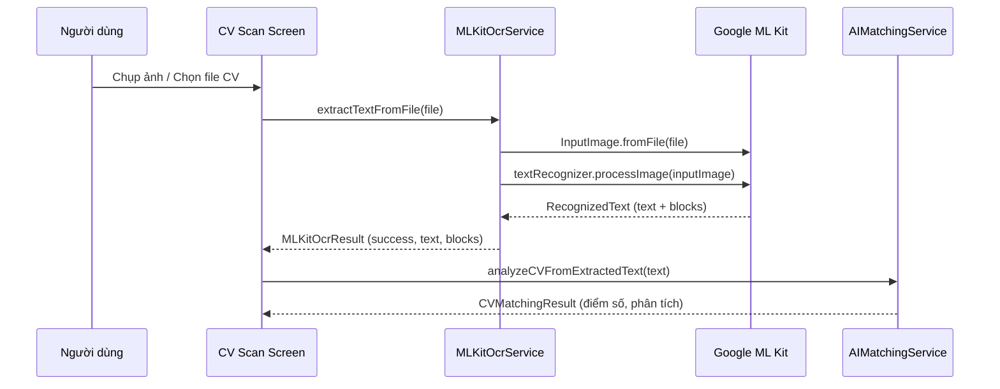

# Google ML Kit - OCR Text Recognition

## Mục đích

Tài liệu giải thích chi tiết về Google ML Kit Text Recognition — thư viện nhận diện văn bản (OCR) on-device được sử dụng trong dự án NP FutureGate để trích xuất nội dung từ CV ảnh và PDF.

## Định nghĩa

**Google ML Kit Text Recognition** là một thư viện machine learning của Google cho phép nhận diện và trích xuất văn bản từ hình ảnh trực tiếp trên thiết bị (on-device), không cần kết nối internet. Thư viện hỗ trợ nhận diện nhiều ngôn ngữ bao gồm Latin, Chinese, Devanagari, Japanese, Korean.

Package sử dụng: `google_mlkit_text_recognition: ^0.15.0`

## Lý do sử dụng trong dự án

NP FutureGate cần tính năng **scan CV từ ảnh chụp hoặc file PDF** để:

1. **Ứng viên** có thể chụp ảnh CV giấy và hệ thống tự động trích xuất nội dung
2. **Nhà tuyển dụng** có thể scan CV ứng viên gửi dạng ảnh/PDF để phân tích bằng AI
3. **Hệ thống AI Matching** cần text từ CV để so khớp với yêu cầu công việc

Lý do chọn Google ML Kit thay vì các giải pháp khác:
- **On-device processing**: Không cần gửi dữ liệu CV nhạy cảm lên server
- **Miễn phí**: Không tốn chi phí API call như Google Cloud Vision
- **Tốc độ nhanh**: Xử lý trực tiếp trên thiết bị, không phụ thuộc mạng
- **Hỗ trợ Flutter**: Package chính thức từ Google cho Flutter

## Cách tích hợp trong dự án

### Kiến trúc tích hợp

```
┌─────────────────────────────────────────────────────┐
│  UI Layer (CV Scan Screen)                          │
│  - Chụp ảnh / Chọn file                            │
└──────────────────────┬──────────────────────────────┘
                       │
┌──────────────────────▼──────────────────────────────┐
│  MLKitOcrService (lib/core/services/)               │
│  - extractTextFromFile()                            │
│  - extractTextFromPdf()                             │
│  - extractTextFromUrl()                             │
│  - pickAndExtractFromCamera()                       │
└──────────────────────┬──────────────────────────────┘
                       │
┌──────────────────────▼──────────────────────────────┐
│  AIMatchingService                                  │
│  - Nhận text OCR → gửi Mistral AI phân tích        │
└─────────────────────────────────────────────────────┘
```

### File chính

| File | Vai trò |
|------|---------|
| `lib/core/services/mlkit_ocr_service.dart` | Service chính xử lý OCR on-device |
| `lib/core/services/ocr_service.dart` | Service OCR backup qua server (Dio) |
| `lib/core/services/ai_matching_service.dart` | Sử dụng kết quả OCR cho AI matching |
| `lib/features/employer/screens/jobs/cv_scan_analysis_screen.dart` | UI scan CV |

### Luồng xử lý



## Ví dụ code từ dự án

### 1. Service MLKit OCR chính (`mlkit_ocr_service.dart`)

```dart
import 'package:google_mlkit_text_recognition/google_mlkit_text_recognition.dart';

class MLKitOcrService {
  factory MLKitOcrService() => _instance;
  MLKitOcrService._internal();
  static final MLKitOcrService _instance = MLKitOcrService._internal();

  /// Trích xuất text từ file ảnh (File object)
  Future<MLKitOcrResult> extractTextFromFile(File imageFile) async {
    try {
      if (!imageFile.existsSync()) {
        return MLKitOcrResult.failure('File không tồn tại');
      }

      final inputImage = InputImage.fromFile(imageFile);
      final textRecognizer = TextRecognizer(script: TextRecognitionScript.latin);

      try {
        final RecognizedText recognizedText =
            await textRecognizer.processImage(inputImage);

        if (recognizedText.text.isEmpty) {
          return MLKitOcrResult.failure('Không tìm thấy văn bản trong ảnh');
        }

        return MLKitOcrResult(
          success: true,
          text: recognizedText.text,
          blocks: recognizedText.blocks
              .map((block) => TextBlockInfo(
                    text: block.text,
                    confidence: block.lines.isNotEmpty
                        ? block.lines
                                .map((l) => l.confidence ?? 0.0)
                                .reduce((a, b) => a + b) /
                            block.lines.length
                        : 0.0,
                  ))
              .toList(),
        );
      } finally {
        await textRecognizer.close();
      }
    } catch (e) {
      return MLKitOcrResult.failure('Lỗi nhận diện văn bản: $e');
    }
  }
}
```

### 2. Xử lý PDF (render từng trang → OCR)

```dart
/// Trích xuất text từ file PDF (render từng trang thành ảnh → ML Kit OCR)
Future<MLKitOcrResult> extractTextFromPdf(File pdfFile) async {
  final document = await PdfDocument.openFile(pdfFile.path);
  final pageCount = document.pagesCount;
  final StringBuffer combinedText = StringBuffer();

  for (int i = 1; i <= pageCount; i++) {
    final page = await document.getPage(i);
    
    // Render page to image - tăng 3x resolution cho OCR chất lượng cao
    final pageImage = await page.render(
      width: page.width * 3,
      height: page.height * 3,
      format: PdfPageImageFormat.png,
      backgroundColor: '#FFFFFF',
    );
    await page.close();

    // Save rendered image to temp file → OCR
    final tempImageFile = File('${tempDir.path}/pdf_page_$i.png');
    await tempImageFile.writeAsBytes(pageImage.bytes);
    final result = await extractTextFromFile(tempImageFile);

    if (result.success && result.text.isNotEmpty) {
      combinedText.write(result.text);
    }
  }

  return MLKitOcrResult(success: true, text: combinedText.toString());
}
```

### 3. Sử dụng trong AI Matching Service

```dart
class AIMatchingService {
  final MLKitOcrService _mlkitService = MLKitOcrService();

  Future<CVMatchingResult> _analyzeUploadCV(String fileUrl, JobModel job) async {
    // OCR trích xuất text từ CV
    final ocrResult = await _mlkitService.extractTextFromUrl(fileUrl);
    if (!ocrResult.success || ocrResult.text.isEmpty) {
      throw Exception(ocrResult.error ?? 'OCR trống');
    }
    // Gửi text cho Mistral AI phân tích
    return await analyzeCVFromExtractedText(extractedText: ocrResult.text, job: job);
  }
}
```

## Ưu điểm

| Ưu điểm | Mô tả |
|----------|--------|
| **On-device** | Xử lý hoàn toàn trên thiết bị, bảo mật dữ liệu CV |
| **Miễn phí** | Không tốn chi phí API, không giới hạn số lần sử dụng |
| **Tốc độ** | Xử lý nhanh (< 1 giây cho ảnh thông thường) |
| **Offline** | Hoạt động không cần internet |
| **Đa ngôn ngữ** | Hỗ trợ Latin script (tiếng Anh, Việt) |
| **Confidence score** | Trả về độ tin cậy cho từng block text |
| **Cấu trúc** | Trả về text theo blocks, lines, elements — dễ phân tích |

## Nhược điểm

| Nhược điểm | Mô tả |
|------------|--------|
| **Kích thước app** | Tăng khoảng 10-15MB do ML model |
| **Chất lượng ảnh** | Phụ thuộc nhiều vào chất lượng ảnh đầu vào |
| **PDF phức tạp** | Cần render PDF thành ảnh trước khi OCR (tốn thời gian) |
| **Không hỗ trợ handwriting tốt** | Chữ viết tay có độ chính xác thấp |
| **Tiếng Việt có dấu** | Đôi khi nhận sai dấu tiếng Việt |
| **Chỉ text** | Không nhận diện được bảng biểu, layout phức tạp |

## Liên kết liên quan

- [Tổng quan kiến trúc](../01_tong_quan_kien_truc.md)
- [Luồng quản lý CV](../02_co_che_tung_chuc_nang/cv_management_flow.md)
- [Mistral AI](./mistral_ai.md)
- [Dio vs HTTP](./dio_vs_http.md)
