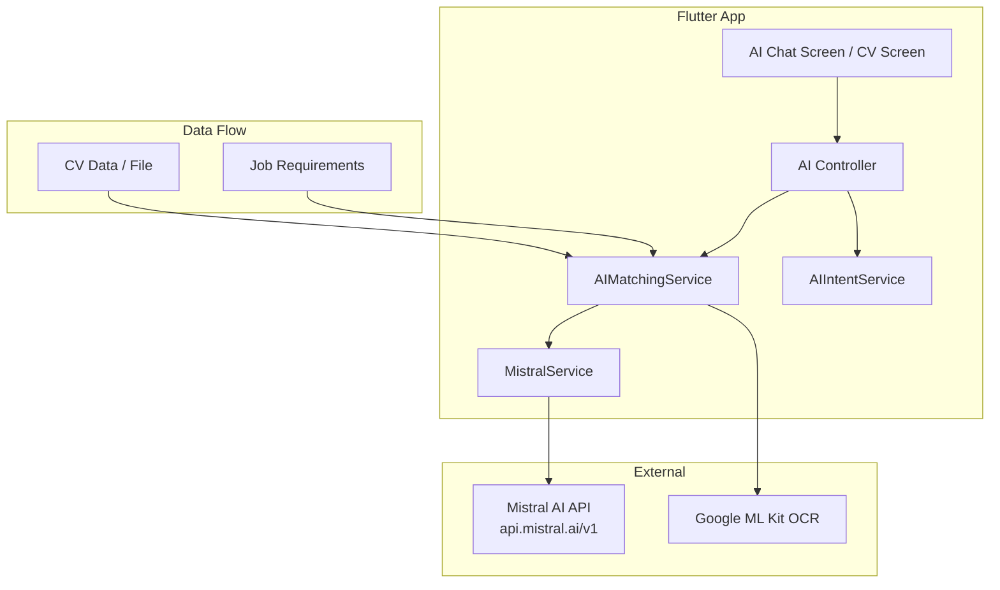
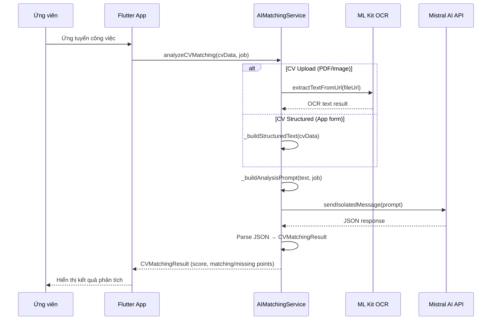

# Mistral AI

## Mục đích

Giải thích chi tiết về Mistral AI — dịch vụ AI được tích hợp vào NP FutureGate để cung cấp các tính năng thông minh: phân tích CV, chatbot tư vấn, và hệ thống intent-based queries.

## Định nghĩa

Mistral AI là một công ty AI của Pháp cung cấp các Large Language Models (LLMs) hiệu suất cao. Dự án sử dụng Mistral AI thông qua REST API (`https://api.mistral.ai/v1`) với model `open-mistral-7b` (hoặc model được cấu hình qua biến môi trường).

**Các tính năng AI trong dự án:**
- **CV Analysis:** Phân tích độ phù hợp giữa CV ứng viên và yêu cầu công việc
- **Chatbot:** Trợ lý AI tư vấn tìm việc, viết CV, chuẩn bị phỏng vấn
- **Intent-based Queries:** Hệ thống nhận diện ý định người dùng để truy vấn dữ liệu tự động

## Lý do sử dụng trong dự án

1. **API đơn giản:** REST API chuẩn OpenAI-compatible, dễ tích hợp từ Flutter qua HTTP.

2. **Hỗ trợ tiếng Việt:** Mistral models xử lý tiếng Việt tốt, phù hợp cho chatbot và phân tích CV tiếng Việt.

3. **JSON mode:** Hỗ trợ `response_format: json_object` — quan trọng cho CV analysis cần output có cấu trúc.

4. **Chi phí hợp lý:** Rẻ hơn GPT-4, phù hợp cho đồ án sinh viên.

5. **Tốc độ nhanh:** Model 7B cho response time nhanh, phù hợp cho chatbot realtime.

6. **Không cần SDK phức tạp:** Chỉ cần package `http` có sẵn, không cần thêm AI SDK.

## Cách tích hợp trong dự án

### Kiến trúc tích hợp AI



### Các service liên quan

| Service | File | Vai trò |
|---------|------|---------|
| `MistralService` | `mistral_service.dart` | Giao tiếp trực tiếp với Mistral API |
| `AIMatchingService` | `ai_matching_service.dart` | Phân tích CV matching |
| `AIIntentService` | `ai_intent_service.dart` | Nhận diện intent từ câu hỏi |
| `EnhancedAIService` | `enhanced_ai_service.dart` | AI service nâng cao |
| `MLKitOcrService` | `mlkit_ocr_service.dart` | OCR text extraction (hỗ trợ AI) |

## Ví dụ code từ dự án

### 1. MistralService — Core API Client (lib/core/services/mistral_service.dart)

```dart
class MistralService {
  factory MistralService() => _instance;
  MistralService._internal();
  static final MistralService _instance = MistralService._internal();

  final String _apiKey = dotenv.env['MISTRAL_API_KEY'] ?? '';
  final String _model = dotenv.env['MISTRAL_MODEL'] ?? 'open-mistral-7b';
  final String _baseUrl = 'https://api.mistral.ai/v1';

  final List<Map<String, String>> _conversationHistory = [];

  /// Gửi tin nhắn đến Mistral AI và nhận phản hồi (Chatbot mode)
  Future<String> sendMessage(String message) async {
    if (_apiKey.isEmpty) {
      throw Exception('Mistral API key chưa được cấu hình');
    }

    _conversationHistory.add({
      'role': 'user',
      'content': message,
    });

    try {
      final response = await http.post(
        Uri.parse('$_baseUrl/chat/completions'),
        headers: {
          'Content-Type': 'application/json',
          'Authorization': 'Bearer $_apiKey',
        },
        body: jsonEncode({
          'model': _model,
          'messages': [
            {
              'role': 'system',
              'content': '''Bạn là trợ lý AI thông minh của NP FutureGate - 
              nền tảng kết nối sinh viên với cơ hội việc làm.
              
Nhiệm vụ của bạn:
- Tư vấn về tìm việc, viết CV, chuẩn bị phỏng vấn
- Hướng dẫn sử dụng các tính năng của app
- Giải đáp thắc mắc về quy trình ứng tuyển
- Gợi ý ngành nghề phù hợp với profile sinh viên

Hãy trả lời thân thiện, chuyên nghiệp và súc tích bằng tiếng Việt.'''
            },
            ..._conversationHistory,
          ],
          'temperature': 0.7,
          'max_tokens': 4000,
        }),
      );

      if (response.statusCode == 200) {
        final data = jsonDecode(utf8.decode(response.bodyBytes));
        final assistantMessage = data['choices'][0]['message']['content'];
        _conversationHistory.add({
          'role': 'assistant',
          'content': assistantMessage,
        });
        return assistantMessage;
      } else {
        final error = jsonDecode(utf8.decode(response.bodyBytes));
        throw Exception('Lỗi API: ${error['message'] ?? response.statusCode}');
      }
    } catch (e) {
      rethrow;
    }
  }
}
```

### 2. Isolated Message — CV Analysis Mode

```dart
/// Gửi tin nhắn ĐỘC LẬP - không lưu history, không bị nhiễu
/// Dùng cho CV analysis (mỗi lần là 1 session riêng)
/// Có retry logic nếu thất bại
Future<String> sendIsolatedMessage(String message, 
    {String? systemPrompt, int maxRetries = 2}) async {
  if (_apiKey.isEmpty) {
    throw Exception('Mistral API key chưa được cấu hình');
  }

  final system = systemPrompt ?? 
    'Bạn là chuyên gia phân tích CV và tuyển dụng. '
    'Luôn trả lời chính xác bằng tiếng Việt. '
    'Khi được yêu cầu trả về JSON, CHỈ trả về đúng 1 object JSON hợp lệ.';

  Exception? lastError;

  for (int attempt = 0; attempt <= maxRetries; attempt++) {
    try {
      if (attempt > 0) {
        final delay = attempt == 1 ? 3 : 8;
        await Future.delayed(Duration(seconds: delay));
      }

      final response = await http.post(
        Uri.parse('$_baseUrl/chat/completions'),
        headers: {
          'Content-Type': 'application/json',
          'Authorization': 'Bearer $_apiKey',
        },
        body: jsonEncode({
          'model': _model,
          'messages': [
            {'role': 'system', 'content': system},
            {'role': 'user', 'content': message},
          ],
          'temperature': 0.1,  // Thấp hơn cho kết quả chính xác
          'max_tokens': 4096,
          'response_format': {'type': 'json_object'},
        }),
      );

      if (response.statusCode == 200) {
        final data = jsonDecode(utf8.decode(response.bodyBytes));
        return data['choices'][0]['message']['content'];
      } else if (response.statusCode == 429) {
        // Rate limit - đợi 30s rồi retry
        await Future.delayed(const Duration(seconds: 30));
      } else if (response.statusCode == 422 || response.statusCode == 400) {
        // Fallback: gửi không có json mode
        return await _sendWithoutJsonMode(system, message);
      }
    } catch (e) {
      lastError = e is Exception ? e : Exception(e.toString());
    }
  }

  throw lastError ?? Exception('Không thể kết nối Mistral AI');
}
```

### 3. CV Analysis — AIMatchingService (lib/core/services/ai_matching_service.dart)

```dart
class AIMatchingService {
  final MistralService _mistralService = MistralService();
  final MLKitOcrService _mlkitService = MLKitOcrService();

  /// Phân tích CV - tự phân biệt upload vs structured
  Future<CVMatchingResult> analyzeCVMatching({
    required Map<String, dynamic> cvData,
    required JobModel job,
  }) async {
    final String? fileUrl = cvData['file_url'] ?? cvData['data']?['file_url'];
    final String cvType = (cvData['type'] ?? '').toString();
    final bool isUpload = cvType == 'upload' || 
        (fileUrl != null && fileUrl.isNotEmpty);

    if (isUpload && fileUrl != null && fileUrl.isNotEmpty) {
      // LUỒNG 1: CV Upload → OCR → AI
      return await _analyzeUploadCV(fileUrl, job);
    } else {
      // LUỒNG 2: CV App → Structured → AI
      return await _analyzeStructuredCV(cvData, job);
    }
  }

  /// Prompt phân tích CV
  String _buildAnalysisPrompt(String cvText, JobModel job) => '''
PHÂN TÍCH ĐỘ PHÙ HỢP CV VỚI CÔNG VIỆC.

[CV]
$cvText

[CÔNG VIỆC]
Vị trí: ${job.metadata.title}
Mô tả: ${job.metadata.jobDescription.join('. ')}
Yêu cầu: ${job.metadata.candidateRequirements.join('. ')}
Kỹ năng: ${job.metadata.requirementsTags.join(', ')}

Trả về JSON duy nhất:
{"overall_score": 0-100, "semantic_similarity": 0.0-1.0, 
 "keyword_match_score": 0-100, "summary": "nhận xét tiếng Việt", 
 "matching_points": ["điểm phù hợp"], 
 "missing_points": ["điểm thiếu"], 
 "parsed_data": {"name": "", "skills": "", "experience": ""}}''';
}
```

### 4. Intent-based Queries — AIIntentService (lib/core/services/ai_intent_service.dart)

```dart
class AIIntentService {
  factory AIIntentService() => _instance;
  AIIntentService._internal();
  static final AIIntentService _instance = AIIntentService._internal();

  List<AIIntent> _intents = [];

  /// Phân tích câu hỏi của user để tìm intent phù hợp
  Future<IntentAnalysisResult> analyzeUserQuery(
    String query,
    String userRole,
  ) async {
    final normalizedQuery = query.toLowerCase().trim();

    // Lọc intents theo role (employer, student, school, all)
    final allowedIntents = _intents.where((intent) {
      return intent.requiredRoles.contains(userRole) ||
          intent.requiredRoles.contains('all');
    }).toList();

    AIIntent? bestMatch;
    double bestScore = 0.0;

    for (final intent in allowedIntents) {
      final double score = _calculateMatchScore(normalizedQuery, intent);
      if (score > bestScore) {
        bestScore = score;
        bestMatch = intent;
      }
    }

    // Threshold: 0.6 = có thể là intent này
    final isDataQuery = bestScore >= 0.6 && bestMatch != null;

    return IntentAnalysisResult(
      matchedIntent: isDataQuery ? bestMatch : null,
      confidence: bestScore,
      isDataQuery: isDataQuery,
      extractedParams: isDataQuery 
          ? _extractParameters(normalizedQuery, bestMatch) 
          : null,
    );
  }

  /// Tính điểm match giữa query và intent
  double _calculateMatchScore(String query, AIIntent intent) {
    double score = 0.0;
    int matchCount = 0;

    // Kiểm tra keywords (trọng số cao)
    for (final keyword in intent.keywords) {
      if (query.contains(keyword.toLowerCase())) {
        matchCount++;
        score += 0.3;
      }
    }

    // Kiểm tra patterns
    for (final pattern in intent.patterns) {
      if (query.contains(pattern.toLowerCase())) {
        matchCount++;
        score += 0.4;
      }
    }

    if (matchCount >= 2) score += 0.2;
    return score > 1.0 ? 1.0 : score;
  }
}
```

### 5. Ví dụ Intent Definitions

```dart
// Employer intent: Xem ứng viên ứng tuyển hôm nay
AIIntent(
  id: 'employer_applications_today',
  name: 'Xem ứng viên ứng tuyển hôm nay',
  category: 'applications',
  keywords: ['ứng tuyển', 'ứng viên', 'hôm nay', 'mới'],
  patterns: [
    'ứng tuyển hôm nay',
    'ứng viên hôm nay',
    'ứng viên mới',
    'danh sách ứng tuyển',
  ],
  description: 'Hiển thị danh sách các ứng viên đã ứng tuyển trong ngày',
  requiredRoles: ['employer'],
  actionType: 'data_query',
  queryConfig: {
    'table': 'applications',
    'filter': 'today',
    'include': ['student_profile', 'job_info'],
  },
),

// Student intent: Công việc đề xuất
AIIntent(
  id: 'student_recommended_jobs',
  name: 'Công việc đề xuất',
  category: 'jobs',
  keywords: ['đề xuất', 'gợi ý', 'recommended', 'phù hợp'],
  patterns: ['công việc đề xuất', 'gợi ý công việc', 'phù hợp'],
  description: 'Các công việc được đề xuất dựa trên hồ sơ của bạn',
  requiredRoles: ['student'],
  actionType: 'data_query',
  queryConfig: {
    'table': 'jobs',
    'filter': 'recommended',
  },
),
```

### 6. So sánh ứng viên (Compare CVs)

```dart
Future<CVComparisonResult> compareCVsStructured({
  required List<Map<String, dynamic>> cvsData,
  required List<String> candidateNames,
  required JobModel job,
}) async {
  final texts = await _getAllCVTexts(cvsData);
  final prompt = '''SO SÁNH ỨNG VIÊN VÀ TRẢ VỀ JSON

[YÊU CẦU CÔNG VIỆC]
Vị trí: ${job.metadata.title}

[ỨNG VIÊN]
${texts.asMap().entries.map((e) => 
    "[${candidateNames[e.key]}]\n${e.value}").join("\n\n")}

Đánh giá 5 tiêu chí (0-100): skills_score, experience_score, 
education_score, overall_score, potential_score.

TRẢ VỀ JSON:
{"candidates": [...], "recommendation": ""}''';

  final result = await _callAIAndParse(prompt);
  if (result != null) {
    return CVComparisonResult.fromJson(result, candidateNames);
  }
  // Fallback nếu AI lỗi...
}
```

## Luồng xử lý CV Analysis



## Ưu điểm

| Ưu điểm | Mô tả |
|----------|--------|
| **API đơn giản** | REST API chuẩn, dễ tích hợp |
| **Tiếng Việt tốt** | Xử lý NLP tiếng Việt chất lượng |
| **JSON mode** | Output có cấu trúc cho CV analysis |
| **Tốc độ** | Response nhanh với model 7B |
| **Chi phí thấp** | Rẻ hơn GPT-4/Claude |
| **Retry logic** | Xử lý rate limit và lỗi tự động |
| **Isolated sessions** | Tách biệt chatbot và CV analysis |

## Nhược điểm

| Nhược điểm | Mô tả | Giải pháp trong dự án |
|------------|--------|----------------------|
| **Rate limiting** | Giới hạn requests/phút | Retry logic với exponential backoff |
| **Không offline** | Cần internet | Hiển thị thông báo lỗi rõ ràng |
| **Hallucination** | AI có thể tạo thông tin sai | Validate JSON output, fallback values |
| **Token limit** | Giới hạn context window | Tóm tắt CV text trước khi gửi |
| **Không deterministic** | Kết quả có thể khác nhau mỗi lần | temperature=0.1 cho CV analysis |
| **API key exposure** | Key lưu trong .env | Sử dụng flutter_dotenv, không commit .env |

## Liên kết liên quan

- [AI Matching Flow](../02_co_che_tung_chuc_nang/ai_matching_flow.md)
- [Tổng quan kiến trúc](../01_tong_quan_kien_truc.md)
- [Điểm sáng kỹ thuật](../05_diem_sang_ky_thuat_va_business.md)
- [Google ML Kit OCR](./google_mlkit_ocr.md)
- [Công nghệ sử dụng](../04_cong_nghe_su_dung/tech_stack_overview.md)
