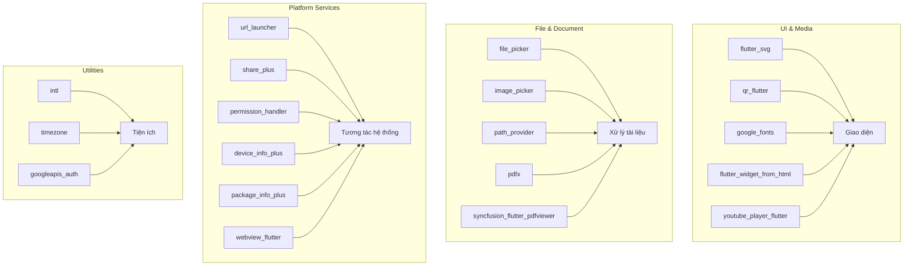

# Các Thư Viện Bổ Trợ Khác

## Mục đích

Tài liệu này giải thích chi tiết tất cả các thư viện bổ trợ còn lại được sử dụng trong dự án NP FutureGate, bao gồm mô tả ngắn, vai trò cụ thể trong dự án, và ví dụ sử dụng thực tế từ source code.

---

## 1. flutter_svg (^2.2.3)

### Mô tả
Thư viện render file SVG (Scalable Vector Graphics) trong Flutter. Hỗ trợ hiển thị hình ảnh vector với chất lượng cao ở mọi kích thước màn hình.

### Vai trò trong dự án
- Hiển thị logo, icon, và hình minh họa dạng vector trong giao diện ứng dụng
- Đảm bảo hình ảnh sắc nét trên mọi thiết bị với mật độ pixel khác nhau
- Giảm dung lượng ứng dụng so với sử dụng ảnh bitmap (PNG/JPG)

### Ví dụ sử dụng
```dart
import 'package:flutter_svg/flutter_svg.dart';

// Hiển thị logo SVG từ assets
SvgPicture.asset(
  'assets/logo/app_logo.svg',
  width: 120,
  height: 120,
);
```

---

## 2. qr_flutter (^4.1.0)

### Mô tả
Thư viện tạo và hiển thị mã QR (Quick Response Code) trong Flutter. Hỗ trợ tùy chỉnh màu sắc, kích thước, và mức độ sửa lỗi.

### Vai trò trong dự án
- Tạo mã QR cho liên kết thanh toán PayOS trong màn hình nâng cấp tài khoản
- Cho phép nhà tuyển dụng quét mã QR để thanh toán gói subscription

### Ví dụ sử dụng
```dart
import 'package:qr_flutter/qr_flutter.dart';

// Trong UpgradeAccountScreen - tạo QR code thanh toán
QrImageView(
  data: paymentUrl, // URL thanh toán từ PayOS
  version: QrVersions.auto,
  size: 200.0,
);
```

---

## 3. file_picker (^8.1.6)

### Mô tả
Thư viện cho phép người dùng chọn file từ bộ nhớ thiết bị. Hỗ trợ nhiều loại file: PDF, hình ảnh, tài liệu, v.v.

### Vai trò trong dự án
- Upload CV dạng PDF trong màn hình quản lý CV (`cv_upload_screen.dart`)
- Đính kèm file trong email template của nhà tuyển dụng (`email_template_editor_screen.dart`)
- Chọn file đính kèm trong hệ thống phản hồi ứng viên (`employer_response_repository.dart`)

### Ví dụ sử dụng
```dart
import 'package:file_picker/file_picker.dart';

// Chọn file PDF để upload CV
final result = await FilePicker.platform.pickFiles(
  type: FileType.custom,
  allowedExtensions: ['pdf'],
);

if (result != null) {
  final file = File(result.files.single.path!);
  // Upload file lên Supabase Storage
}
```

---

## 4. image_picker (^1.2.1)

### Mô tả
Thư viện chọn hình ảnh từ thư viện ảnh hoặc chụp ảnh trực tiếp từ camera. Hỗ trợ cả iOS và Android.

### Vai trò trong dự án
- Chọn/chụp ảnh đại diện trong màn hình chỉnh sửa profile (`edit_profile_screen.dart`)
- Chụp ảnh CV để scan OCR (`mlkit_ocr_service.dart`)
- Upload logo công ty cho nhà tuyển dụng (`edit_company_profile_screen.dart`)
- Chụp ảnh CV để phân tích AI (`cv_scan_analysis_screen.dart`)
- Gửi hình ảnh trong chat (`chat_detail_screen.dart`)

### Ví dụ sử dụng
```dart
import 'package:image_picker/image_picker.dart';

final picker = ImagePicker();

// Chọn ảnh từ thư viện
final XFile? image = await picker.pickImage(
  source: ImageSource.gallery,
  maxWidth: 800,
  imageQuality: 85,
);

// Hoặc chụp ảnh từ camera
final XFile? photo = await picker.pickImage(
  source: ImageSource.camera,
);
```

---

## 5. intl (^0.20.2)

### Mô tả
Thư viện quốc tế hóa (internationalization) của Dart. Cung cấp định dạng ngày tháng, số, tiền tệ theo locale, và hỗ trợ đa ngôn ngữ.

### Vai trò trong dự án
- Định dạng ngày tháng hiển thị trong toàn bộ ứng dụng (lịch phỏng vấn, tin tuyển dụng, chat)
- Định dạng tiền tệ VND trong thanh toán và subscription
- Hiển thị thời gian tương đối ("2 giờ trước", "hôm qua")
- Sử dụng rộng rãi trong hơn 20 file source code

### Ví dụ sử dụng
```dart
import 'package:intl/intl.dart';

// Định dạng ngày tháng tiếng Việt
final dateFormat = DateFormat('dd/MM/yyyy HH:mm');
final formattedDate = dateFormat.format(interview.scheduledAt);

// Định dạng tiền tệ
final currencyFormat = NumberFormat.currency(locale: 'vi_VN', symbol: '₫');
final price = currencyFormat.format(299000); // "299.000 ₫"
```

---

## 6. url_launcher (^6.3.2)

### Mô tả
Thư viện mở URL trong trình duyệt mặc định, gọi điện thoại, gửi email, hoặc mở ứng dụng bản đồ từ trong ứng dụng Flutter.

### Vai trò trong dự án
- Mở link thanh toán PayOS trong trình duyệt (`payos_service.dart`)
- Mở CV đã upload trên Supabase Storage (`cv_supabase_service.dart`)
- Mở website công ty từ trang chi tiết (`company_detail_screen.dart`)
- Gọi điện/gửi email cho nhà tuyển dụng (`companies_list_screen.dart`)
- Mở link download CV (`cv_display_manager.dart`)

### Ví dụ sử dụng
```dart
import 'package:url_launcher/url_launcher.dart';

// Mở link thanh toán trong trình duyệt
Future<void> openPaymentUrl(String paymentUrl) async {
  final uri = Uri.parse(paymentUrl);
  if (await canLaunchUrl(uri)) {
    await launchUrl(uri, mode: LaunchMode.externalApplication);
  }
}

// Gọi điện thoại
await launchUrl(Uri.parse('tel:+84123456789'));

// Gửi email
await launchUrl(Uri.parse('mailto:hr@company.com'));
```

---

## 7. share_plus (^12.0.1)

### Mô tả
Thư viện chia sẻ nội dung (text, link, file) từ ứng dụng Flutter sang các ứng dụng khác thông qua share sheet của hệ điều hành.

### Vai trò trong dự án
- Chia sẻ thông tin công ty, link tuyển dụng qua mạng xã hội
- Chia sẻ profile công ty từ màn hình chỉnh sửa (`edit_company_profile_screen.dart`)

### Ví dụ sử dụng
```dart
import 'package:share_plus/share_plus.dart';

// Chia sẻ link công ty
await Share.share(
  'Xem thông tin tuyển dụng tại ${company.name}: $companyUrl',
  subject: 'Thông tin tuyển dụng - ${company.name}',
);
```

---

## 8. permission_handler (^12.0.1)

### Mô tả
Thư viện quản lý quyền truy cập (permissions) trên thiết bị. Hỗ trợ yêu cầu, kiểm tra, và xử lý trạng thái quyền cho camera, microphone, storage, notifications, v.v.

### Vai trò trong dự án
- Xin quyền microphone cho tính năng nhập liệu bằng giọng nói (`speech_text_field.dart`)
- Xin quyền microphone cho chatbot voice input (`chatbot_screen.dart`)
- Xin quyền camera/storage cho upload ảnh và scan CV
- Xin quyền microphone trong chat voice message (`chat_detail_screen.dart`)

### Ví dụ sử dụng
```dart
import 'package:permission_handler/permission_handler.dart';

// Kiểm tra và xin quyền microphone
Future<bool> requestMicrophonePermission() async {
  final status = await Permission.microphone.status;
  if (status.isDenied) {
    final result = await Permission.microphone.request();
    return result.isGranted;
  }
  return status.isGranted;
}
```

---

## 9. device_info_plus (^12.3.0)

### Mô tả
Thư viện lấy thông tin chi tiết về thiết bị đang chạy ứng dụng: tên thiết bị, hệ điều hành, phiên bản, nhà sản xuất, v.v.

### Vai trò trong dự án
- Thu thập thông tin thiết bị khi đăng ký device token cho push notifications
- Lưu trữ metadata thiết bị (device_type, device_name) vào database để quản lý multi-device

### Ví dụ sử dụng
```dart
import 'package:device_info_plus/device_info_plus.dart';

// Lấy thông tin thiết bị trong DeviceTokenRepository
final deviceInfoPlugin = DeviceInfoPlugin();

if (Platform.isAndroid) {
  final androidInfo = await deviceInfoPlugin.androidInfo;
  deviceType = 'android';
  deviceName = '${androidInfo.manufacturer} ${androidInfo.model}';
} else if (Platform.isIOS) {
  final iosInfo = await deviceInfoPlugin.iosInfo;
  deviceType = 'ios';
  deviceName = '${iosInfo.name} ${iosInfo.model}';
}
```

---

## 10. package_info_plus (^9.0.0)

### Mô tả
Thư viện lấy thông tin về ứng dụng hiện tại: tên app, package name, version, build number.

### Vai trò trong dự án
- Lấy phiên bản ứng dụng (app_version) khi lưu device token
- Hiển thị thông tin phiên bản trong màn hình Settings
- Theo dõi version của app trên từng thiết bị để quản lý cập nhật

### Ví dụ sử dụng
```dart
import 'package:package_info_plus/package_info_plus.dart';

// Lấy thông tin phiên bản app
final packageInfo = await PackageInfo.fromPlatform();
final appVersion = packageInfo.version;     // "1.0.0"
final buildNumber = packageInfo.buildNumber; // "1"
final appName = packageInfo.appName;         // "NP FutureGate"
```

---

## 11. googleapis_auth (^1.6.0)

### Mô tả
Thư viện xác thực OAuth2 cho Google APIs. Hỗ trợ Service Account authentication và các phương thức xác thực khác của Google Cloud.

### Vai trò trong dự án
- Xác thực OAuth2 với Firebase Cloud Messaging V1 API
- Lấy access token từ Service Account để gửi push notifications server-side
- Thay thế legacy FCM API key bằng phương thức bảo mật hơn

### Ví dụ sử dụng
```dart
import 'package:googleapis_auth/auth_io.dart';

// Lấy OAuth2 access token trong PushNotificationService
static Future<String> _getAccessToken() async {
  final serviceAccountJson = await rootBundle.loadString(_serviceAccountPath);
  final accountCredentials = ServiceAccountCredentials.fromJson(
    json.decode(serviceAccountJson),
  );

  const scopes = ['https://www.googleapis.com/auth/firebase.messaging'];

  final authClient = await clientViaServiceAccount(
    accountCredentials,
    scopes,
  );

  final accessToken = authClient.credentials.accessToken.data;
  authClient.close();
  return accessToken;
}
```

---

## 12. timezone (^0.9.0)

### Mô tả
Thư viện xử lý múi giờ (timezone) trong Dart. Cung cấp database múi giờ IANA và các hàm chuyển đổi thời gian giữa các timezone.

### Vai trò trong dự án
- Khởi tạo timezone data khi app start (`main.dart`)
- Lên lịch local notifications theo đúng múi giờ người dùng
- Tính toán thời gian nhắc nhở phỏng vấn chính xác (`interview_reminder_service.dart`)

### Ví dụ sử dụng
```dart
import 'package:timezone/data/latest.dart' as tz;
import 'package:timezone/timezone.dart' as tz;

// Khởi tạo timezone trong main.dart
tz.initializeTimeZones();

// Tạo thời gian theo timezone cụ thể cho notification
final scheduledDate = tz.TZDateTime.from(
  interview.scheduledAt.subtract(Duration(minutes: 30)),
  tz.local,
);
```

---

## 13. path_provider (^2.1.5)

### Mô tả
Thư viện cung cấp đường dẫn đến các thư mục hệ thống phổ biến trên thiết bị: thư mục tạm, thư mục documents, thư mục cache.

### Vai trò trong dự án
- Lưu file tạm khi xử lý OCR scan CV (`mlkit_ocr_service.dart`)
- Lưu ảnh tạm từ PDF pages trước khi chạy text recognition
- Quản lý cache file cho hiệu suất tốt hơn

### Ví dụ sử dụng
```dart
import 'package:path_provider/path_provider.dart';

// Lấy thư mục tạm để lưu ảnh từ PDF
final tempDir = await getTemporaryDirectory();
final tempFile = File('${tempDir.path}/page_$i.png');

// Lưu ảnh page PDF vào file tạm để OCR
await tempFile.writeAsBytes(pageImage);
```

---

## 14. pdfx (^2.9.0)

### Mô tả
Thư viện render và xử lý file PDF trong Flutter. Hỗ trợ mở PDF, render từng trang thành hình ảnh, và hiển thị PDF viewer.

### Vai trò trong dự án
- Chuyển đổi từng trang PDF thành hình ảnh để phục vụ OCR scanning
- Hỗ trợ quy trình: PDF → Image → Google ML Kit Text Recognition
- Xử lý CV dạng PDF trong `mlkit_ocr_service.dart`

### Ví dụ sử dụng
```dart
import 'package:pdfx/pdfx.dart';

// Mở file PDF và render từng trang thành ảnh
final document = await PdfDocument.openFile(pdfFile.path);
final pageCount = document.pagesCount;

for (int i = 1; i <= pageCount; i++) {
  final page = await document.getPage(i);
  final pageImage = await page.render(
    width: page.width * 2,
    height: page.height * 2,
  );
  // Sử dụng pageImage cho OCR
  await page.close();
}
await document.close();
```

---

## 15. syncfusion_flutter_pdfviewer (^32.1.1)

### Mô tả
Thư viện PDF viewer chuyên nghiệp từ Syncfusion. Hỗ trợ hiển thị PDF với zoom, scroll, search text, bookmark, và nhiều tính năng nâng cao.

### Vai trò trong dự án
- Hiển thị CV dạng PDF cho ứng viên và nhà tuyển dụng xem trực tiếp trong app
- Xem trước CV trước khi gửi ứng tuyển (`cv_display_manager.dart`)
- Cung cấp trải nghiệm đọc PDF mượt mà với zoom và scroll

### Ví dụ sử dụng
```dart
import 'package:syncfusion_flutter_pdfviewer/pdfviewer.dart';

// Hiển thị PDF từ URL trong CV Display Manager
SfPdfViewer.network(
  cvUrl,
  canShowScrollHead: true,
  canShowScrollStatus: true,
  enableDoubleTapZooming: true,
);
```

---

## 16. flutter_widget_from_html (^0.15.2)

### Mô tả
Thư viện render nội dung HTML thành Flutter widgets. Hỗ trợ nhiều thẻ HTML, CSS inline, hình ảnh, link, bảng, và các phần tử phức tạp.

### Vai trò trong dự án
- Hiển thị kết quả phân tích trí tuệ đa dạng (MI - Multiple Intelligence) dạng HTML (`mi_result_screen.dart`)
- Render nội dung tin tức nghề nghiệp từ CMS (`career_news_detail_screen.dart`)
- Hiển thị nội dung rich text từ API response

### Ví dụ sử dụng
```dart
import 'package:flutter_widget_from_html/flutter_widget_from_html.dart';

// Hiển thị kết quả phân tích MI dạng HTML
HtmlWidget(
  analysisResult.htmlContent,
  textStyle: const TextStyle(fontSize: 14),
  onTapUrl: (url) {
    launchUrl(Uri.parse(url));
    return true;
  },
);
```

---

## 17. youtube_player_flutter (^9.0.3)

### Mô tả
Thư viện nhúng và phát video YouTube trong ứng dụng Flutter. Hỗ trợ điều khiển phát/dừng, fullscreen, caption, và tùy chỉnh giao diện player.

### Vai trò trong dự án
- Phát video bài học trong hệ thống khóa học trực tuyến (`lesson_video_screen.dart`)
- Hỗ trợ fullscreen, auto-play, và caption cho trải nghiệm học tập tốt
- Quản lý playlist bài học với chuyển video tự động

### Ví dụ sử dụng
```dart
import 'package:youtube_player_flutter/youtube_player_flutter.dart';

// Khởi tạo YouTube player cho bài học
_controller = YoutubePlayerController(
  initialVideoId: lesson.youtubeVideoId!,
  flags: const YoutubePlayerFlags(
    autoPlay: true,
    mute: false,
    enableCaption: true,
    controlsVisibleAtStart: true,
  ),
);

// Widget hiển thị player
YoutubePlayer(
  controller: _controller,
  showVideoProgressIndicator: true,
  progressIndicatorColor: AppMainColors.primary,
);
```

---

## 18. google_fonts (^6.2.1)

### Mô tả
Thư viện sử dụng font chữ từ Google Fonts trong Flutter. Hỗ trợ hơn 1000 font families, tải font động hoặc bundle sẵn.

### Vai trò trong dự án
- Tạo typography đẹp và chuyên nghiệp cho các template CV (`cv5.dart` - `cv9.dart`)
- Sử dụng font đặc biệt cho floating action button (`draggable_floating_button.dart`)
- Đa dạng hóa kiểu chữ trong các mẫu CV khác nhau

### Ví dụ sử dụng
```dart
import 'package:google_fonts/google_fonts.dart';

// Sử dụng Google Fonts trong CV template
Text(
  profileName,
  style: GoogleFonts.playfairDisplay(
    fontSize: 28,
    fontWeight: FontWeight.bold,
    color: Colors.white,
  ),
);

// Font cho tiêu đề section
Text(
  'Kinh nghiệm làm việc',
  style: GoogleFonts.roboto(
    fontSize: 16,
    fontWeight: FontWeight.w600,
  ),
);
```

---

## 19. webview_flutter (any)

### Mô tả
Thư viện nhúng trình duyệt web (WebView) trong ứng dụng Flutter. Hỗ trợ load URL, JavaScript, navigation delegate, và tùy chỉnh user agent.

### Vai trò trong dự án
- Hiển thị trang web bên ngoài trong app (điều khoản sử dụng, chính sách bảo mật)
- Xem CV trên Google Drive trực tiếp trong ứng dụng (`web_view_screen.dart`)
- Hiển thị nội dung web với progress indicator và xử lý lỗi

### Ví dụ sử dụng
```dart
import 'package:webview_flutter/webview_flutter.dart';

// Khởi tạo WebView controller trong WebViewScreen
_controller = WebViewController()
  ..setJavaScriptMode(JavaScriptMode.unrestricted)
  ..setBackgroundColor(Colors.black)
  ..setUserAgent('Mozilla/5.0 (Windows NT 10.0; Win64; x64)...')
  ..setNavigationDelegate(
    NavigationDelegate(
      onProgress: (int progress) {
        setState(() => _loadingProgress = progress / 100);
      },
      onPageFinished: (String url) {
        setState(() => _isLoading = false);
      },
    ),
  )
  ..loadRequest(Uri.parse(url));

// Widget hiển thị
WebViewWidget(controller: _controller);
```

---

## Bảng Tổng Hợp

| # | Thư viện | Phiên bản | Nhóm chức năng | Vai trò chính |
|---|----------|-----------|----------------|---------------|
| 1 | flutter_svg | ^2.2.3 | UI/Media | Hiển thị hình ảnh vector SVG |
| 2 | qr_flutter | ^4.1.0 | UI/Media | Tạo mã QR thanh toán |
| 3 | file_picker | ^8.1.6 | File I/O | Chọn file từ thiết bị |
| 4 | image_picker | ^1.2.1 | File I/O | Chọn/chụp ảnh |
| 5 | intl | ^0.20.2 | Localization | Định dạng ngày, số, tiền tệ |
| 6 | url_launcher | ^6.3.2 | Platform | Mở URL, gọi điện, gửi email |
| 7 | share_plus | ^12.0.1 | Platform | Chia sẻ nội dung |
| 8 | permission_handler | ^12.0.1 | Platform | Quản lý quyền truy cập |
| 9 | device_info_plus | ^12.3.0 | Platform | Lấy thông tin thiết bị |
| 10 | package_info_plus | ^9.0.0 | Platform | Lấy thông tin ứng dụng |
| 11 | googleapis_auth | ^1.6.0 | Authentication | OAuth2 cho FCM V1 API |
| 12 | timezone | ^0.9.0 | Utilities | Xử lý múi giờ |
| 13 | path_provider | ^2.1.5 | File I/O | Đường dẫn thư mục hệ thống |
| 14 | pdfx | ^2.9.0 | Document | Render PDF thành ảnh cho OCR |
| 15 | syncfusion_flutter_pdfviewer | ^32.1.1 | Document | Xem PDF chuyên nghiệp |
| 16 | flutter_widget_from_html | ^0.15.2 | UI/Content | Render HTML thành widgets |
| 17 | youtube_player_flutter | ^9.0.3 | Media | Phát video YouTube |
| 18 | google_fonts | ^6.2.1 | UI/Typography | Font chữ Google Fonts |
| 19 | webview_flutter | any | Platform | Nhúng trình duyệt web |

---

## Sơ Đồ Phân Nhóm Thư Viện



---

## Liên Kết Liên Quan

- [Tổng quan công nghệ sử dụng](../04_cong_nghe_su_dung/tech_stack_overview.md)
- [So sánh và lý do chọn công nghệ](../04_cong_nghe_su_dung/tech_comparison_reason.md)
- [Flutter Framework](./flutter.md)
- [Supabase](./supabase.md)
- [Firebase FCM](./firebase_fcm.md)
- [Google ML Kit OCR](./google_mlkit_ocr.md)
- [Dio vs HTTP](./dio_vs_http.md)
