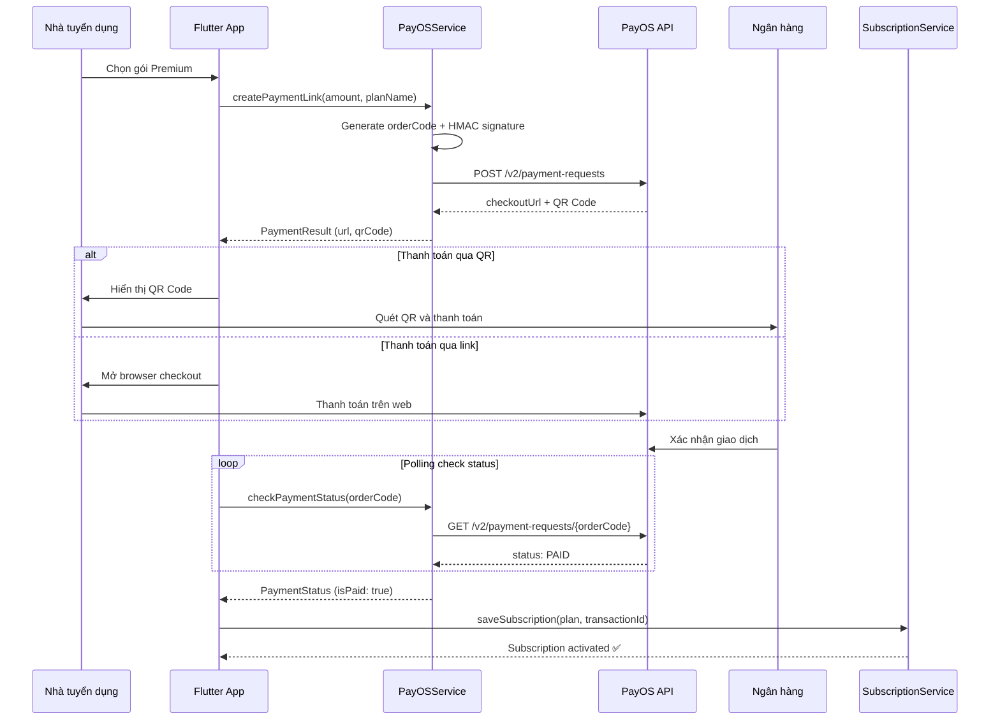

# PayOS — Cổng thanh toán

## Mục đích

Tài liệu giải thích chi tiết về **PayOS** — cổng thanh toán trực tuyến được tích hợp trong dự án NP FutureGate để xử lý thanh toán gói dịch vụ (subscription) cho nhà tuyển dụng.

## Định nghĩa

**PayOS** là một cổng thanh toán trực tuyến của Việt Nam, cung cấp API đơn giản để tích hợp thanh toán qua:
- Chuyển khoản ngân hàng (QR Code)
- Ví điện tử (MoMo, ZaloPay, VNPay)
- Thẻ quốc tế (Visa, Mastercard)

PayOS được thiết kế đặc biệt cho developer với API RESTful, documentation rõ ràng, và sandbox environment để test.

**Không có package riêng** — tích hợp qua REST API sử dụng `http` package.

## Lý do sử dụng trong dự án

NP FutureGate cần hệ thống thanh toán cho tính năng **Subscription (gói dịch vụ)** của nhà tuyển dụng:

1. **Gói Basic**: Miễn phí — giới hạn số tin đăng
2. **Gói Premium**: Trả phí — mở rộng tính năng AI matching, đăng tin không giới hạn
3. **Gói Enterprise**: Trả phí cao — tất cả tính năng + ưu tiên

Lý do chọn PayOS:
- **Việt Nam-focused**: Hỗ trợ ngân hàng Việt Nam, QR Code VietQR
- **API đơn giản**: RESTful API, dễ tích hợp không cần SDK phức tạp
- **Phí thấp**: Phí giao dịch cạnh tranh cho startup
- **Sandbox**: Môi trường test miễn phí
- **QR Code**: Tạo QR thanh toán tự động — phổ biến tại Việt Nam
- **Webhook**: Thông báo realtime khi thanh toán thành công

## Cách tích hợp trong dự án

### Kiến trúc thanh toán



### File liên quan

| File | Vai trò |
|------|---------|
| `lib/core/services/payos_service.dart` | Service chính gọi PayOS API |
| `lib/core/services/subscription_service.dart` | Quản lý subscription sau thanh toán |
| `lib/features/employer/screens/subscription/upgrade_account_screen.dart` | UI chọn gói |
| `lib/features/employer/screens/subscription/payment_history_screen.dart` | Lịch sử thanh toán |

### Cấu hình môi trường (.env)

```env
PAYOS_CLIENT_ID=your_client_id
PAYOS_API_KEY=your_api_key
PAYOS_CHECKSUM_KEY=your_checksum_key
```

## Ví dụ code từ dự án

### 1. PayOS Service — Singleton Pattern (`payos_service.dart`)

```dart
import 'dart:convert';
import 'package:crypto/crypto.dart';
import 'package:http/http.dart' as http;

class PayOSService {
  factory PayOSService() => _instance;
  PayOSService._internal();
  static final PayOSService _instance = PayOSService._internal();

  String get _clientId => dotenv.env['PAYOS_CLIENT_ID'] ?? '';
  String get _apiKey => dotenv.env['PAYOS_API_KEY'] ?? '';
  String get _checksumKey => dotenv.env['PAYOS_CHECKSUM_KEY'] ?? '';

  static const String _baseUrl = 'https://api-merchant.payos.vn';
}
```

### 2. Tạo link thanh toán

```dart
Future<PaymentResult> createPaymentLink({
  required int amount,
  required String planName,
  required String userId,
  String? returnUrl,
  String? cancelUrl,
}) async {
  if (_clientId.isEmpty || _apiKey.isEmpty) {
    return PaymentResult(
      success: false,
      error: 'PayOS credentials chưa được cấu hình',
    );
  }

  final orderCode = DateTime.now().millisecondsSinceEpoch % 9007199254740991;
  final description = 'Goi $planName'.substring(0, 25);
  final actualCancelUrl = cancelUrl ?? 'https://npfuturegate.com/payment/cancel';
  final actualReturnUrl = returnUrl ?? 'https://npfuturegate.com/payment/success';

  // PayOS signature: alphabetical order
  final signatureData =
      'amount=$amount&cancelUrl=$actualCancelUrl&description=$description'
      '&orderCode=$orderCode&returnUrl=$actualReturnUrl';

  // Generate HMAC-SHA256 checksum
  final checksum = _generateChecksum(signatureData);

  final body = {
    'orderCode': orderCode,
    'amount': amount,
    'description': description,
    'buyerName': 'Customer',
    'items': [{'name': 'Goi $planName', 'quantity': 1, 'price': amount}],
    'cancelUrl': actualCancelUrl,
    'returnUrl': actualReturnUrl,
    'expiredAt': DateTime.now()
        .add(const Duration(hours: 24))
        .millisecondsSinceEpoch ~/ 1000,
    'signature': checksum,
  };

  final response = await http.post(
    Uri.parse('$_baseUrl/v2/payment-requests'),
    headers: {
      'Content-Type': 'application/json',
      'x-client-id': _clientId,
      'x-api-key': _apiKey,
    },
    body: jsonEncode(body),
  );

  if (response.statusCode == 200) {
    final data = jsonDecode(response.body);
    if (data['code'] == '00') {
      final responseData = data['data'];
      return PaymentResult(
        success: true,
        paymentUrl: responseData['checkoutUrl'],
        qrCodeData: responseData['qrCode'],
        orderCode: orderCode.toString(),
        accountNumber: responseData['accountNumber'],
        accountName: responseData['accountName'],
        amount: amount,
      );
    }
  }
  return PaymentResult(success: false, error: 'Lỗi tạo link thanh toán');
}
```

### 3. Kiểm tra trạng thái thanh toán

```dart
Future<PaymentStatus> checkPaymentStatus(String orderCode) async {
  try {
    final response = await http.get(
      Uri.parse('$_baseUrl/v2/payment-requests/$orderCode'),
      headers: {
        'x-client-id': _clientId,
        'x-api-key': _apiKey,
      },
    );

    if (response.statusCode == 200) {
      final data = jsonDecode(response.body);
      if (data['code'] == '00') {
        final status = data['data']['status'] as String;
        return PaymentStatus(
          orderCode: orderCode,
          status: status,
          isPaid: status == 'PAID',
          transactionId: data['data']['transactions']?.isNotEmpty == true
              ? data['data']['transactions'][0]['reference']
              : null,
        );
      }
    }

    return PaymentStatus(
      orderCode: orderCode,
      status: 'UNKNOWN',
      isPaid: false,
    );
  } catch (e) {
    return PaymentStatus(
      orderCode: orderCode,
      status: 'ERROR',
      isPaid: false,
      error: e.toString(),
    );
  }
}
```

### 4. Tạo HMAC-SHA256 Checksum

```dart
String _generateChecksum(String data) {
  final key = utf8.encode(_checksumKey);
  final bytes = utf8.encode(data);
  final hmacSha256 = Hmac(sha256, key);
  final digest = hmacSha256.convert(bytes);
  return digest.toString();
}
```

### 5. Mở URL thanh toán trong browser

```dart
Future<bool> openPaymentUrl(String url) async {
  final uri = Uri.parse(url);
  if (await canLaunchUrl(uri)) {
    return await launchUrl(uri, mode: LaunchMode.externalApplication);
  }
  return false;
}
```

### 6. Data Models

```dart
class PaymentResult {
  PaymentResult({
    required this.success,
    this.paymentUrl,
    this.qrCodeData,      // QR code string data
    this.orderCode,
    this.accountNumber,
    this.accountName,
    this.amount,
    this.description,
    this.error,
  });
  final bool success;
  final String? paymentUrl;
  final String? qrCodeData;
  final String? orderCode;
  final String? accountNumber;
  final String? accountName;
  final int? amount;
  final String? description;
  final String? error;
}

class PaymentStatus {
  PaymentStatus({
    required this.orderCode,
    required this.status,
    required this.isPaid,
    this.transactionId,
    this.error,
  });
  final String orderCode;
  final String status;    // PENDING, PAID, CANCELLED, EXPIRED
  final bool isPaid;
  final String? transactionId;
  final String? error;
}
```

## Bảo mật

| Cơ chế | Mô tả |
|--------|--------|
| **HMAC-SHA256** | Signature cho mỗi request để xác thực |
| **Environment variables** | Credentials lưu trong `.env`, không hardcode |
| **Server-side verification** | PayOS verify signature phía server |
| **Order expiration** | Link thanh toán hết hạn sau 24 giờ |
| **HTTPS only** | Mọi communication qua HTTPS |

## Ưu điểm

| Ưu điểm | Mô tả |
|----------|--------|
| **Việt Nam native** | Hỗ trợ đầy đủ ngân hàng VN, VietQR |
| **API đơn giản** | RESTful, chỉ cần http package |
| **QR Code** | Tạo QR thanh toán tự động |
| **Sandbox** | Test miễn phí không cần tiền thật |
| **Phí thấp** | Cạnh tranh cho startup/đồ án |
| **Realtime status** | Polling hoặc webhook để check trạng thái |
| **Không cần SDK** | Tích hợp qua REST API thuần |
| **Multi-method** | Bank transfer, e-wallet, card |

## Nhược điểm

| Nhược điểm | Mô tả |
|------------|--------|
| **Chỉ Việt Nam** | Không hỗ trợ thanh toán quốc tế tốt |
| **Không có Flutter SDK** | Phải tự implement REST calls |
| **Polling** | Cần polling để check status (không có push notification) |
| **Documentation** | Tài liệu chưa phong phú bằng Stripe |
| **Startup mới** | Ít case study và community support |
| **Không recurring** | Chưa hỗ trợ auto-recurring subscription |
| **Refund thủ công** | Hoàn tiền cần xử lý qua dashboard |

## Liên kết liên quan

- [Tổng quan kiến trúc](../01_tong_quan_kien_truc.md)
- [Luồng thanh toán](../02_co_che_tung_chuc_nang/payment_flow.md)
- [Dio vs HTTP](./dio_vs_http.md)
- [Điểm sáng kỹ thuật](../05_diem_sang_ky_thuat_va_business.md)
- [So sánh công nghệ](../04_cong_nghe_su_dung/tech_comparison_reason.md)
