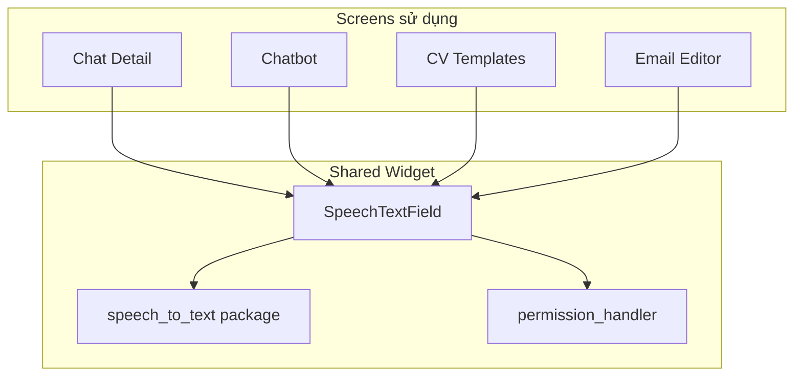
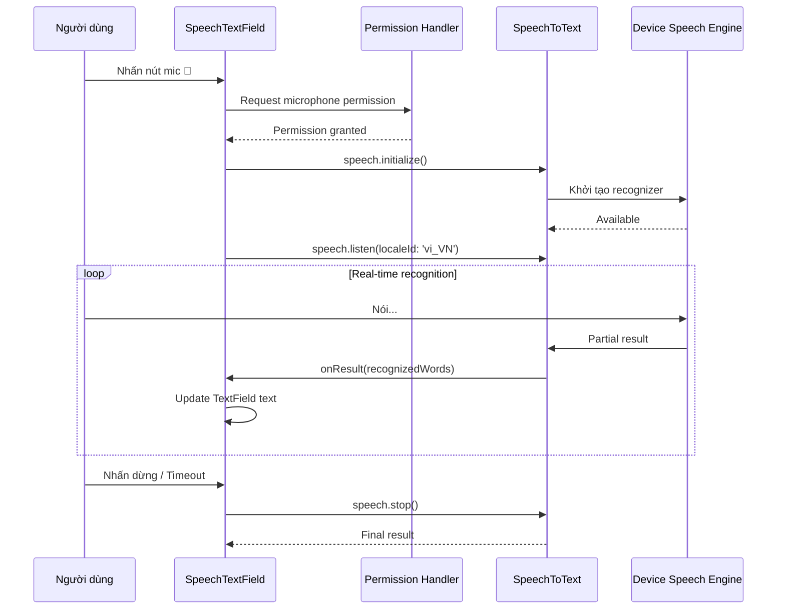

# Speech to Text — Nhận dạng giọng nói

## Mục đích

Tài liệu giải thích chi tiết về thư viện **speech_to_text** — thư viện nhận dạng giọng nói (Speech Recognition) được sử dụng trong dự án NP FutureGate để cho phép người dùng nhập liệu bằng giọng nói thay vì gõ phím.

## Định nghĩa

**speech_to_text** là một Flutter plugin cho phép chuyển đổi giọng nói thành văn bản (Speech-to-Text / STT) sử dụng các engine nhận dạng giọng nói có sẵn trên thiết bị:
- **Android**: Google Speech Recognition
- **iOS**: Apple Speech Framework

Package: `speech_to_text: ^7.3.0`

## Lý do sử dụng trong dự án

NP FutureGate tích hợp nhận dạng giọng nói vào **nhiều màn hình nhập liệu** để:

1. **Tăng trải nghiệm người dùng**: Nhập liệu nhanh hơn bằng giọng nói
2. **Hỗ trợ accessibility**: Người dùng khó khăn trong việc gõ phím có thể dùng giọng nói
3. **Chatbot AI**: Người dùng có thể nói câu hỏi thay vì gõ
4. **Tìm kiếm CV template**: Tìm kiếm bằng giọng nói
5. **Soạn email**: Nhà tuyển dụng có thể đọc nội dung email

Lý do chọn speech_to_text:
- **On-device**: Sử dụng engine có sẵn trên thiết bị, không tốn API
- **Hỗ trợ tiếng Việt**: Locale `vi_VN` cho nhận dạng tiếng Việt
- **Real-time**: Partial results cho phản hồi tức thì
- **Cross-platform**: Hoạt động trên cả Android và iOS

## Cách tích hợp trong dự án

### Các màn hình sử dụng

| Màn hình | File | Mục đích |
|----------|------|----------|
| **SpeechTextField** (Widget dùng chung) | `lib/shared/widgets/inputs/speech_text_field.dart` | Widget TextField tích hợp mic |
| Chatbot Screen | `lib/screens/chatbot/chatbot_screen.dart` | Hỏi AI bằng giọng nói |
| Chat Detail Screen | `lib/features/chat/screens/chat_detail_screen.dart` | Nhắn tin bằng giọng nói |
| CV Templates Screen | `lib/features/cv/screens/cv_setting/cv_general_templates_screen.dart` | Tìm kiếm template |
| Email Template Editor | `lib/features/employer/screens/email_template_editor_screen.dart` | Soạn email bằng giọng nói |

### Kiến trúc Widget tái sử dụng



### Luồng xử lý



## Ví dụ code từ dự án

### 1. Widget SpeechTextField — Tái sử dụng (`speech_text_field.dart`)

```dart
import 'package:speech_to_text/speech_to_text.dart' as stt;
import 'package:permission_handler/permission_handler.dart';

class _SpeechTextFieldState extends State<SpeechTextField>
    with SingleTickerProviderStateMixin {
  late stt.SpeechToText _speech;
  bool _isListening = false;
  bool _speechAvailable = false;
  String _currentWords = '';
  int _speechStartPosition = 0;
  String _lastRecognizedWords = '';

  @override
  void initState() {
    super.initState();
    _speech = stt.SpeechToText();
    _initSpeech();
  }

  Future<void> _initSpeech() async {
    try {
      _speechAvailable = await _speech.initialize(
        onError: (error) {
          setState(() => _isListening = false);
          if (error.errorMsg.contains('recognizerNotAvailable')) {
            _showError(
              'Nhận diện giọng nói không khả dụng.\n'
              'Vui lòng:\n'
              '1. Cài đặt Google App\n'
              '2. Bật quyền Microphone\n'
              '3. Kết nối Internet'
            );
          }
        },
        onStatus: (status) {
          if (status == 'done' || status == 'notListening') {
            setState(() => _isListening = false);
          }
        },
      );
    } catch (e) {
      setState(() => _speechAvailable = false);
    }
  }
}
```

### 2. Bắt đầu/Dừng nghe — Toggle Listening

```dart
Future<void> _toggleListening() async {
  if (!_speechAvailable) {
    // Check and request permission
    final status = await Permission.microphone.request();
    if (!status.isGranted) {
      _showError('Cần cấp quyền microphone để sử dụng tính năng này');
      return;
    }
    await _initSpeech();
  }

  if (_isListening) {
    // Stop listening
    await _speech.stop();
    setState(() {
      _isListening = false;
      _lastRecognizedWords = '';
    });
  } else {
    // Start listening at current cursor position
    _speechStartPosition = widget.controller.selection.baseOffset;
    if (_speechStartPosition < 0) {
      _speechStartPosition = widget.controller.text.length;
    }

    setState(() {
      _isListening = true;
      _currentWords = '';
      _lastRecognizedWords = '';
    });

    await _speech.listen(
      onResult: (result) {
        if (!_isListening) return;
        final recognizedWords = result.recognizedWords;

        setState(() {
          _currentWords = recognizedWords;
          // Insert recognized text at cursor position
          final currentText = widget.controller.text;
          String textBeforeSpeech = currentText.substring(0, _speechStartPosition);
          String textAfterSpeech;

          if (_lastRecognizedWords.isNotEmpty) {
            final lastEndPosition = _speechStartPosition + _lastRecognizedWords.length;
            textAfterSpeech = currentText.substring(lastEndPosition);
          } else {
            textAfterSpeech = currentText.substring(_speechStartPosition);
          }

          final newText = textBeforeSpeech + recognizedWords + textAfterSpeech;
          widget.controller.value = TextEditingValue(
            text: newText,
            selection: TextSelection.collapsed(
              offset: _speechStartPosition + recognizedWords.length,
            ),
          );

          _lastRecognizedWords = recognizedWords;
        });
      },
      listenFor: const Duration(seconds: 30),
      pauseFor: const Duration(seconds: 3),
      listenOptions: stt.SpeechListenOptions(
        partialResults: true,
        cancelOnError: false,
        listenMode: stt.ListenMode.dictation,
      ),
      localeId: 'vi_VN', // Vietnamese
    );
  }
}
```

### 3. UI — Nút mic với animation

```dart
Widget _buildMicButton() {
  return AnimatedBuilder(
    animation: _animationController,
    builder: (context, child) {
      return Transform.scale(
        scale: _isListening ? _scaleAnimation.value : 1.0,
        child: Container(
          width: 40,
          height: 40,
          decoration: BoxDecoration(
            shape: BoxShape.circle,
            gradient: _isListening
                ? LinearGradient(colors: [Colors.red[400]!, Colors.red[600]!])
                : LinearGradient(colors: [Colors.blue[400]!, Colors.blue[600]!]),
            boxShadow: [
              BoxShadow(
                color: (_isListening ? Colors.red : Colors.blue)
                    .withValues(alpha: 0.3),
                blurRadius: _isListening ? 8 : 4,
              ),
            ],
          ),
          child: InkWell(
            onTap: widget.enabled ? _toggleListening : null,
            child: Icon(
              _isListening ? Icons.mic : Icons.mic_none,
              color: Colors.white,
              size: 20,
            ),
          ),
        ),
      );
    },
  );
}
```

### 4. Live transcription indicator

```dart
// Hiển thị trạng thái đang nghe
if (_isListening) ...[
  Container(
    padding: const EdgeInsets.symmetric(horizontal: 12, vertical: 8),
    decoration: BoxDecoration(
      color: Colors.red[50],
      borderRadius: BorderRadius.circular(8),
      border: Border.all(color: Colors.red[200]!),
    ),
    child: Row(
      children: [
        Container(
          width: 8, height: 8,
          decoration: const BoxDecoration(
            color: Colors.red,
            shape: BoxShape.circle,
          ),
        ),
        const SizedBox(width: 8),
        Expanded(
          child: Text(
            _currentWords.isEmpty
                ? 'Đang lắng nghe...'
                : 'Đang nhận diện: "$_currentWords"',
            style: TextStyle(fontSize: 12, color: Colors.red[700]),
          ),
        ),
      ],
    ),
  ),
],
```

## Ưu điểm

| Ưu điểm | Mô tả |
|----------|--------|
| **On-device** | Sử dụng engine có sẵn, không tốn API cost |
| **Tiếng Việt** | Hỗ trợ locale `vi_VN` cho nhận dạng tiếng Việt |
| **Real-time** | Partial results cho phản hồi tức thì khi nói |
| **Cross-platform** | Android (Google) + iOS (Apple Speech) |
| **Dễ tích hợp** | API đơn giản: initialize → listen → stop |
| **Permission handling** | Tích hợp tốt với permission_handler |
| **Dictation mode** | Hỗ trợ chế độ đọc chính tả dài |

## Nhược điểm

| Nhược điểm | Mô tả |
|------------|--------|
| **Cần internet** | Hầu hết engine cần kết nối mạng để nhận dạng |
| **Giới hạn thời gian** | Tối đa 30-60 giây mỗi lần nghe |
| **Tiếng Việt chưa hoàn hảo** | Đôi khi nhận sai từ có dấu hoặc từ địa phương |
| **Phụ thuộc device** | Chất lượng phụ thuộc vào engine trên thiết bị |
| **Không hoạt động trên emulator** | Cần thiết bị thật để test |
| **Background noise** | Nhạy cảm với tiếng ồn xung quanh |
| **Không custom model** | Không thể train model riêng cho domain cụ thể |

## Liên kết liên quan

- [Tổng quan kiến trúc](../01_tong_quan_kien_truc.md)
- [Luồng chat](../02_co_che_tung_chuc_nang/chat_flow.md)
- [Điểm sáng kỹ thuật](../05_diem_sang_ky_thuat_va_business.md)
- [Các thư viện khác](./other_libraries.md)
