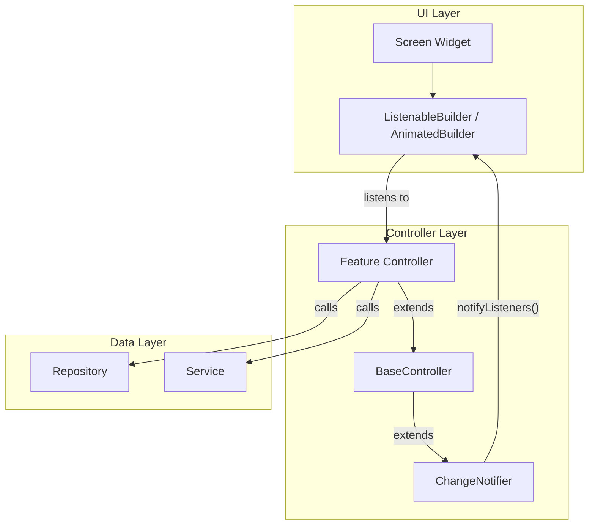

# State Management — ChangeNotifier + BaseController Pattern

## Mục đích

Giải thích chi tiết cơ chế quản lý trạng thái (state management) trong dự án NP FutureGate, sử dụng ChangeNotifier kết hợp với BaseController pattern tự xây dựng.

## Định nghĩa

### ChangeNotifier

`ChangeNotifier` là một class trong Flutter framework cung cấp cơ chế **observer pattern** đơn giản. Khi state thay đổi, gọi `notifyListeners()` để thông báo cho tất cả listeners (thường là widgets) rebuild lại UI.

### BaseController Pattern

`BaseController` là một abstract class tự xây dựng trong dự án, kế thừa từ `ChangeNotifier`, cung cấp các chức năng chung cho tất cả controllers:
- Quản lý trạng thái loading
- Quản lý trạng thái error
- Safe notification (tránh gọi notifyListeners sau khi dispose)

## Lý do sử dụng trong dự án

1. **Đơn giản và dễ hiểu:** ChangeNotifier là giải pháp state management có sẵn trong Flutter, không cần thêm dependency bên ngoài (so với Bloc, Riverpod, GetX).

2. **Phù hợp với kiến trúc MVC:** Controller giữ business logic, View (Screen) lắng nghe thay đổi và rebuild — tách biệt rõ ràng.

3. **Lightweight:** Không có boilerplate code phức tạp như Bloc (Event/State classes) hay code generation như Riverpod.

4. **BaseController giảm code lặp:** Mọi controller đều cần loading state, error handling, và safe dispose — BaseController cung cấp sẵn.

5. **Dễ mở rộng:** Thêm feature mới chỉ cần tạo controller mới extends BaseController.

## Cách tích hợp trong dự án

### Kiến trúc tổng thể



### Luồng hoạt động

```
1. User tương tác với UI (tap button, scroll, input text)
2. Screen gọi method trên Controller
3. Controller set isLoading = true → notifyListeners() → UI hiển thị loading
4. Controller gọi Repository/Service để lấy/xử lý data
5. Controller cập nhật state nội bộ
6. Controller set isLoading = false → notifyListeners() → UI rebuild với data mới
7. Nếu có lỗi: Controller gọi setError() → notifyListeners() → UI hiển thị error
```

## Ví dụ code từ dự án

### 1. BaseController (lib/core/controllers/base_controller.dart)

```dart
import 'package:flutter/foundation.dart';

/// Abstract base class for all controllers providing common state management.
///
/// Provides:
/// - Loading state management via [isLoading]
/// - Error state management via [error] and [hasError]
/// - Safe notification via [safeNotifyListeners] that checks disposal state
abstract class BaseController extends ChangeNotifier {
  bool _isLoading = false;
  bool _isDisposed = false;
  String? _error;

  /// Whether the controller is currently performing an async operation.
  bool get isLoading => _isLoading;

  /// Whether the controller has an active error.
  bool get hasError => _error != null;

  /// The current error message, or null if no error.
  String? get error => _error;

  /// Sets the loading state and notifies listeners.
  @protected
  set isLoading(bool value) {
    _isLoading = value;
    safeNotifyListeners();
  }

  /// Sets the error state and notifies listeners.
  @protected
  void setError(String? error) {
    _error = error;
    safeNotifyListeners();
  }

  /// Calls [notifyListeners] only if the controller has not been disposed.
  @protected
  void safeNotifyListeners() {
    if (!_isDisposed) {
      notifyListeners();
    }
  }

  @override
  void dispose() {
    _isDisposed = true;
    super.dispose();
  }
}
```

### 2. Feature Controller (lib/features/candidate/controllers/home_candidate_controller.dart)

```dart
class HomeCandidateController extends ChangeNotifier {
  final AuthRepository _authRepo = AuthRepository();
  final JobRepository _jobRepo = JobRepository();

  Profile? _profile;
  List<String> _savedJobIds = [];
  List<String> _appliedJobIds = [];
  bool _isDisposed = false;

  // Getters - UI đọc state qua đây
  Profile? get profile => _profile;
  List<String> get savedJobIds => _savedJobIds;
  List<String> get appliedJobIds => _appliedJobIds;
  Stream<List<JobModel>> get activeJobsStream => _jobRepo.activeJobsStream;

  String get fullName =>
      _profile?.fullName ??
      SupabaseService.instance.currentUser?.userMetadata?['full_name'] ??
      'Người dùng';

  /// Initialize controller - load profile and saved jobs.
  Future<void> init() async {
    await Future.wait([
      _loadProfile(),
      _loadSavedJobs(),
    ]);
  }

  Future<void> _loadProfile() async {
    final profile = await _authRepo.getCurrentUserProfile();
    if (!_isDisposed) {
      _profile = profile;
      notifyListeners(); // Thông báo UI rebuild
    }
  }

  /// Toggle save/unsave a job with optimistic update.
  Future<void> toggleSaveJob(String jobId) async {
    final user = SupabaseService.instance.currentUser;
    if (user == null) return;

    // Optimistic update - cập nhật UI ngay lập tức
    if (_savedJobIds.contains(jobId)) {
      _savedJobIds.remove(jobId);
    } else {
      _savedJobIds.add(jobId);
    }
    notifyListeners();

    try {
      await _jobRepo.toggleSaveJob(user.id, jobId);
    } catch (e) {
      // Revert on error - hoàn tác nếu API thất bại
      await _loadSavedJobs();
      rethrow;
    }
  }

  /// Filter jobs: created within 24h AND matches user profile fields.
  List<JobModel> filterTodayJobs(List<JobModel> allJobs) {
    final now = DateTime.now();
    return allJobs.where((job) {
      if (job.createdAt == null) return false;
      final diff = now.difference(job.createdAt!);
      if (diff.inHours > 24) return false;

      if (_profile != null) {
        final userFields = _profile!.metadata['interested_fields'];
        if (userFields is List && userFields.isNotEmpty) {
          final jobFields = job.metadata.fields;
          final hasMatch = userFields.any(
            (uField) => jobFields.any(
              (jField) => jField.toString().toLowerCase() ==
                  uField.toString().toLowerCase(),
            ),
          );
          if (!hasMatch) return false;
        }
      }
      return true;
    }).toList();
  }

  @override
  void dispose() {
    _isDisposed = true;
    super.dispose();
  }
}
```

### 3. Cách sử dụng Controller trong UI

```dart
// Trong Screen widget
class CandidateHomeScreen extends StatefulWidget {
  @override
  State<CandidateHomeScreen> createState() => _CandidateHomeScreenState();
}

class _CandidateHomeScreenState extends State<CandidateHomeScreen> {
  final _controller = HomeCandidateController();

  @override
  void initState() {
    super.initState();
    _controller.init();
  }

  @override
  void dispose() {
    _controller.dispose();
    super.dispose();
  }

  @override
  Widget build(BuildContext context) {
    return ListenableBuilder(
      listenable: _controller,
      builder: (context, child) {
        if (_controller.isLoading) {
          return const CircularProgressIndicator();
        }
        return Text('Xin chào, ${_controller.fullName}');
      },
    );
  }
}
```

### 4. PaginationMixin (lib/core/controllers/pagination_mixin.dart)

Dự án còn sử dụng mixin pattern để thêm chức năng phân trang cho controllers:

```dart
mixin PaginationMixin on ChangeNotifier {
  int _currentPage = 0;
  bool _hasMore = true;
  bool _isLoadingMore = false;

  int get currentPage => _currentPage;
  bool get hasMore => _hasMore;
  bool get isLoadingMore => _isLoadingMore;

  // Controllers sử dụng mixin này để hỗ trợ infinite scroll
}
```

## So sánh với các giải pháp khác

| Tiêu chí | ChangeNotifier | Bloc | Riverpod | GetX |
|-----------|---------------|------|----------|------|
| **Complexity** | Thấp | Cao | Trung bình | Thấp |
| **Boilerplate** | Ít | Nhiều (Event/State) | Trung bình | Ít |
| **Testability** | Tốt | Rất tốt | Rất tốt | Trung bình |
| **Learning curve** | Thấp | Cao | Trung bình | Thấp |
| **Dependency** | Không (built-in) | bloc, flutter_bloc | riverpod | get |
| **Scalability** | Trung bình | Cao | Cao | Trung bình |
| **Phù hợp dự án** | ✅ Đủ dùng | Overkill | Tốt nhưng phức tạp | Quá magic |

**Lý do chọn ChangeNotifier cho NP FutureGate:**
- Dự án đồ án cá nhân, cần đơn giản và dễ giải thích
- BaseController pattern đã giải quyết vấn đề code lặp
- Không cần reactive streams phức tạp (Bloc)
- Không cần code generation (Riverpod)

## Ưu điểm

| Ưu điểm | Mô tả |
|----------|--------|
| **Built-in** | Không cần thêm package bên ngoài |
| **Đơn giản** | Dễ hiểu, dễ debug, dễ giải thích |
| **Flexible** | Có thể kết hợp với Stream, Future |
| **BaseController** | Giảm boilerplate, chuẩn hóa error/loading |
| **Safe dispose** | Tránh crash khi widget đã unmount |
| **Optimistic update** | Dễ implement pattern cập nhật UI trước, rollback nếu lỗi |

## Nhược điểm

| Nhược điểm | Mô tả | Giải pháp |
|------------|--------|-----------|
| **Rebuild toàn bộ** | notifyListeners() rebuild tất cả listeners | Chia nhỏ controllers theo feature |
| **Không có DevTools** | Không có time-travel debugging như Bloc | Sử dụng debugPrint logging |
| **Manual dispose** | Phải tự quản lý lifecycle | BaseController + _isDisposed flag |
| **Khó test phức tạp** | Không có event/state separation | Unit test trực tiếp trên controller |
| **Không reactive** | Không có stream-based state | Kết hợp với Supabase Realtime streams |

## Liên kết liên quan

- [Tổng quan kiến trúc](../01_tong_quan_kien_truc.md)
- [Flutter](./flutter.md)
- [Sơ đồ State Management Flow](../03_so_do_flow/state_management_flow.mermaid)
- [Phân tích file dùng chung](../11_phan_tich_cac_file_dung_chung/utils_analysis.md)
