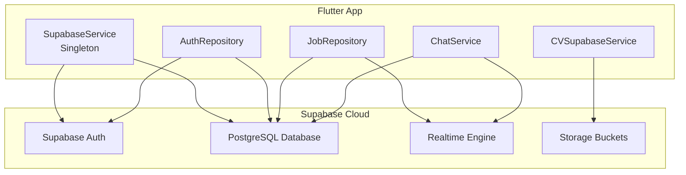

# Supabase

## Mục đích

Giải thích chi tiết về Supabase — nền tảng Backend-as-a-Service (BaaS) được sử dụng làm backend chính cho toàn bộ hệ thống NP FutureGate, bao gồm Authentication, Database, Realtime, và Storage.

## Định nghĩa

Supabase là một nền tảng mã nguồn mở thay thế Firebase, được xây dựng trên PostgreSQL. Supabase cung cấp:
- **Authentication:** Hệ thống xác thực người dùng (email/password, OAuth, magic link)
- **Database:** PostgreSQL database với REST API tự động (PostgREST)
- **Realtime:** WebSocket subscriptions cho thay đổi database
- **Storage:** Object storage cho files (ảnh, PDF, CV)
- **Edge Functions:** Serverless functions (Deno)
- **Row Level Security (RLS):** Bảo mật cấp hàng dữ liệu

**Phiên bản sử dụng:** supabase_flutter ^2.9.1

## Lý do sử dụng trong dự án

1. **PostgreSQL mạnh mẽ:** Hỗ trợ JSONB (lưu metadata linh hoạt), full-text search, và quan hệ phức tạp — phù hợp cho hệ thống tuyển dụng với nhiều loại dữ liệu.

2. **Realtime built-in:** Chat giữa ứng viên và nhà tuyển dụng cần realtime — Supabase Realtime cung cấp sẵn qua WebSocket.

3. **Authentication đa dạng:** Hỗ trợ email/password và Google Sign-In, quản lý session tự động.

4. **Row Level Security:** Bảo mật dữ liệu theo vai trò (Candidate, Employer, School, Admin) mà không cần viết middleware.

5. **Storage tích hợp:** Lưu trữ avatar, CV files trực tiếp, có CDN và public URL.

6. **Miễn phí cho đồ án:** Free tier đủ cho development và demo.

7. **Flutter SDK chính thức:** Package `supabase_flutter` được maintain bởi team Supabase.

## Cách tích hợp trong dự án

### Kiến trúc tích hợp



### Các bảng chính trong Database

| Bảng | Mô tả | Quan hệ |
|------|--------|---------|
| `profiles` | Thông tin người dùng | 1:1 với auth.users |
| `jobs` | Tin tuyển dụng | N:1 với profiles (creator) |
| `applications` | Đơn ứng tuyển | N:1 với jobs, profiles |
| `conversations` | Cuộc hội thoại | N:N giữa profiles |
| `messages` | Tin nhắn chat | N:1 với conversations |
| `interview_schedules` | Lịch phỏng vấn | N:1 với applications |
| `notifications` | Thông báo | N:1 với profiles |
| `device_tokens` | FCM tokens | N:1 với profiles |
| `school_partnerships` | Liên kết trường-DN | N:N giữa profiles |

## Ví dụ code từ dự án

### 1. Khởi tạo Supabase (lib/core/services/supabase_service.dart)

```dart
class SupabaseService {
  SupabaseService._();
  static SupabaseService? _instance;
  static SupabaseClient? _client;

  static SupabaseService get instance {
    _instance ??= SupabaseService._();
    return _instance!;
  }

  SupabaseClient get client {
    if (_client == null) {
      throw Exception(
          'Supabase chưa được khởi tạo. Gọi initialize() trong main() trước.');
    }
    return _client!;
  }

  /// Initialize Supabase - gọi trong main() trước runApp()
  static Future<void> initialize() async {
    try {
      await dotenv.load(fileName: '.env');

      await Supabase.initialize(
        url: SupabaseConfig.supabaseUrl,
        anonKey: SupabaseConfig.supabaseAnonKey,
        authOptions: const FlutterAuthClientOptions(
          authFlowType: AuthFlowType.pkce,
        ),
      );

      _client = Supabase.instance.client;
    } catch (e) {
      debugPrint('❌ Lỗi khởi tạo Supabase: $e');
      rethrow;
    }
  }

  bool get isAuthenticated => client.auth.currentUser != null;
  User? get currentUser => client.auth.currentUser;
  String? get currentUserId => client.auth.currentUser?.id;
}
```

### 2. Authentication — Đăng ký (lib/core/repositories/auth_repository.dart)

```dart
Future<AuthResult> signUpWithEmail({
  required String email,
  required String password,
  required String fullName,
  required String phone,
  required UserRole role,
}) async {
  try {
    final response = await _client.auth.signUp(
      email: email,
      password: password,
      data: {
        'full_name': fullName,
        'phone': phone,
        'role': role.value,
      },
    );

    if (response.user == null) {
      return AuthResult.failure('Đăng ký thất bại. Vui lòng thử lại.');
    }

    // Tạo profile trong database
    await _client.from('profiles').insert({
      'id': response.user!.id,
      'email': email,
      'full_name': fullName,
      'phone': phone,
      'role': role.value,
      'metadata': {},
      'is_active': false,
    });

    return AuthResult.success(
      message: 'Đăng ký thành công!',
      data: response.user,
    );
  } on AuthException catch (e) {
    return AuthResult.failure(_getAuthErrorMessage(e));
  }
}
```

### 3. Authentication — Google Sign-In

```dart
Future<AuthResult> signInWithGoogle() async {
  try {
    await _googleSignIn.signOut();
    final googleUser = await _googleSignIn.signIn();
    if (googleUser == null) {
      return AuthResult.failure('Đăng nhập Google bị hủy.');
    }

    final googleAuth = await googleUser.authentication;
    final accessToken = googleAuth.accessToken;
    final idToken = googleAuth.idToken;

    // Sign in to Supabase with Google credentials
    final response = await _client.auth.signInWithIdToken(
      provider: OAuthProvider.google,
      idToken: idToken!,
      accessToken: accessToken!,
    );

    if (response.user == null) {
      return AuthResult.failure('Đăng nhập Google thất bại.');
    }

    return AuthResult.success(
      message: 'Đăng nhập Google thành công!',
      data: response.user,
    );
  } on AuthException catch (e) {
    return AuthResult.failure(_getAuthErrorMessage(e));
  }
}
```

### 4. Database — Query dữ liệu

```dart
// Lấy danh sách conversations
Future<List<ConversationModel>> getConversations() async {
  final userId = _supabase.auth.currentUser?.id;
  if (userId == null) return [];

  final response = await _supabase
      .from('conversations')
      .select()
      .or('participant1_id.eq.$userId,participant2_id.eq.$userId')
      .order('last_message_at', ascending: false);

  return (response as List)
      .map((json) => ConversationModel.fromJson(json))
      .toList();
}

// Gửi tin nhắn
Future<MessageModel?> sendMessage({
  required String conversationId,
  required String content,
  String messageType = 'text',
}) async {
  final userId = _supabase.auth.currentUser?.id;
  if (userId == null) return null;

  final response = await _supabase
      .from('messages')
      .insert({
        'conversation_id': conversationId,
        'sender_id': userId,
        'sender_type': userType,
        'content': content,
        'message_type': messageType,
      })
      .select()
      .single();

  return MessageModel.fromJson(response);
}
```

### 5. Realtime — Stream messages

```dart
// Stream messages realtime cho chat
Stream<List<MessageModel>> streamMessages(String conversationId) {
  final userId = _supabase.auth.currentUser?.id;
  
  return _supabase
      .from('messages')
      .stream(primaryKey: ['id'])
      .order('created_at', ascending: true)
      .map((data) => data
          .where((json) => 
              json['conversation_id'] == conversationId &&
              json['is_deleted'] == false)
          .map((json) {
            final message = MessageModel.fromJson(json);
            message.isSentByMe = message.senderId == userId;
            return message;
          })
          .toList());
}

// Stream conversations realtime
Stream<List<ConversationModel>> streamConversations() {
  final userId = _supabase.auth.currentUser?.id;
  if (userId == null) return Stream.value([]);

  return _supabase
      .from('conversations')
      .stream(primaryKey: ['id'])
      .order('last_message_at', ascending: false)
      .asyncMap((data) async {
        final conversations = data
            .where((json) =>
                json['participant1_id'] == userId ||
                json['participant2_id'] == userId)
            .map((json) => ConversationModel.fromJson(json))
            .toList();
        // Load thêm user info cho mỗi conversation...
        return conversations;
      });
}
```

### 6. Storage — Upload avatar

```dart
Future<String?> uploadAvatar(File file, String userId) async {
  try {
    final fileExt = file.path.split('.').last;
    final fileName = '$userId/avatar_${DateTime.now().millisecondsSinceEpoch}.$fileExt';

    // Xóa avatar cũ nếu có
    try {
      final profile = await getCurrentUserProfile();
      if (profile?.avatarUrl != null) {
        final oldUrl = profile!.avatarUrl!;
        if (oldUrl.contains('/storage/v1/object/public/profile/')) {
          final oldPath = oldUrl.split('/profile/').last;
          await _client.storage.from('profile').remove([oldPath]);
        }
      }
    } catch (e) {
      debugPrint('Error deleting old avatar: $e');
    }

    // Upload file mới
    await _client.storage.from('profile').upload(
      fileName,
      file,
      fileOptions: const FileOptions(cacheControl: '3600', upsert: false),
    );

    // Lấy public URL
    final imageUrl = _client.storage.from('profile').getPublicUrl(fileName);
    return imageUrl;
  } catch (e) {
    throw Exception('Upload failed: $e');
  }
}
```

## Ưu điểm

| Ưu điểm | Mô tả |
|----------|--------|
| **PostgreSQL** | Database quan hệ mạnh mẽ, hỗ trợ JSONB, full-text search |
| **Realtime** | WebSocket subscriptions cho chat, notifications |
| **RLS** | Row Level Security bảo mật cấp hàng dữ liệu |
| **Auth tích hợp** | Email, Google, OAuth providers |
| **Storage** | Object storage với CDN, public URLs |
| **Auto-generated API** | REST API tự động từ schema (PostgREST) |
| **Flutter SDK** | Package chính thức, type-safe |
| **Open source** | Có thể self-host nếu cần |
| **Free tier** | Đủ cho development và demo đồ án |

## Nhược điểm

| Nhược điểm | Mô tả | Giải pháp trong dự án |
|------------|--------|----------------------|
| **Vendor lock-in** | Phụ thuộc vào Supabase API | Tách Repository layer, dễ thay thế |
| **Realtime limitations** | Không hỗ trợ presence/typing indicators native | Sử dụng polling cho typing |
| **Cold start** | Free tier có cold start delay | Chấp nhận cho đồ án |
| **Complex queries** | Một số query phức tạp cần RPC/SQL functions | Tạo database functions |
| **File size limit** | Free tier giới hạn storage | Compress ảnh trước khi upload |
| **Rate limiting** | Free tier có giới hạn requests | Implement caching phía client |

## So sánh Supabase vs Firebase

| Tiêu chí | Supabase | Firebase |
|----------|----------|----------|
| **Database** | PostgreSQL (SQL) | Firestore (NoSQL) |
| **Query** | SQL, joins, aggregations | Limited queries, no joins |
| **Realtime** | PostgreSQL changes | Firestore snapshots |
| **Auth** | Tương đương | Tương đương |
| **Storage** | S3-compatible | Google Cloud Storage |
| **Pricing** | Generous free tier | Pay-as-you-go |
| **Open source** | ✅ Có | ❌ Không |
| **Self-host** | ✅ Có thể | ❌ Không |
| **Flutter SDK** | Tốt | Rất tốt |

**Lý do chọn Supabase:** PostgreSQL cho phép lưu metadata phức tạp (JSONB), thực hiện joins giữa các bảng, và RLS phù hợp cho hệ thống multi-role.

## Liên kết liên quan

- [Tổng quan kiến trúc](../01_tong_quan_kien_truc.md)
- [Authentication Flow](../02_co_che_tung_chuc_nang/authentication_flow.md)
- [Realtime Sync Flow](../02_co_che_tung_chuc_nang/realtime_sync_flow.md)
- [Chat Flow](../02_co_che_tung_chuc_nang/chat_flow.md)
- [So sánh công nghệ](../04_cong_nghe_su_dung/tech_comparison_reason.md)
