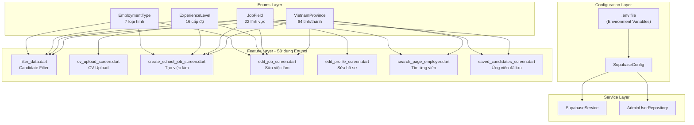

# Phân tích Constants, Enums và Configuration

## Mục đích

Tài liệu này phân tích chi tiết các file hằng số (constants), enums và cấu hình (config) được sử dụng chung trong toàn bộ dự án NP FutureGate. Các file này đóng vai trò chuẩn hóa dữ liệu, đảm bảo tính nhất quán giữa các module, và tập trung quản lý cấu hình kết nối dịch vụ bên ngoài.

## Tổng quan cấu trúc

```
lib/core/
├── config/
│   └── supabase_config.dart          # Cấu hình kết nối Supabase
├── enums/
│   ├── employment_types.dart          # Loại hình công việc
│   ├── experience_levels.dart         # Cấp độ kinh nghiệm
│   ├── job_fields.dart                # Lĩnh vực nghề nghiệp
│   └── vietnam_provinces.dart         # Danh sách tỉnh/thành Việt Nam
└── .env                               # Biến môi trường (không commit)
```

---

## 1. Supabase Configuration (`lib/core/config/supabase_config.dart`)

### Mục đích

Quản lý tập trung thông tin kết nối đến Supabase — backend-as-a-service chính của dự án. Tách biệt credentials khỏi source code thông qua biến môi trường.

### Cấu trúc

```dart
class SupabaseConfig {
  static String get supabaseUrl {
    final url = dotenv.env['SUPABASE_URL'];
    if (url == null || url.isEmpty) {
      throw Exception('SUPABASE_URL not found in .env file');
    }
    return url;
  }

  static String get supabaseAnonKey {
    final key = dotenv.env['SUPABASE_ANON_KEY'];
    if (key == null || key.isEmpty) {
      throw Exception('SUPABASE_ANON_KEY not found in .env file');
    }
    return key;
  }
}
```

### Đặc điểm thiết kế

| Đặc điểm | Mô tả |
|-----------|--------|
| Pattern | Static getters (không cần khởi tạo instance) |
| Bảo mật | Đọc từ `.env` qua `flutter_dotenv`, không hardcode |
| Validation | Throw exception nếu thiếu biến môi trường |
| Dependency | `flutter_dotenv` package |

### Cách sử dụng

`SupabaseConfig` được sử dụng bởi `SupabaseService` trong quá trình khởi tạo ứng dụng:

```dart
// Trong SupabaseService.initialize()
await Supabase.initialize(
  url: SupabaseConfig.supabaseUrl,
  anonKey: SupabaseConfig.supabaseAnonKey,
  authOptions: const FlutterAuthClientOptions(
    authFlowType: AuthFlowType.pkce,
  ),
);
```

### Biến môi trường (`.env`)

| Biến | Mục đích |
|------|----------|
| `SUPABASE_URL` | URL endpoint của Supabase project |
| `SUPABASE_ANON_KEY` | Anonymous key cho client-side access |
| `MISTRAL_API_KEY` | API key cho Mistral AI service |
| `MISTRAL_MODEL` | Model name sử dụng (mistral-large-2411) |
| `PAYOS_CLIENT_ID` | Client ID cho PayOS payment |
| `PAYOS_API_KEY` | API key cho PayOS |
| `PAYOS_CHECKSUM_KEY` | Checksum key cho PayOS verification |
| `EMAILJS_SERVICE_ID` | Service ID cho EmailJS |
| `EMAILJS_PUBLIC_KEY` | Public key cho EmailJS |
| `EMAILJS_TEMPLATE_ID` | Template ID cho email gửi đi |
| `EMAILJS_TEMPLATE_RESPONSE_ID` | Template ID cho email phản hồi |

---

## 2. Employment Types (`lib/core/enums/employment_types.dart`)

### Mục đích

Định nghĩa các loại hình công việc được hỗ trợ trong hệ thống tuyển dụng.

### Cấu trúc

```dart
enum EmploymentType {
  fullTime,       // Toàn thời gian
  partTime,       // Bán thời gian
  internship,     // Thực tập
  freelance,      // Freelance
  contract,       // Hợp đồng
  remote,         // Làm việc từ xa
  temporary;      // Thời vụ

  String get displayName { ... }
  static List<String> get valuesList => values.map((e) => e.displayName).toList();
}
```

### Giá trị và hiển thị

| Enum Value | Display Name (Tiếng Việt) |
|------------|---------------------------|
| `fullTime` | Toàn thời gian |
| `partTime` | Bán thời gian |
| `internship` | Thực tập |
| `freelance` | Freelance |
| `contract` | Hợp đồng |
| `remote` | Làm việc từ xa |
| `temporary` | Thời vụ |

---

## 3. Experience Levels (`lib/core/enums/experience_levels.dart`)

### Mục đích

Định nghĩa các cấp độ kinh nghiệm làm việc, kết hợp cả thang đo theo năm và theo vị trí (level).

### Cấu trúc

```dart
enum ExperienceLevel {
  // Theo số năm kinh nghiệm
  noExperience, underOneYear, oneYear, twoYears,
  threeYears, fourYears, fiveYears, overFiveYears,
  // Theo cấp bậc
  intern, fresher, junior, middle, senior, lead, manager, director;

  String get displayName { ... }
  static List<String> get valuesList => values.map((e) => e.displayName).toList();
}
```

### Giá trị và hiển thị

| Enum Value | Display Name (Tiếng Việt) |
|------------|---------------------------|
| `noExperience` | Chưa có kinh nghiệm |
| `underOneYear` | Dưới 1 năm |
| `oneYear` | 1 năm |
| `twoYears` | 2 năm |
| `threeYears` | 3 năm |
| `fourYears` | 4 năm |
| `fiveYears` | 5 năm |
| `overFiveYears` | Trên 5 năm |
| `intern` | Thực tập sinh |
| `fresher` | Mới tốt nghiệp |
| `junior` | Junior |
| `middle` | Middle |
| `senior` | Senior |
| `lead` | Trưởng nhóm |
| `manager` | Quản lý |
| `director` | Giám đốc |

### Đặc điểm

Enum này kết hợp hai hệ thống phân loại:
- **Theo thời gian**: Phù hợp cho ứng viên mô tả kinh nghiệm tổng quát
- **Theo cấp bậc**: Phù hợp cho nhà tuyển dụng yêu cầu vị trí cụ thể

---

## 4. Job Fields (`lib/core/enums/job_fields.dart`)

### Mục đích

Định nghĩa danh sách các lĩnh vực nghề nghiệp/ngành nghề được hỗ trợ trong hệ thống.

### Cấu trúc

```dart
enum JobField {
  itSoftware, marketing, sales, accountingAudit, hrAdmin,
  construction, architecture, education, medicalHealth,
  customerService, production, transportLogistics,
  designCreative, bankingFinance, realEstate, restaurantHotel,
  legal, interpreterTranslator, telecommunications,
  insurance, retail, other;

  String get displayName { ... }
  static List<String> get valuesList => values.map((e) => e.displayName).toList();
}
```

### Giá trị và hiển thị

| Enum Value | Display Name (Tiếng Việt) |
|------------|---------------------------|
| `itSoftware` | IT - Phần mềm |
| `marketing` | Marketing / Truyền thông |
| `sales` | Kinh doanh / Bán hàng |
| `accountingAudit` | Kế toán / Kiểm toán |
| `hrAdmin` | Nhân sự / Hành chính |
| `construction` | Xây dựng |
| `architecture` | Kiến trúc / Nội thất |
| `education` | Giáo dục / Đào tạo |
| `medicalHealth` | Y tế / Sức khỏe |
| `customerService` | Dịch vụ khách hàng |
| `production` | Sản xuất / Vận hành |
| `transportLogistics` | Vận tải / Kho vận |
| `designCreative` | Thiết kế / Sáng tạo |
| `bankingFinance` | Ngân hàng / Tài chính |
| `realEstate` | Bất động sản |
| `restaurantHotel` | Nhà hàng / Khách sạn |
| `legal` | Luật / Pháp lý |
| `interpreterTranslator` | Biên / Phiên dịch |
| `telecommunications` | Viễn thông |
| `insurance` | Bảo hiểm |
| `retail` | Bán lẻ / Tiêu dùng |
| `other` | Khác |

---

## 5. Vietnam Provinces (`lib/core/enums/vietnam_provinces.dart`)

### Mục đích

Cung cấp danh sách đầy đủ 63 tỉnh/thành phố Việt Nam cùng giá trị "Khác" cho trường hợp đặc biệt. Sử dụng cho bộ lọc địa điểm trong tìm kiếm việc làm và hồ sơ ứng viên.

### Cấu trúc

```dart
enum VietnamProvince {
  haNoi, hoChiMinh, daNang, haiPhong, canTho,
  anGiang, baRiaVungTau, bacGiang, bacKan, bacLieu,
  // ... 63 tỉnh/thành + other
  other;

  String get displayName { ... }
  static List<String> get valuesList => values.map((e) => e.displayName).toList();
}
```

### Đặc điểm

- **Số lượng**: 64 giá trị (63 tỉnh/thành + "Khác")
- **Thứ tự ưu tiên**: 5 thành phố trực thuộc trung ương đặt đầu tiên (Hà Nội, Hồ Chí Minh, Đà Nẵng, Hải Phòng, Cần Thơ)
- **Naming convention**: camelCase theo tên không dấu
- **Display name**: Tên đầy đủ có dấu tiếng Việt

---

## Sơ đồ mối quan hệ



---

## Design Pattern chung

### Enhanced Enum Pattern

Tất cả 4 enum files đều sử dụng cùng một pattern thiết kế:

```dart
enum EnumName {
  value1,
  value2,
  // ...
  other;  // Giá trị fallback

  // Getter hiển thị tên tiếng Việt
  String get displayName {
    switch (this) {
      case EnumName.value1: return 'Tên hiển thị 1';
      // ...
    }
  }

  // Static getter trả về danh sách tên hiển thị
  static List<String> get valuesList => values.map((e) => e.displayName).toList();
}
```

### Ưu điểm của pattern này

| Ưu điểm | Giải thích |
|----------|------------|
| Type-safe | Compiler kiểm tra tại compile-time, tránh lỗi typo |
| Localization-ready | `displayName` tách biệt logic hiển thị khỏi giá trị enum |
| Dễ sử dụng | `valuesList` cung cấp danh sách sẵn cho dropdown/filter UI |
| Fallback | Giá trị `other` xử lý trường hợp không nằm trong danh sách |
| Nhất quán | Tất cả enums tuân theo cùng interface |

### Cách sử dụng trong UI

```dart
// Trong filter_data.dart - tạo danh sách cho dropdown
final List<String> cities = VietnamProvince.valuesList;
final List<String> experiences = ExperienceLevel.valuesList;
final List<String> jobWorkTypes = EmploymentType.valuesList;
final List<String> jobTypes = JobField.valuesList;
```

---

## Mối quan hệ với các module khác

### Config → Services

```
SupabaseConfig ──→ SupabaseService.initialize()
                 ──→ AdminUserRepository (direct access)
```

`SupabaseConfig` là điểm truy cập duy nhất cho credentials Supabase, đảm bảo single source of truth.

### Enums → Features

| Module | Enums sử dụng | Mục đích |
|--------|---------------|----------|
| Candidate (filter) | Tất cả 4 enums | Bộ lọc tìm kiếm việc làm |
| Employer (create/edit job) | Tất cả 4 enums | Form tạo/sửa tin tuyển dụng |
| Employer (search) | JobField, VietnamProvince | Tìm kiếm ứng viên |
| CV Upload | JobField | Chọn lĩnh vực cho CV |
| Profile Edit | EmploymentType, JobField | Cập nhật hồ sơ cá nhân |
| School (create job) | Tất cả 4 enums | Tạo việc làm từ trường |

### Enums → Models

Các enum values được lưu trữ dưới dạng `String` (displayName) trong database Supabase, cho phép đọc dữ liệu dễ dàng mà không cần conversion phức tạp.

---

## Thống kê

| Metric | Giá trị |
|--------|---------|
| Tổng số file config | 1 |
| Tổng số file enum | 4 |
| Tổng số enum values | 109 (7 + 16 + 22 + 64) |
| Modules sử dụng enums | 10+ screens |
| Biến môi trường | 11 |
| External services configured | 4 (Supabase, Mistral AI, PayOS, EmailJS) |

---

## Liên kết liên quan

- [Tổng quan kiến trúc](../01_tong_quan_kien_truc.md)
- [Utils Analysis](./utils_analysis.md)
- [Themes Analysis](./themes_analysis.md)
- [Routes Analysis](./routes_analysis.md)
- [Network Interceptor Analysis](./network_interceptor_analysis.md)
- [Công nghệ Supabase](../10_giai_thich_cong_nghe_tung_cai/supabase.md)
