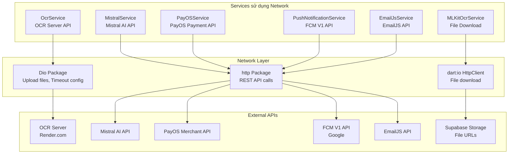
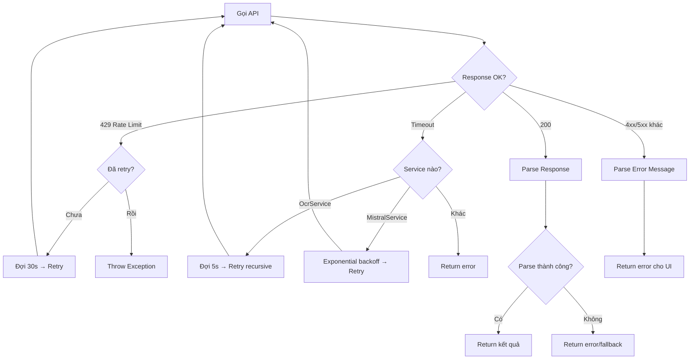
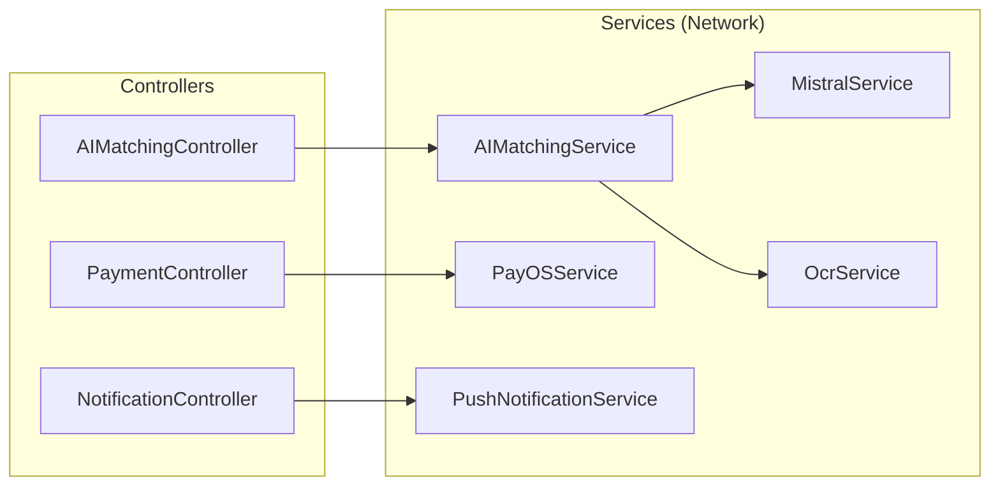

# Phân Tích Cơ Chế Xử Lý Network

## Mục đích

Tài liệu này phân tích toàn bộ cơ chế xử lý network (giao tiếp mạng) trong dự án NP FutureGate, bao gồm:
- Cách sử dụng thư viện **Dio** và **http** cho các HTTP requests
- Cơ chế xử lý lỗi (error handling) cho từng service
- Chiến lược retry và timeout
- Mối quan hệ giữa network layer với các module khác

## Tổng quan kiến trúc Network

### Hai thư viện HTTP được sử dụng

Dự án NP FutureGate sử dụng **song song** hai thư viện HTTP:

| Thư viện | Version | Sử dụng tại | Mục đích chính |
|----------|---------|-------------|----------------|
| `dio` | ^5.8.0 | `OcrService` | Upload file multipart, cấu hình timeout chi tiết |
| `http` | ^1.6.0 | `MistralService`, `PayOSService`, `PushNotificationService`, `EmailJsService`, `JobSelectionDialog` | REST API calls đơn giản (JSON) |

Ngoài ra, `dart:io` (`HttpClient`) được sử dụng trực tiếp trong `MLKitOcrService` để download file từ URL.

### Sơ đồ tổng quan



## Phân tích chi tiết từng Service

### 1. OcrService — Sử dụng Dio

**File:** `lib/core/services/ocr_service.dart`

Đây là service **duy nhất** sử dụng thư viện Dio trong dự án. Lý do chọn Dio thay vì http:
- Cần upload file dạng **multipart/form-data** (Dio hỗ trợ `FormData` và `MultipartFile` native)
- Cần cấu hình **timeout chi tiết** (connect timeout và receive timeout riêng biệt)
- Cần bắt lỗi theo **loại cụ thể** (`DioExceptionType`)

#### Cấu hình Dio

```dart
static final Dio _dio = Dio();

// Cấu hình timeout (120 giây cho cold start server trên Render)
_dio.options.connectTimeout = const Duration(seconds: 120);
_dio.options.receiveTimeout = const Duration(seconds: 120);
```

#### Cơ chế Upload File

```dart
final formData = FormData.fromMap({
  'file': await MultipartFile.fromFile(
    file.path,
    filename: file.path.split('/').last,
  ),
  'lang': language,
});

final response = await _dio.post(apiUrl, data: formData);
```

#### Error Handling & Retry

```dart
on DioException catch (e) {
  if (e.type == DioExceptionType.connectionTimeout ||
      e.type == DioExceptionType.receiveTimeout) {
    // Retry sau 5 giây (đợi server wake up từ cold start)
    await Future.delayed(const Duration(seconds: 5));
    return await extractText(file: file, language: language); // Recursive retry
  }
  return {'success': false, 'error': 'Network error: ${e.message}'};
}
```

**Đặc điểm:**
- Retry **vô hạn** khi gặp timeout (recursive call) — phù hợp vì server trên Render có cold start
- Trả về `Map<String, dynamic>` với key `success` để caller kiểm tra kết quả
- Có method `isServerHealthy()` để kiểm tra trạng thái server trước khi gọi

#### Lưu ý về Interceptors

> **Dự án KHÔNG sử dụng Dio Interceptors.** Dio instance được tạo đơn giản (`Dio()`) mà không thêm bất kỳ interceptor nào. Tất cả logic xử lý lỗi, retry, và logging được thực hiện trực tiếp trong method `extractText()`.

---

### 2. MistralService — Sử dụng http

**File:** `lib/core/services/mistral_service.dart`

Service giao tiếp với Mistral AI API, có hai phương thức chính:

#### a) `sendMessage()` — Chat có lịch sử

```dart
final response = await http.post(
  Uri.parse('$_baseUrl/chat/completions'),
  headers: {
    'Content-Type': 'application/json',
    'Authorization': 'Bearer $_apiKey',
  },
  body: jsonEncode({...}),
);
```

**Error handling:**
- Kiểm tra `response.statusCode == 200`
- Parse error message từ response body
- `rethrow` exception để caller xử lý

#### b) `sendIsolatedMessage()` — Có Retry Logic phức tạp

Đây là phương thức có cơ chế retry tinh vi nhất trong dự án:

```dart
Future<String> sendIsolatedMessage(String message, {
  String? systemPrompt, 
  int maxRetries = 2,  // Tối đa 3 lần thử (0, 1, 2)
}) async {
  for (int attempt = 0; attempt <= maxRetries; attempt++) {
    // Exponential backoff: 3s → 8s
    if (attempt > 0) {
      final delay = attempt == 1 ? 3 : 8;
      await Future.delayed(Duration(seconds: delay));
    }
    
    // Xử lý theo status code:
    // 200 → return kết quả
    // 429 → Rate limit: đợi 30s rồi retry (chỉ 1 lần)
    // 422/400 → Fallback sang mode không có json_object
    // Khác → Lưu error, tiếp tục retry
  }
}
```

**Chiến lược xử lý lỗi theo HTTP status:**

| Status Code | Xử lý | Mô tả |
|-------------|--------|--------|
| 200 | Return kết quả | Thành công |
| 429 | Đợi 30s + retry 1 lần | Rate limit từ Mistral API |
| 422 / 400 | Fallback `_sendWithoutJsonMode()` | `response_format` không hỗ trợ |
| Khác | Lưu error, retry tiếp | Lỗi server tạm thời |

---

### 3. PayOSService — Sử dụng http

**File:** `lib/core/services/payos_service.dart`

#### Cơ chế bảo mật

```dart
// HMAC-SHA256 checksum cho mỗi request
final checksum = _generateChecksum(signatureData);

// Headers xác thực
headers: {
  'Content-Type': 'application/json',
  'x-client-id': _clientId,
  'x-api-key': _apiKey,
},
```

#### Error Handling

```dart
if (response.statusCode == 200) {
  final data = jsonDecode(response.body);
  if (data['code'] == '00') {
    // Thành công - parse response data
  } else {
    // Lỗi business logic từ PayOS
    return PaymentResult(success: false, error: data['desc']);
  }
} else {
  // Parse error response chi tiết
  String errorMsg = 'Lỗi kết nối: ${response.statusCode}';
  try {
    final errorData = jsonDecode(response.body);
    errorMsg = errorData['desc'] ?? errorData['message'] ?? errorMsg;
  } catch (_) {}
  return PaymentResult(success: false, error: errorMsg);
}
```

**Đặc điểm:**
- **Không có retry** — thanh toán là idempotent operation, retry có thể gây duplicate
- Trả về `PaymentResult` object với `success` flag
- Parse error message từ response body để hiển thị cho user

---

### 4. PushNotificationService — Sử dụng http + OAuth2

**File:** `lib/core/services/push_notification_service.dart`

#### Cơ chế xác thực OAuth2

```dart
static Future<String> _getAccessToken() async {
  // Load service account JSON từ assets
  final serviceAccountJson = await rootBundle.loadString(_serviceAccountPath);
  final accountCredentials = ServiceAccountCredentials.fromJson(...);
  
  // Lấy OAuth2 token qua googleapis_auth
  final authClient = await clientViaServiceAccount(accountCredentials, scopes);
  final accessToken = authClient.credentials.accessToken.data;
  authClient.close();
  return accessToken;
}
```

#### Error Handling

```dart
try {
  final response = await http.post(
    Uri.parse(_fcmEndpoint),
    headers: {
      'Content-Type': 'application/json',
      'Authorization': 'Bearer $accessToken',
    },
    body: jsonEncode(message),
  );
  
  if (response.statusCode == 200) {
    return true;
  } else {
    debugPrint('❌ Failed: ${response.statusCode}');
    return false;  // Trả về false thay vì throw
  }
} catch (e) {
  debugPrint('❌ Error: $e');
  return false;
}
```

**Đặc điểm:**
- Trả về `bool` (true/false) thay vì throw exception
- Gửi đến nhiều devices bằng vòng lặp tuần tự (không parallel)
- Logging chi tiết với emoji markers cho debug

---

### 5. MLKitOcrService — Sử dụng dart:io HttpClient

**File:** `lib/core/services/mlkit_ocr_service.dart`

```dart
final response = await HttpClient()
    .getUrl(Uri.parse(fileUrl))
    .then((req) => req.close());

if (response.statusCode != 200) {
  return MLKitOcrResult.failure('Không thể tải file (HTTP ${response.statusCode})');
}

final bytes = await consolidateHttpClientResponseBytes(response);
```

**Đặc điểm:**
- Sử dụng `HttpClient` trực tiếp từ `dart:io` (không qua Dio hay http)
- Mục đích: download binary file (ảnh/PDF) để xử lý OCR on-device
- Error handling đơn giản: kiểm tra status code, trả về `MLKitOcrResult.failure()`

---

### 6. EmailJsService — Sử dụng http

**File:** `lib/core/services/emailjs_service.dart`

```dart
final response = await http.post(
  url,
  headers: {'Content-Type': 'application/json'},
  body: json.encode({
    'service_id': _serviceId,
    'template_id': _templateId,
    'user_id': _publicKey,
    'template_params': {...},
  }),
);
```

**Đặc điểm:**
- Không có retry logic
- Trả về `bool` (true/false)
- Logging đơn giản

## Tổng hợp các Pattern xử lý lỗi

### Pattern 1: Return Result Object

Sử dụng bởi: `OcrService`, `PayOSService`, `MLKitOcrService`

```dart
// Trả về object có flag success
return {'success': true, ...data};
return {'success': false, 'error': 'message'};

// Hoặc typed result
return PaymentResult(success: true, ...);
return PaymentResult(success: false, error: 'message');
```

### Pattern 2: Return Boolean

Sử dụng bởi: `PushNotificationService`, `EmailJsService`

```dart
if (response.statusCode == 200) return true;
return false;
```

### Pattern 3: Throw Exception

Sử dụng bởi: `MistralService`

```dart
if (response.statusCode == 200) {
  return data['choices'][0]['message']['content'];
} else {
  throw Exception('Lỗi API: ${error['message']}');
}
```

### Bảng tổng hợp chiến lược Network

| Service | Thư viện | Retry | Timeout | Auth Method | Error Pattern |
|---------|----------|-------|---------|-------------|---------------|
| OcrService | Dio | Có (recursive, vô hạn) | 120s connect + receive | Không | Result Map |
| MistralService | http | Có (max 3 lần, exponential backoff) | Mặc định | Bearer Token | Throw Exception |
| PayOSService | http | Không | Mặc định | API Key + HMAC | Result Object |
| PushNotificationService | http | Không | Mặc định | OAuth2 Bearer | Boolean |
| EmailJsService | http | Không | Mặc định | Public Key trong body | Boolean |
| MLKitOcrService | dart:io HttpClient | Không | Mặc định | Không | Result Object |

## Sơ đồ luồng xử lý lỗi



## Mối quan hệ với các Module khác

### Network → Controllers



### Luồng dữ liệu Network điển hình

```
UI (User Action)
  → Controller (gọi service method)
    → Service (chuẩn bị request, gọi HTTP)
      → External API (xử lý và trả response)
    ← Service (parse response, xử lý lỗi)
  ← Controller (cập nhật state, notifyListeners)
← UI (rebuild với dữ liệu mới hoặc hiển thị lỗi)
```

## Đánh giá và nhận xét

### Điểm mạnh

1. **Tách biệt rõ ràng**: Mỗi service chịu trách nhiệm giao tiếp với một external API cụ thể
2. **Error handling phù hợp ngữ cảnh**: 
   - AI service có retry (vì API có thể quá tải tạm thời)
   - Payment service không retry (tránh duplicate transaction)
   - Notification service trả boolean (fire-and-forget pattern)
3. **Singleton pattern**: Các service sử dụng factory constructor đảm bảo chỉ có 1 instance
4. **Logging chi tiết**: Sử dụng `debugPrint` với emoji markers giúp debug dễ dàng

### Điểm cần cải thiện

1. **Không có Dio Interceptors**: Dự án không tận dụng interceptor pattern của Dio (logging, token refresh, error transformation)
2. **Không có centralized error handling**: Mỗi service xử lý lỗi theo cách riêng, không có base class chung
3. **Không có request/response logging tập trung**: Logging nằm rải rác trong từng method
4. **OcrService retry vô hạn**: Có thể gây infinite loop nếu server down lâu
5. **Không có connection check**: Không kiểm tra kết nối internet trước khi gọi API
6. **Thiếu cancel token**: Không hỗ trợ hủy request khi user navigate away

### Đề xuất cải thiện

```dart
// Ví dụ: Tạo BaseNetworkService với interceptors
class BaseNetworkService {
  late final Dio _dio;
  
  BaseNetworkService() {
    _dio = Dio(BaseOptions(
      connectTimeout: Duration(seconds: 30),
      receiveTimeout: Duration(seconds: 30),
    ));
    
    _dio.interceptors.addAll([
      LogInterceptor(requestBody: true, responseBody: true),
      RetryInterceptor(maxRetries: 3),
      ErrorInterceptor(),
    ]);
  }
}
```

## Liên kết liên quan

- [Tổng quan kiến trúc](../01_tong_quan_kien_truc.md)
- [Luồng AI Matching](../02_co_che_tung_chuc_nang/ai_matching_flow.md)
- [Luồng thanh toán PayOS](../02_co_che_tung_chuc_nang/payment_flow.md)
- [Luồng Notification](../02_co_che_tung_chuc_nang/notification_flow.md)
- [Luồng quản lý CV (OCR)](../02_co_che_tung_chuc_nang/cv_management_flow.md)
- [So sánh Dio vs Http](../10_giai_thich_cong_nghe_tung_cai/dio_vs_http.md)
- [Công nghệ sử dụng](../04_cong_nghe_su_dung/tech_stack_overview.md)
