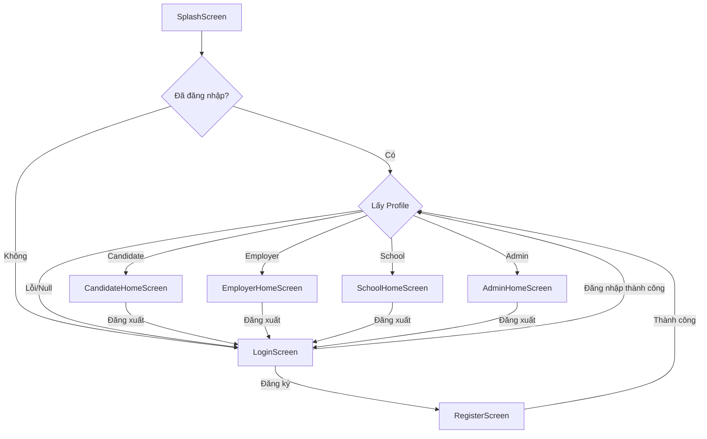
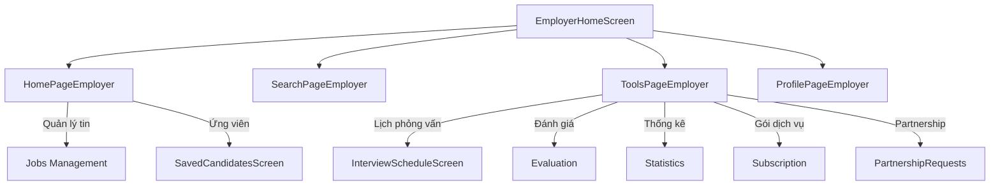
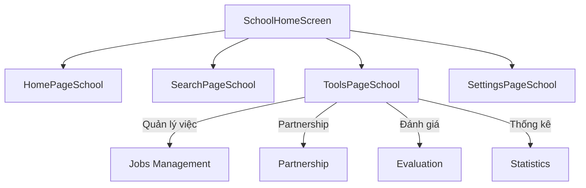
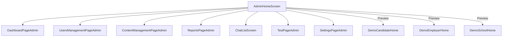

# Phân Tích Cấu Trúc Navigation & Routing

## Mục đích

Tài liệu này phân tích cơ chế điều hướng (navigation/routing) trong ứng dụng NP FutureGate. Dự án sử dụng **imperative navigation** (Navigator.push/pop) thay vì declarative routing (go_router, auto_route). Hệ thống routing được thiết kế theo mô hình **role-based navigation** — sau khi đăng nhập, người dùng được điều hướng đến màn hình Home tương ứng với vai trò của họ.

---

## Cấu trúc tổng quan

### Đặc điểm chính

| Đặc điểm | Mô tả |
|-----------|--------|
| Phương pháp | Imperative Navigation (Navigator 1.0) |
| Route naming | Không sử dụng named routes |
| Global Navigator Key | `navigatorKey` trong `main.dart` |
| Entry point | `SplashScreen` → kiểm tra auth → điều hướng theo role |
| Bottom Navigation | `CustomBottomNavBar` (shared widget) |
| Deep linking | Thông qua notification payload |

### Không có file routes riêng biệt

Dự án **không** sử dụng file định nghĩa routes tập trung (như `app_routes.dart` hay `router.dart`). Thay vào đó, navigation được thực hiện trực tiếp tại mỗi screen thông qua `Navigator.push()` và `Navigator.pop()`.

---

## Luồng Navigation chính

### 1. Khởi động ứng dụng (App Startup)

```
main() → MyApp → SplashScreen → [Kiểm tra auth state]
                                    ├── Đã đăng nhập → Lấy profile → Điều hướng theo role
                                    └── Chưa đăng nhập → LoginScreen
```

**File liên quan:** `lib/main.dart`, `lib/screens/splash/splash_screen.dart`

### 2. Điều hướng theo vai trò (Role-Based Routing)

Sau khi xác thực thành công, hệ thống lấy `UserRole` từ profile và điều hướng:

```dart
switch (profile.role) {
  case UserRole.candidate:
    homeScreen = const CandidateHomeScreen();
  case UserRole.employer:
    homeScreen = const EmployerHomeScreen();
  case UserRole.school:
    homeScreen = const SchoolHomeScreen();
  case UserRole.admin:
    homeScreen = const AdminHomeScreen();
}

Navigator.of(context).pushReplacement(
  MaterialPageRoute(builder: (_) => homeScreen),
);
```

**4 vai trò:** Candidate, Employer, School, Admin

### 3. Sơ đồ Navigation tổng thể



---

## Cấu trúc Navigation trong từng vai trò

### Candidate Navigation

```mermaid
graph TD
    CH[CandidateHomeScreen] --> HP[HomePageCandidate]
    CH --> SP[SearchPageCandidate]
    CH --> TP[ToolsPageCandidate]
    CH --> ST[SettingsPageCandidate]
    
    HP -->|Tap job| JD[JobDetailScreen]
    HP -->|Notifications| NS[NotificationsScreen]
    
    SP -->|Tap job| JD
    
    TP -->|Đã ứng tuyển| AJ[AppliedJobsScreen]
    TP -->|Đã lưu| SJ[SavedJobsScreen]
    TP -->|Công ty| CL[CompaniesListScreen]
    TP -->|Lịch phỏng vấn| IS[InterviewScheduleScreen]
    TP -->|Tạo CV| CC[CVCreationScreen]
    TP -->|CV đã tạo| CM[CVManagementScreen]
    TP -->|MBTI Test| MQ[MBTIQuestionScreen]
    TP -->|MI Test| MI[MIQuestionScreen]
    TP -->|Khóa học| CS[CoursesScreen]
    TP -->|Tin tức| CN[CareerNewsScreen]
    TP -->|Chat| CLS[ChatListScreen]
    
    ST -->|Đổi mật khẩu| CP[ChangePasswordScreen]
    ST -->|Đăng xuất| LS[LoginScreen]
```



**Bottom Navigation Bar (4 tabs):**
- Trang chủ (`HomePageCandidate`)
- Tìm kiếm (`SearchPageCandidate`)
- Công cụ (`ToolsPageCandidate`)
- Cài đặt (`SettingsPageCandidate`)

### Employer Navigation



**Bottom Navigation Bar (4 tabs):**
- Trang chủ (`HomePageEmployer`)
- Tìm kiếm (`SearchPageEmployer`)
- Công cụ (`ToolsPageEmployer`)
- Hồ sơ (`ProfilePageEmployer`)

### School Navigation



**Bottom Navigation Bar (4 tabs):**
- Trang chủ (`HomePageSchool`)
- Tìm kiếm (`SearchPageSchool`)
- Công cụ (`ToolsPageSchool`)
- Cài đặt (`SettingsPageSchool`)

### Admin Navigation

Admin sử dụng **Drawer navigation** thay vì Bottom Navigation Bar:



**Drawer Menu (7 mục):**
- Dashboard — Tổng quan hệ thống
- Quản lý người dùng — Candidates, Employers, Schools
- Quản lý nội dung — Jobs, Companies, Applications
- Báo cáo — Reports & Analytics
- Tin nhắn — Quản lý tin nhắn & Hỗ trợ
- Test — Testing & Debugging
- Cài đặt — System settings

---

## Các phương thức Navigation được sử dụng

### 1. `Navigator.push()` — Điều hướng tiến

Sử dụng phổ biến nhất, đẩy screen mới lên navigation stack:

```dart
Navigator.push(
  context,
  MaterialPageRoute(builder: (context) => const JobDetailScreen(job: job)),
);
```

**Trường hợp sử dụng:** Mở chi tiết job, mở chat, mở settings con, mở CV, v.v.

### 2. `Navigator.pop()` — Quay lại

Quay về screen trước đó trong stack:

```dart
Navigator.pop(context);
```

**Trường hợp sử dụng:** Nút back, đóng dialog, hoàn thành action.

### 3. `Navigator.pushReplacement()` — Thay thế screen hiện tại

Thay thế screen hiện tại, không cho phép quay lại:

```dart
Navigator.of(context).pushReplacement(
  MaterialPageRoute(builder: (_) => homeScreen),
);
```

**Trường hợp sử dụng:** Sau login → Home, Splash → Home/Login.

### 4. `Navigator.pushAndRemoveUntil()` — Xóa toàn bộ stack

Xóa tất cả screens trong stack và đẩy screen mới:

```dart
Navigator.of(context).pushAndRemoveUntil(
  MaterialPageRoute(builder: (_) => const LoginScreen()),
  (route) => false,
);
```

**Trường hợp sử dụng:** Đăng xuất — xóa toàn bộ navigation history.

---

## Global Navigator Key

```dart
// main.dart
final GlobalKey<NavigatorState> navigatorKey = GlobalKey<NavigatorState>();

// Sử dụng trong MaterialApp
MaterialApp(
  navigatorKey: navigatorKey,
  ...
)
```

**Mục đích:** Cho phép navigation từ bất kỳ đâu trong app mà không cần `BuildContext`, đặc biệt hữu ích cho:
- Navigation từ notification handlers (FCM)
- Navigation từ background services
- Navigation từ callbacks không có context

---

## Navigation từ Notifications

### Cơ chế hoạt động

File `notification_navigation_setup.dart` đăng ký handler cho notification navigation:

```dart
void setupNotificationNavigation() {
  StatusNotificationService.onNavigate = _handleNavigate;
}
```

### Các action codes được hỗ trợ

| Nhóm | Action Codes | Màn hình đích |
|-------|-------------|---------------|
| Job | `jobDetail`, `jobApproved`, `jobRejected`, `newJobPosted`, `jobExpiring` | JobDetailScreen |
| Application | `applicationReceived`, `applicationApproved`, `applicationRejected` | Job Applicants / Job Detail |
| Interview | `interviewScheduled`, `interviewUpdated`, `interviewCanceled`, `interviewReminder` | InterviewDetailScreen |
| Partnership | `partnershipRequest`, `partnershipApproved`, `partnershipRejected` | PartnershipDetailScreen |
| Profile | `profileViewed`, `profileFollowed` | ProfileScreen |
| Message | `newMessage`, `messageReply` | ChatScreen |
| Admin | `adminReview`, `adminApproved`, `adminRejected` | Admin Screen |
| Subscription | `subscriptionExpiring` | SubscriptionScreen |

### Local Notification (Interview Reminder)

```dart
// main.dart
void _handleNotificationTap(String payload) {
  if (payload.startsWith('interview:')) {
    final interviewId = payload.split(':')[1];
    // Navigate to interview detail
  }
}
```

---

## CustomBottomNavBar — Widget điều hướng dùng chung

### Vị trí file
`lib/shared/widgets/layouts/custom_bottom_nav_bar.dart`

### Cấu trúc

```dart
class CustomBottomNavBar extends StatelessWidget {
  final int currentIndex;
  final Function(int) onTap;
  final Color primaryColor;
  
  // 4 tabs cố định:
  // 0: Trang chủ (home_rounded)
  // 1: Tìm kiếm (search_rounded)
  // 2: Công cụ (build_rounded)
  // 3: Cài đặt (settings_rounded)
}
```

### Đặc điểm thiết kế
- Floating bottom bar với `margin: 20`, `borderRadius: 20`
- Animation khi chuyển tab (300ms, easeInOut)
- Tab được chọn hiển thị label text, tab không chọn chỉ hiển thị icon
- Sử dụng bởi: `CandidateHomeScreen`, `EmployerHomeScreen`, `SchoolHomeScreen`
- Admin **không** sử dụng (dùng Drawer thay thế)

---

## Mối quan hệ với các modules khác

### 1. Auth Module
- `SplashScreen` kiểm tra `SupabaseService.isAuthenticated` để quyết định route
- `LoginScreen` và `RegisterScreen` điều hướng đến Home screen theo role sau khi auth thành công
- Logout sử dụng `pushAndRemoveUntil` để xóa toàn bộ stack

### 2. Notification Module
- `notification_navigation_setup.dart` đăng ký navigation handler
- `FCMService` sử dụng `navigatorKey` để navigate khi app ở background
- Local notifications sử dụng payload để xác định destination

### 3. Feature Modules (Candidate, Employer, School, Admin)
- Mỗi module có Home Screen riêng với bottom navigation/drawer
- Navigation giữa các sub-screens sử dụng `Navigator.push()`
- Không có cross-module navigation trực tiếp (trừ Chat)

### 4. Shared Widgets
- `CustomBottomNavBar` là widget dùng chung cho 3 vai trò (Candidate, Employer, School)
- Đảm bảo UX nhất quán giữa các vai trò

### 5. Core Services
- `SupabaseService` cung cấp auth state cho routing decisions
- `AuthRepository` cung cấp profile/role cho role-based routing
- `FCMService` trigger navigation từ push notifications

---

## Ưu điểm và hạn chế

### Ưu điểm
- **Đơn giản, dễ hiểu:** Imperative navigation trực quan, dễ debug
- **Linh hoạt:** Có thể truyền data trực tiếp qua constructor
- **Không phụ thuộc thư viện:** Không cần go_router, auto_route
- **Type-safe:** Truyền object trực tiếp, không cần parse params

### Hạn chế
- **Không có deep linking URL-based:** Khó implement web navigation
- **Không có route guards tập trung:** Auth check phải thực hiện tại mỗi điểm entry
- **Khó maintain khi scale:** Navigation logic phân tán trong nhiều files
- **Không hỗ trợ nested navigation phức tạp:** Bottom nav + nested routes khó quản lý

---

## Liên kết liên quan

- [Tổng quan kiến trúc](../01_tong_quan_kien_truc.md)
- [Authentication Flow](../02_co_che_tung_chuc_nang/authentication_flow.md)
- [Notification Flow](../02_co_che_tung_chuc_nang/notification_flow.md)
- [Navigation Flow Diagram](../03_so_do_flow/navigation_flow.mermaid)
- [Utils Analysis](./utils_analysis.md)
- [Themes Analysis](./themes_analysis.md)
