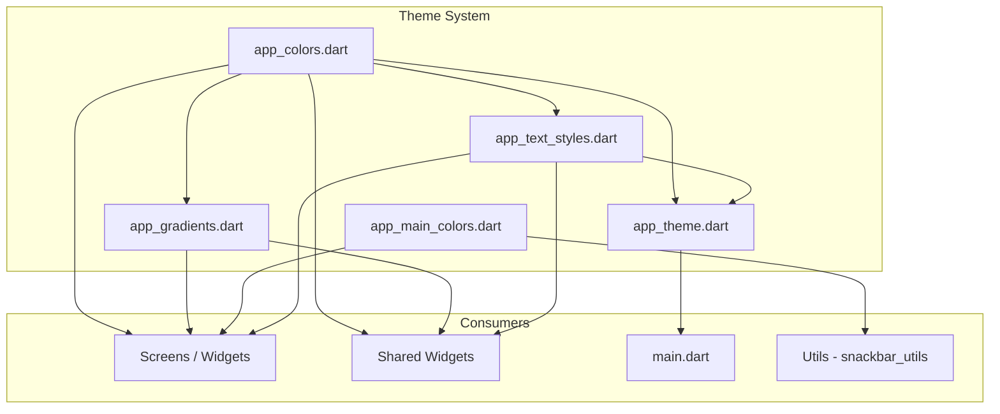
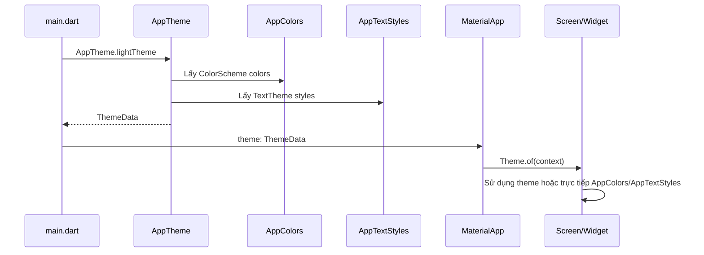

# Phân Tích Hệ Thống Theme

## Mục đích

Tài liệu này phân tích chi tiết hệ thống theme của ứng dụng NP FutureGate, bao gồm 5 file trong thư mục `lib/core/theme/`. Hệ thống theme đảm bảo giao diện nhất quán, hiện đại và dễ bảo trì trên toàn bộ ứng dụng.

## Tổng quan cấu trúc

```
lib/core/theme/
├── app_colors.dart          # Bảng màu toàn diện (primary, secondary, status, background)
├── app_gradients.dart       # Các gradient hiệu ứng hiện đại
├── app_main_colors.dart     # Tông màu chủ đạo xanh dương (Material Blue)
├── app_text_styles.dart     # Typography system (heading, body, label, button)
└── app_theme.dart           # ThemeData configuration (Light + Dark theme)
```

## Sơ đồ quan hệ giữa các file



---

## 1. AppColors (`app_colors.dart`)

### Mục đích

Định nghĩa toàn bộ bảng màu của ứng dụng theo hệ thống phân cấp rõ ràng. Lấy cảm hứng từ logo NP FutureGate với tông màu sáng, hiện đại, hướng về tương lai.

### Cấu trúc

Class `AppColors` sử dụng **private constructor** (`AppColors._()`) để ngăn khởi tạo instance — tất cả thuộc tính đều là `static const Color`.

| Nhóm màu | Số lượng | Mô tả |
|-----------|----------|--------|
| Primary Colors | 9 | Xanh dương (Blue), Xanh lá (Green), Tím (Purple) — mỗi màu có 3 shade: dark, base, light |
| Secondary Colors | 6 | Cam (Orange), Xanh ngọc (Cyan), Hồng (Pink) — mỗi màu có 2 shade |
| Background Colors | 4 | White, Light, Grey, Dark |
| Text Colors | 5 | Primary, Secondary, Hint, White, Disabled |
| Status Colors | 4 | Success, Warning, Error, Info |
| Border & Divider | 3 | Border, Divider, Shadow |
| Special Colors | 3 | Highlight, GlassWhite, GlassDark |

### Chi tiết bảng màu chính

```dart
// Màu xanh dương công nghệ - từ logo
static const Color primaryBlue = Color(0xFF2196F3);       // Material Blue 500
static const Color primaryBlueDark = Color(0xFF1976D2);   // Material Blue 700
static const Color primaryBlueLight = Color(0xFF64B5F6);  // Material Blue 300

// Màu xanh lá tương lai - năng lượng, phát triển
static const Color primaryGreen = Color(0xFF4CAF50);
static const Color primaryGreenDark = Color(0xFF388E3C);
static const Color primaryGreenLight = Color(0xFF81C784);

// Màu tím công nghệ - sáng tạo, đổi mới
static const Color primaryPurple = Color(0xFF9C27B0);
static const Color primaryPurpleDark = Color(0xFF7B1FA2);
static const Color primaryPurpleLight = Color(0xFFBA68C8);
```

### Cách sử dụng

```dart
// Trong widget
Container(
  color: AppColors.primaryBlue,
  child: Text('Hello', style: TextStyle(color: AppColors.textWhite)),
)

// Status indicator
Icon(Icons.check, color: AppColors.success)
```

### Mối quan hệ

- **Được sử dụng bởi**: `app_gradients.dart`, `app_text_styles.dart`, `app_theme.dart`, hầu hết screens và widgets trong dự án
- **Là nền tảng**: Tất cả file theme khác đều phụ thuộc vào `AppColors`

---

## 2. AppGradients (`app_gradients.dart`)

### Mục đích

Cung cấp các gradient màu tạo hiệu ứng hiện đại, hướng về tương lai cho giao diện ứng dụng. Sử dụng cho backgrounds, buttons, cards và các hiệu ứng đặc biệt.

### Cấu trúc

Class `AppGradients` sử dụng private constructor, tất cả thuộc tính là `static const LinearGradient`.

| Nhóm gradient | Số lượng | Mô tả |
|---------------|----------|--------|
| Gradient chính | 3 | primaryBlue, primaryGreen, primaryPurple |
| Gradient kết hợp | 4 | blueToGreen, purpleToBlue, cyanToGreen, orangeToPink |
| Gradient nền | 3 | backgroundLight, backgroundDark, cardGradient |
| Gradient đặc biệt | 4 | sunrise, ocean, neon, shimmer |
| Gradient overlay | 2 | darkOverlay, glassOverlay |

### Chi tiết các gradient nổi bật

```dart
/// Gradient xanh dương -> xanh lá (công nghệ + tự nhiên)
static const LinearGradient blueToGreen = LinearGradient(
  begin: Alignment.topLeft,
  end: Alignment.bottomRight,
  colors: [
    AppColors.primaryBlue,
    AppColors.secondaryCyan,
    AppColors.primaryGreen,
  ],
);

/// Gradient shimmer cho loading effect
static const LinearGradient shimmer = LinearGradient(
  begin: Alignment(-1.0, -0.3),
  end: Alignment(1.0, 0.3),
  colors: [
    Color(0xFFE0E0E0),
    Color(0xFFF5F5F5),
    Color(0xFFE0E0E0),
  ],
  stops: [0.0, 0.5, 1.0],
);
```

### Cách sử dụng

```dart
// Background gradient cho container
Container(
  decoration: BoxDecoration(gradient: AppGradients.primaryBlue),
)

// Overlay cho ảnh nền
Container(
  decoration: BoxDecoration(gradient: AppGradients.darkOverlay),
)

// Glass morphism effect
Container(
  decoration: BoxDecoration(gradient: AppGradients.glassOverlay),
)
```

### Mối quan hệ

- **Phụ thuộc vào**: `app_colors.dart` (sử dụng các màu từ AppColors)
- **Được sử dụng bởi**: `login_screen.dart`, `register_screen.dart`, `gradient_button.dart`, `custom_cards.dart`, `cv_analysis_screen.dart`, `job_interview_ai_page.dart`

---

## 3. AppMainColors (`app_main_colors.dart`)

### Mục đích

Định nghĩa tông màu chủ đạo xanh dương (Material Blue) cho các màn hình sử dụng thiết kế đơn giản hơn. Đây là bảng màu thay thế/bổ sung cho `AppColors`, tập trung vào tông xanh dương nhất quán.

### Cấu trúc

Class `AppMainColors` sử dụng private constructor với các nhóm:

| Nhóm | Thuộc tính | Mô tả |
|------|-----------|--------|
| Primary Blue Shades | primary, primaryLight, primaryDark | Tông xanh chủ đạo (Material Blue 500/300/700) |
| Background Gradients | backgroundStart, backgroundEnd, backgroundLightStart, backgroundLightEnd | Màu nền gradient |
| Surface Colors | surface, surfaceVariant | Màu bề mặt |
| Text Colors | textPrimary, textSecondary, textOnPrimary | Màu văn bản |
| Accent Colors | accent, accentLight | Màu nhấn (Blue 900/400) |
| Status Colors | success, error, warning, info | Màu trạng thái |
| Shadow | shadow, shadowLight | Bóng đổ (non-const, dùng `withValues`) |
| Gradient Definitions | primaryGradient, lightGradient | Gradient được định nghĩa sẵn |

### Chi tiết

```dart
// Primary Blue Shades - Tông màu chủ đạo
static const Color primary = Color(0xFF2196F3);      // Material Blue 500
static const Color primaryLight = Color(0xFF64B5F6); // Material Blue 300
static const Color primaryDark = Color(0xFF1976D2);  // Material Blue 700

// Gradient Definitions
static const LinearGradient primaryGradient = LinearGradient(
  begin: Alignment.topLeft,
  end: Alignment.bottomRight,
  colors: [backgroundStart, backgroundEnd],
);
```

### Cách sử dụng

```dart
// AppBar hoặc background
Container(
  decoration: BoxDecoration(gradient: AppMainColors.primaryGradient),
)

// Text styling
Text('Title', style: TextStyle(color: AppMainColors.textPrimary))

// Shadow
BoxDecoration(
  boxShadow: [BoxShadow(color: AppMainColors.shadow, blurRadius: 8)],
)
```

### Mối quan hệ

- **Độc lập**: Không import file theme khác, tự định nghĩa đầy đủ
- **Được sử dụng bởi**: Nhiều screens trong `features/school/`, `features/admin/`, `screens/courses/`, `screens/career_news/`, `shared/widgets/cards/job_card.dart`, `core/utils/snackbar_utils.dart`
- **Lưu ý**: Tồn tại song song với `AppColors` — một số screens dùng `AppMainColors`, một số dùng `AppColors`

---

## 4. AppTextStyles (`app_text_styles.dart`)

### Mục đích

Đảm bảo typography nhất quán trong toàn bộ ứng dụng. Định nghĩa hệ thống text styles theo chuẩn Material Design với font family Roboto.

### Cấu trúc

Class `AppTextStyles` sử dụng private constructor, tất cả thuộc tính là `static const TextStyle`.

| Nhóm | Styles | Font Size | Font Weight |
|------|--------|-----------|-------------|
| Heading (h1-h6) | 6 styles | 32px → 16px | Bold → Medium |
| Body | 3 styles | 16px, 14px, 12px | Regular |
| Label | 3 styles | 14px, 12px, 10px | Medium |
| Button | 3 styles | 16px, 14px, 12px | SemiBold |
| Special | 5 styles | 10px → 14px | Varies |
| Display | 2 styles | 48px, 40px | Bold |

### Hệ thống Typography chi tiết

```
Display Large:  48px / Bold    / letterSpacing: -1    → Số lớn, text nổi bật
Display Medium: 40px / Bold    / letterSpacing: -0.5  → Số, text nổi bật
H1:             32px / Bold    / letterSpacing: -0.5  → Tiêu đề lớn nhất
H2:             28px / Bold    / letterSpacing: -0.3  → Tiêu đề phụ
H3:             24px / w600    / letterSpacing: 0     → Tiêu đề section
H4:             20px / w600    / letterSpacing: 0     → Tiêu đề nhỏ
H5:             18px / w500    / letterSpacing: 0     → Tiêu đề card
H6:             16px / w500    / letterSpacing: 0     → Tiêu đề nhỏ nhất
Body Large:     16px / Regular / letterSpacing: 0     → Văn bản chính lớn
Body Medium:    14px / Regular / letterSpacing: 0     → Văn bản chính
Body Small:     12px / Regular / letterSpacing: 0     → Văn bản phụ
Label Large:    14px / w500    / letterSpacing: 0     → Nhãn lớn
Label Medium:   12px / w500    / letterSpacing: 0     → Nhãn trung bình
Label Small:    10px / w500    / letterSpacing: 0.5   → Nhãn nhỏ
Button Large:   16px / w600    / letterSpacing: 0.5   → Button lớn
Button Medium:  14px / w600    / letterSpacing: 0.5   → Button trung bình
Button Small:   12px / w600    / letterSpacing: 0.5   → Button nhỏ
```

### Các style đặc biệt

```dart
/// Link - Text liên kết (14px, Medium, Blue, Underline)
static const TextStyle link = TextStyle(
  fontSize: 14,
  fontWeight: FontWeight.w500,
  color: AppColors.primaryBlue,
  decoration: TextDecoration.underline,
);

/// Error - Text lỗi (12px, Regular, Red)
static const TextStyle error = TextStyle(
  fontSize: 12,
  color: AppColors.error,
);

/// Success - Text thành công (12px, Regular, Green)
static const TextStyle success = TextStyle(
  fontSize: 12,
  color: AppColors.success,
);
```

### Cách sử dụng

```dart
// Heading
Text('Tiêu đề', style: AppTextStyles.h1)

// Body text
Text('Nội dung', style: AppTextStyles.bodyMedium)

// Custom color override
Text('Custom', style: AppTextStyles.h3.copyWith(color: AppColors.primaryBlue))
```

### Mối quan hệ

- **Phụ thuộc vào**: `app_colors.dart` (sử dụng màu cho text)
- **Được sử dụng bởi**: `app_theme.dart` (TextTheme), `gradient_text_field.dart`, `gradient_button.dart`, `custom_cards.dart`, và nhiều screens khác

---

## 5. AppTheme (`app_theme.dart`)

### Mục đích

Cấu hình `ThemeData` hoàn chỉnh cho ứng dụng, tích hợp tất cả colors và text styles vào Material 3 theme system. Được áp dụng tại `main.dart` cho toàn bộ ứng dụng.

### Cấu trúc

Class `AppTheme` cung cấp 2 getter static:

| Theme | Mô tả | Trạng thái |
|-------|--------|-----------|
| `lightTheme` | Theme sáng đầy đủ với Material 3 | Hoàn chỉnh |
| `darkTheme` | Theme tối cơ bản | Cơ bản (có thể mở rộng) |

### Light Theme - Các thành phần được cấu hình

| Component | Cấu hình chính |
|-----------|---------------|
| ColorScheme | primary: Blue, secondary: Cyan, tertiary: Green |
| AppBar | elevation: 0, transparent background, centered title |
| Card | elevation: 2, borderRadius: 16, white background |
| ElevatedButton | borderRadius: 12, padding: 24x14, blue background |
| TextButton | borderRadius: 12, blue foreground |
| OutlinedButton | borderRadius: 12, blue border width: 2 |
| InputDecoration | filled, borderRadius: 12, blue focused border |
| FAB | circular shape, blue background |
| BottomNavigationBar | fixed type, blue selected color |
| Dialog | borderRadius: 20, elevation: 8 |
| Chip | borderRadius: 20, grey background |
| SnackBar | floating behavior, borderRadius: 12 |
| ProgressIndicator | blue color, grey track |
| Switch | blue when selected |
| Checkbox | blue when selected, borderRadius: 4 |
| Radio | blue when selected |
| TextTheme | Mapping đầy đủ từ AppTextStyles |

### Cách áp dụng trong main.dart

```dart
// main.dart
MaterialApp(
  theme: AppTheme.lightTheme,
  darkTheme: AppTheme.darkTheme,
  // ...
)
```

### TextTheme mapping

```dart
textTheme: const TextTheme(
  displayLarge: AppTextStyles.displayLarge,
  displayMedium: AppTextStyles.displayMedium,
  headlineLarge: AppTextStyles.h1,
  headlineMedium: AppTextStyles.h2,
  headlineSmall: AppTextStyles.h3,
  titleLarge: AppTextStyles.h4,
  titleMedium: AppTextStyles.h5,
  titleSmall: AppTextStyles.h6,
  bodyLarge: AppTextStyles.bodyLarge,
  bodyMedium: AppTextStyles.bodyMedium,
  bodySmall: AppTextStyles.bodySmall,
  labelLarge: AppTextStyles.labelLarge,
  labelMedium: AppTextStyles.labelMedium,
  labelSmall: AppTextStyles.labelSmall,
)
```

### Mối quan hệ

- **Phụ thuộc vào**: `app_colors.dart`, `app_text_styles.dart`
- **Được sử dụng bởi**: `main.dart` (entry point duy nhất)
- **Ảnh hưởng**: Toàn bộ ứng dụng thông qua `Theme.of(context)`

---

## Sơ đồ luồng áp dụng Theme



## Phân tích thiết kế

### Ưu điểm

1. **Tách biệt rõ ràng**: Mỗi file có trách nhiệm riêng biệt (colors, gradients, typography, theme)
2. **Immutable**: Sử dụng `static const` đảm bảo không thay đổi runtime
3. **Private constructor**: Ngăn khởi tạo instance không cần thiết
4. **Material 3**: Sử dụng Material Design 3 với `useMaterial3: true`
5. **Hệ thống phân cấp**: Màu sắc được tổ chức theo nhóm logic (primary, secondary, status)
6. **Typography scale**: Hệ thống font size nhất quán từ 10px đến 48px
7. **Dark theme ready**: Đã có cấu trúc cho dark theme, dễ mở rộng

### Điểm cần lưu ý

1. **Hai hệ thống màu song song**: `AppColors` và `AppMainColors` tồn tại đồng thời — có thể gây nhầm lẫn khi chọn sử dụng
2. **Dark theme chưa hoàn chỉnh**: `darkTheme` chỉ cấu hình ColorScheme cơ bản, chưa có đầy đủ component themes
3. **Hardcoded colors trong gradients**: Một số gradient trong `AppGradients` sử dụng Color trực tiếp thay vì tham chiếu `AppColors`

### Đề xuất cải thiện

- Hợp nhất `AppColors` và `AppMainColors` thành một hệ thống duy nhất
- Hoàn thiện dark theme với đầy đủ component configurations
- Thay thế hardcoded colors trong gradients bằng tham chiếu AppColors

---

## Thống kê sử dụng

| File Theme | Số lượng screens/widgets sử dụng | Phạm vi |
|------------|----------------------------------|---------|
| `AppColors` | 15+ files | Screens chính, shared widgets, theme files |
| `AppMainColors` | 25+ files | School, Admin, Courses, Career News, Shared widgets |
| `AppTextStyles` | 10+ files | Shared widgets, auth screens, theme |
| `AppGradients` | 8+ files | Auth, Employer, Candidate, Shared widgets |
| `AppTheme` | 1 file (main.dart) | Entry point — ảnh hưởng toàn bộ app |

## Liên kết liên quan

- [Tổng quan kiến trúc](../01_tong_quan_kien_truc.md)
- [Phân tích Utils](./utils_analysis.md)
- [Phân tích Constants](./constants_analysis.md)
- [Flutter](../10_giai_thich_cong_nghe_tung_cai/flutter.md)
- [State Management](../10_giai_thich_cong_nghe_tung_cai/state_management_changenotifier.md)
