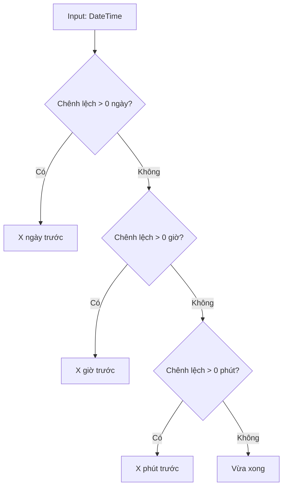
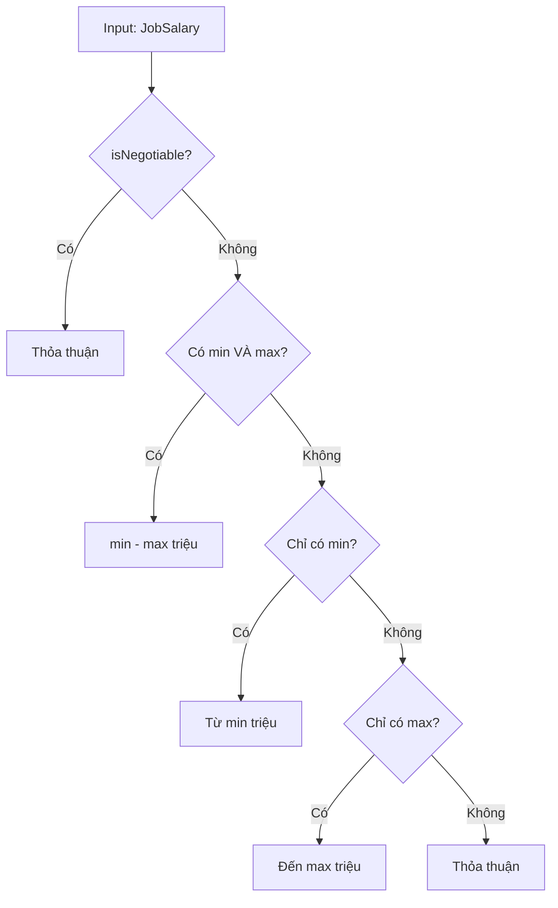
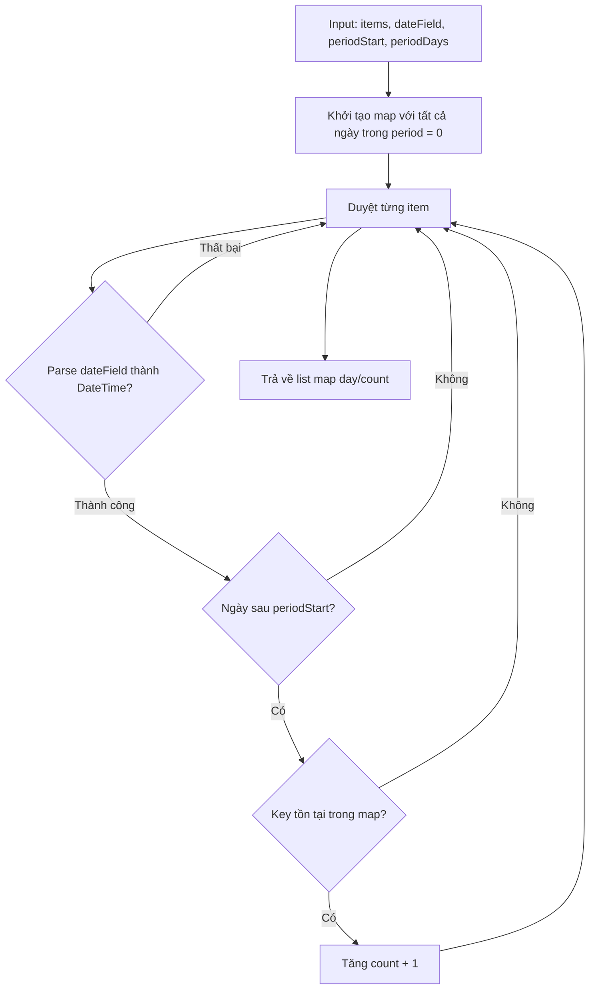
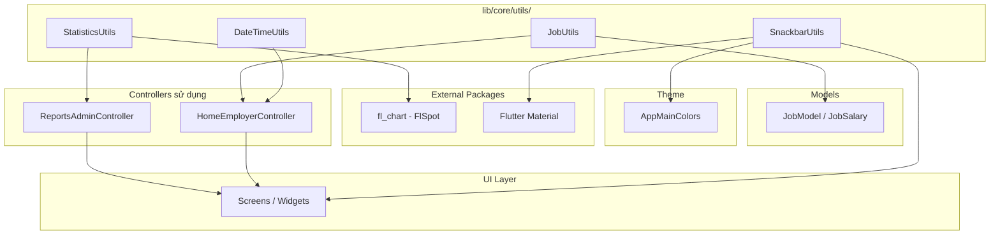

# Phân Tích Các File Utility Dùng Chung

## Mục đích

Tài liệu này phân tích chi tiết các file utility trong thư mục `lib/core/utils/`, bao gồm mục đích, cấu trúc, cách sử dụng và mối quan hệ với các modules khác trong dự án NP FutureGate. Các utility files đóng vai trò cung cấp các hàm tiện ích dùng chung, giúp tránh trùng lặp code và đảm bảo tính nhất quán trong toàn bộ ứng dụng.

## Tổng quan thư mục `lib/core/utils/`

```
lib/core/utils/
├── date_time_utils.dart      # Xử lý định dạng và tính toán thời gian
├── job_utils.dart            # Tiện ích liên quan đến công việc/tuyển dụng
├── snackbar_utils.dart       # Hiển thị thông báo SnackBar thống nhất
└── statistics_utils.dart     # Chuyển đổi dữ liệu thống kê cho biểu đồ
```

| File | Số dòng | Phương thức | Phụ thuộc ngoài |
|------|---------|-------------|-----------------|
| `date_time_utils.dart` | ~45 | 3 static methods | Không |
| `job_utils.dart` | ~55 | 4 static methods | `JobModel`, Flutter Material |
| `snackbar_utils.dart` | ~55 | 1 top-level function | Flutter Material, `AppMainColors` |
| `statistics_utils.dart` | ~60 | 2 static methods | `fl_chart` (FlSpot) |

---

## 1. DateTimeUtils — Xử lý thời gian

### Mục đích

Cung cấp các phương thức tĩnh để định dạng và tính toán thời gian, thay thế cho các đoạn code trùng lặp trước đây nằm rải rác trong nhiều file screen.

### Cấu trúc

```dart
class DateTimeUtils {
  DateTimeUtils._(); // Private constructor - không cho phép khởi tạo instance

  static String getTimeAgo(DateTime dateTime);      // "2 ngày trước", "Vừa xong"
  static String getDeadlineText(DateTime deadline);  // "Còn 5 ngày", "Đã hết hạn"
  static bool isWithinHours(DateTime dateTime, int hours); // Kiểm tra trong khoảng giờ
}
```

### Chi tiết các phương thức

| Phương thức | Input | Output | Mô tả |
|-------------|-------|--------|--------|
| `getTimeAgo` | `DateTime` | `String` | Trả về chuỗi "thời gian trước" dạng tương đối (ngày/giờ/phút/vừa xong) |
| `getDeadlineText` | `DateTime` | `String` | Trả về text deadline tương đối (còn bao lâu hoặc đã hết hạn) |
| `isWithinHours` | `DateTime`, `int` | `bool` | Kiểm tra thời điểm có nằm trong N giờ gần đây không |

### Logic xử lý `getTimeAgo`



### Cách sử dụng

```dart
// Trong HomeEmployerController
String getTimeAgo(DateTime dateTime) => DateTimeUtils.getTimeAgo(dateTime);
String getDeadlineText(DateTime deadline) => DateTimeUtils.getDeadlineText(deadline);
```

### Mối quan hệ với modules khác

- **Sử dụng bởi**: `HomeEmployerController` (module Employer)
- **Phụ thuộc**: Không có phụ thuộc ngoài (pure Dart)
- **Pattern**: Delegate pattern — Controller ủy quyền logic format thời gian cho utility

---

## 2. JobUtils — Tiện ích công việc

### Mục đích

Tập trung các phương thức helper liên quan đến hiển thị thông tin công việc (trạng thái, lương, màu deadline). Trước đây các logic này bị trùng lặp trong nhiều screen của employer và candidate.

### Cấu trúc

```dart
class JobUtils {
  JobUtils._(); // Private constructor

  static String getJobStatus(JobModel job);           // "Đang tuyển" / "Hết hạn"
  static String getSalaryString(JobSalary salary);    // "10 - 15 triệu"
  static Color getDeadlineColor(DateTime deadline);   // Màu theo mức độ khẩn cấp
  static String _formatNumber(double number);         // Helper nội bộ
}
```

### Chi tiết các phương thức

| Phương thức | Input | Output | Mô tả |
|-------------|-------|--------|--------|
| `getJobStatus` | `JobModel` | `String` | Xác định trạng thái job dựa trên deadline |
| `getSalaryString` | `JobSalary` | `String` | Format chuỗi lương hiển thị (thỏa thuận/khoảng/từ/đến) |
| `getDeadlineColor` | `DateTime` | `Color` | Trả về màu theo mức độ khẩn cấp của deadline |
| `_formatNumber` | `double` | `String` | Format số (bỏ .0 nếu là số nguyên) |

### Logic xử lý `getSalaryString`



### Logic xử lý `getDeadlineColor`

| Điều kiện | Màu trả về | Ý nghĩa |
|-----------|------------|----------|
| Đã quá hạn (difference < 0) | `Colors.red` | Hết hạn |
| Còn ≤ 3 ngày | `Colors.orange.shade700` | Sắp hết hạn |
| Còn > 3 ngày | `Colors.green.shade600` | Còn thời gian |

### Cách sử dụng

```dart
// Trong HomeEmployerController
String getJobStatus(JobModel job) => JobUtils.getJobStatus(job);
String getSalaryString(JobSalary salary) => JobUtils.getSalaryString(salary);
Color getDeadlineColor(DateTime deadline) => JobUtils.getDeadlineColor(deadline);
```

### Mối quan hệ với modules khác

- **Sử dụng bởi**: `HomeEmployerController` (module Employer)
- **Phụ thuộc**: `JobModel`, `JobSalary` (từ `lib/core/models/job_model.dart`), Flutter Material (cho `Color`)
- **Liên quan**: Kết hợp với `DateTimeUtils` trong cùng controller để hiển thị thông tin job đầy đủ

---

## 3. SnackbarUtils — Thông báo người dùng

### Mục đích

Cung cấp hàm hiển thị SnackBar với giao diện thống nhất trên toàn ứng dụng. Đảm bảo mọi thông báo (thành công, lỗi, thông tin) đều có cùng style, icon, và hành vi.

### Cấu trúc

```dart
enum SnackBarType { success, error, info }

void showAppSnackBar(
  BuildContext context, {
  required String message,
  SnackBarType type = SnackBarType.info,
  VoidCallback? action,
  String? actionLabel,
});
```

### Chi tiết

| Tham số | Kiểu | Bắt buộc | Mô tả |
|---------|------|----------|--------|
| `context` | `BuildContext` | Có | Context để truy cập ScaffoldMessenger |
| `message` | `String` | Có | Nội dung thông báo |
| `type` | `SnackBarType` | Không (mặc định: info) | Loại thông báo quyết định màu và icon |
| `action` | `VoidCallback?` | Không | Callback khi nhấn nút action |
| `actionLabel` | `String?` | Không | Label cho nút action |

### Bảng màu và icon theo loại

| SnackBarType | Màu nền | Icon |
|--------------|---------|------|
| `success` | `AppMainColors.success` | `Icons.check_circle_outline` |
| `error` | `AppMainColors.error` | `Icons.error_outline` |
| `info` | `AppMainColors.info` | `Icons.info_outline` |

### Đặc điểm thiết kế

- **Floating behavior**: SnackBar hiển thị dạng floating, không dính vào bottom
- **Rounded corners**: Bo góc 12px
- **Margin**: 16px tất cả các cạnh
- **Duration**: 3 giây tự động ẩn
- **Auto-dismiss**: Tự động ẩn SnackBar hiện tại trước khi hiển thị cái mới (`hideCurrentSnackBar()`)

### Cách sử dụng

```dart
// Hiển thị thông báo thành công
showAppSnackBar(
  context,
  message: 'Đã lưu thành công!',
  type: SnackBarType.success,
);

// Hiển thị lỗi với action
showAppSnackBar(
  context,
  message: 'Không thể kết nối',
  type: SnackBarType.error,
  action: () => retryConnection(),
  actionLabel: 'Thử lại',
);
```

### Mối quan hệ với modules khác

- **Sử dụng bởi**: Tất cả các screens cần hiển thị thông báo cho người dùng
- **Phụ thuộc**: `AppMainColors` (từ `lib/core/theme/app_main_colors.dart`), Flutter Material
- **Liên quan**: Kết nối với hệ thống theme thông qua `AppMainColors` để đảm bảo màu sắc nhất quán

---

## 4. StatisticsUtils — Xử lý dữ liệu thống kê

### Mục đích

Cung cấp các hàm thuần (pure functions) để chuyển đổi dữ liệu thô từ Supabase thành dạng phù hợp cho hiển thị biểu đồ. Được sử dụng bởi controllers để chuẩn bị dữ liệu chart.

### Cấu trúc

```dart
class StatisticsUtils {
  StatisticsUtils._(); // Private constructor

  static List<Map<String, dynamic>> groupByDay(
    List<dynamic> items,
    String dateField,
    DateTime periodStart,
    int periodDays,
  );

  static List<FlSpot> buildLineChartSpots(
    List<Map<String, dynamic>> dayCountList,
  );
}
```

### Chi tiết các phương thức

| Phương thức | Input | Output | Mô tả |
|-------------|-------|--------|--------|
| `groupByDay` | items, dateField, periodStart, periodDays | `List<Map>` với key 'day' và 'count' | Nhóm items theo ngày trong khoảng thời gian |
| `buildLineChartSpots` | dayCountList | `List<FlSpot>` | Chuyển đổi dữ liệu ngày-count thành FlSpot cho biểu đồ |

### Logic xử lý `groupByDay`



### Cách sử dụng

```dart
// Trong ReportsAdminController
List<Map<String, dynamic>> get usersByDay {
  final daysAgo = int.parse(_selectedPeriod);
  final periodStart = DateTime.now().subtract(Duration(days: daysAgo));
  return StatisticsUtils.groupByDay(
    _rawUsers,
    'created_at',
    periodStart,
    daysAgo,
  );
}

// Chuyển đổi sang FlSpot cho biểu đồ đường
final spots = StatisticsUtils.buildLineChartSpots(usersByDay);
```

### Mối quan hệ với modules khác

- **Sử dụng bởi**: `ReportsAdminController` (module Admin)
- **Phụ thuộc**: `fl_chart` package (class `FlSpot`)
- **Liên quan**: Kết nối với `StatisticsModel` (data model) và biểu đồ fl_chart trên UI

---

## Sơ đồ quan hệ tổng thể



---

## Nguyên tắc thiết kế chung

### 1. Private Constructor Pattern

Tất cả utility classes sử dụng `ClassName._()` để ngăn việc tạo instance. Đây là pattern phổ biến trong Dart cho các class chỉ chứa static methods:

```dart
class DateTimeUtils {
  DateTimeUtils._(); // Không thể gọi DateTimeUtils()
  static String getTimeAgo(...) { ... }
}
```

### 2. Pure Functions

Các phương thức trong `DateTimeUtils`, `JobUtils`, và `StatisticsUtils` đều là pure functions — không có side effects, output chỉ phụ thuộc vào input. Điều này giúp:
- Dễ test
- Dễ tái sử dụng
- Không phụ thuộc vào state bên ngoài

### 3. Delegate Pattern

Controllers sử dụng delegate pattern để expose utility methods cho UI:

```dart
// Controller delegate cho View
String getTimeAgo(DateTime dateTime) => DateTimeUtils.getTimeAgo(dateTime);
```

Lợi ích:
- View không cần biết về utility classes
- Controller kiểm soát được logic nào được expose
- Dễ thay đổi implementation mà không ảnh hưởng View

### 4. Tách biệt concerns

| Utility | Concern |
|---------|---------|
| `DateTimeUtils` | Formatting thời gian |
| `JobUtils` | Business logic hiển thị job |
| `SnackbarUtils` | UI feedback cho người dùng |
| `StatisticsUtils` | Data transformation cho charts |

---

## Đánh giá và nhận xét

### Điểm mạnh

- **DRY principle**: Tập trung logic dùng chung, tránh trùng lặp code
- **Testability**: Pure functions dễ viết unit test
- **Consistency**: Đảm bảo format thời gian, lương, thông báo nhất quán toàn app
- **Separation of Concerns**: Mỗi file có trách nhiệm rõ ràng

### Điểm có thể cải thiện

- `SnackbarUtils` chưa được import trực tiếp ở đâu (có thể đang sử dụng qua barrel export hoặc chưa được tích hợp hoàn toàn)
- `StatisticsUtils.buildLineChartSpots` chưa thấy được gọi trực tiếp trong code (có thể sử dụng trực tiếp trong widget)
- Có thể bổ sung thêm utility cho format tiền tệ VND, validate input, hoặc string manipulation

---

## Liên kết liên quan

- [Tổng quan kiến trúc](../01_tong_quan_kien_truc.md)
- [Phân tích Theme](./themes_analysis.md)
- [Phân tích Constants](./constants_analysis.md)
- [Giải thích fl_chart](../10_giai_thich_cong_nghe_tung_cai/fl_chart.md)
- [Giải thích Flutter](../10_giai_thich_cong_nghe_tung_cai/flutter.md)
