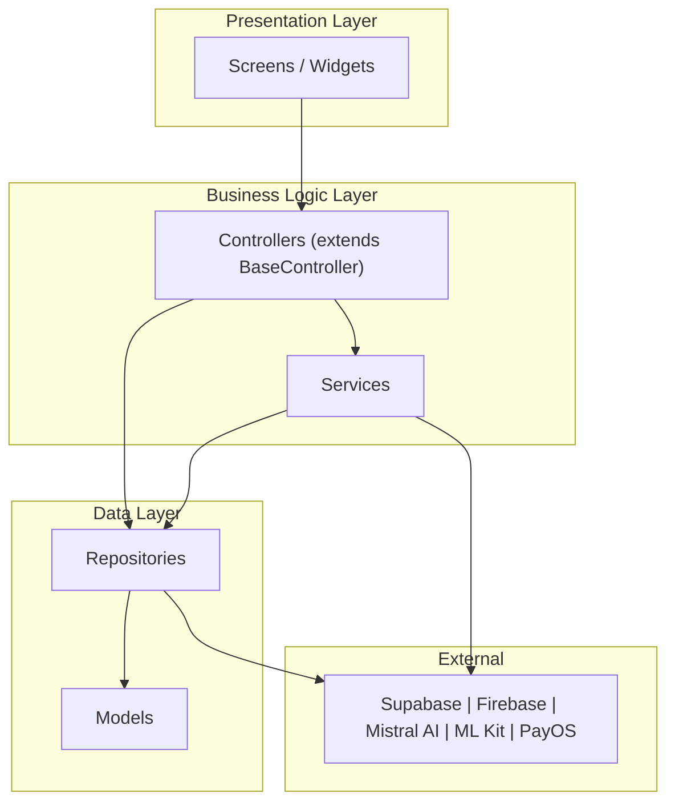

# Tóm Tắt Kiến Trúc Hệ Thống — NP FutureGate

> **Tài liệu tóm tắt nhanh** dùng cho trình chiếu và bảo vệ đồ án.  
> Tối đa 3 trang A4 — sử dụng bullet points và bảng để dễ đọc.

---

## 1. Tổng Quan Dự Án

| Tiêu chí | Thông tin |
|-----------|-----------|
| **Tên dự án** | NP FutureGate |
| **Loại ứng dụng** | Nền tảng kết nối việc làm thông minh |
| **Đối tượng** | Sinh viên, Nhà tuyển dụng, Trường học |
| **Nền tảng** | Flutter (Android + iOS) |
| **Kiến trúc** | MVC + ChangeNotifier (BaseController pattern) |
| **Backend** | Supabase (PostgreSQL + Auth + Realtime + Storage) |
| **AI Engine** | Mistral AI (LLM) + Google ML Kit (OCR) |

**Vấn đề giải quyết:**
- Sinh viên khó tìm việc phù hợp, không biết CV mình thiếu gì
- Nhà tuyển dụng mất thời gian sàng lọc CV thủ công
- Trường học thiếu kênh kết nối doanh nghiệp cho sinh viên

---

## 2. Thống Kê Dự Án

| Metric | Số lượng |
|--------|----------|
| Feature modules | **10** |
| Core services | **17** |
| Repositories | **16** |
| Data models | **24** |
| User roles | **4** (Candidate, Employer, School, Admin) |
| External integrations | **5** (Supabase, Firebase, Mistral AI, Google ML Kit, PayOS) |
| Shared widget categories | 5 (buttons, cards, dialogs, inputs, layouts) |
| Utility files | 4 |
| Theme files | 5 |
| Enum files | 4 |

---

## 3. Kiến Trúc Chính

### 3.1 Mô Hình Phân Tầng



### 3.2 Luồng Dữ Liệu

```
User Action → Screen → Controller → Repository/Service → External API → Response → Controller (notifyListeners) → UI Rebuild
```

### 3.3 State Management

- **BaseController** (abstract, extends ChangeNotifier): quản lý `isLoading`, `error`, `safeNotifyListeners()`
- **PaginationMixin**: logic phân trang tái sử dụng
- **Feature Controllers**: kế thừa BaseController, xử lý logic nghiệp vụ riêng

---

## 4. Công Nghệ Nổi Bật

| Nhóm | Công nghệ | Vai trò |
|------|-----------|---------|
| **Framework** | Flutter 3.x | Cross-platform mobile |
| **Backend** | Supabase | Auth + DB + Realtime + Storage |
| **AI/ML** | Mistral AI | Phân tích CV, chatbot, intent queries |
| **AI/ML** | Google ML Kit | OCR on-device |
| **Notifications** | Firebase FCM V1 | Push notifications (OAuth2) |
| **Payment** | PayOS | Cổng thanh toán Việt Nam |
| **Networking** | Dio | HTTP client với interceptors |
| **Charts** | FL Chart | Biểu đồ thống kê |
| **Voice** | Speech-to-Text | Nhập liệu giọng nói |

---

## 5. Điểm Sáng Kỹ Thuật

| # | Điểm sáng | Mô tả ngắn |
|---|-----------|-------------|
| 1 | **AI Pipeline hoàn chỉnh** | OCR → Text Extraction → Mistral AI Analysis → Structured Result |
| 2 | **On-device OCR** | Xử lý CV trên thiết bị, bảo mật dữ liệu nhạy cảm |
| 3 | **Intent-based AI Chatbot** | Hiểu ngữ cảnh → phân tích intent → truy vấn data thực → trả lời |
| 4 | **Realtime Architecture** | WebSocket cho chat, cập nhật trạng thái tức thì |
| 5 | **Multi-role + RLS** | 4 vai trò, phân quyền ở database level (Row Level Security) |
| 6 | **FCM V1 + OAuth2** | Push notification hiện đại, xử lý 3 trạng thái app |
| 7 | **Payment Subscription** | Mô hình freemium với PayOS, tự động kích hoạt gói |

---

## 6. Điểm Sáng Business

| # | Điểm sáng | Giá trị |
|---|-----------|---------|
| 1 | **Job Matching AI** | Điểm phù hợp 0-100, gợi ý cải thiện CV |
| 2 | **CV Analysis tự động** | Upload/Scan/Tạo mới → phân tích tức thì |
| 3 | **Kết nối đa bên** | Sinh viên ↔ Nhà tuyển dụng ↔ Trường học |
| 4 | **Interview Management** | Đặt lịch + nhắc nhở tự động + AI trả lời |
| 5 | **Partnership System** | Trường liên kết DN → giới thiệu việc cho SV |

---

## 7. So Sánh Nhanh

| Tính năng | NP FutureGate | TopCV | VietnamWorks | LinkedIn |
|-----------|:---:|:---:|:---:|:---:|
| AI matching CV | ✅ | ⚠️ | ⚠️ | ⚠️ |
| OCR scan CV | ✅ | ❌ | ❌ | ❌ |
| Vai trò trường học | ✅ | ❌ | ❌ | ❌ |
| Chat realtime | ✅ | ❌ | ❌ | ✅ |
| Intent-based chatbot | ✅ | ❌ | ❌ | ❌ |
| Hướng đến sinh viên | ✅ | ⚠️ | ❌ | ❌ |

---

## 8. Kết Luận

**NP FutureGate** là nền tảng kết nối việc làm thông minh với các đặc điểm nổi bật:

- ✅ **Kiến trúc rõ ràng**: MVC phân tầng, dễ mở rộng và bảo trì
- ✅ **AI-powered**: Pipeline AI hoàn chỉnh từ OCR đến phân tích và gợi ý
- ✅ **Bảo mật cao**: RLS database-level + on-device processing + OAuth2
- ✅ **Realtime**: Trải nghiệm tức thì với WebSocket
- ✅ **Đa vai trò**: Kết nối 3 bên (Sinh viên - Doanh nghiệp - Trường học)
- ✅ **Tích hợp đầy đủ**: 5 dịch vụ bên ngoài hoạt động đồng bộ
- ✅ **Thực tiễn**: Giải quyết vấn đề thực tế của sinh viên Việt Nam

**Hướng phát triển:**
- Mở rộng AI: phỏng vấn ảo, đánh giá kỹ năng mềm
- Tích hợp video call cho phỏng vấn online
- Mở rộng web platform
- Hệ thống recommendation nâng cao

---

## Liên Kết Liên Quan

- [Tổng quan kiến trúc chi tiết](./01_tong_quan_kien_truc.md)
- [Cơ chế từng chức năng](./02_co_che_tung_chuc_nang/authentication_flow.md)
- [Sơ đồ luồng Mermaid](./03_so_do_flow/mermaid_sequence_diagrams.md)
- [Công nghệ sử dụng](./04_cong_nghe_su_dung/tech_stack_overview.md)
- [Điểm sáng kỹ thuật và business](./05_diem_sang_ky_thuat_va_business.md)
- [So sánh với hệ thống khác](./06_so_sanh_voi_he_thong_khac.md)
